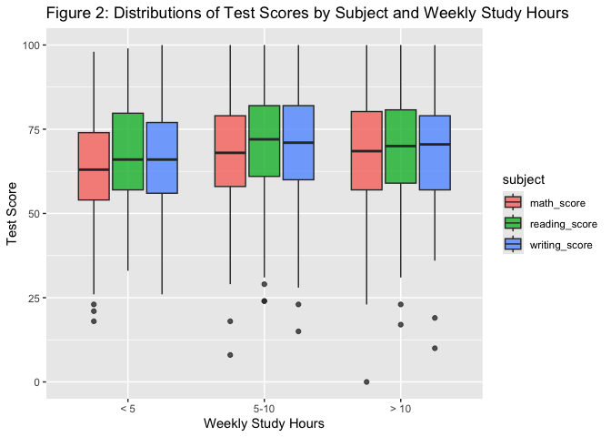

eda
================
Kate Colvin
2024-12-11

## Function to format the tables into word doc

Never mind I’m not using this anymore (the tables are huge and ugly and
hard to format!!)

``` r
# FitFlextableToPage <- function(ft, pgwidth = 7.5){
#   ft_out <- ft %>% autofit()
# 
#   ft_out <- width(ft_out, width = dim(ft_out)$widths*pgwidth /(flextable_dim(ft_out)$widths))
#   return(ft_out)
# }

# table1 %>% 
#   as_flex_table() %>% 
#   FitFlextableToPage() %>% 
#   flextable::save_as_docx(path = "summarytable.docx")
```

## Data Cleaning

Reading in + cleaning data

``` r
score_df <- read_csv("Project_1_data.csv") %>% 
  janitor::clean_names() %>% 
  mutate(wkly_study_hours = 
           case_match(
             wkly_study_hours, 
             "< 5" ~ "< 5",
             "> 10" ~ "> 10", 
             "10-May" ~ "5-10"), 
         wkly_study_hours = factor(wkly_study_hours, c("< 5", "5-10", "> 10")))
```

    ## Rows: 948 Columns: 14
    ## ── Column specification ────────────────────────────────────────────────────────
    ## Delimiter: ","
    ## chr (10): Gender, EthnicGroup, ParentEduc, LunchType, TestPrep, ParentMarita...
    ## dbl  (4): NrSiblings, MathScore, ReadingScore, WritingScore
    ## 
    ## ℹ Use `spec()` to retrieve the full column specification for this data.
    ## ℹ Specify the column types or set `show_col_types = FALSE` to quiet this message.

Summary Table 1 (Demographics)

``` r
table1 <- score_df %>% 
  select(-c(test_prep, wkly_study_hours, 
         math_score, reading_score, writing_score)) %>% 
  tbl_summary(
    by = gender,
    label = list("ethnic_group" ~ "Ethnic Group", 
                 "parent_educ" ~ "Parents' Education",
                 "lunch_type" ~ "Lunch Type", 
                 "parent_marital_status" ~ "Parents' Marital Status", 
                 "practice_sport" ~ "Practice Sport", 
                 "is_first_child" ~ "Oldest Child (Yes/No)", 
                 "nr_siblings" ~ "# Siblings", 
                 "transport_means" ~ "Transport Means"), 
    type = list(nr_siblings ~ "continuous"), 
    digits = list(all_continuous() ~ c(0))) %>% 
  bold_labels() %>% 
  modify_caption("Table 1. Summary of Student Demographic Variables (N=948)") %>% 
  add_overall() 
table1
```

<div id="vjalymiqtg" style="padding-left:0px;padding-right:0px;padding-top:10px;padding-bottom:10px;overflow-x:auto;overflow-y:auto;width:auto;height:auto;">
<style>#vjalymiqtg table {
  font-family: system-ui, 'Segoe UI', Roboto, Helvetica, Arial, sans-serif, 'Apple Color Emoji', 'Segoe UI Emoji', 'Segoe UI Symbol', 'Noto Color Emoji';
  -webkit-font-smoothing: antialiased;
  -moz-osx-font-smoothing: grayscale;
}
&#10;#vjalymiqtg thead, #vjalymiqtg tbody, #vjalymiqtg tfoot, #vjalymiqtg tr, #vjalymiqtg td, #vjalymiqtg th {
  border-style: none;
}
&#10;#vjalymiqtg p {
  margin: 0;
  padding: 0;
}
&#10;#vjalymiqtg .gt_table {
  display: table;
  border-collapse: collapse;
  line-height: normal;
  margin-left: auto;
  margin-right: auto;
  color: #333333;
  font-size: 16px;
  font-weight: normal;
  font-style: normal;
  background-color: #FFFFFF;
  width: auto;
  border-top-style: solid;
  border-top-width: 2px;
  border-top-color: #A8A8A8;
  border-right-style: none;
  border-right-width: 2px;
  border-right-color: #D3D3D3;
  border-bottom-style: solid;
  border-bottom-width: 2px;
  border-bottom-color: #A8A8A8;
  border-left-style: none;
  border-left-width: 2px;
  border-left-color: #D3D3D3;
}
&#10;#vjalymiqtg .gt_caption {
  padding-top: 4px;
  padding-bottom: 4px;
}
&#10;#vjalymiqtg .gt_title {
  color: #333333;
  font-size: 125%;
  font-weight: initial;
  padding-top: 4px;
  padding-bottom: 4px;
  padding-left: 5px;
  padding-right: 5px;
  border-bottom-color: #FFFFFF;
  border-bottom-width: 0;
}
&#10;#vjalymiqtg .gt_subtitle {
  color: #333333;
  font-size: 85%;
  font-weight: initial;
  padding-top: 3px;
  padding-bottom: 5px;
  padding-left: 5px;
  padding-right: 5px;
  border-top-color: #FFFFFF;
  border-top-width: 0;
}
&#10;#vjalymiqtg .gt_heading {
  background-color: #FFFFFF;
  text-align: center;
  border-bottom-color: #FFFFFF;
  border-left-style: none;
  border-left-width: 1px;
  border-left-color: #D3D3D3;
  border-right-style: none;
  border-right-width: 1px;
  border-right-color: #D3D3D3;
}
&#10;#vjalymiqtg .gt_bottom_border {
  border-bottom-style: solid;
  border-bottom-width: 2px;
  border-bottom-color: #D3D3D3;
}
&#10;#vjalymiqtg .gt_col_headings {
  border-top-style: solid;
  border-top-width: 2px;
  border-top-color: #D3D3D3;
  border-bottom-style: solid;
  border-bottom-width: 2px;
  border-bottom-color: #D3D3D3;
  border-left-style: none;
  border-left-width: 1px;
  border-left-color: #D3D3D3;
  border-right-style: none;
  border-right-width: 1px;
  border-right-color: #D3D3D3;
}
&#10;#vjalymiqtg .gt_col_heading {
  color: #333333;
  background-color: #FFFFFF;
  font-size: 100%;
  font-weight: normal;
  text-transform: inherit;
  border-left-style: none;
  border-left-width: 1px;
  border-left-color: #D3D3D3;
  border-right-style: none;
  border-right-width: 1px;
  border-right-color: #D3D3D3;
  vertical-align: bottom;
  padding-top: 5px;
  padding-bottom: 6px;
  padding-left: 5px;
  padding-right: 5px;
  overflow-x: hidden;
}
&#10;#vjalymiqtg .gt_column_spanner_outer {
  color: #333333;
  background-color: #FFFFFF;
  font-size: 100%;
  font-weight: normal;
  text-transform: inherit;
  padding-top: 0;
  padding-bottom: 0;
  padding-left: 4px;
  padding-right: 4px;
}
&#10;#vjalymiqtg .gt_column_spanner_outer:first-child {
  padding-left: 0;
}
&#10;#vjalymiqtg .gt_column_spanner_outer:last-child {
  padding-right: 0;
}
&#10;#vjalymiqtg .gt_column_spanner {
  border-bottom-style: solid;
  border-bottom-width: 2px;
  border-bottom-color: #D3D3D3;
  vertical-align: bottom;
  padding-top: 5px;
  padding-bottom: 5px;
  overflow-x: hidden;
  display: inline-block;
  width: 100%;
}
&#10;#vjalymiqtg .gt_spanner_row {
  border-bottom-style: hidden;
}
&#10;#vjalymiqtg .gt_group_heading {
  padding-top: 8px;
  padding-bottom: 8px;
  padding-left: 5px;
  padding-right: 5px;
  color: #333333;
  background-color: #FFFFFF;
  font-size: 100%;
  font-weight: initial;
  text-transform: inherit;
  border-top-style: solid;
  border-top-width: 2px;
  border-top-color: #D3D3D3;
  border-bottom-style: solid;
  border-bottom-width: 2px;
  border-bottom-color: #D3D3D3;
  border-left-style: none;
  border-left-width: 1px;
  border-left-color: #D3D3D3;
  border-right-style: none;
  border-right-width: 1px;
  border-right-color: #D3D3D3;
  vertical-align: middle;
  text-align: left;
}
&#10;#vjalymiqtg .gt_empty_group_heading {
  padding: 0.5px;
  color: #333333;
  background-color: #FFFFFF;
  font-size: 100%;
  font-weight: initial;
  border-top-style: solid;
  border-top-width: 2px;
  border-top-color: #D3D3D3;
  border-bottom-style: solid;
  border-bottom-width: 2px;
  border-bottom-color: #D3D3D3;
  vertical-align: middle;
}
&#10;#vjalymiqtg .gt_from_md > :first-child {
  margin-top: 0;
}
&#10;#vjalymiqtg .gt_from_md > :last-child {
  margin-bottom: 0;
}
&#10;#vjalymiqtg .gt_row {
  padding-top: 8px;
  padding-bottom: 8px;
  padding-left: 5px;
  padding-right: 5px;
  margin: 10px;
  border-top-style: solid;
  border-top-width: 1px;
  border-top-color: #D3D3D3;
  border-left-style: none;
  border-left-width: 1px;
  border-left-color: #D3D3D3;
  border-right-style: none;
  border-right-width: 1px;
  border-right-color: #D3D3D3;
  vertical-align: middle;
  overflow-x: hidden;
}
&#10;#vjalymiqtg .gt_stub {
  color: #333333;
  background-color: #FFFFFF;
  font-size: 100%;
  font-weight: initial;
  text-transform: inherit;
  border-right-style: solid;
  border-right-width: 2px;
  border-right-color: #D3D3D3;
  padding-left: 5px;
  padding-right: 5px;
}
&#10;#vjalymiqtg .gt_stub_row_group {
  color: #333333;
  background-color: #FFFFFF;
  font-size: 100%;
  font-weight: initial;
  text-transform: inherit;
  border-right-style: solid;
  border-right-width: 2px;
  border-right-color: #D3D3D3;
  padding-left: 5px;
  padding-right: 5px;
  vertical-align: top;
}
&#10;#vjalymiqtg .gt_row_group_first td {
  border-top-width: 2px;
}
&#10;#vjalymiqtg .gt_row_group_first th {
  border-top-width: 2px;
}
&#10;#vjalymiqtg .gt_summary_row {
  color: #333333;
  background-color: #FFFFFF;
  text-transform: inherit;
  padding-top: 8px;
  padding-bottom: 8px;
  padding-left: 5px;
  padding-right: 5px;
}
&#10;#vjalymiqtg .gt_first_summary_row {
  border-top-style: solid;
  border-top-color: #D3D3D3;
}
&#10;#vjalymiqtg .gt_first_summary_row.thick {
  border-top-width: 2px;
}
&#10;#vjalymiqtg .gt_last_summary_row {
  padding-top: 8px;
  padding-bottom: 8px;
  padding-left: 5px;
  padding-right: 5px;
  border-bottom-style: solid;
  border-bottom-width: 2px;
  border-bottom-color: #D3D3D3;
}
&#10;#vjalymiqtg .gt_grand_summary_row {
  color: #333333;
  background-color: #FFFFFF;
  text-transform: inherit;
  padding-top: 8px;
  padding-bottom: 8px;
  padding-left: 5px;
  padding-right: 5px;
}
&#10;#vjalymiqtg .gt_first_grand_summary_row {
  padding-top: 8px;
  padding-bottom: 8px;
  padding-left: 5px;
  padding-right: 5px;
  border-top-style: double;
  border-top-width: 6px;
  border-top-color: #D3D3D3;
}
&#10;#vjalymiqtg .gt_last_grand_summary_row_top {
  padding-top: 8px;
  padding-bottom: 8px;
  padding-left: 5px;
  padding-right: 5px;
  border-bottom-style: double;
  border-bottom-width: 6px;
  border-bottom-color: #D3D3D3;
}
&#10;#vjalymiqtg .gt_striped {
  background-color: rgba(128, 128, 128, 0.05);
}
&#10;#vjalymiqtg .gt_table_body {
  border-top-style: solid;
  border-top-width: 2px;
  border-top-color: #D3D3D3;
  border-bottom-style: solid;
  border-bottom-width: 2px;
  border-bottom-color: #D3D3D3;
}
&#10;#vjalymiqtg .gt_footnotes {
  color: #333333;
  background-color: #FFFFFF;
  border-bottom-style: none;
  border-bottom-width: 2px;
  border-bottom-color: #D3D3D3;
  border-left-style: none;
  border-left-width: 2px;
  border-left-color: #D3D3D3;
  border-right-style: none;
  border-right-width: 2px;
  border-right-color: #D3D3D3;
}
&#10;#vjalymiqtg .gt_footnote {
  margin: 0px;
  font-size: 90%;
  padding-top: 4px;
  padding-bottom: 4px;
  padding-left: 5px;
  padding-right: 5px;
}
&#10;#vjalymiqtg .gt_sourcenotes {
  color: #333333;
  background-color: #FFFFFF;
  border-bottom-style: none;
  border-bottom-width: 2px;
  border-bottom-color: #D3D3D3;
  border-left-style: none;
  border-left-width: 2px;
  border-left-color: #D3D3D3;
  border-right-style: none;
  border-right-width: 2px;
  border-right-color: #D3D3D3;
}
&#10;#vjalymiqtg .gt_sourcenote {
  font-size: 90%;
  padding-top: 4px;
  padding-bottom: 4px;
  padding-left: 5px;
  padding-right: 5px;
}
&#10;#vjalymiqtg .gt_left {
  text-align: left;
}
&#10;#vjalymiqtg .gt_center {
  text-align: center;
}
&#10;#vjalymiqtg .gt_right {
  text-align: right;
  font-variant-numeric: tabular-nums;
}
&#10;#vjalymiqtg .gt_font_normal {
  font-weight: normal;
}
&#10;#vjalymiqtg .gt_font_bold {
  font-weight: bold;
}
&#10;#vjalymiqtg .gt_font_italic {
  font-style: italic;
}
&#10;#vjalymiqtg .gt_super {
  font-size: 65%;
}
&#10;#vjalymiqtg .gt_footnote_marks {
  font-size: 75%;
  vertical-align: 0.4em;
  position: initial;
}
&#10;#vjalymiqtg .gt_asterisk {
  font-size: 100%;
  vertical-align: 0;
}
&#10;#vjalymiqtg .gt_indent_1 {
  text-indent: 5px;
}
&#10;#vjalymiqtg .gt_indent_2 {
  text-indent: 10px;
}
&#10;#vjalymiqtg .gt_indent_3 {
  text-indent: 15px;
}
&#10;#vjalymiqtg .gt_indent_4 {
  text-indent: 20px;
}
&#10;#vjalymiqtg .gt_indent_5 {
  text-indent: 25px;
}
&#10;#vjalymiqtg .katex-display {
  display: inline-flex !important;
  margin-bottom: 0.75em !important;
}
&#10;#vjalymiqtg div.Reactable > div.rt-table > div.rt-thead > div.rt-tr.rt-tr-group-header > div.rt-th-group:after {
  height: 0px !important;
}
</style>
<table class="gt_table" data-quarto-disable-processing="false" data-quarto-bootstrap="false">
  <caption><span class='gt_from_md'>Table 1. Summary of Student Demographic Variables (N=948)</span></caption>
  <thead>
    <tr class="gt_col_headings">
      <th class="gt_col_heading gt_columns_bottom_border gt_left" rowspan="1" colspan="1" scope="col" id="label"><span class='gt_from_md'><strong>Characteristic</strong></span></th>
      <th class="gt_col_heading gt_columns_bottom_border gt_center" rowspan="1" colspan="1" scope="col" id="stat_0"><span class='gt_from_md'><strong>Overall</strong><br />
N = 948</span><span class="gt_footnote_marks" style="white-space:nowrap;font-style:italic;font-weight:normal;line-height:0;"><sup>1</sup></span></th>
      <th class="gt_col_heading gt_columns_bottom_border gt_center" rowspan="1" colspan="1" scope="col" id="stat_1"><span class='gt_from_md'><strong>female</strong><br />
N = 488</span><span class="gt_footnote_marks" style="white-space:nowrap;font-style:italic;font-weight:normal;line-height:0;"><sup>1</sup></span></th>
      <th class="gt_col_heading gt_columns_bottom_border gt_center" rowspan="1" colspan="1" scope="col" id="stat_2"><span class='gt_from_md'><strong>male</strong><br />
N = 460</span><span class="gt_footnote_marks" style="white-space:nowrap;font-style:italic;font-weight:normal;line-height:0;"><sup>1</sup></span></th>
    </tr>
  </thead>
  <tbody class="gt_table_body">
    <tr><td headers="label" class="gt_row gt_left" style="font-weight: bold;">Ethnic Group</td>
<td headers="stat_0" class="gt_row gt_center"><br /></td>
<td headers="stat_1" class="gt_row gt_center"><br /></td>
<td headers="stat_2" class="gt_row gt_center"><br /></td></tr>
    <tr><td headers="label" class="gt_row gt_left">    group A</td>
<td headers="stat_0" class="gt_row gt_center">80 (9.0%)</td>
<td headers="stat_1" class="gt_row gt_center">32 (7.0%)</td>
<td headers="stat_2" class="gt_row gt_center">48 (11%)</td></tr>
    <tr><td headers="label" class="gt_row gt_left">    group B</td>
<td headers="stat_0" class="gt_row gt_center">171 (19%)</td>
<td headers="stat_1" class="gt_row gt_center">91 (20%)</td>
<td headers="stat_2" class="gt_row gt_center">80 (19%)</td></tr>
    <tr><td headers="label" class="gt_row gt_left">    group C</td>
<td headers="stat_0" class="gt_row gt_center">277 (31%)</td>
<td headers="stat_1" class="gt_row gt_center">156 (34%)</td>
<td headers="stat_2" class="gt_row gt_center">121 (28%)</td></tr>
    <tr><td headers="label" class="gt_row gt_left">    group D</td>
<td headers="stat_0" class="gt_row gt_center">237 (27%)</td>
<td headers="stat_1" class="gt_row gt_center">117 (25%)</td>
<td headers="stat_2" class="gt_row gt_center">120 (28%)</td></tr>
    <tr><td headers="label" class="gt_row gt_left">    group E</td>
<td headers="stat_0" class="gt_row gt_center">124 (14%)</td>
<td headers="stat_1" class="gt_row gt_center">63 (14%)</td>
<td headers="stat_2" class="gt_row gt_center">61 (14%)</td></tr>
    <tr><td headers="label" class="gt_row gt_left">    Unknown</td>
<td headers="stat_0" class="gt_row gt_center">59</td>
<td headers="stat_1" class="gt_row gt_center">29</td>
<td headers="stat_2" class="gt_row gt_center">30</td></tr>
    <tr><td headers="label" class="gt_row gt_left" style="font-weight: bold;">Parents' Education</td>
<td headers="stat_0" class="gt_row gt_center"><br /></td>
<td headers="stat_1" class="gt_row gt_center"><br /></td>
<td headers="stat_2" class="gt_row gt_center"><br /></td></tr>
    <tr><td headers="label" class="gt_row gt_left">    associate's degree</td>
<td headers="stat_0" class="gt_row gt_center">198 (22%)</td>
<td headers="stat_1" class="gt_row gt_center">101 (22%)</td>
<td headers="stat_2" class="gt_row gt_center">97 (23%)</td></tr>
    <tr><td headers="label" class="gt_row gt_left">    bachelor's degree</td>
<td headers="stat_0" class="gt_row gt_center">104 (12%)</td>
<td headers="stat_1" class="gt_row gt_center">57 (12%)</td>
<td headers="stat_2" class="gt_row gt_center">47 (11%)</td></tr>
    <tr><td headers="label" class="gt_row gt_left">    high school</td>
<td headers="stat_0" class="gt_row gt_center">176 (20%)</td>
<td headers="stat_1" class="gt_row gt_center">83 (18%)</td>
<td headers="stat_2" class="gt_row gt_center">93 (22%)</td></tr>
    <tr><td headers="label" class="gt_row gt_left">    master's degree</td>
<td headers="stat_0" class="gt_row gt_center">55 (6.1%)</td>
<td headers="stat_1" class="gt_row gt_center">33 (7.1%)</td>
<td headers="stat_2" class="gt_row gt_center">22 (5.1%)</td></tr>
    <tr><td headers="label" class="gt_row gt_left">    some college</td>
<td headers="stat_0" class="gt_row gt_center">199 (22%)</td>
<td headers="stat_1" class="gt_row gt_center">107 (23%)</td>
<td headers="stat_2" class="gt_row gt_center">92 (21%)</td></tr>
    <tr><td headers="label" class="gt_row gt_left">    some high school</td>
<td headers="stat_0" class="gt_row gt_center">163 (18%)</td>
<td headers="stat_1" class="gt_row gt_center">86 (18%)</td>
<td headers="stat_2" class="gt_row gt_center">77 (18%)</td></tr>
    <tr><td headers="label" class="gt_row gt_left">    Unknown</td>
<td headers="stat_0" class="gt_row gt_center">53</td>
<td headers="stat_1" class="gt_row gt_center">21</td>
<td headers="stat_2" class="gt_row gt_center">32</td></tr>
    <tr><td headers="label" class="gt_row gt_left" style="font-weight: bold;">Lunch Type</td>
<td headers="stat_0" class="gt_row gt_center"><br /></td>
<td headers="stat_1" class="gt_row gt_center"><br /></td>
<td headers="stat_2" class="gt_row gt_center"><br /></td></tr>
    <tr><td headers="label" class="gt_row gt_left">    free/reduced</td>
<td headers="stat_0" class="gt_row gt_center">331 (35%)</td>
<td headers="stat_1" class="gt_row gt_center">179 (37%)</td>
<td headers="stat_2" class="gt_row gt_center">152 (33%)</td></tr>
    <tr><td headers="label" class="gt_row gt_left">    standard</td>
<td headers="stat_0" class="gt_row gt_center">617 (65%)</td>
<td headers="stat_1" class="gt_row gt_center">309 (63%)</td>
<td headers="stat_2" class="gt_row gt_center">308 (67%)</td></tr>
    <tr><td headers="label" class="gt_row gt_left" style="font-weight: bold;">Parents' Marital Status</td>
<td headers="stat_0" class="gt_row gt_center"><br /></td>
<td headers="stat_1" class="gt_row gt_center"><br /></td>
<td headers="stat_2" class="gt_row gt_center"><br /></td></tr>
    <tr><td headers="label" class="gt_row gt_left">    divorced</td>
<td headers="stat_0" class="gt_row gt_center">146 (16%)</td>
<td headers="stat_1" class="gt_row gt_center">75 (16%)</td>
<td headers="stat_2" class="gt_row gt_center">71 (16%)</td></tr>
    <tr><td headers="label" class="gt_row gt_left">    married</td>
<td headers="stat_0" class="gt_row gt_center">516 (57%)</td>
<td headers="stat_1" class="gt_row gt_center">255 (55%)</td>
<td headers="stat_2" class="gt_row gt_center">261 (60%)</td></tr>
    <tr><td headers="label" class="gt_row gt_left">    single</td>
<td headers="stat_0" class="gt_row gt_center">213 (24%)</td>
<td headers="stat_1" class="gt_row gt_center">120 (26%)</td>
<td headers="stat_2" class="gt_row gt_center">93 (21%)</td></tr>
    <tr><td headers="label" class="gt_row gt_left">    widowed</td>
<td headers="stat_0" class="gt_row gt_center">24 (2.7%)</td>
<td headers="stat_1" class="gt_row gt_center">12 (2.6%)</td>
<td headers="stat_2" class="gt_row gt_center">12 (2.7%)</td></tr>
    <tr><td headers="label" class="gt_row gt_left">    Unknown</td>
<td headers="stat_0" class="gt_row gt_center">49</td>
<td headers="stat_1" class="gt_row gt_center">26</td>
<td headers="stat_2" class="gt_row gt_center">23</td></tr>
    <tr><td headers="label" class="gt_row gt_left" style="font-weight: bold;">Practice Sport</td>
<td headers="stat_0" class="gt_row gt_center"><br /></td>
<td headers="stat_1" class="gt_row gt_center"><br /></td>
<td headers="stat_2" class="gt_row gt_center"><br /></td></tr>
    <tr><td headers="label" class="gt_row gt_left">    never</td>
<td headers="stat_0" class="gt_row gt_center">112 (12%)</td>
<td headers="stat_1" class="gt_row gt_center">57 (12%)</td>
<td headers="stat_2" class="gt_row gt_center">55 (12%)</td></tr>
    <tr><td headers="label" class="gt_row gt_left">    regularly</td>
<td headers="stat_0" class="gt_row gt_center">343 (37%)</td>
<td headers="stat_1" class="gt_row gt_center">177 (37%)</td>
<td headers="stat_2" class="gt_row gt_center">166 (37%)</td></tr>
    <tr><td headers="label" class="gt_row gt_left">    sometimes</td>
<td headers="stat_0" class="gt_row gt_center">477 (51%)</td>
<td headers="stat_1" class="gt_row gt_center">249 (52%)</td>
<td headers="stat_2" class="gt_row gt_center">228 (51%)</td></tr>
    <tr><td headers="label" class="gt_row gt_left">    Unknown</td>
<td headers="stat_0" class="gt_row gt_center">16</td>
<td headers="stat_1" class="gt_row gt_center">5</td>
<td headers="stat_2" class="gt_row gt_center">11</td></tr>
    <tr><td headers="label" class="gt_row gt_left" style="font-weight: bold;">Oldest Child (Yes/No)</td>
<td headers="stat_0" class="gt_row gt_center">604 (66%)</td>
<td headers="stat_1" class="gt_row gt_center">321 (68%)</td>
<td headers="stat_2" class="gt_row gt_center">283 (64%)</td></tr>
    <tr><td headers="label" class="gt_row gt_left">    Unknown</td>
<td headers="stat_0" class="gt_row gt_center">30</td>
<td headers="stat_1" class="gt_row gt_center">13</td>
<td headers="stat_2" class="gt_row gt_center">17</td></tr>
    <tr><td headers="label" class="gt_row gt_left" style="font-weight: bold;"># Siblings</td>
<td headers="stat_0" class="gt_row gt_center">2 (1, 3)</td>
<td headers="stat_1" class="gt_row gt_center">2 (1, 3)</td>
<td headers="stat_2" class="gt_row gt_center">2 (1, 3)</td></tr>
    <tr><td headers="label" class="gt_row gt_left">    Unknown</td>
<td headers="stat_0" class="gt_row gt_center">46</td>
<td headers="stat_1" class="gt_row gt_center">28</td>
<td headers="stat_2" class="gt_row gt_center">18</td></tr>
    <tr><td headers="label" class="gt_row gt_left" style="font-weight: bold;">Transport Means</td>
<td headers="stat_0" class="gt_row gt_center"><br /></td>
<td headers="stat_1" class="gt_row gt_center"><br /></td>
<td headers="stat_2" class="gt_row gt_center"><br /></td></tr>
    <tr><td headers="label" class="gt_row gt_left">    private</td>
<td headers="stat_0" class="gt_row gt_center">337 (40%)</td>
<td headers="stat_1" class="gt_row gt_center">174 (39%)</td>
<td headers="stat_2" class="gt_row gt_center">163 (40%)</td></tr>
    <tr><td headers="label" class="gt_row gt_left">    school_bus</td>
<td headers="stat_0" class="gt_row gt_center">509 (60%)</td>
<td headers="stat_1" class="gt_row gt_center">268 (61%)</td>
<td headers="stat_2" class="gt_row gt_center">241 (60%)</td></tr>
    <tr><td headers="label" class="gt_row gt_left">    Unknown</td>
<td headers="stat_0" class="gt_row gt_center">102</td>
<td headers="stat_1" class="gt_row gt_center">46</td>
<td headers="stat_2" class="gt_row gt_center">56</td></tr>
  </tbody>
  &#10;  <tfoot class="gt_footnotes">
    <tr>
      <td class="gt_footnote" colspan="4"><span class="gt_footnote_marks" style="white-space:nowrap;font-style:italic;font-weight:normal;line-height:0;"><sup>1</sup></span> <span class='gt_from_md'>n (%); Median (Q1, Q3)</span></td>
    </tr>
  </tfoot>
</table>
</div>

``` r
table1 %>%
  as_gt() %>%
  gtsave(filename = "table1.png")
```

Summary Table 2 (Academics)

``` r
table2 <- score_df %>% 
  select(test_prep, wkly_study_hours, 
         math_score, reading_score, writing_score, gender) %>% 
  tbl_summary(
    by = gender,
    label = list("test_prep" ~ "Test Prep", 
                 "wkly_study_hours" ~ "Weekly Study Hours",
                 "math_score" ~ "Math Score", 
                 "reading_score" ~ "Reading Score", 
                 "writing_score" ~ "Writing Score")) %>% 
  bold_labels() %>% 
  modify_caption("Table 2. Summary of Student Academic Variables (N=948)") %>% 
  add_overall() 
table2
```

<div id="bwapffqhmc" style="padding-left:0px;padding-right:0px;padding-top:10px;padding-bottom:10px;overflow-x:auto;overflow-y:auto;width:auto;height:auto;">
<style>#bwapffqhmc table {
  font-family: system-ui, 'Segoe UI', Roboto, Helvetica, Arial, sans-serif, 'Apple Color Emoji', 'Segoe UI Emoji', 'Segoe UI Symbol', 'Noto Color Emoji';
  -webkit-font-smoothing: antialiased;
  -moz-osx-font-smoothing: grayscale;
}
&#10;#bwapffqhmc thead, #bwapffqhmc tbody, #bwapffqhmc tfoot, #bwapffqhmc tr, #bwapffqhmc td, #bwapffqhmc th {
  border-style: none;
}
&#10;#bwapffqhmc p {
  margin: 0;
  padding: 0;
}
&#10;#bwapffqhmc .gt_table {
  display: table;
  border-collapse: collapse;
  line-height: normal;
  margin-left: auto;
  margin-right: auto;
  color: #333333;
  font-size: 16px;
  font-weight: normal;
  font-style: normal;
  background-color: #FFFFFF;
  width: auto;
  border-top-style: solid;
  border-top-width: 2px;
  border-top-color: #A8A8A8;
  border-right-style: none;
  border-right-width: 2px;
  border-right-color: #D3D3D3;
  border-bottom-style: solid;
  border-bottom-width: 2px;
  border-bottom-color: #A8A8A8;
  border-left-style: none;
  border-left-width: 2px;
  border-left-color: #D3D3D3;
}
&#10;#bwapffqhmc .gt_caption {
  padding-top: 4px;
  padding-bottom: 4px;
}
&#10;#bwapffqhmc .gt_title {
  color: #333333;
  font-size: 125%;
  font-weight: initial;
  padding-top: 4px;
  padding-bottom: 4px;
  padding-left: 5px;
  padding-right: 5px;
  border-bottom-color: #FFFFFF;
  border-bottom-width: 0;
}
&#10;#bwapffqhmc .gt_subtitle {
  color: #333333;
  font-size: 85%;
  font-weight: initial;
  padding-top: 3px;
  padding-bottom: 5px;
  padding-left: 5px;
  padding-right: 5px;
  border-top-color: #FFFFFF;
  border-top-width: 0;
}
&#10;#bwapffqhmc .gt_heading {
  background-color: #FFFFFF;
  text-align: center;
  border-bottom-color: #FFFFFF;
  border-left-style: none;
  border-left-width: 1px;
  border-left-color: #D3D3D3;
  border-right-style: none;
  border-right-width: 1px;
  border-right-color: #D3D3D3;
}
&#10;#bwapffqhmc .gt_bottom_border {
  border-bottom-style: solid;
  border-bottom-width: 2px;
  border-bottom-color: #D3D3D3;
}
&#10;#bwapffqhmc .gt_col_headings {
  border-top-style: solid;
  border-top-width: 2px;
  border-top-color: #D3D3D3;
  border-bottom-style: solid;
  border-bottom-width: 2px;
  border-bottom-color: #D3D3D3;
  border-left-style: none;
  border-left-width: 1px;
  border-left-color: #D3D3D3;
  border-right-style: none;
  border-right-width: 1px;
  border-right-color: #D3D3D3;
}
&#10;#bwapffqhmc .gt_col_heading {
  color: #333333;
  background-color: #FFFFFF;
  font-size: 100%;
  font-weight: normal;
  text-transform: inherit;
  border-left-style: none;
  border-left-width: 1px;
  border-left-color: #D3D3D3;
  border-right-style: none;
  border-right-width: 1px;
  border-right-color: #D3D3D3;
  vertical-align: bottom;
  padding-top: 5px;
  padding-bottom: 6px;
  padding-left: 5px;
  padding-right: 5px;
  overflow-x: hidden;
}
&#10;#bwapffqhmc .gt_column_spanner_outer {
  color: #333333;
  background-color: #FFFFFF;
  font-size: 100%;
  font-weight: normal;
  text-transform: inherit;
  padding-top: 0;
  padding-bottom: 0;
  padding-left: 4px;
  padding-right: 4px;
}
&#10;#bwapffqhmc .gt_column_spanner_outer:first-child {
  padding-left: 0;
}
&#10;#bwapffqhmc .gt_column_spanner_outer:last-child {
  padding-right: 0;
}
&#10;#bwapffqhmc .gt_column_spanner {
  border-bottom-style: solid;
  border-bottom-width: 2px;
  border-bottom-color: #D3D3D3;
  vertical-align: bottom;
  padding-top: 5px;
  padding-bottom: 5px;
  overflow-x: hidden;
  display: inline-block;
  width: 100%;
}
&#10;#bwapffqhmc .gt_spanner_row {
  border-bottom-style: hidden;
}
&#10;#bwapffqhmc .gt_group_heading {
  padding-top: 8px;
  padding-bottom: 8px;
  padding-left: 5px;
  padding-right: 5px;
  color: #333333;
  background-color: #FFFFFF;
  font-size: 100%;
  font-weight: initial;
  text-transform: inherit;
  border-top-style: solid;
  border-top-width: 2px;
  border-top-color: #D3D3D3;
  border-bottom-style: solid;
  border-bottom-width: 2px;
  border-bottom-color: #D3D3D3;
  border-left-style: none;
  border-left-width: 1px;
  border-left-color: #D3D3D3;
  border-right-style: none;
  border-right-width: 1px;
  border-right-color: #D3D3D3;
  vertical-align: middle;
  text-align: left;
}
&#10;#bwapffqhmc .gt_empty_group_heading {
  padding: 0.5px;
  color: #333333;
  background-color: #FFFFFF;
  font-size: 100%;
  font-weight: initial;
  border-top-style: solid;
  border-top-width: 2px;
  border-top-color: #D3D3D3;
  border-bottom-style: solid;
  border-bottom-width: 2px;
  border-bottom-color: #D3D3D3;
  vertical-align: middle;
}
&#10;#bwapffqhmc .gt_from_md > :first-child {
  margin-top: 0;
}
&#10;#bwapffqhmc .gt_from_md > :last-child {
  margin-bottom: 0;
}
&#10;#bwapffqhmc .gt_row {
  padding-top: 8px;
  padding-bottom: 8px;
  padding-left: 5px;
  padding-right: 5px;
  margin: 10px;
  border-top-style: solid;
  border-top-width: 1px;
  border-top-color: #D3D3D3;
  border-left-style: none;
  border-left-width: 1px;
  border-left-color: #D3D3D3;
  border-right-style: none;
  border-right-width: 1px;
  border-right-color: #D3D3D3;
  vertical-align: middle;
  overflow-x: hidden;
}
&#10;#bwapffqhmc .gt_stub {
  color: #333333;
  background-color: #FFFFFF;
  font-size: 100%;
  font-weight: initial;
  text-transform: inherit;
  border-right-style: solid;
  border-right-width: 2px;
  border-right-color: #D3D3D3;
  padding-left: 5px;
  padding-right: 5px;
}
&#10;#bwapffqhmc .gt_stub_row_group {
  color: #333333;
  background-color: #FFFFFF;
  font-size: 100%;
  font-weight: initial;
  text-transform: inherit;
  border-right-style: solid;
  border-right-width: 2px;
  border-right-color: #D3D3D3;
  padding-left: 5px;
  padding-right: 5px;
  vertical-align: top;
}
&#10;#bwapffqhmc .gt_row_group_first td {
  border-top-width: 2px;
}
&#10;#bwapffqhmc .gt_row_group_first th {
  border-top-width: 2px;
}
&#10;#bwapffqhmc .gt_summary_row {
  color: #333333;
  background-color: #FFFFFF;
  text-transform: inherit;
  padding-top: 8px;
  padding-bottom: 8px;
  padding-left: 5px;
  padding-right: 5px;
}
&#10;#bwapffqhmc .gt_first_summary_row {
  border-top-style: solid;
  border-top-color: #D3D3D3;
}
&#10;#bwapffqhmc .gt_first_summary_row.thick {
  border-top-width: 2px;
}
&#10;#bwapffqhmc .gt_last_summary_row {
  padding-top: 8px;
  padding-bottom: 8px;
  padding-left: 5px;
  padding-right: 5px;
  border-bottom-style: solid;
  border-bottom-width: 2px;
  border-bottom-color: #D3D3D3;
}
&#10;#bwapffqhmc .gt_grand_summary_row {
  color: #333333;
  background-color: #FFFFFF;
  text-transform: inherit;
  padding-top: 8px;
  padding-bottom: 8px;
  padding-left: 5px;
  padding-right: 5px;
}
&#10;#bwapffqhmc .gt_first_grand_summary_row {
  padding-top: 8px;
  padding-bottom: 8px;
  padding-left: 5px;
  padding-right: 5px;
  border-top-style: double;
  border-top-width: 6px;
  border-top-color: #D3D3D3;
}
&#10;#bwapffqhmc .gt_last_grand_summary_row_top {
  padding-top: 8px;
  padding-bottom: 8px;
  padding-left: 5px;
  padding-right: 5px;
  border-bottom-style: double;
  border-bottom-width: 6px;
  border-bottom-color: #D3D3D3;
}
&#10;#bwapffqhmc .gt_striped {
  background-color: rgba(128, 128, 128, 0.05);
}
&#10;#bwapffqhmc .gt_table_body {
  border-top-style: solid;
  border-top-width: 2px;
  border-top-color: #D3D3D3;
  border-bottom-style: solid;
  border-bottom-width: 2px;
  border-bottom-color: #D3D3D3;
}
&#10;#bwapffqhmc .gt_footnotes {
  color: #333333;
  background-color: #FFFFFF;
  border-bottom-style: none;
  border-bottom-width: 2px;
  border-bottom-color: #D3D3D3;
  border-left-style: none;
  border-left-width: 2px;
  border-left-color: #D3D3D3;
  border-right-style: none;
  border-right-width: 2px;
  border-right-color: #D3D3D3;
}
&#10;#bwapffqhmc .gt_footnote {
  margin: 0px;
  font-size: 90%;
  padding-top: 4px;
  padding-bottom: 4px;
  padding-left: 5px;
  padding-right: 5px;
}
&#10;#bwapffqhmc .gt_sourcenotes {
  color: #333333;
  background-color: #FFFFFF;
  border-bottom-style: none;
  border-bottom-width: 2px;
  border-bottom-color: #D3D3D3;
  border-left-style: none;
  border-left-width: 2px;
  border-left-color: #D3D3D3;
  border-right-style: none;
  border-right-width: 2px;
  border-right-color: #D3D3D3;
}
&#10;#bwapffqhmc .gt_sourcenote {
  font-size: 90%;
  padding-top: 4px;
  padding-bottom: 4px;
  padding-left: 5px;
  padding-right: 5px;
}
&#10;#bwapffqhmc .gt_left {
  text-align: left;
}
&#10;#bwapffqhmc .gt_center {
  text-align: center;
}
&#10;#bwapffqhmc .gt_right {
  text-align: right;
  font-variant-numeric: tabular-nums;
}
&#10;#bwapffqhmc .gt_font_normal {
  font-weight: normal;
}
&#10;#bwapffqhmc .gt_font_bold {
  font-weight: bold;
}
&#10;#bwapffqhmc .gt_font_italic {
  font-style: italic;
}
&#10;#bwapffqhmc .gt_super {
  font-size: 65%;
}
&#10;#bwapffqhmc .gt_footnote_marks {
  font-size: 75%;
  vertical-align: 0.4em;
  position: initial;
}
&#10;#bwapffqhmc .gt_asterisk {
  font-size: 100%;
  vertical-align: 0;
}
&#10;#bwapffqhmc .gt_indent_1 {
  text-indent: 5px;
}
&#10;#bwapffqhmc .gt_indent_2 {
  text-indent: 10px;
}
&#10;#bwapffqhmc .gt_indent_3 {
  text-indent: 15px;
}
&#10;#bwapffqhmc .gt_indent_4 {
  text-indent: 20px;
}
&#10;#bwapffqhmc .gt_indent_5 {
  text-indent: 25px;
}
&#10;#bwapffqhmc .katex-display {
  display: inline-flex !important;
  margin-bottom: 0.75em !important;
}
&#10;#bwapffqhmc div.Reactable > div.rt-table > div.rt-thead > div.rt-tr.rt-tr-group-header > div.rt-th-group:after {
  height: 0px !important;
}
</style>
<table class="gt_table" data-quarto-disable-processing="false" data-quarto-bootstrap="false">
  <caption><span class='gt_from_md'>Table 2. Summary of Student Academic Variables (N=948)</span></caption>
  <thead>
    <tr class="gt_col_headings">
      <th class="gt_col_heading gt_columns_bottom_border gt_left" rowspan="1" colspan="1" scope="col" id="label"><span class='gt_from_md'><strong>Characteristic</strong></span></th>
      <th class="gt_col_heading gt_columns_bottom_border gt_center" rowspan="1" colspan="1" scope="col" id="stat_0"><span class='gt_from_md'><strong>Overall</strong><br />
N = 948</span><span class="gt_footnote_marks" style="white-space:nowrap;font-style:italic;font-weight:normal;line-height:0;"><sup>1</sup></span></th>
      <th class="gt_col_heading gt_columns_bottom_border gt_center" rowspan="1" colspan="1" scope="col" id="stat_1"><span class='gt_from_md'><strong>female</strong><br />
N = 488</span><span class="gt_footnote_marks" style="white-space:nowrap;font-style:italic;font-weight:normal;line-height:0;"><sup>1</sup></span></th>
      <th class="gt_col_heading gt_columns_bottom_border gt_center" rowspan="1" colspan="1" scope="col" id="stat_2"><span class='gt_from_md'><strong>male</strong><br />
N = 460</span><span class="gt_footnote_marks" style="white-space:nowrap;font-style:italic;font-weight:normal;line-height:0;"><sup>1</sup></span></th>
    </tr>
  </thead>
  <tbody class="gt_table_body">
    <tr><td headers="label" class="gt_row gt_left" style="font-weight: bold;">Test Prep</td>
<td headers="stat_0" class="gt_row gt_center"><br /></td>
<td headers="stat_1" class="gt_row gt_center"><br /></td>
<td headers="stat_2" class="gt_row gt_center"><br /></td></tr>
    <tr><td headers="label" class="gt_row gt_left">    completed</td>
<td headers="stat_0" class="gt_row gt_center">322 (36%)</td>
<td headers="stat_1" class="gt_row gt_center">162 (35%)</td>
<td headers="stat_2" class="gt_row gt_center">160 (37%)</td></tr>
    <tr><td headers="label" class="gt_row gt_left">    none</td>
<td headers="stat_0" class="gt_row gt_center">571 (64%)</td>
<td headers="stat_1" class="gt_row gt_center">297 (65%)</td>
<td headers="stat_2" class="gt_row gt_center">274 (63%)</td></tr>
    <tr><td headers="label" class="gt_row gt_left">    Unknown</td>
<td headers="stat_0" class="gt_row gt_center">55</td>
<td headers="stat_1" class="gt_row gt_center">29</td>
<td headers="stat_2" class="gt_row gt_center">26</td></tr>
    <tr><td headers="label" class="gt_row gt_left" style="font-weight: bold;">Weekly Study Hours</td>
<td headers="stat_0" class="gt_row gt_center"><br /></td>
<td headers="stat_1" class="gt_row gt_center"><br /></td>
<td headers="stat_2" class="gt_row gt_center"><br /></td></tr>
    <tr><td headers="label" class="gt_row gt_left">    &lt; 5</td>
<td headers="stat_0" class="gt_row gt_center">253 (28%)</td>
<td headers="stat_1" class="gt_row gt_center">131 (28%)</td>
<td headers="stat_2" class="gt_row gt_center">122 (28%)</td></tr>
    <tr><td headers="label" class="gt_row gt_left">    5-10</td>
<td headers="stat_0" class="gt_row gt_center">508 (56%)</td>
<td headers="stat_1" class="gt_row gt_center">263 (56%)</td>
<td headers="stat_2" class="gt_row gt_center">245 (56%)</td></tr>
    <tr><td headers="label" class="gt_row gt_left">    &gt; 10</td>
<td headers="stat_0" class="gt_row gt_center">150 (16%)</td>
<td headers="stat_1" class="gt_row gt_center">76 (16%)</td>
<td headers="stat_2" class="gt_row gt_center">74 (17%)</td></tr>
    <tr><td headers="label" class="gt_row gt_left">    Unknown</td>
<td headers="stat_0" class="gt_row gt_center">37</td>
<td headers="stat_1" class="gt_row gt_center">18</td>
<td headers="stat_2" class="gt_row gt_center">19</td></tr>
    <tr><td headers="label" class="gt_row gt_left" style="font-weight: bold;">Math Score</td>
<td headers="stat_0" class="gt_row gt_center">66 (56, 76)</td>
<td headers="stat_1" class="gt_row gt_center">64 (53, 74)</td>
<td headers="stat_2" class="gt_row gt_center">69 (59, 79)</td></tr>
    <tr><td headers="label" class="gt_row gt_left" style="font-weight: bold;">Reading Score</td>
<td headers="stat_0" class="gt_row gt_center">70 (59, 80)</td>
<td headers="stat_1" class="gt_row gt_center">73 (63, 83)</td>
<td headers="stat_2" class="gt_row gt_center">65 (55, 76)</td></tr>
    <tr><td headers="label" class="gt_row gt_left" style="font-weight: bold;">Writing Score</td>
<td headers="stat_0" class="gt_row gt_center">68 (57, 79)</td>
<td headers="stat_1" class="gt_row gt_center">74 (63, 83)</td>
<td headers="stat_2" class="gt_row gt_center">64 (53, 74)</td></tr>
  </tbody>
  &#10;  <tfoot class="gt_footnotes">
    <tr>
      <td class="gt_footnote" colspan="4"><span class="gt_footnote_marks" style="white-space:nowrap;font-style:italic;font-weight:normal;line-height:0;"><sup>1</sup></span> <span class='gt_from_md'>n (%); Median (Q1, Q3)</span></td>
    </tr>
  </tfoot>
</table>
</div>

``` r
table2 %>%
  as_gt() %>%
  gtsave(filename = "table2.png")
```

## Visualizations

Plotting the overall distribution of scores, stratified by subject

``` r
score_long_df <- score_df %>%  
  pivot_longer(cols = math_score:writing_score, 
               names_to = "subject", 
               values_to = "score")

score_dists_plot <- score_long_df %>% 
  ggplot(aes(x = score, fill = subject, color = subject)) +
  geom_density(alpha = 0.3, linewidth = 1) +
  labs(x = "Test Score", y = "Density")
score_dists_plot
```

<!-- -->

``` r
ggsave("score_density.png")
```

    ## Saving 7 x 5 in image

``` r
# Test for differences 

score_test <- score_long_df %>% select(subject, score) %>% 
  tbl_summary(by = subject) %>% 
  add_overall() %>% 
  add_p()
score_test
```

<div id="uhgzdzosei" style="padding-left:0px;padding-right:0px;padding-top:10px;padding-bottom:10px;overflow-x:auto;overflow-y:auto;width:auto;height:auto;">
<style>#uhgzdzosei table {
  font-family: system-ui, 'Segoe UI', Roboto, Helvetica, Arial, sans-serif, 'Apple Color Emoji', 'Segoe UI Emoji', 'Segoe UI Symbol', 'Noto Color Emoji';
  -webkit-font-smoothing: antialiased;
  -moz-osx-font-smoothing: grayscale;
}
&#10;#uhgzdzosei thead, #uhgzdzosei tbody, #uhgzdzosei tfoot, #uhgzdzosei tr, #uhgzdzosei td, #uhgzdzosei th {
  border-style: none;
}
&#10;#uhgzdzosei p {
  margin: 0;
  padding: 0;
}
&#10;#uhgzdzosei .gt_table {
  display: table;
  border-collapse: collapse;
  line-height: normal;
  margin-left: auto;
  margin-right: auto;
  color: #333333;
  font-size: 16px;
  font-weight: normal;
  font-style: normal;
  background-color: #FFFFFF;
  width: auto;
  border-top-style: solid;
  border-top-width: 2px;
  border-top-color: #A8A8A8;
  border-right-style: none;
  border-right-width: 2px;
  border-right-color: #D3D3D3;
  border-bottom-style: solid;
  border-bottom-width: 2px;
  border-bottom-color: #A8A8A8;
  border-left-style: none;
  border-left-width: 2px;
  border-left-color: #D3D3D3;
}
&#10;#uhgzdzosei .gt_caption {
  padding-top: 4px;
  padding-bottom: 4px;
}
&#10;#uhgzdzosei .gt_title {
  color: #333333;
  font-size: 125%;
  font-weight: initial;
  padding-top: 4px;
  padding-bottom: 4px;
  padding-left: 5px;
  padding-right: 5px;
  border-bottom-color: #FFFFFF;
  border-bottom-width: 0;
}
&#10;#uhgzdzosei .gt_subtitle {
  color: #333333;
  font-size: 85%;
  font-weight: initial;
  padding-top: 3px;
  padding-bottom: 5px;
  padding-left: 5px;
  padding-right: 5px;
  border-top-color: #FFFFFF;
  border-top-width: 0;
}
&#10;#uhgzdzosei .gt_heading {
  background-color: #FFFFFF;
  text-align: center;
  border-bottom-color: #FFFFFF;
  border-left-style: none;
  border-left-width: 1px;
  border-left-color: #D3D3D3;
  border-right-style: none;
  border-right-width: 1px;
  border-right-color: #D3D3D3;
}
&#10;#uhgzdzosei .gt_bottom_border {
  border-bottom-style: solid;
  border-bottom-width: 2px;
  border-bottom-color: #D3D3D3;
}
&#10;#uhgzdzosei .gt_col_headings {
  border-top-style: solid;
  border-top-width: 2px;
  border-top-color: #D3D3D3;
  border-bottom-style: solid;
  border-bottom-width: 2px;
  border-bottom-color: #D3D3D3;
  border-left-style: none;
  border-left-width: 1px;
  border-left-color: #D3D3D3;
  border-right-style: none;
  border-right-width: 1px;
  border-right-color: #D3D3D3;
}
&#10;#uhgzdzosei .gt_col_heading {
  color: #333333;
  background-color: #FFFFFF;
  font-size: 100%;
  font-weight: normal;
  text-transform: inherit;
  border-left-style: none;
  border-left-width: 1px;
  border-left-color: #D3D3D3;
  border-right-style: none;
  border-right-width: 1px;
  border-right-color: #D3D3D3;
  vertical-align: bottom;
  padding-top: 5px;
  padding-bottom: 6px;
  padding-left: 5px;
  padding-right: 5px;
  overflow-x: hidden;
}
&#10;#uhgzdzosei .gt_column_spanner_outer {
  color: #333333;
  background-color: #FFFFFF;
  font-size: 100%;
  font-weight: normal;
  text-transform: inherit;
  padding-top: 0;
  padding-bottom: 0;
  padding-left: 4px;
  padding-right: 4px;
}
&#10;#uhgzdzosei .gt_column_spanner_outer:first-child {
  padding-left: 0;
}
&#10;#uhgzdzosei .gt_column_spanner_outer:last-child {
  padding-right: 0;
}
&#10;#uhgzdzosei .gt_column_spanner {
  border-bottom-style: solid;
  border-bottom-width: 2px;
  border-bottom-color: #D3D3D3;
  vertical-align: bottom;
  padding-top: 5px;
  padding-bottom: 5px;
  overflow-x: hidden;
  display: inline-block;
  width: 100%;
}
&#10;#uhgzdzosei .gt_spanner_row {
  border-bottom-style: hidden;
}
&#10;#uhgzdzosei .gt_group_heading {
  padding-top: 8px;
  padding-bottom: 8px;
  padding-left: 5px;
  padding-right: 5px;
  color: #333333;
  background-color: #FFFFFF;
  font-size: 100%;
  font-weight: initial;
  text-transform: inherit;
  border-top-style: solid;
  border-top-width: 2px;
  border-top-color: #D3D3D3;
  border-bottom-style: solid;
  border-bottom-width: 2px;
  border-bottom-color: #D3D3D3;
  border-left-style: none;
  border-left-width: 1px;
  border-left-color: #D3D3D3;
  border-right-style: none;
  border-right-width: 1px;
  border-right-color: #D3D3D3;
  vertical-align: middle;
  text-align: left;
}
&#10;#uhgzdzosei .gt_empty_group_heading {
  padding: 0.5px;
  color: #333333;
  background-color: #FFFFFF;
  font-size: 100%;
  font-weight: initial;
  border-top-style: solid;
  border-top-width: 2px;
  border-top-color: #D3D3D3;
  border-bottom-style: solid;
  border-bottom-width: 2px;
  border-bottom-color: #D3D3D3;
  vertical-align: middle;
}
&#10;#uhgzdzosei .gt_from_md > :first-child {
  margin-top: 0;
}
&#10;#uhgzdzosei .gt_from_md > :last-child {
  margin-bottom: 0;
}
&#10;#uhgzdzosei .gt_row {
  padding-top: 8px;
  padding-bottom: 8px;
  padding-left: 5px;
  padding-right: 5px;
  margin: 10px;
  border-top-style: solid;
  border-top-width: 1px;
  border-top-color: #D3D3D3;
  border-left-style: none;
  border-left-width: 1px;
  border-left-color: #D3D3D3;
  border-right-style: none;
  border-right-width: 1px;
  border-right-color: #D3D3D3;
  vertical-align: middle;
  overflow-x: hidden;
}
&#10;#uhgzdzosei .gt_stub {
  color: #333333;
  background-color: #FFFFFF;
  font-size: 100%;
  font-weight: initial;
  text-transform: inherit;
  border-right-style: solid;
  border-right-width: 2px;
  border-right-color: #D3D3D3;
  padding-left: 5px;
  padding-right: 5px;
}
&#10;#uhgzdzosei .gt_stub_row_group {
  color: #333333;
  background-color: #FFFFFF;
  font-size: 100%;
  font-weight: initial;
  text-transform: inherit;
  border-right-style: solid;
  border-right-width: 2px;
  border-right-color: #D3D3D3;
  padding-left: 5px;
  padding-right: 5px;
  vertical-align: top;
}
&#10;#uhgzdzosei .gt_row_group_first td {
  border-top-width: 2px;
}
&#10;#uhgzdzosei .gt_row_group_first th {
  border-top-width: 2px;
}
&#10;#uhgzdzosei .gt_summary_row {
  color: #333333;
  background-color: #FFFFFF;
  text-transform: inherit;
  padding-top: 8px;
  padding-bottom: 8px;
  padding-left: 5px;
  padding-right: 5px;
}
&#10;#uhgzdzosei .gt_first_summary_row {
  border-top-style: solid;
  border-top-color: #D3D3D3;
}
&#10;#uhgzdzosei .gt_first_summary_row.thick {
  border-top-width: 2px;
}
&#10;#uhgzdzosei .gt_last_summary_row {
  padding-top: 8px;
  padding-bottom: 8px;
  padding-left: 5px;
  padding-right: 5px;
  border-bottom-style: solid;
  border-bottom-width: 2px;
  border-bottom-color: #D3D3D3;
}
&#10;#uhgzdzosei .gt_grand_summary_row {
  color: #333333;
  background-color: #FFFFFF;
  text-transform: inherit;
  padding-top: 8px;
  padding-bottom: 8px;
  padding-left: 5px;
  padding-right: 5px;
}
&#10;#uhgzdzosei .gt_first_grand_summary_row {
  padding-top: 8px;
  padding-bottom: 8px;
  padding-left: 5px;
  padding-right: 5px;
  border-top-style: double;
  border-top-width: 6px;
  border-top-color: #D3D3D3;
}
&#10;#uhgzdzosei .gt_last_grand_summary_row_top {
  padding-top: 8px;
  padding-bottom: 8px;
  padding-left: 5px;
  padding-right: 5px;
  border-bottom-style: double;
  border-bottom-width: 6px;
  border-bottom-color: #D3D3D3;
}
&#10;#uhgzdzosei .gt_striped {
  background-color: rgba(128, 128, 128, 0.05);
}
&#10;#uhgzdzosei .gt_table_body {
  border-top-style: solid;
  border-top-width: 2px;
  border-top-color: #D3D3D3;
  border-bottom-style: solid;
  border-bottom-width: 2px;
  border-bottom-color: #D3D3D3;
}
&#10;#uhgzdzosei .gt_footnotes {
  color: #333333;
  background-color: #FFFFFF;
  border-bottom-style: none;
  border-bottom-width: 2px;
  border-bottom-color: #D3D3D3;
  border-left-style: none;
  border-left-width: 2px;
  border-left-color: #D3D3D3;
  border-right-style: none;
  border-right-width: 2px;
  border-right-color: #D3D3D3;
}
&#10;#uhgzdzosei .gt_footnote {
  margin: 0px;
  font-size: 90%;
  padding-top: 4px;
  padding-bottom: 4px;
  padding-left: 5px;
  padding-right: 5px;
}
&#10;#uhgzdzosei .gt_sourcenotes {
  color: #333333;
  background-color: #FFFFFF;
  border-bottom-style: none;
  border-bottom-width: 2px;
  border-bottom-color: #D3D3D3;
  border-left-style: none;
  border-left-width: 2px;
  border-left-color: #D3D3D3;
  border-right-style: none;
  border-right-width: 2px;
  border-right-color: #D3D3D3;
}
&#10;#uhgzdzosei .gt_sourcenote {
  font-size: 90%;
  padding-top: 4px;
  padding-bottom: 4px;
  padding-left: 5px;
  padding-right: 5px;
}
&#10;#uhgzdzosei .gt_left {
  text-align: left;
}
&#10;#uhgzdzosei .gt_center {
  text-align: center;
}
&#10;#uhgzdzosei .gt_right {
  text-align: right;
  font-variant-numeric: tabular-nums;
}
&#10;#uhgzdzosei .gt_font_normal {
  font-weight: normal;
}
&#10;#uhgzdzosei .gt_font_bold {
  font-weight: bold;
}
&#10;#uhgzdzosei .gt_font_italic {
  font-style: italic;
}
&#10;#uhgzdzosei .gt_super {
  font-size: 65%;
}
&#10;#uhgzdzosei .gt_footnote_marks {
  font-size: 75%;
  vertical-align: 0.4em;
  position: initial;
}
&#10;#uhgzdzosei .gt_asterisk {
  font-size: 100%;
  vertical-align: 0;
}
&#10;#uhgzdzosei .gt_indent_1 {
  text-indent: 5px;
}
&#10;#uhgzdzosei .gt_indent_2 {
  text-indent: 10px;
}
&#10;#uhgzdzosei .gt_indent_3 {
  text-indent: 15px;
}
&#10;#uhgzdzosei .gt_indent_4 {
  text-indent: 20px;
}
&#10;#uhgzdzosei .gt_indent_5 {
  text-indent: 25px;
}
&#10;#uhgzdzosei .katex-display {
  display: inline-flex !important;
  margin-bottom: 0.75em !important;
}
&#10;#uhgzdzosei div.Reactable > div.rt-table > div.rt-thead > div.rt-tr.rt-tr-group-header > div.rt-th-group:after {
  height: 0px !important;
}
</style>
<table class="gt_table" data-quarto-disable-processing="false" data-quarto-bootstrap="false">
  <thead>
    <tr class="gt_col_headings">
      <th class="gt_col_heading gt_columns_bottom_border gt_left" rowspan="1" colspan="1" scope="col" id="label"><span class='gt_from_md'><strong>Characteristic</strong></span></th>
      <th class="gt_col_heading gt_columns_bottom_border gt_center" rowspan="1" colspan="1" scope="col" id="stat_0"><span class='gt_from_md'><strong>Overall</strong><br />
N = 2,844</span><span class="gt_footnote_marks" style="white-space:nowrap;font-style:italic;font-weight:normal;line-height:0;"><sup>1</sup></span></th>
      <th class="gt_col_heading gt_columns_bottom_border gt_center" rowspan="1" colspan="1" scope="col" id="stat_1"><span class='gt_from_md'><strong>math_score</strong><br />
N = 948</span><span class="gt_footnote_marks" style="white-space:nowrap;font-style:italic;font-weight:normal;line-height:0;"><sup>1</sup></span></th>
      <th class="gt_col_heading gt_columns_bottom_border gt_center" rowspan="1" colspan="1" scope="col" id="stat_2"><span class='gt_from_md'><strong>reading_score</strong><br />
N = 948</span><span class="gt_footnote_marks" style="white-space:nowrap;font-style:italic;font-weight:normal;line-height:0;"><sup>1</sup></span></th>
      <th class="gt_col_heading gt_columns_bottom_border gt_center" rowspan="1" colspan="1" scope="col" id="stat_3"><span class='gt_from_md'><strong>writing_score</strong><br />
N = 948</span><span class="gt_footnote_marks" style="white-space:nowrap;font-style:italic;font-weight:normal;line-height:0;"><sup>1</sup></span></th>
      <th class="gt_col_heading gt_columns_bottom_border gt_center" rowspan="1" colspan="1" scope="col" id="p.value"><span class='gt_from_md'><strong>p-value</strong></span><span class="gt_footnote_marks" style="white-space:nowrap;font-style:italic;font-weight:normal;line-height:0;"><sup>2</sup></span></th>
    </tr>
  </thead>
  <tbody class="gt_table_body">
    <tr><td headers="label" class="gt_row gt_left">score</td>
<td headers="stat_0" class="gt_row gt_center">68 (57, 78)</td>
<td headers="stat_1" class="gt_row gt_center">66 (56, 76)</td>
<td headers="stat_2" class="gt_row gt_center">70 (59, 80)</td>
<td headers="stat_3" class="gt_row gt_center">68 (57, 79)</td>
<td headers="p.value" class="gt_row gt_center"><0.001</td></tr>
  </tbody>
  &#10;  <tfoot class="gt_footnotes">
    <tr>
      <td class="gt_footnote" colspan="6"><span class="gt_footnote_marks" style="white-space:nowrap;font-style:italic;font-weight:normal;line-height:0;"><sup>1</sup></span> <span class='gt_from_md'>Median (Q1, Q3)</span></td>
    </tr>
    <tr>
      <td class="gt_footnote" colspan="6"><span class="gt_footnote_marks" style="white-space:nowrap;font-style:italic;font-weight:normal;line-height:0;"><sup>2</sup></span> <span class='gt_from_md'>Kruskal-Wallis rank sum test</span></td>
    </tr>
  </tfoot>
</table>
</div>

Correlation between test scores

``` r
cor_matrix <- score_df %>% 
  select(math_score, reading_score, writing_score) %>% 
  cor()

corrplot(cor_matrix,  method = "color", 
         addCoef.col = "black", 
         tl.col = "black",      
         tl.srt = 45,
         order = 'hclust',
         diag = F)
```

<!-- -->

``` r
boxplots_study <- score_long_df %>% na.omit(wkly_study_hours) %>% 
  ggplot(aes(x = wkly_study_hours, y = score, fill = subject)) +
  geom_boxplot(alpha = 0.8) +
  labs(x = "Weekly Study Hours", y = "Test Score")
boxplots_study
```

<!-- -->

``` r
ggsave("study_boxplots.png")
```

    ## Saving 7 x 5 in image
