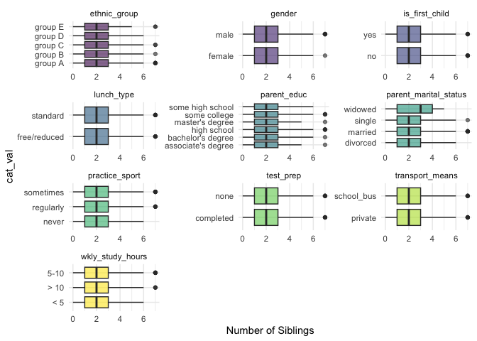
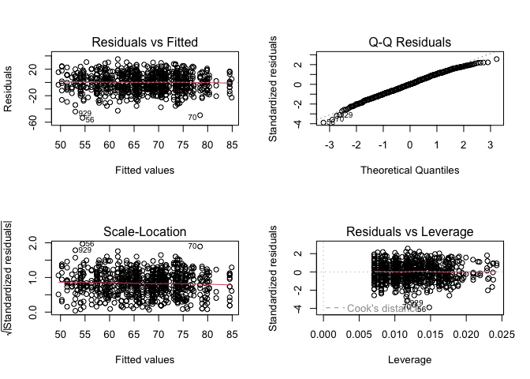
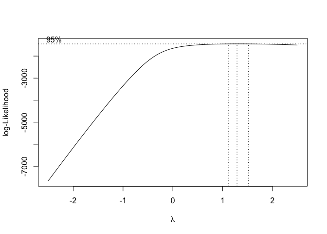
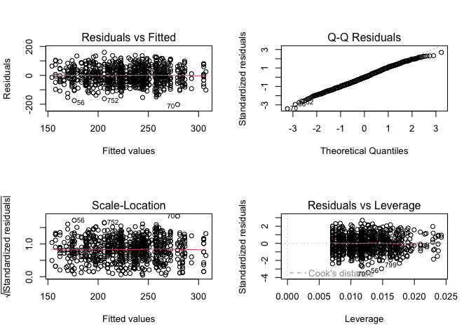
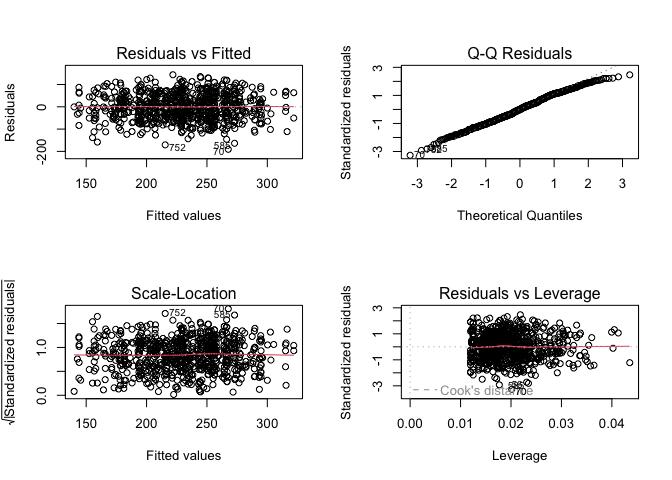
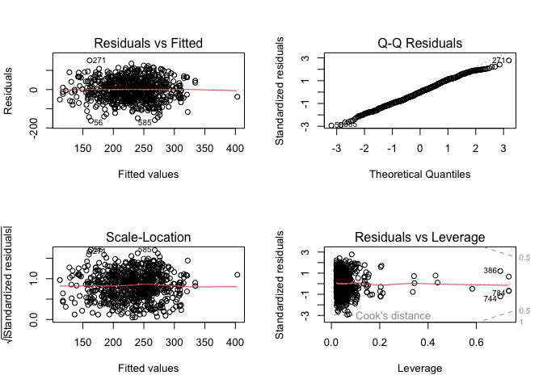
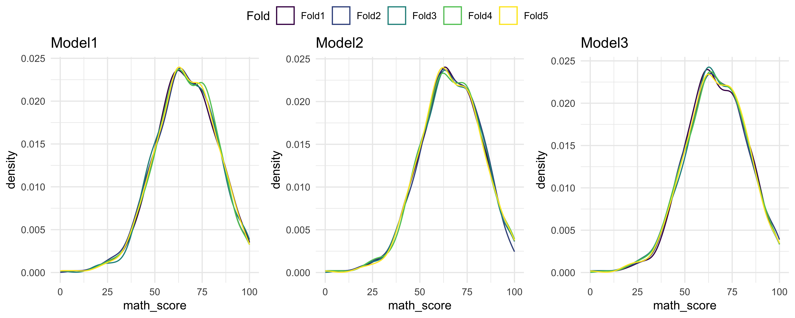
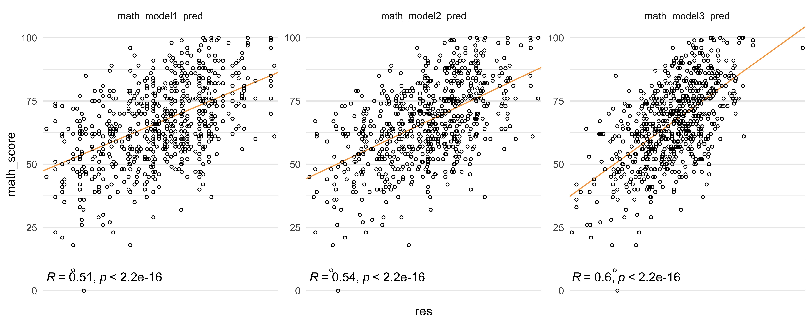

score_prediction
================
Chhiring Lama
2024-12-15

Firstly, we were interested in identifying any covariates are associated
with each other or not. There are ten categorical potential predictors
for which we first tested for chi-squared test for each pair of two
variables. However, there wasn’t enough evidence suggesting association
between any two categorical variables.

``` r
cat_columns <- names(score_df)[c(1:8, 10:11)]
comparisons <- combn(cat_columns, 2, simplify = FALSE)

categorical_df <- score_df[, cat_columns] |> 
  drop_na()
  
chiseq_test <- lapply(comparisons, function(x){
  categorical_df <- score_df |> 
    dplyr::select(x[1], x[2]) |> 
    drop_na()
  res = chisq.test(table(categorical_df), 
                   correct = TRUE) |> 
    broom::tidy() |> 
    mutate(group = paste(x[1], x[2], sep = ":"), 
           `p.value` = signif(`p.value`, 3), 
           statistic = round(statistic, 3))
  
  return(res)
})

chiseq_test <- bind_rows(chiseq_test) 

chiseq_test |> 
  dplyr::select(statistic, `p.value`, group) |> 
  arrange(`p.value`) |> 
  head(5) |> 
  knitr::kable(caption = "Chi-Squared Test For Categorical Covariates: Top 5 results (No signficant associations)")
```

| statistic | p.value | group                         |
|----------:|--------:|:------------------------------|
|    15.206 |  0.0553 | ethnic_group:wkly_study_hours |
|     9.385 |  0.0947 | parent_educ:transport_means   |
|     9.282 |  0.0983 | parent_educ:test_prep         |
|     7.462 |  0.1130 | gender:ethnic_group           |
|     4.251 |  0.1190 | test_prep:wkly_study_hours    |

Chi-Squared Test For Categorical Covariates: Top 5 results (No
signficant associations)

Next, the remaining continuous variable, `nr_siblings`, that measure
number of siblings was tested against all the categorical variables to
test for number of sibling differs between different categorical
variables. Number of siblings were different between students who were
the first child versus those who were not, also between students with
different number of weekly study hours. It will be worth accounting for
both `is_first_child` and `wkly_study_hours` if we include number of
siblings in the model.

``` r
grouped_df <- score_df |> 
      pivot_longer(
        cols = c(1:8, 10:11), 
        names_to = "cat_group", 
        values_to = "cat_val") |> 
  drop_na() 

grouped_df |> 
  ggplot(aes(x = cat_val, y = nr_siblings, fill = cat_group)) +
  geom_boxplot(alpha = 0.6) + 
  labs(y = "Number of Siblings") +
  coord_flip() +
  facet_wrap(~cat_group, scales = "free", ncol = 3) +
  theme_minimal()+
  theme(legend.position = "none") 
```



``` r
aov_res <- lapply(cat_columns, function(category){
  res = aov(nr_siblings ~ get(category), 
                    data = score_df) |> 
    broom::tidy() |> 
    mutate(term = case_when(
      term == "get(category)" ~ category, 
      TRUE ~ term)) |> 
    slice(1) |> 
    dplyr::select(term, df, statistic, `p.value`)
  return(res)
})

aov_res <- bind_rows(aov_res) 

aov_res |> 
  filter(`p.value` < 0.05) |> 
  mutate(`p.value` = signif(`p.value`, 3), 
         statistic = round(statistic, digits = 3)) |> 
  knitr::kable()
```

| term             |  df | statistic |  p.value |
|:-----------------|----:|----------:|---------:|
| is_first_child   |   1 |    16.366 | 5.68e-05 |
| wkly_study_hours |   2 |     3.024 | 4.91e-02 |

To model for math, reading and writing scores of students, we utilized
step-wise regression validation process for model selection.

``` r
math_model1 <- lm(math_score+1 ~ gender + wkly_study_hours + test_prep + ethnic_group + lunch_type, data = score_df) 

par(mfrow = c(2,2))
plot(math_model1)
```



``` r
shapiro.test(rstandard(math_model1))
```

    ## 
    ##  Shapiro-Wilk normality test
    ## 
    ## data:  rstandard(math_model1)
    ## W = 0.99388, p-value = 0.0023

``` r
par(mfrow = c(1,1))
boxcox <- MASS::boxcox(math_model1, 
             lambda = seq(-2.5, 2.5, 1/10)) 
```



``` r
boxcox <- Reduce(cbind, boxcox)
optimal_power <- boxcox |> 
  as_tibble() |> 
  filter(V2 == max(V2)) |> 
  pull(init) |> 
  round(digits =2)
```

Transforming Y:

``` r
score_df <- score_df |> 
  mutate(transformed_math = (math_score +1)^1.29)
math_model1 <- lm(transformed_math ~ gender + wkly_study_hours + test_prep + ethnic_group + lunch_type, data = score_df) 

math_model1 |> 
  broom::tidy() |> 
  mutate(`p.value` = signif(`p.value`, 3), 
         estimate = round(estimate, 3), 
         `std.error` = round(`std.error`, 3), 
         statistic = round(statistic, 3)) |> 
  knitr::kable(digits = 50)
```

| term                   | estimate | std.error | statistic |  p.value |
|:-----------------------|---------:|----------:|----------:|---------:|
| (Intercept)            |  228.600 |     9.069 |    25.208 | 0.00e+00 |
| gendermale             |   21.232 |     4.225 |     5.025 | 6.21e-07 |
| wkly_study_hours5-10   |   12.120 |     4.949 |     2.449 | 1.45e-02 |
| wkly_study_hours\> 10  |   14.286 |     6.597 |     2.166 | 3.06e-02 |
| test_prepnone          |  -25.984 |     4.393 |    -5.915 | 4.92e-09 |
| ethnic_groupgroup B    |    3.561 |     8.409 |     0.423 | 6.72e-01 |
| ethnic_groupgroup C    |    7.936 |     7.894 |     1.005 | 3.15e-01 |
| ethnic_groupgroup D    |   22.225 |     8.024 |     2.770 | 5.74e-03 |
| ethnic_groupgroup E    |   43.160 |     8.913 |     4.843 | 1.54e-06 |
| lunch_typefree/reduced |  -48.594 |     4.421 |   -10.991 | 2.92e-26 |

``` r
par(mfrow = c(2,2))
plot(math_model1)
```



``` r
shapiro.test(rstandard(math_model1))
```

    ## 
    ##  Shapiro-Wilk normality test
    ## 
    ## data:  rstandard(math_model1)
    ## W = 0.99682, p-value = 0.1096

``` r
### removing the influential point if needed
cooksd <- cooks.distance(math_model1)
influential <- as.numeric(names(cooksd)[(cooksd > 0.5)])
```

As seen above the after Y transformation where
$Y^*= ({math\_score + 1})^{1.34}$, the residuals follow normality,
homoscedascity and mean zero looking at the diagnostic plots.

``` r
math_model2 <- lm(transformed_math ~ gender + wkly_study_hours + test_prep + ethnic_group + lunch_type + parent_educ, data = score_df) 
math_model2 |> 
  broom::tidy() |> 
  mutate(`p.value` = signif(`p.value`, 3), 
         estimate = round(estimate, 3), 
         `std.error` = round(`std.error`, 3), 
         statistic = round(statistic, 3)) |> 
  knitr::kable(digits = 50)
```

| term                          | estimate | std.error | statistic |  p.value |
|:------------------------------|---------:|----------:|----------:|---------:|
| (Intercept)                   |  217.867 |    10.070 |    21.635 | 0.00e+00 |
| gendermale                    |   21.875 |     4.325 |     5.058 | 5.33e-07 |
| wkly_study_hours5-10          |   12.535 |     5.062 |     2.476 | 1.35e-02 |
| wkly_study_hours\> 10         |   13.840 |     6.709 |     2.063 | 3.95e-02 |
| test_prepnone                 |  -27.135 |     4.518 |    -6.006 | 2.97e-09 |
| ethnic_groupgroup B           |    3.990 |     8.672 |     0.460 | 6.46e-01 |
| ethnic_groupgroup C           |    5.423 |     8.151 |     0.665 | 5.06e-01 |
| ethnic_groupgroup D           |   20.861 |     8.284 |     2.518 | 1.20e-02 |
| ethnic_groupgroup E           |   42.527 |     9.184 |     4.630 | 4.31e-06 |
| lunch_typefree/reduced        |  -50.725 |     4.518 |   -11.228 | 3.94e-27 |
| parent_educassociate’s degree |   20.296 |     6.824 |     2.974 | 3.04e-03 |
| parent_educbachelor’s degree  |   27.087 |     7.951 |     3.407 | 6.93e-04 |
| parent_educhigh school        |   -1.295 |     6.915 |    -0.187 | 8.52e-01 |
| parent_educmaster’s degree    |   31.040 |     9.994 |     3.106 | 1.97e-03 |
| parent_educsome college       |   20.704 |     6.854 |     3.021 | 2.61e-03 |

``` r
par(mfrow = c(2,2))
plot(math_model2)
```



``` r
### removing the influential point if needed
cooksd <- cooks.distance(math_model2)
influential <- as.numeric(names(cooksd)[(cooksd > 0.5)])
```

``` r
math_model3 <- lm(transformed_math ~ gender + wkly_study_hours*parent_marital_status + test_prep + ethnic_group + lunch_type + parent_educ*parent_marital_status + practice_sport, data = score_df)

math_model3 |> 
  broom::tidy() |> 
  mutate(`p.value` = signif(`p.value`, 3), 
         estimate = round(estimate, 3), 
         `std.error` = round(`std.error`, 3), 
         statistic = round(statistic, 3)) |> 
  knitr::kable(digits = 50)
```

| term | estimate | std.error | statistic | p.value |
|:---|---:|---:|---:|---:|
| (Intercept) | 174.543 | 15.466 | 11.286 | 3.80e-27 |
| gendermale | 21.763 | 4.437 | 4.904 | 1.18e-06 |
| wkly_study_hours5-10 | 30.025 | 10.306 | 2.913 | 3.70e-03 |
| wkly_study_hours\> 10 | 44.182 | 13.662 | 3.234 | 1.28e-03 |
| parent_marital_statusdivorced | 49.008 | 19.585 | 2.502 | 1.26e-02 |
| parent_marital_statusmarried | 41.896 | 14.271 | 2.936 | 3.44e-03 |
| parent_marital_statuswidowed | 79.938 | 50.621 | 1.579 | 1.15e-01 |
| test_prepnone | -25.376 | 4.637 | -5.473 | 6.28e-08 |
| ethnic_groupgroup B | 5.902 | 8.885 | 0.664 | 5.07e-01 |
| ethnic_groupgroup C | 8.079 | 8.363 | 0.966 | 3.34e-01 |
| ethnic_groupgroup D | 22.393 | 8.487 | 2.639 | 8.52e-03 |
| ethnic_groupgroup E | 50.648 | 9.445 | 5.362 | 1.13e-07 |
| lunch_typefree/reduced | -53.788 | 4.625 | -11.630 | 1.37e-28 |
| parent_educassociate’s degree | 32.566 | 13.161 | 2.474 | 1.36e-02 |
| parent_educbachelor’s degree | 26.969 | 17.078 | 1.579 | 1.15e-01 |
| parent_educhigh school | 24.192 | 14.220 | 1.701 | 8.94e-02 |
| parent_educmaster’s degree | 53.891 | 19.104 | 2.821 | 4.93e-03 |
| parent_educsome college | 14.356 | 13.968 | 1.028 | 3.04e-01 |
| practice_sportregularly | 15.507 | 7.276 | 2.131 | 3.34e-02 |
| practice_sportsometimes | 11.157 | 7.065 | 1.579 | 1.15e-01 |
| wkly_study_hours5-10:parent_marital_statusdivorced | -34.580 | 16.416 | -2.107 | 3.55e-02 |
| wkly_study_hours\> 10:parent_marital_statusdivorced | -71.896 | 22.252 | -3.231 | 1.29e-03 |
| wkly_study_hours5-10:parent_marital_statusmarried | -23.557 | 12.241 | -1.924 | 5.47e-02 |
| wkly_study_hours\> 10:parent_marital_statusmarried | -34.563 | 16.213 | -2.132 | 3.34e-02 |
| wkly_study_hours5-10:parent_marital_statuswidowed | 30.377 | 60.500 | 0.502 | 6.16e-01 |
| wkly_study_hours\> 10:parent_marital_statuswidowed | -63.330 | 56.958 | -1.112 | 2.67e-01 |
| parent_marital_statusdivorced:parent_educassociate’s degree | -50.235 | 21.281 | -2.361 | 1.85e-02 |
| parent_marital_statusmarried:parent_educassociate’s degree | -9.111 | 16.101 | -0.566 | 5.72e-01 |
| parent_marital_statuswidowed:parent_educassociate’s degree | -32.104 | 66.280 | -0.484 | 6.28e-01 |
| parent_marital_statusdivorced:parent_educbachelor’s degree | 31.422 | 29.283 | 1.073 | 2.84e-01 |
| parent_marital_statusmarried:parent_educbachelor’s degree | -9.768 | 19.965 | -0.489 | 6.25e-01 |
| parent_marital_statuswidowed:parent_educbachelor’s degree | -46.369 | 72.972 | -0.635 | 5.25e-01 |
| parent_marital_statusdivorced:parent_educhigh school | -65.833 | 21.578 | -3.051 | 2.37e-03 |
| parent_marital_statusmarried:parent_educhigh school | -24.952 | 16.976 | -1.470 | 1.42e-01 |
| parent_marital_statuswidowed:parent_educhigh school | -143.334 | 69.310 | -2.068 | 3.90e-02 |
| parent_marital_statusdivorced:parent_educmaster’s degree | -55.561 | 30.369 | -1.830 | 6.78e-02 |
| parent_marital_statusmarried:parent_educmaster’s degree | -19.145 | 23.538 | -0.813 | 4.16e-01 |
| parent_marital_statuswidowed:parent_educmaster’s degree | -128.847 | 87.296 | -1.476 | 1.40e-01 |
| parent_marital_statusdivorced:parent_educsome college | -0.209 | 21.805 | -0.010 | 9.92e-01 |
| parent_marital_statusmarried:parent_educsome college | 4.448 | 16.719 | 0.266 | 7.90e-01 |
| parent_marital_statuswidowed:parent_educsome college | -26.635 | 56.817 | -0.469 | 6.39e-01 |

``` r
par(mfrow = c(2,2))
plot(math_model3)
```



``` r
### removing the influential point if needed
cooksd <- cooks.distance(math_model3)
influential <- as.numeric(names(cooksd)[(cooksd > 0.5)])
```

After testing multiple models and removing redundant predictors using
step-wise regression, the three models with higher adjusted $R^2$ are
selected further for cross-validation to pick the best predictive model.
Here is a look to the 5-fold division for cross-validation.

## Splitting dataset for cross validation

``` r
#specify the cross-validation method
set.seed(1)
ctrl <- trainControl(method = "cv", number = 5)

filtered_df <- score_df |> 
  drop_na(gender, wkly_study_hours, parent_marital_status, test_prep, ethnic_group, 
          lunch_type, parent_educ, practice_sport)

#fit a regression model and use k-fold CV to evaluate performance
model1 <- train(transformed_math ~ gender + wkly_study_hours + 
    test_prep + ethnic_group + lunch_type, data = filtered_df, method = "lm", trControl = ctrl)

model2 <- train(transformed_math ~ gender + wkly_study_hours + 
    test_prep + ethnic_group + lunch_type + parent_educ, data = filtered_df, method = "lm", trControl = ctrl)

model3 <- train(transformed_math ~ gender + wkly_study_hours*parent_marital_status + test_prep + ethnic_group + lunch_type + 
    parent_educ*parent_marital_status + practice_sport, data = filtered_df, method = "lm", trControl = ctrl)
# get fold subsets
fold_data_model1 <- lapply(model1$control$index, function(index) filtered_df[index,]) |> 
    bind_rows(.id = "Fold") 
fold_data_model2 <- lapply(model2$control$index, function(index) filtered_df[index,]) |> 
    bind_rows(.id = "Fold") 
fold_data_model3 <- lapply(model3$control$index, function(index) filtered_df[index,]) |> 
    bind_rows(.id = "Fold") 

# example plots
plot1 <- ggplot(fold_data_model1, aes(math_score, col = Fold)) + geom_density(alpha = 0.6) + ggtitle("Model1")
plot2 <- ggplot(fold_data_model2, aes(math_score, col = Fold)) + geom_density(alpha = 0.6) + ggtitle("Model2")
plot3 <- ggplot(fold_data_model3, aes(math_score, col = Fold)) + geom_density(alpha = 0.6) + ggtitle("Model3")
ggarrange(plot1, plot2, plot3, ncol = 3, common.legend = TRUE)
```



Below is the 5-fold cross-validation results including fitted value
versus observed score plot and performace metrices from each of the
three models.

``` r
filtered_df |> 
  mutate(math_model1_pred = (model1[["finalModel"]][["fitted.values"]])^(1/1.29) - 1, 
         math_model2_pred = (model2[["finalModel"]][["fitted.values"]])^(1/1.29) - 1, 
         math_model3_pred = (model3[["finalModel"]][["fitted.values"]])^(1/1.29) - 1) |> 
  pivot_longer(
    cols = c(math_model1_pred, math_model2_pred, math_model3_pred), 
    names_to = "model_type", 
    values_to = "res"
  ) |> 
  ggplot(aes(x = res, y = math_score)) +
  geom_abline(intercept = 0, slope = 1, color = "#f7aa58") +
  geom_point(size = 1, shape = 21) +
  facet_wrap(~model_type, scale = "free") +
  stat_cor(label.y = 5) +
  scale_x_discrete(labels = c("Predicted Math Score"))
```



``` r
bind_rows(model1$results, model2$results, model3$results) |> 
  mutate(model_id = c(1, 2, 3)) |> 
  relocate(model_id) |> 
  knitr::kable(digits =3, caption = "Performance matrices of the 3 Multiple Linear Regression Models")
```

| model_id | intercept |   RMSE | Rsquared |    MAE | RMSESD | RsquaredSD | MAESD |
|---------:|:----------|-------:|---------:|-------:|-------:|-----------:|------:|
|        1 | TRUE      | 60.413 |    0.239 | 49.457 |  1.901 |      0.055 | 1.691 |
|        2 | TRUE      | 58.948 |    0.277 | 48.614 |  3.531 |      0.069 | 2.485 |
|        3 | TRUE      | 59.625 |    0.268 | 48.660 |  2.753 |      0.027 | 2.677 |

Performance matrices of the 3 Multiple Linear Regression Models
