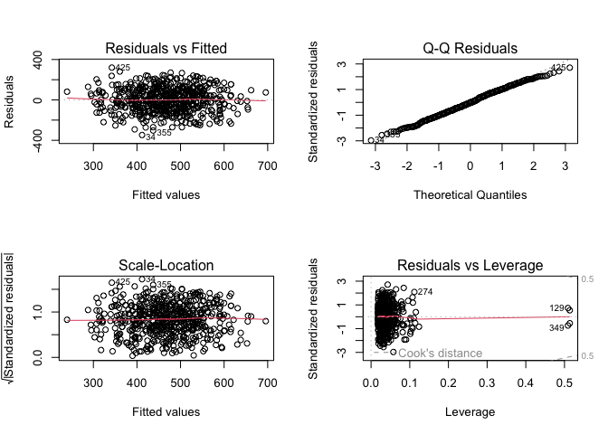
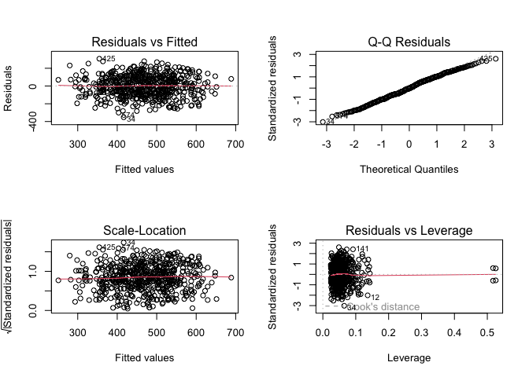

Predicting Reading Score
================
Jeong Yun Choi
2024-12-15

We implement step-wise regression to deduce significant covariates for
modeling `reading score`. We note that most of the variables listed are
categorical. Therefore, we incorporated factor releveing in order to
give some dimensions. First, we will check for non-linearity in the
scores and apply transformation if need be.

``` r
# Preliminary using all covariates for the first model
reading_model1v1 <- lm(reading_score ~ gender + ethnic_group + parent_educ + lunch_type + test_prep + parent_marital_status + practice_sport + transport_means + wkly_study_hours, data = score_df)

summary(reading_model1v1)
```

    ## 
    ## Call:
    ## lm(formula = reading_score ~ gender + ethnic_group + parent_educ + 
    ##     lunch_type + test_prep + parent_marital_status + practice_sport + 
    ##     transport_means + wkly_study_hours, data = score_df)
    ## 
    ## Residuals:
    ##     Min      1Q  Median      3Q     Max 
    ## -40.941  -8.820   0.412   9.075  29.896 
    ## 
    ## Coefficients:
    ##                               Estimate Std. Error t value Pr(>|t|)    
    ## (Intercept)                    73.2325     3.2700  22.396  < 2e-16 ***
    ## gendermale                     -7.7133     1.1100  -6.949 1.02e-11 ***
    ## ethnic_groupgroup B            -1.4560     2.2540  -0.646 0.518547    
    ## ethnic_groupgroup C            -0.7939     2.1607  -0.367 0.713427    
    ## ethnic_groupgroup D             2.4767     2.1728   1.140 0.254824    
    ## ethnic_groupgroup E             5.9234     2.3830   2.486 0.013218 *  
    ## parent_educassociate's degree   4.8671     1.7280   2.817 0.005023 ** 
    ## parent_educbachelor's degree    7.3487     2.0266   3.626 0.000314 ***
    ## parent_educhigh school         -0.3464     1.7506  -0.198 0.843197    
    ## parent_educmaster's degree      8.7922     2.4794   3.546 0.000423 ***
    ## parent_educsome college         2.5284     1.7709   1.428 0.153919    
    ## lunch_typefree/reduced         -8.4564     1.1490  -7.360 6.51e-13 ***
    ## test_prepnone                  -6.4209     1.1682  -5.496 5.87e-08 ***
    ## parent_marital_statusdivorced  -1.8091     1.7943  -1.008 0.313756    
    ## parent_marital_statusmarried    3.3283     1.3466   2.472 0.013746 *  
    ## parent_marital_statuswidowed    3.7308     3.6279   1.028 0.304219    
    ## practice_sportregularly        -0.8158     1.8552  -0.440 0.660293    
    ## practice_sportsometimes         0.6334     1.7995   0.352 0.724958    
    ## transport_meansprivate         -0.3129     1.1350  -0.276 0.782905    
    ## wkly_study_hours5-10            2.6766     1.3092   2.044 0.041367 *  
    ## wkly_study_hours> 10            1.1958     1.7100   0.699 0.484642    
    ## ---
    ## Signif. codes:  0 '***' 0.001 '**' 0.01 '*' 0.05 '.' 0.1 ' ' 1
    ## 
    ## Residual standard error: 13.2 on 566 degrees of freedom
    ## Multiple R-squared:  0.2682, Adjusted R-squared:  0.2423 
    ## F-statistic: 10.37 on 20 and 566 DF,  p-value: < 2.2e-16

``` r
###covariates practice_sports, is_first_child, nr_siblings, transport_means are not significant

reading_model1v2 <- lm(reading_score ~ gender + ethnic_group + parent_educ +lunch_type + test_prep + parent_marital_status + wkly_study_hours, data = score_df)
summary(reading_model1v2)
```

    ## 
    ## Call:
    ## lm(formula = reading_score ~ gender + ethnic_group + parent_educ + 
    ##     lunch_type + test_prep + parent_marital_status + wkly_study_hours, 
    ##     data = score_df)
    ## 
    ## Residuals:
    ##     Min      1Q  Median      3Q     Max 
    ## -41.661  -8.604   0.594   9.263  30.252 
    ## 
    ## Coefficients:
    ##                               Estimate Std. Error t value Pr(>|t|)    
    ## (Intercept)                    73.0893     2.8156  25.959  < 2e-16 ***
    ## gendermale                     -7.7224     1.1084  -6.967 8.98e-12 ***
    ## ethnic_groupgroup B            -1.4318     2.2509  -0.636 0.524965    
    ## ethnic_groupgroup C            -0.7388     2.1541  -0.343 0.731750    
    ## ethnic_groupgroup D             2.5473     2.1671   1.175 0.240303    
    ## ethnic_groupgroup E             5.8112     2.3770   2.445 0.014796 *  
    ## parent_educassociate's degree   4.9095     1.7238   2.848 0.004557 ** 
    ## parent_educbachelor's degree    7.3948     2.0224   3.657 0.000279 ***
    ## parent_educhigh school         -0.3808     1.7470  -0.218 0.827512    
    ## parent_educmaster's degree      8.9831     2.4667   3.642 0.000296 ***
    ## parent_educsome college         2.4921     1.7673   1.410 0.159046    
    ## lunch_typefree/reduced         -8.4814     1.1468  -7.395 5.07e-13 ***
    ## test_prepnone                  -6.4210     1.1610  -5.531 4.87e-08 ***
    ## parent_marital_statusdivorced  -1.7892     1.7875  -1.001 0.317292    
    ## parent_marital_statusmarried    3.3561     1.3439   2.497 0.012796 *  
    ## parent_marital_statuswidowed    3.6598     3.6151   1.012 0.311792    
    ## wkly_study_hours5-10            2.6738     1.3069   2.046 0.041220 *  
    ## wkly_study_hours> 10            1.2128     1.7068   0.711 0.477627    
    ## ---
    ## Signif. codes:  0 '***' 0.001 '**' 0.01 '*' 0.05 '.' 0.1 ' ' 1
    ## 
    ## Residual standard error: 13.19 on 569 degrees of freedom
    ## Multiple R-squared:  0.2661, Adjusted R-squared:  0.2442 
    ## F-statistic: 12.14 on 17 and 569 DF,  p-value: < 2.2e-16

``` r
#increased adjusted R^2 value. Will be keeping this model.

reading_model1<- lm(reading_score ~ gender + ethnic_group + parent_educ +lunch_type + test_prep + parent_marital_status + wkly_study_hours, data = score_df)

par(mfrow = c(1,1))
boxcox_reading <- MASS::boxcox(reading_model1, lambda = seq(-2.5, 2.5, 0.1))
```


``` r
shapiro.test(rstandard(reading_model1))
```

    ## 
    ##  Shapiro-Wilk normality test
    ## 
    ## data:  rstandard(reading_model1)
    ## W = 0.99177, p-value = 0.002428

``` r
boxcox_reading <- Reduce(cbind, boxcox_reading)
optimal_power <- boxcox_reading |> 
  as_tibble() |> 
  filter(V2 == max(V2)) |> 
  pull(init) |> 
  round(digits =2)
```

``` r
# Transformed Y using the optimal lambda: 
score_df <- score_df %>% 
  mutate(transformed_reading = (reading_score +1)^1.44)

#adjusted some relevant covariates
reading_model1 = lm(transformed_reading ~ gender + ethnic_group + parent_educ + test_prep + parent_marital_status + wkly_study_hours, data = score_df)

reading_model1 %>% 
  broom::tidy() %>% 
  mutate(`p.value` = signif(`p.value`, 3), 
         estimate = round(estimate, 3), 
         `std.error` = round(`std.error`, 3), 
         statistic = round(statistic, 3)) |> 
  knitr::kable(digits = 50)
```

| term                          | estimate | std.error | statistic |  p.value |
|:------------------------------|---------:|----------:|----------:|---------:|
| (Intercept)                   |  465.027 |    26.590 |    17.489 | 0.00e+00 |
| gendermale                    |  -69.200 |    10.650 |    -6.498 | 1.78e-10 |
| ethnic_groupgroup B           |  -13.951 |    21.656 |    -0.644 | 5.20e-01 |
| ethnic_groupgroup C           |   -7.464 |    20.724 |    -0.360 | 7.19e-01 |
| ethnic_groupgroup D           |   23.186 |    20.849 |     1.112 | 2.67e-01 |
| ethnic_groupgroup E           |   58.666 |    22.853 |     2.567 | 1.05e-02 |
| parent_educassociate’s degree |   44.727 |    16.585 |     2.697 | 7.21e-03 |
| parent_educbachelor’s degree  |   69.559 |    19.457 |     3.575 | 3.80e-04 |
| parent_educhigh school        |   -3.014 |    16.806 |    -0.179 | 8.58e-01 |
| parent_educmaster’s degree    |   80.619 |    23.731 |     3.397 | 7.28e-04 |
| parent_educsome college       |   22.078 |    17.004 |     1.298 | 1.95e-01 |
| test_prepnone                 |  -56.974 |    11.164 |    -5.103 | 4.55e-07 |
| parent_marital_statusdivorced |  -14.511 |    17.195 |    -0.844 | 3.99e-01 |
| parent_marital_statusmarried  |   32.312 |    12.926 |     2.500 | 1.27e-02 |
| parent_marital_statuswidowed  |   31.750 |    34.780 |     0.913 | 3.62e-01 |
| wkly_study_hours5-10          |   28.875 |    12.562 |     2.299 | 2.19e-02 |
| wkly_study_hours\> 10         |   12.072 |    16.421 |     0.735 | 4.63e-01 |

``` r
par(mfrow = c(2,2))
plot(reading_model1)
```


``` r
shapiro.test(rstandard(reading_model1))
```

    ## 
    ##  Shapiro-Wilk normality test
    ## 
    ## data:  rstandard(reading_model1)
    ## W = 0.99564, p-value = 0.1008

``` r
##After transforming, shapiro test fails to reject null, indiciating normality is assumed. 

### removing the influential point if needed
cooksd_read <- cooks.distance(reading_model1)
influential_read <- as.numeric(names(cooksd_read)[(cooksd_read > 0.5)])
# influential_read is 0
```

As seen above the after Y transformation where
$Y^*= ({reading\_score + 1})^{1.44}$, the residuals follow normality,
homoscedascity and mean zero looking at the diagnostic plots.

## Refined Covariates

``` r
### Add interaction between `ethnic_group` and `parent_educ`.
reading_model2v1 <- lm(transformed_reading ~ gender + test_prep + parent_marital_status + wkly_study_hours + ethnic_group:parent_educ, data = score_df)
summary(reading_model2v1)
```

    ## 
    ## Call:
    ## lm(formula = transformed_reading ~ gender + test_prep + parent_marital_status + 
    ##     wkly_study_hours + ethnic_group:parent_educ, data = score_df)
    ## 
    ## Residuals:
    ##     Min      1Q  Median      3Q     Max 
    ## -334.91  -81.35   -0.31   85.27  320.17 
    ## 
    ## Coefficients: (1 not defined because of singularities)
    ##                                                   Estimate Std. Error t value
    ## (Intercept)                                        541.038     35.781  15.121
    ## gendermale                                         -68.359     10.902  -6.271
    ## test_prepnone                                      -58.528     11.424  -5.123
    ## parent_marital_statusdivorced                      -14.468     17.713  -0.817
    ## parent_marital_statusmarried                        33.164     13.399   2.475
    ## parent_marital_statuswidowed                        38.838     35.706   1.088
    ## wkly_study_hours5-10                                28.969     12.888   2.248
    ## wkly_study_hours> 10                                10.087     16.876   0.598
    ## ethnic_groupgroup A:parent_educsome high school    -77.630     49.584  -1.566
    ## ethnic_groupgroup B:parent_educsome high school   -109.042     40.315  -2.705
    ## ethnic_groupgroup C:parent_educsome high school   -101.028     40.332  -2.505
    ## ethnic_groupgroup D:parent_educsome high school    -34.135     38.183  -0.894
    ## ethnic_groupgroup E:parent_educsome high school      5.296     45.457   0.116
    ## ethnic_groupgroup A:parent_educassociate's degree  -32.582     54.859  -0.594
    ## ethnic_groupgroup B:parent_educassociate's degree  -29.066     39.296  -0.740
    ## ethnic_groupgroup C:parent_educassociate's degree  -30.703     37.416  -0.821
    ## ethnic_groupgroup D:parent_educassociate's degree  -13.269     39.728  -0.334
    ## ethnic_groupgroup E:parent_educassociate's degree    4.999     40.151   0.125
    ## ethnic_groupgroup A:parent_educbachelor's degree    -9.677     71.530  -0.135
    ## ethnic_groupgroup B:parent_educbachelor's degree     1.759     47.324   0.037
    ## ethnic_groupgroup C:parent_educbachelor's degree    -2.824     39.750  -0.071
    ## ethnic_groupgroup D:parent_educbachelor's degree   -15.904     44.154  -0.360
    ## ethnic_groupgroup E:parent_educbachelor's degree    48.204     53.514   0.901
    ## ethnic_groupgroup A:parent_educhigh school         -56.969     45.456  -1.253
    ## ethnic_groupgroup B:parent_educhigh school        -106.687     38.867  -2.745
    ## ethnic_groupgroup C:parent_educhigh school         -82.830     38.232  -2.167
    ## ethnic_groupgroup D:parent_educhigh school         -60.708     38.697  -1.569
    ## ethnic_groupgroup E:parent_educhigh school          -8.209     48.344  -0.170
    ## ethnic_groupgroup A:parent_educmaster's degree     -55.661     95.858  -0.581
    ## ethnic_groupgroup B:parent_educmaster's degree      47.744     61.041   0.782
    ## ethnic_groupgroup C:parent_educmaster's degree     -58.449     49.644  -1.177
    ## ethnic_groupgroup D:parent_educmaster's degree      39.788     46.399   0.858
    ## ethnic_groupgroup E:parent_educmaster's degree     102.140     61.182   1.669
    ## ethnic_groupgroup A:parent_educsome college        -68.389     51.180  -1.336
    ## ethnic_groupgroup B:parent_educsome college        -77.143     43.470  -1.775
    ## ethnic_groupgroup C:parent_educsome college        -52.642     37.369  -1.409
    ## ethnic_groupgroup D:parent_educsome college        -27.919     38.501  -0.725
    ## ethnic_groupgroup E:parent_educsome college             NA         NA      NA
    ##                                                   Pr(>|t|)    
    ## (Intercept)                                        < 2e-16 ***
    ## gendermale                                        7.28e-10 ***
    ## test_prepnone                                     4.16e-07 ***
    ## parent_marital_statusdivorced                      0.41438    
    ## parent_marital_statusmarried                       0.01362 *  
    ## parent_marital_statuswidowed                       0.27719    
    ## wkly_study_hours5-10                               0.02499 *  
    ## wkly_study_hours> 10                               0.55028    
    ## ethnic_groupgroup A:parent_educsome high school    0.11802    
    ## ethnic_groupgroup B:parent_educsome high school    0.00705 ** 
    ## ethnic_groupgroup C:parent_educsome high school    0.01254 *  
    ## ethnic_groupgroup D:parent_educsome high school    0.37171    
    ## ethnic_groupgroup E:parent_educsome high school    0.90730    
    ## ethnic_groupgroup A:parent_educassociate's degree  0.55281    
    ## ethnic_groupgroup B:parent_educassociate's degree  0.45982    
    ## ethnic_groupgroup C:parent_educassociate's degree  0.41224    
    ## ethnic_groupgroup D:parent_educassociate's degree  0.73850    
    ## ethnic_groupgroup E:parent_educassociate's degree  0.90096    
    ## ethnic_groupgroup A:parent_educbachelor's degree   0.89244    
    ## ethnic_groupgroup B:parent_educbachelor's degree   0.97037    
    ## ethnic_groupgroup C:parent_educbachelor's degree   0.94339    
    ## ethnic_groupgroup D:parent_educbachelor's degree   0.71884    
    ## ethnic_groupgroup E:parent_educbachelor's degree   0.36810    
    ## ethnic_groupgroup A:parent_educhigh school         0.21064    
    ## ethnic_groupgroup B:parent_educhigh school         0.00625 ** 
    ## ethnic_groupgroup C:parent_educhigh school         0.03070 *  
    ## ethnic_groupgroup D:parent_educhigh school         0.11726    
    ## ethnic_groupgroup E:parent_educhigh school         0.86522    
    ## ethnic_groupgroup A:parent_educmaster's degree     0.56171    
    ## ethnic_groupgroup B:parent_educmaster's degree     0.43446    
    ## ethnic_groupgroup C:parent_educmaster's degree     0.23956    
    ## ethnic_groupgroup D:parent_educmaster's degree     0.39153    
    ## ethnic_groupgroup E:parent_educmaster's degree     0.09560 .  
    ## ethnic_groupgroup A:parent_educsome college        0.18202    
    ## ethnic_groupgroup B:parent_educsome college        0.07651 .  
    ## ethnic_groupgroup C:parent_educsome college        0.15949    
    ## ethnic_groupgroup D:parent_educsome college        0.46866    
    ## ethnic_groupgroup E:parent_educsome college             NA    
    ## ---
    ## Signif. codes:  0 '***' 0.001 '**' 0.01 '*' 0.05 '.' 0.1 ' ' 1
    ## 
    ## Residual standard error: 127.9 on 550 degrees of freedom
    ## Multiple R-squared:  0.2157, Adjusted R-squared:  0.1643 
    ## F-statistic: 4.201 on 36 and 550 DF,  p-value: 8.364e-14

``` r
### No significant interaction effect between `ethnic_group` and `parent educ` and adjusted R^2 value decreased. Will not be keeping this.

# Add interaction between `parent_marital_status` and `wkly_study_hours` and `parent_educ`, added lunch_type covariate. Deleted ethnic group.
reading_model2v2 <- lm(transformed_reading ~ gender + lunch_type + test_prep + parent_marital_status:parent_educ + wkly_study_hours:parent_educ, data = score_df)
summary(reading_model2v2)
```

    ## 
    ## Call:
    ## lm(formula = transformed_reading ~ gender + lunch_type + test_prep + 
    ##     parent_marital_status:parent_educ + wkly_study_hours:parent_educ, 
    ##     data = score_df)
    ## 
    ## Residuals:
    ##     Min      1Q  Median      3Q     Max 
    ## -331.61  -85.24    0.98   88.08  318.18 
    ## 
    ## Coefficients: (1 not defined because of singularities)
    ##                                                              Estimate
    ## (Intercept)                                                  648.6589
    ## gendermale                                                   -71.5131
    ## lunch_typefree/reduced                                       -82.4781
    ## test_prepnone                                                -64.1506
    ## parent_marital_statussingle:parent_educsome high school     -123.9885
    ## parent_marital_statusdivorced:parent_educsome high school   -111.3817
    ## parent_marital_statusmarried:parent_educsome high school     -91.6515
    ## parent_marital_statuswidowed:parent_educsome high school     -64.6100
    ## parent_marital_statussingle:parent_educassociate's degree    -97.1425
    ## parent_marital_statusdivorced:parent_educassociate's degree -147.6457
    ## parent_marital_statusmarried:parent_educassociate's degree   -59.6920
    ## parent_marital_statuswidowed:parent_educassociate's degree    -0.5289
    ## parent_marital_statussingle:parent_educbachelor's degree    -108.7603
    ## parent_marital_statusdivorced:parent_educbachelor's degree   -33.3807
    ## parent_marital_statusmarried:parent_educbachelor's degree    -75.4363
    ## parent_marital_statuswidowed:parent_educbachelor's degree    -54.7733
    ## parent_marital_statussingle:parent_educhigh school           -82.9666
    ## parent_marital_statusdivorced:parent_educhigh school        -163.3035
    ## parent_marital_statusmarried:parent_educhigh school          -92.2655
    ## parent_marital_statuswidowed:parent_educhigh school         -211.3339
    ## parent_marital_statussingle:parent_educmaster's degree       -17.7216
    ## parent_marital_statusdivorced:parent_educmaster's degree     -68.6809
    ## parent_marital_statusmarried:parent_educmaster's degree       -5.7651
    ## parent_marital_statuswidowed:parent_educmaster's degree      -87.9289
    ## parent_marital_statussingle:parent_educsome college         -160.3932
    ## parent_marital_statusdivorced:parent_educsome college       -106.1733
    ## parent_marital_statusmarried:parent_educsome college        -102.2423
    ## parent_marital_statuswidowed:parent_educsome college               NA
    ## parent_educsome high school:wkly_study_hours5-10              -9.3624
    ## parent_educassociate's degree:wkly_study_hours5-10            32.9360
    ## parent_educbachelor's degree:wkly_study_hours5-10             82.0421
    ## parent_educhigh school:wkly_study_hours5-10                   -6.9614
    ## parent_educmaster's degree:wkly_study_hours5-10               -0.6908
    ## parent_educsome college:wkly_study_hours5-10                  56.2981
    ## parent_educsome high school:wkly_study_hours> 10              17.7729
    ## parent_educassociate's degree:wkly_study_hours> 10            24.7170
    ## parent_educbachelor's degree:wkly_study_hours> 10             -6.4235
    ## parent_educhigh school:wkly_study_hours> 10                    4.1312
    ## parent_educmaster's degree:wkly_study_hours> 10               32.2706
    ## parent_educsome college:wkly_study_hours> 10                   6.6425
    ##                                                             Std. Error t value
    ## (Intercept)                                                    73.6994   8.801
    ## gendermale                                                     10.3928  -6.881
    ## lunch_typefree/reduced                                         10.9175  -7.555
    ## test_prepnone                                                  10.9640  -5.851
    ## parent_marital_statussingle:parent_educsome high school        78.5062  -1.579
    ## parent_marital_statusdivorced:parent_educsome high school      81.0521  -1.374
    ## parent_marital_statusmarried:parent_educsome high school       76.8796  -1.192
    ## parent_marital_statuswidowed:parent_educsome high school      114.5855  -0.564
    ## parent_marital_statussingle:parent_educassociate's degree      78.2232  -1.242
    ## parent_marital_statusdivorced:parent_educassociate's degree    80.6252  -1.831
    ## parent_marital_statusmarried:parent_educassociate's degree     76.9754  -0.775
    ## parent_marital_statuswidowed:parent_educassociate's degree    116.5537  -0.005
    ## parent_marital_statussingle:parent_educbachelor's degree       81.7704  -1.330
    ## parent_marital_statusdivorced:parent_educbachelor's degree     90.4668  -0.369
    ## parent_marital_statusmarried:parent_educbachelor's degree      77.9798  -0.967
    ## parent_marital_statuswidowed:parent_educbachelor's degree     106.7299  -0.513
    ## parent_marital_statussingle:parent_educhigh school             80.2389  -1.034
    ## parent_marital_statusdivorced:parent_educhigh school           80.0474  -2.040
    ## parent_marital_statusmarried:parent_educhigh school            76.9249  -1.199
    ## parent_marital_statuswidowed:parent_educhigh school            99.1332  -2.132
    ## parent_marital_statussingle:parent_educmaster's degree         86.1146  -0.206
    ## parent_marital_statusdivorced:parent_educmaster's degree       88.9074  -0.772
    ## parent_marital_statusmarried:parent_educmaster's degree        83.5563  -0.069
    ## parent_marital_statuswidowed:parent_educmaster's degree       149.2348  -0.589
    ## parent_marital_statussingle:parent_educsome college            75.1437  -2.134
    ## parent_marital_statusdivorced:parent_educsome college          76.5973  -1.386
    ## parent_marital_statusmarried:parent_educsome college           72.2706  -1.415
    ## parent_marital_statuswidowed:parent_educsome college                NA      NA
    ## parent_educsome high school:wkly_study_hours5-10               27.4720  -0.341
    ## parent_educassociate's degree:wkly_study_hours5-10             26.8842   1.225
    ## parent_educbachelor's degree:wkly_study_hours5-10              33.1620   2.474
    ## parent_educhigh school:wkly_study_hours5-10                    27.1106  -0.257
    ## parent_educmaster's degree:wkly_study_hours5-10                43.5016  -0.016
    ## parent_educsome college:wkly_study_hours5-10                   27.7925   2.026
    ## parent_educsome high school:wkly_study_hours> 10               35.9758   0.494
    ## parent_educassociate's degree:wkly_study_hours> 10             31.8990   0.775
    ## parent_educbachelor's degree:wkly_study_hours> 10              46.6968  -0.138
    ## parent_educhigh school:wkly_study_hours> 10                    36.9868   0.112
    ## parent_educmaster's degree:wkly_study_hours> 10                70.7570   0.456
    ## parent_educsome college:wkly_study_hours> 10                   35.1075   0.189
    ##                                                             Pr(>|t|)    
    ## (Intercept)                                                  < 2e-16 ***
    ## gendermale                                                  1.63e-11 ***
    ## lunch_typefree/reduced                                      1.77e-13 ***
    ## test_prepnone                                               8.41e-09 ***
    ## parent_marital_statussingle:parent_educsome high school       0.1148    
    ## parent_marital_statusdivorced:parent_educsome high school     0.1699    
    ## parent_marital_statusmarried:parent_educsome high school      0.2337    
    ## parent_marital_statuswidowed:parent_educsome high school      0.5731    
    ## parent_marital_statussingle:parent_educassociate's degree     0.2148    
    ## parent_marital_statusdivorced:parent_educassociate's degree   0.0676 .  
    ## parent_marital_statusmarried:parent_educassociate's degree    0.4384    
    ## parent_marital_statuswidowed:parent_educassociate's degree    0.9964    
    ## parent_marital_statussingle:parent_educbachelor's degree      0.1840    
    ## parent_marital_statusdivorced:parent_educbachelor's degree    0.7123    
    ## parent_marital_statusmarried:parent_educbachelor's degree     0.3338    
    ## parent_marital_statuswidowed:parent_educbachelor's degree     0.6080    
    ## parent_marital_statussingle:parent_educhigh school            0.3016    
    ## parent_marital_statusdivorced:parent_educhigh school          0.0418 *  
    ## parent_marital_statusmarried:parent_educhigh school           0.2309    
    ## parent_marital_statuswidowed:parent_educhigh school           0.0335 *  
    ## parent_marital_statussingle:parent_educmaster's degree        0.8370    
    ## parent_marital_statusdivorced:parent_educmaster's degree      0.4402    
    ## parent_marital_statusmarried:parent_educmaster's degree       0.9450    
    ## parent_marital_statuswidowed:parent_educmaster's degree       0.5560    
    ## parent_marital_statussingle:parent_educsome college           0.0332 *  
    ## parent_marital_statusdivorced:parent_educsome college         0.1663    
    ## parent_marital_statusmarried:parent_educsome college          0.1577    
    ## parent_marital_statuswidowed:parent_educsome college              NA    
    ## parent_educsome high school:wkly_study_hours5-10              0.7334    
    ## parent_educassociate's degree:wkly_study_hours5-10            0.2211    
    ## parent_educbachelor's degree:wkly_study_hours5-10             0.0137 *  
    ## parent_educhigh school:wkly_study_hours5-10                   0.7974    
    ## parent_educmaster's degree:wkly_study_hours5-10               0.9873    
    ## parent_educsome college:wkly_study_hours5-10                  0.0433 *  
    ## parent_educsome high school:wkly_study_hours> 10              0.6215    
    ## parent_educassociate's degree:wkly_study_hours> 10            0.4388    
    ## parent_educbachelor's degree:wkly_study_hours> 10             0.8906    
    ## parent_educhigh school:wkly_study_hours> 10                   0.9111    
    ## parent_educmaster's degree:wkly_study_hours> 10               0.6485    
    ## parent_educsome college:wkly_study_hours> 10                  0.8500    
    ## ---
    ## Signif. codes:  0 '***' 0.001 '**' 0.01 '*' 0.05 '.' 0.1 ' ' 1
    ## 
    ## Residual standard error: 122.1 on 548 degrees of freedom
    ## Multiple R-squared:  0.2873, Adjusted R-squared:  0.2379 
    ## F-statistic: 5.814 on 38 and 548 DF,  p-value: < 2.2e-16

``` r
### Some significant interaction effect between `parent_marital_status` and `parent_educ`. `lunch_type` demonstrates to be significant and adjusted R^2 slightly improved so will be keeping these interactions and new covariate.

# Add interaction between `gender`/ `wkly_study_hours` / `test_prep` and `parent_educ`.
reading_model2v3 <- lm(transformed_reading ~ gender + lunch_type + parent_marital_status +gender:parent_educ + wkly_study_hours:parent_educ + test_prep:parent_educ, data = score_df)
summary(reading_model2v3)
```

    ## 
    ## Call:
    ## lm(formula = transformed_reading ~ gender + lunch_type + parent_marital_status + 
    ##     gender:parent_educ + wkly_study_hours:parent_educ + test_prep:parent_educ, 
    ##     data = score_df)
    ## 
    ## Residuals:
    ##     Min      1Q  Median      3Q     Max 
    ## -340.90  -80.69    0.32   86.56  298.16 
    ## 
    ## Coefficients:
    ##                                                    Estimate Std. Error t value
    ## (Intercept)                                         504.230     32.834  15.357
    ## gendermale                                          -54.380     23.805  -2.284
    ## lunch_typefree/reduced                              -80.370     10.875  -7.391
    ## parent_marital_statusdivorced                       -10.727     16.835  -0.637
    ## parent_marital_statusmarried                         28.981     12.632   2.294
    ## parent_marital_statuswidowed                         29.946     34.139   0.877
    ## genderfemale:parent_educassociate's degree           46.577     42.114   1.106
    ## gendermale:parent_educassociate's degree             36.787     40.567   0.907
    ## genderfemale:parent_educbachelor's degree            53.907     45.468   1.186
    ## gendermale:parent_educbachelor's degree              14.730     44.953   0.328
    ## genderfemale:parent_educhigh school                   6.687     46.801   0.143
    ## gendermale:parent_educhigh school                    -6.922     44.579  -0.155
    ## genderfemale:parent_educmaster's degree              30.210     65.588   0.461
    ## gendermale:parent_educmaster's degree                61.924     61.689   1.004
    ## genderfemale:parent_educsome college                 42.950     43.916   0.978
    ## gendermale:parent_educsome college                    4.026     44.777   0.090
    ## parent_educsome high school:wkly_study_hours5-10     -1.094     27.808  -0.039
    ## parent_educassociate's degree:wkly_study_hours5-10   36.120     27.008   1.337
    ## parent_educbachelor's degree:wkly_study_hours5-10    91.392     32.727   2.793
    ## parent_educhigh school:wkly_study_hours5-10          -7.988     27.455  -0.291
    ## parent_educmaster's degree:wkly_study_hours5-10      13.992     44.577   0.314
    ## parent_educsome college:wkly_study_hours5-10         61.622     27.982   2.202
    ## parent_educsome high school:wkly_study_hours> 10     22.986     36.057   0.637
    ## parent_educassociate's degree:wkly_study_hours> 10   28.007     31.946   0.877
    ## parent_educbachelor's degree:wkly_study_hours> 10     3.536     46.983   0.075
    ## parent_educhigh school:wkly_study_hours> 10          22.632     37.610   0.602
    ## parent_educmaster's degree:wkly_study_hours> 10      92.990     79.561   1.169
    ## parent_educsome college:wkly_study_hours> 10          8.983     35.875   0.250
    ## parent_educsome high school:test_prepnone           -41.741     24.321  -1.716
    ## parent_educassociate's degree:test_prepnone         -73.433     22.323  -3.290
    ## parent_educbachelor's degree:test_prepnone          -71.190     29.972  -2.375
    ## parent_educhigh school:test_prepnone                -50.072     25.735  -1.946
    ## parent_educmaster's degree:test_prepnone             -1.643     45.964  -0.036
    ## parent_educsome college:test_prepnone               -95.887     25.148  -3.813
    ##                                                    Pr(>|t|)    
    ## (Intercept)                                         < 2e-16 ***
    ## gendermale                                         0.022730 *  
    ## lunch_typefree/reduced                             5.43e-13 ***
    ## parent_marital_statusdivorced                      0.524275    
    ## parent_marital_statusmarried                       0.022150 *  
    ## parent_marital_statuswidowed                       0.380763    
    ## genderfemale:parent_educassociate's degree         0.269217    
    ## gendermale:parent_educassociate's degree           0.364886    
    ## genderfemale:parent_educbachelor's degree          0.236289    
    ## gendermale:parent_educbachelor's degree            0.743281    
    ## genderfemale:parent_educhigh school                0.886438    
    ## gendermale:parent_educhigh school                  0.876667    
    ## genderfemale:parent_educmaster's degree            0.645271    
    ## gendermale:parent_educmaster's degree              0.315915    
    ## genderfemale:parent_educsome college               0.328499    
    ## gendermale:parent_educsome college                 0.928393    
    ## parent_educsome high school:wkly_study_hours5-10   0.968635    
    ## parent_educassociate's degree:wkly_study_hours5-10 0.181639    
    ## parent_educbachelor's degree:wkly_study_hours5-10  0.005411 ** 
    ## parent_educhigh school:wkly_study_hours5-10        0.771203    
    ## parent_educmaster's degree:wkly_study_hours5-10    0.753733    
    ## parent_educsome college:wkly_study_hours5-10       0.028062 *  
    ## parent_educsome high school:wkly_study_hours> 10   0.524075    
    ## parent_educassociate's degree:wkly_study_hours> 10 0.381029    
    ## parent_educbachelor's degree:wkly_study_hours> 10  0.940028    
    ## parent_educhigh school:wkly_study_hours> 10        0.547582    
    ## parent_educmaster's degree:wkly_study_hours> 10    0.242989    
    ## parent_educsome college:wkly_study_hours> 10       0.802362    
    ## parent_educsome high school:test_prepnone          0.086679 .  
    ## parent_educassociate's degree:test_prepnone        0.001067 ** 
    ## parent_educbachelor's degree:test_prepnone         0.017878 *  
    ## parent_educhigh school:test_prepnone               0.052199 .  
    ## parent_educmaster's degree:test_prepnone           0.971497    
    ## parent_educsome college:test_prepnone              0.000153 ***
    ## ---
    ## Signif. codes:  0 '***' 0.001 '**' 0.01 '*' 0.05 '.' 0.1 ' ' 1
    ## 
    ## Residual standard error: 122.8 on 553 degrees of freedom
    ## Multiple R-squared:  0.2724, Adjusted R-squared:  0.229 
    ## F-statistic: 6.273 on 33 and 553 DF,  p-value: < 2.2e-16

``` r
## Some significant interaction effect between `wkly_study_hours` and `parent_educ` and adjusted R^2 slightly decreased so will be not be keeping these interactions. Keeping reading_model2v2. 
```

``` r
reading_model2 <- lm(transformed_reading ~ gender + lunch_type + test_prep + parent_marital_status:parent_educ + wkly_study_hours:parent_educ, data = score_df)

reading_model2 |> 
  broom::tidy() |> 
  mutate(`p.value` = signif(`p.value`, 3), 
         estimate = round(estimate, 3), 
         `std.error` = round(`std.error`, 3), 
         statistic = round(statistic, 3)) |> 
  drop_na()|>
  knitr::kable(digits = 50)
```

| term | estimate | std.error | statistic | p.value |
|:---|---:|---:|---:|---:|
| (Intercept) | 648.659 | 73.699 | 8.801 | 1.77e-17 |
| gendermale | -71.513 | 10.393 | -6.881 | 1.63e-11 |
| lunch_typefree/reduced | -82.478 | 10.918 | -7.555 | 1.77e-13 |
| test_prepnone | -64.151 | 10.964 | -5.851 | 8.41e-09 |
| parent_marital_statussingle:parent_educsome high school | -123.989 | 78.506 | -1.579 | 1.15e-01 |
| parent_marital_statusdivorced:parent_educsome high school | -111.382 | 81.052 | -1.374 | 1.70e-01 |
| parent_marital_statusmarried:parent_educsome high school | -91.652 | 76.880 | -1.192 | 2.34e-01 |
| parent_marital_statuswidowed:parent_educsome high school | -64.610 | 114.586 | -0.564 | 5.73e-01 |
| parent_marital_statussingle:parent_educassociate’s degree | -97.142 | 78.223 | -1.242 | 2.15e-01 |
| parent_marital_statusdivorced:parent_educassociate’s degree | -147.646 | 80.625 | -1.831 | 6.76e-02 |
| parent_marital_statusmarried:parent_educassociate’s degree | -59.692 | 76.975 | -0.775 | 4.38e-01 |
| parent_marital_statuswidowed:parent_educassociate’s degree | -0.529 | 116.554 | -0.005 | 9.96e-01 |
| parent_marital_statussingle:parent_educbachelor’s degree | -108.760 | 81.770 | -1.330 | 1.84e-01 |
| parent_marital_statusdivorced:parent_educbachelor’s degree | -33.381 | 90.467 | -0.369 | 7.12e-01 |
| parent_marital_statusmarried:parent_educbachelor’s degree | -75.436 | 77.980 | -0.967 | 3.34e-01 |
| parent_marital_statuswidowed:parent_educbachelor’s degree | -54.773 | 106.730 | -0.513 | 6.08e-01 |
| parent_marital_statussingle:parent_educhigh school | -82.967 | 80.239 | -1.034 | 3.02e-01 |
| parent_marital_statusdivorced:parent_educhigh school | -163.304 | 80.047 | -2.040 | 4.18e-02 |
| parent_marital_statusmarried:parent_educhigh school | -92.265 | 76.925 | -1.199 | 2.31e-01 |
| parent_marital_statuswidowed:parent_educhigh school | -211.334 | 99.133 | -2.132 | 3.35e-02 |
| parent_marital_statussingle:parent_educmaster’s degree | -17.722 | 86.115 | -0.206 | 8.37e-01 |
| parent_marital_statusdivorced:parent_educmaster’s degree | -68.681 | 88.907 | -0.772 | 4.40e-01 |
| parent_marital_statusmarried:parent_educmaster’s degree | -5.765 | 83.556 | -0.069 | 9.45e-01 |
| parent_marital_statuswidowed:parent_educmaster’s degree | -87.929 | 149.235 | -0.589 | 5.56e-01 |
| parent_marital_statussingle:parent_educsome college | -160.393 | 75.144 | -2.134 | 3.32e-02 |
| parent_marital_statusdivorced:parent_educsome college | -106.173 | 76.597 | -1.386 | 1.66e-01 |
| parent_marital_statusmarried:parent_educsome college | -102.242 | 72.271 | -1.415 | 1.58e-01 |
| parent_educsome high school:wkly_study_hours5-10 | -9.362 | 27.472 | -0.341 | 7.33e-01 |
| parent_educassociate’s degree:wkly_study_hours5-10 | 32.936 | 26.884 | 1.225 | 2.21e-01 |
| parent_educbachelor’s degree:wkly_study_hours5-10 | 82.042 | 33.162 | 2.474 | 1.37e-02 |
| parent_educhigh school:wkly_study_hours5-10 | -6.961 | 27.111 | -0.257 | 7.97e-01 |
| parent_educmaster’s degree:wkly_study_hours5-10 | -0.691 | 43.502 | -0.016 | 9.87e-01 |
| parent_educsome college:wkly_study_hours5-10 | 56.298 | 27.792 | 2.026 | 4.33e-02 |
| parent_educsome high school:wkly_study_hours\> 10 | 17.773 | 35.976 | 0.494 | 6.21e-01 |
| parent_educassociate’s degree:wkly_study_hours\> 10 | 24.717 | 31.899 | 0.775 | 4.39e-01 |
| parent_educbachelor’s degree:wkly_study_hours\> 10 | -6.424 | 46.697 | -0.138 | 8.91e-01 |
| parent_educhigh school:wkly_study_hours\> 10 | 4.131 | 36.987 | 0.112 | 9.11e-01 |
| parent_educmaster’s degree:wkly_study_hours\> 10 | 32.271 | 70.757 | 0.456 | 6.49e-01 |
| parent_educsome college:wkly_study_hours\> 10 | 6.643 | 35.108 | 0.189 | 8.50e-01 |

``` r
par(mfrow = c(2,2))
plot(reading_model2)
```



``` r
### removing the influential point if needed
cooksd <- cooks.distance(reading_model2)
cooksd_clean <- cooksd[!is.na(cooksd)]
influential <- as.numeric(names(cooksd_clean)[(cooksd_clean > 0.5)])
# influential_read is 0
```

``` r
### Add 3 way interaction between `test_prep`, `parent_educ` and `wkly_study_hours`
reading_model3v1 <- lm(transformed_reading ~ gender + lunch_type + test_prep:parent_educ:wkly_study_hours, data = score_df)
summary(reading_model3v1)
```

    ## 
    ## Call:
    ## lm(formula = transformed_reading ~ gender + lunch_type + test_prep:parent_educ:wkly_study_hours, 
    ##     data = score_df)
    ## 
    ## Residuals:
    ##     Min      1Q  Median      3Q     Max 
    ## -342.81  -82.10   -0.68   84.77  330.00 
    ## 
    ## Coefficients: (1 not defined because of singularities)
    ##                                                                       Estimate
    ## (Intercept)                                                            446.880
    ## gendermale                                                             -67.383
    ## lunch_typefree/reduced                                                 -80.693
    ## test_prepcompleted:parent_educsome high school:wkly_study_hours< 5      85.478
    ## test_prepnone:parent_educsome high school:wkly_study_hours< 5           37.706
    ## test_prepcompleted:parent_educassociate's degree:wkly_study_hours< 5   155.371
    ## test_prepnone:parent_educassociate's degree:wkly_study_hours< 5         21.552
    ## test_prepcompleted:parent_educbachelor's degree:wkly_study_hours< 5     95.047
    ## test_prepnone:parent_educbachelor's degree:wkly_study_hours< 5          73.286
    ## test_prepcompleted:parent_educhigh school:wkly_study_hours< 5          -58.867
    ## test_prepnone:parent_educhigh school:wkly_study_hours< 5                46.600
    ## test_prepcompleted:parent_educmaster's degree:wkly_study_hours< 5       48.910
    ## test_prepnone:parent_educmaster's degree:wkly_study_hours< 5           134.312
    ## test_prepcompleted:parent_educsome college:wkly_study_hours< 5         127.363
    ## test_prepnone:parent_educsome college:wkly_study_hours< 5                5.739
    ## test_prepcompleted:parent_educsome high school:wkly_study_hours5-10     67.640
    ## test_prepnone:parent_educsome high school:wkly_study_hours5-10          42.434
    ## test_prepcompleted:parent_educassociate's degree:wkly_study_hours5-10  140.720
    ## test_prepnone:parent_educassociate's degree:wkly_study_hours5-10        93.427
    ## test_prepcompleted:parent_educbachelor's degree:wkly_study_hours5-10   222.157
    ## test_prepnone:parent_educbachelor's degree:wkly_study_hours5-10        133.060
    ## test_prepcompleted:parent_educhigh school:wkly_study_hours5-10          98.784
    ## test_prepnone:parent_educhigh school:wkly_study_hours5-10               10.396
    ## test_prepcompleted:parent_educmaster's degree:wkly_study_hours5-10     160.102
    ## test_prepnone:parent_educmaster's degree:wkly_study_hours5-10          117.059
    ## test_prepcompleted:parent_educsome college:wkly_study_hours5-10        154.160
    ## test_prepnone:parent_educsome college:wkly_study_hours5-10              78.844
    ## test_prepcompleted:parent_educsome high school:wkly_study_hours> 10    129.569
    ## test_prepnone:parent_educsome high school:wkly_study_hours> 10          40.836
    ## test_prepcompleted:parent_educassociate's degree:wkly_study_hours> 10  148.365
    ## test_prepnone:parent_educassociate's degree:wkly_study_hours> 10        83.177
    ## test_prepcompleted:parent_educbachelor's degree:wkly_study_hours> 10   142.767
    ## test_prepnone:parent_educbachelor's degree:wkly_study_hours> 10         28.640
    ## test_prepcompleted:parent_educhigh school:wkly_study_hours> 10          81.051
    ## test_prepnone:parent_educhigh school:wkly_study_hours> 10               72.084
    ## test_prepcompleted:parent_educmaster's degree:wkly_study_hours> 10     167.969
    ## test_prepnone:parent_educmaster's degree:wkly_study_hours> 10          264.850
    ## test_prepcompleted:parent_educsome college:wkly_study_hours> 10        132.700
    ## test_prepnone:parent_educsome college:wkly_study_hours> 10                  NA
    ##                                                                       Std. Error
    ## (Intercept)                                                               34.090
    ## gendermale                                                                10.445
    ## lunch_typefree/reduced                                                    11.093
    ## test_prepcompleted:parent_educsome high school:wkly_study_hours< 5        51.121
    ## test_prepnone:parent_educsome high school:wkly_study_hours< 5             42.543
    ## test_prepcompleted:parent_educassociate's degree:wkly_study_hours< 5      48.485
    ## test_prepnone:parent_educassociate's degree:wkly_study_hours< 5           43.969
    ## test_prepcompleted:parent_educbachelor's degree:wkly_study_hours< 5       49.700
    ## test_prepnone:parent_educbachelor's degree:wkly_study_hours< 5            48.625
    ## test_prepcompleted:parent_educhigh school:wkly_study_hours< 5             78.379
    ## test_prepnone:parent_educhigh school:wkly_study_hours< 5                  40.880
    ## test_prepcompleted:parent_educmaster's degree:wkly_study_hours< 5         93.114
    ## test_prepnone:parent_educmaster's degree:wkly_study_hours< 5              49.947
    ## test_prepcompleted:parent_educsome college:wkly_study_hours< 5            57.190
    ## test_prepnone:parent_educsome college:wkly_study_hours< 5                 42.705
    ## test_prepcompleted:parent_educsome high school:wkly_study_hours5-10       39.852
    ## test_prepnone:parent_educsome high school:wkly_study_hours5-10            40.025
    ## test_prepcompleted:parent_educassociate's degree:wkly_study_hours5-10     41.180
    ## test_prepnone:parent_educassociate's degree:wkly_study_hours5-10          38.058
    ## test_prepcompleted:parent_educbachelor's degree:wkly_study_hours5-10      46.677
    ## test_prepnone:parent_educbachelor's degree:wkly_study_hours5-10           41.559
    ## test_prepcompleted:parent_educhigh school:wkly_study_hours5-10            42.167
    ## test_prepnone:parent_educhigh school:wkly_study_hours5-10                 37.217
    ## test_prepcompleted:parent_educmaster's degree:wkly_study_hours5-10        57.061
    ## test_prepnone:parent_educmaster's degree:wkly_study_hours5-10             45.885
    ## test_prepcompleted:parent_educsome college:wkly_study_hours5-10           43.418
    ## test_prepnone:parent_educsome college:wkly_study_hours5-10                37.640
    ## test_prepcompleted:parent_educsome high school:wkly_study_hours> 10       60.233
    ## test_prepnone:parent_educsome high school:wkly_study_hours> 10            47.567
    ## test_prepcompleted:parent_educassociate's degree:wkly_study_hours> 10     46.619
    ## test_prepnone:parent_educassociate's degree:wkly_study_hours> 10          45.087
    ## test_prepcompleted:parent_educbachelor's degree:wkly_study_hours> 10      64.178
    ## test_prepnone:parent_educbachelor's degree:wkly_study_hours> 10           64.255
    ## test_prepcompleted:parent_educhigh school:wkly_study_hours> 10            52.625
    ## test_prepnone:parent_educhigh school:wkly_study_hours> 10                 51.029
    ## test_prepcompleted:parent_educmaster's degree:wkly_study_hours> 10        78.660
    ## test_prepnone:parent_educmaster's degree:wkly_study_hours> 10            127.772
    ## test_prepcompleted:parent_educsome college:wkly_study_hours> 10           54.680
    ## test_prepnone:parent_educsome college:wkly_study_hours> 10                    NA
    ##                                                                       t value
    ## (Intercept)                                                            13.109
    ## gendermale                                                             -6.451
    ## lunch_typefree/reduced                                                 -7.274
    ## test_prepcompleted:parent_educsome high school:wkly_study_hours< 5      1.672
    ## test_prepnone:parent_educsome high school:wkly_study_hours< 5           0.886
    ## test_prepcompleted:parent_educassociate's degree:wkly_study_hours< 5    3.205
    ## test_prepnone:parent_educassociate's degree:wkly_study_hours< 5         0.490
    ## test_prepcompleted:parent_educbachelor's degree:wkly_study_hours< 5     1.912
    ## test_prepnone:parent_educbachelor's degree:wkly_study_hours< 5          1.507
    ## test_prepcompleted:parent_educhigh school:wkly_study_hours< 5          -0.751
    ## test_prepnone:parent_educhigh school:wkly_study_hours< 5                1.140
    ## test_prepcompleted:parent_educmaster's degree:wkly_study_hours< 5       0.525
    ## test_prepnone:parent_educmaster's degree:wkly_study_hours< 5            2.689
    ## test_prepcompleted:parent_educsome college:wkly_study_hours< 5          2.227
    ## test_prepnone:parent_educsome college:wkly_study_hours< 5               0.134
    ## test_prepcompleted:parent_educsome high school:wkly_study_hours5-10     1.697
    ## test_prepnone:parent_educsome high school:wkly_study_hours5-10          1.060
    ## test_prepcompleted:parent_educassociate's degree:wkly_study_hours5-10   3.417
    ## test_prepnone:parent_educassociate's degree:wkly_study_hours5-10        2.455
    ## test_prepcompleted:parent_educbachelor's degree:wkly_study_hours5-10    4.759
    ## test_prepnone:parent_educbachelor's degree:wkly_study_hours5-10         3.202
    ## test_prepcompleted:parent_educhigh school:wkly_study_hours5-10          2.343
    ## test_prepnone:parent_educhigh school:wkly_study_hours5-10               0.279
    ## test_prepcompleted:parent_educmaster's degree:wkly_study_hours5-10      2.806
    ## test_prepnone:parent_educmaster's degree:wkly_study_hours5-10           2.551
    ## test_prepcompleted:parent_educsome college:wkly_study_hours5-10         3.551
    ## test_prepnone:parent_educsome college:wkly_study_hours5-10              2.095
    ## test_prepcompleted:parent_educsome high school:wkly_study_hours> 10     2.151
    ## test_prepnone:parent_educsome high school:wkly_study_hours> 10          0.858
    ## test_prepcompleted:parent_educassociate's degree:wkly_study_hours> 10   3.182
    ## test_prepnone:parent_educassociate's degree:wkly_study_hours> 10        1.845
    ## test_prepcompleted:parent_educbachelor's degree:wkly_study_hours> 10    2.225
    ## test_prepnone:parent_educbachelor's degree:wkly_study_hours> 10         0.446
    ## test_prepcompleted:parent_educhigh school:wkly_study_hours> 10          1.540
    ## test_prepnone:parent_educhigh school:wkly_study_hours> 10               1.413
    ## test_prepcompleted:parent_educmaster's degree:wkly_study_hours> 10      2.135
    ## test_prepnone:parent_educmaster's degree:wkly_study_hours> 10           2.073
    ## test_prepcompleted:parent_educsome college:wkly_study_hours> 10         2.427
    ## test_prepnone:parent_educsome college:wkly_study_hours> 10                 NA
    ##                                                                       Pr(>|t|)
    ## (Intercept)                                                            < 2e-16
    ## gendermale                                                            2.43e-10
    ## lunch_typefree/reduced                                                1.21e-12
    ## test_prepcompleted:parent_educsome high school:wkly_study_hours< 5    0.095077
    ## test_prepnone:parent_educsome high school:wkly_study_hours< 5         0.375841
    ## test_prepcompleted:parent_educassociate's degree:wkly_study_hours< 5  0.001431
    ## test_prepnone:parent_educassociate's degree:wkly_study_hours< 5       0.624218
    ## test_prepcompleted:parent_educbachelor's degree:wkly_study_hours< 5   0.056344
    ## test_prepnone:parent_educbachelor's degree:wkly_study_hours< 5        0.132346
    ## test_prepcompleted:parent_educhigh school:wkly_study_hours< 5         0.452944
    ## test_prepnone:parent_educhigh school:wkly_study_hours< 5              0.254812
    ## test_prepcompleted:parent_educmaster's degree:wkly_study_hours< 5     0.599606
    ## test_prepnone:parent_educmaster's degree:wkly_study_hours< 5          0.007383
    ## test_prepcompleted:parent_educsome college:wkly_study_hours< 5        0.026352
    ## test_prepnone:parent_educsome college:wkly_study_hours< 5             0.893143
    ## test_prepcompleted:parent_educsome high school:wkly_study_hours5-10   0.090214
    ## test_prepnone:parent_educsome high school:wkly_study_hours5-10        0.289521
    ## test_prepcompleted:parent_educassociate's degree:wkly_study_hours5-10 0.000680
    ## test_prepnone:parent_educassociate's degree:wkly_study_hours5-10      0.014404
    ## test_prepcompleted:parent_educbachelor's degree:wkly_study_hours5-10  2.49e-06
    ## test_prepnone:parent_educbachelor's degree:wkly_study_hours5-10       0.001445
    ## test_prepcompleted:parent_educhigh school:wkly_study_hours5-10        0.019501
    ## test_prepnone:parent_educhigh school:wkly_study_hours5-10             0.780097
    ## test_prepcompleted:parent_educmaster's degree:wkly_study_hours5-10    0.005197
    ## test_prepnone:parent_educmaster's degree:wkly_study_hours5-10         0.011008
    ## test_prepcompleted:parent_educsome college:wkly_study_hours5-10       0.000417
    ## test_prepnone:parent_educsome college:wkly_study_hours5-10            0.036659
    ## test_prepcompleted:parent_educsome high school:wkly_study_hours> 10   0.031901
    ## test_prepnone:parent_educsome high school:wkly_study_hours> 10        0.390997
    ## test_prepcompleted:parent_educassociate's degree:wkly_study_hours> 10 0.001543
    ## test_prepnone:parent_educassociate's degree:wkly_study_hours> 10      0.065600
    ## test_prepcompleted:parent_educbachelor's degree:wkly_study_hours> 10  0.026517
    ## test_prepnone:parent_educbachelor's degree:wkly_study_hours> 10       0.655971
    ## test_prepcompleted:parent_educhigh school:wkly_study_hours> 10        0.124099
    ## test_prepnone:parent_educhigh school:wkly_study_hours> 10             0.158339
    ## test_prepcompleted:parent_educmaster's degree:wkly_study_hours> 10    0.033172
    ## test_prepnone:parent_educmaster's degree:wkly_study_hours> 10         0.038653
    ## test_prepcompleted:parent_educsome college:wkly_study_hours> 10       0.015551
    ## test_prepnone:parent_educsome college:wkly_study_hours> 10                  NA
    ##                                                                          
    ## (Intercept)                                                           ***
    ## gendermale                                                            ***
    ## lunch_typefree/reduced                                                ***
    ## test_prepcompleted:parent_educsome high school:wkly_study_hours< 5    .  
    ## test_prepnone:parent_educsome high school:wkly_study_hours< 5            
    ## test_prepcompleted:parent_educassociate's degree:wkly_study_hours< 5  ** 
    ## test_prepnone:parent_educassociate's degree:wkly_study_hours< 5          
    ## test_prepcompleted:parent_educbachelor's degree:wkly_study_hours< 5   .  
    ## test_prepnone:parent_educbachelor's degree:wkly_study_hours< 5           
    ## test_prepcompleted:parent_educhigh school:wkly_study_hours< 5            
    ## test_prepnone:parent_educhigh school:wkly_study_hours< 5                 
    ## test_prepcompleted:parent_educmaster's degree:wkly_study_hours< 5        
    ## test_prepnone:parent_educmaster's degree:wkly_study_hours< 5          ** 
    ## test_prepcompleted:parent_educsome college:wkly_study_hours< 5        *  
    ## test_prepnone:parent_educsome college:wkly_study_hours< 5                
    ## test_prepcompleted:parent_educsome high school:wkly_study_hours5-10   .  
    ## test_prepnone:parent_educsome high school:wkly_study_hours5-10           
    ## test_prepcompleted:parent_educassociate's degree:wkly_study_hours5-10 ***
    ## test_prepnone:parent_educassociate's degree:wkly_study_hours5-10      *  
    ## test_prepcompleted:parent_educbachelor's degree:wkly_study_hours5-10  ***
    ## test_prepnone:parent_educbachelor's degree:wkly_study_hours5-10       ** 
    ## test_prepcompleted:parent_educhigh school:wkly_study_hours5-10        *  
    ## test_prepnone:parent_educhigh school:wkly_study_hours5-10                
    ## test_prepcompleted:parent_educmaster's degree:wkly_study_hours5-10    ** 
    ## test_prepnone:parent_educmaster's degree:wkly_study_hours5-10         *  
    ## test_prepcompleted:parent_educsome college:wkly_study_hours5-10       ***
    ## test_prepnone:parent_educsome college:wkly_study_hours5-10            *  
    ## test_prepcompleted:parent_educsome high school:wkly_study_hours> 10   *  
    ## test_prepnone:parent_educsome high school:wkly_study_hours> 10           
    ## test_prepcompleted:parent_educassociate's degree:wkly_study_hours> 10 ** 
    ## test_prepnone:parent_educassociate's degree:wkly_study_hours> 10      .  
    ## test_prepcompleted:parent_educbachelor's degree:wkly_study_hours> 10  *  
    ## test_prepnone:parent_educbachelor's degree:wkly_study_hours> 10          
    ## test_prepcompleted:parent_educhigh school:wkly_study_hours> 10           
    ## test_prepnone:parent_educhigh school:wkly_study_hours> 10                
    ## test_prepcompleted:parent_educmaster's degree:wkly_study_hours> 10    *  
    ## test_prepnone:parent_educmaster's degree:wkly_study_hours> 10         *  
    ## test_prepcompleted:parent_educsome college:wkly_study_hours> 10       *  
    ## test_prepnone:parent_educsome college:wkly_study_hours> 10               
    ## ---
    ## Signif. codes:  0 '***' 0.001 '**' 0.01 '*' 0.05 '.' 0.1 ' ' 1
    ## 
    ## Residual standard error: 123.2 on 549 degrees of freedom
    ## Multiple R-squared:  0.2735, Adjusted R-squared:  0.2246 
    ## F-statistic: 5.587 on 37 and 549 DF,  p-value: < 2.2e-16

``` r
### Some significant 3-way interaction effect and adjusted R^2 decreased only slightly.

### Keep wkly_study_hours and parent_educ interaction term. Add 3 way interaction between `test_prep`, `parent_educ` and `wkly_study_hours` and `ethnic_group`, `test_prep` and `parent_marital_status`
reading_model3v2 <- lm(transformed_reading ~ gender + lunch_type + wkly_study_hours:parent_educ + parent_marital_status:wkly_study_hours + ethnic_group:test_prep, data = score_df)
summary(reading_model3v2)
```

    ## 
    ## Call:
    ## lm(formula = transformed_reading ~ gender + lunch_type + wkly_study_hours:parent_educ + 
    ##     parent_marital_status:wkly_study_hours + ethnic_group:test_prep, 
    ##     data = score_df)
    ## 
    ## Residuals:
    ##     Min      1Q  Median      3Q     Max 
    ## -366.04  -82.22   -4.12   87.36  297.47 
    ## 
    ## Coefficients: (2 not defined because of singularities)
    ##                                                     Estimate Std. Error t value
    ## (Intercept)                                         554.9503    38.6142  14.372
    ## gendermale                                          -72.1902    10.3442  -6.979
    ## lunch_typefree/reduced                              -78.2100    10.7481  -7.277
    ## wkly_study_hours< 5:parent_educsome high school     -69.7836    43.6388  -1.599
    ## wkly_study_hours5-10:parent_educsome high school    -48.2226    39.4685  -1.222
    ## wkly_study_hours> 10:parent_educsome high school     14.8105    38.5211   0.384
    ## wkly_study_hours< 5:parent_educassociate's degree   -51.0966    43.5907  -1.172
    ## wkly_study_hours5-10:parent_educassociate's degree   18.0272    38.7630   0.465
    ## wkly_study_hours> 10:parent_educassociate's degree   44.0695    34.3592   1.283
    ## wkly_study_hours< 5:parent_educbachelor's degree    -52.0781    45.7605  -1.138
    ## wkly_study_hours5-10:parent_educbachelor's degree    72.6974    41.2953   1.760
    ## wkly_study_hours> 10:parent_educbachelor's degree    24.3270    46.3747   0.525
    ## wkly_study_hours< 5:parent_educhigh school          -80.1988    45.1728  -1.775
    ## wkly_study_hours5-10:parent_educhigh school         -48.3439    39.0051  -1.239
    ## wkly_study_hours> 10:parent_educhigh school           0.4264    38.3160   0.011
    ## wkly_study_hours< 5:parent_educmaster's degree        8.2000    50.3645   0.163
    ## wkly_study_hours5-10:parent_educmaster's degree      41.2075    44.2727   0.931
    ## wkly_study_hours> 10:parent_educmaster's degree     101.5119    66.4995   1.527
    ## wkly_study_hours< 5:parent_educsome college         -87.3982    44.0996  -1.982
    ## wkly_study_hours5-10:parent_educsome college          6.1659    39.5696   0.156
    ## wkly_study_hours> 10:parent_educsome college              NA         NA      NA
    ## wkly_study_hours< 5:parent_marital_statusdivorced    41.1920    32.7166   1.259
    ## wkly_study_hours5-10:parent_marital_statusdivorced  -13.2664    21.7144  -0.611
    ## wkly_study_hours> 10:parent_marital_statusdivorced -118.0891    40.5448  -2.913
    ## wkly_study_hours< 5:parent_marital_statusmarried     70.9708    23.2303   3.055
    ## wkly_study_hours5-10:parent_marital_statusmarried    24.2260    16.8592   1.437
    ## wkly_study_hours> 10:parent_marital_statusmarried   -13.7325    29.3283  -0.468
    ## wkly_study_hours< 5:parent_marital_statuswidowed    126.5138    89.1232   1.420
    ## wkly_study_hours5-10:parent_marital_statuswidowed    15.6176    39.6947   0.393
    ## wkly_study_hours> 10:parent_marital_statuswidowed   -18.2547    90.3439  -0.202
    ## ethnic_groupgroup A:test_prepcompleted               48.1747    34.9251   1.379
    ## ethnic_groupgroup B:test_prepcompleted               -4.8670    25.6920  -0.189
    ## ethnic_groupgroup C:test_prepcompleted               -6.0108    23.4735  -0.256
    ## ethnic_groupgroup D:test_prepcompleted               24.4128    25.4342   0.960
    ## ethnic_groupgroup E:test_prepcompleted               48.9898    26.9316   1.819
    ## ethnic_groupgroup A:test_prepnone                   -74.5900    27.8016  -2.683
    ## ethnic_groupgroup B:test_prepnone                   -73.8697    22.5685  -3.273
    ## ethnic_groupgroup C:test_prepnone                   -61.2989    21.3721  -2.868
    ## ethnic_groupgroup D:test_prepnone                   -31.7688    21.2947  -1.492
    ## ethnic_groupgroup E:test_prepnone                         NA         NA      NA
    ##                                                    Pr(>|t|)    
    ## (Intercept)                                         < 2e-16 ***
    ## gendermale                                         8.61e-12 ***
    ## lunch_typefree/reduced                             1.19e-12 ***
    ## wkly_study_hours< 5:parent_educsome high school     0.11037    
    ## wkly_study_hours5-10:parent_educsome high school    0.22231    
    ## wkly_study_hours> 10:parent_educsome high school    0.70077    
    ## wkly_study_hours< 5:parent_educassociate's degree   0.24163    
    ## wkly_study_hours5-10:parent_educassociate's degree  0.64207    
    ## wkly_study_hours> 10:parent_educassociate's degree  0.20017    
    ## wkly_study_hours< 5:parent_educbachelor's degree    0.25559    
    ## wkly_study_hours5-10:parent_educbachelor's degree   0.07889 .  
    ## wkly_study_hours> 10:parent_educbachelor's degree   0.60009    
    ## wkly_study_hours< 5:parent_educhigh school          0.07639 .  
    ## wkly_study_hours5-10:parent_educhigh school         0.21572    
    ## wkly_study_hours> 10:parent_educhigh school         0.99112    
    ## wkly_study_hours< 5:parent_educmaster's degree      0.87073    
    ## wkly_study_hours5-10:parent_educmaster's degree     0.35238    
    ## wkly_study_hours> 10:parent_educmaster's degree     0.12746    
    ## wkly_study_hours< 5:parent_educsome college         0.04800 *  
    ## wkly_study_hours5-10:parent_educsome college        0.87623    
    ## wkly_study_hours> 10:parent_educsome college             NA    
    ## wkly_study_hours< 5:parent_marital_statusdivorced   0.20855    
    ## wkly_study_hours5-10:parent_marital_statusdivorced  0.54148    
    ## wkly_study_hours> 10:parent_marital_statusdivorced  0.00373 ** 
    ## wkly_study_hours< 5:parent_marital_statusmarried    0.00236 ** 
    ## wkly_study_hours5-10:parent_marital_statusmarried   0.15130    
    ## wkly_study_hours> 10:parent_marital_statusmarried   0.63980    
    ## wkly_study_hours< 5:parent_marital_statuswidowed    0.15631    
    ## wkly_study_hours5-10:parent_marital_statuswidowed   0.69414    
    ## wkly_study_hours> 10:parent_marital_statuswidowed   0.83995    
    ## ethnic_groupgroup A:test_prepcompleted              0.16834    
    ## ethnic_groupgroup B:test_prepcompleted              0.84982    
    ## ethnic_groupgroup C:test_prepcompleted              0.79800    
    ## ethnic_groupgroup D:test_prepcompleted              0.33756    
    ## ethnic_groupgroup E:test_prepcompleted              0.06945 .  
    ## ethnic_groupgroup A:test_prepnone                   0.00752 ** 
    ## ethnic_groupgroup B:test_prepnone                   0.00113 ** 
    ## ethnic_groupgroup C:test_prepnone                   0.00429 ** 
    ## ethnic_groupgroup D:test_prepnone                   0.13631    
    ## ethnic_groupgroup E:test_prepnone                        NA    
    ## ---
    ## Signif. codes:  0 '***' 0.001 '**' 0.01 '*' 0.05 '.' 0.1 ' ' 1
    ## 
    ## Residual standard error: 120.5 on 549 degrees of freedom
    ## Multiple R-squared:  0.3045, Adjusted R-squared:  0.2577 
    ## F-statistic: 6.498 on 37 and 549 DF,  p-value: < 2.2e-16

``` r
### significant 3-way interaction effect and adjusted R^2 increased slightly.

## Add 3 way interaction between `ethnic_group`, `parent_educ`, `parent_marital_status`, and `gender`, `test_prep`, and `parent_educ`.
reading_model3v3 <- lm(transformed_reading ~ gender + lunch_type + ethnic_group:parent_educ:parent_marital_status+ gender:test_prep:parent_educ, data = score_df)
summary(reading_model3v3)
```

    ## 
    ## Call:
    ## lm(formula = transformed_reading ~ gender + lunch_type + ethnic_group:parent_educ:parent_marital_status + 
    ##     gender:test_prep:parent_educ, data = score_df)
    ## 
    ## Residuals:
    ##     Min      1Q  Median      3Q     Max 
    ## -329.49  -74.27    0.00   74.02  286.11 
    ## 
    ## Coefficients: (30 not defined because of singularities)
    ##                                                                                 Estimate
    ## (Intercept)                                                                      627.863
    ## gendermale                                                                      -101.790
    ## lunch_typefree/reduced                                                           -77.023
    ## ethnic_groupgroup A:parent_educsome high school:parent_marital_statussingle     -109.901
    ## ethnic_groupgroup B:parent_educsome high school:parent_marital_statussingle     -138.805
    ## ethnic_groupgroup C:parent_educsome high school:parent_marital_statussingle     -172.917
    ## ethnic_groupgroup D:parent_educsome high school:parent_marital_statussingle      -89.089
    ## ethnic_groupgroup E:parent_educsome high school:parent_marital_statussingle      -26.555
    ## ethnic_groupgroup A:parent_educassociate's degree:parent_marital_statussingle   -203.272
    ## ethnic_groupgroup B:parent_educassociate's degree:parent_marital_statussingle    -96.972
    ## ethnic_groupgroup C:parent_educassociate's degree:parent_marital_statussingle    -75.821
    ## ethnic_groupgroup D:parent_educassociate's degree:parent_marital_statussingle    -63.352
    ## ethnic_groupgroup E:parent_educassociate's degree:parent_marital_statussingle    -20.058
    ## ethnic_groupgroup A:parent_educbachelor's degree:parent_marital_statussingle          NA
    ## ethnic_groupgroup B:parent_educbachelor's degree:parent_marital_statussingle     -67.197
    ## ethnic_groupgroup C:parent_educbachelor's degree:parent_marital_statussingle    -127.400
    ## ethnic_groupgroup D:parent_educbachelor's degree:parent_marital_statussingle    -243.493
    ## ethnic_groupgroup E:parent_educbachelor's degree:parent_marital_statussingle     -81.668
    ## ethnic_groupgroup A:parent_educhigh school:parent_marital_statussingle          -134.210
    ## ethnic_groupgroup B:parent_educhigh school:parent_marital_statussingle           -93.675
    ## ethnic_groupgroup C:parent_educhigh school:parent_marital_statussingle          -159.614
    ## ethnic_groupgroup D:parent_educhigh school:parent_marital_statussingle           -51.806
    ## ethnic_groupgroup E:parent_educhigh school:parent_marital_statussingle           -12.586
    ## ethnic_groupgroup A:parent_educmaster's degree:parent_marital_statussingle            NA
    ## ethnic_groupgroup B:parent_educmaster's degree:parent_marital_statussingle       109.117
    ## ethnic_groupgroup C:parent_educmaster's degree:parent_marital_statussingle       -85.274
    ## ethnic_groupgroup D:parent_educmaster's degree:parent_marital_statussingle       -13.422
    ## ethnic_groupgroup E:parent_educmaster's degree:parent_marital_statussingle       244.773
    ## ethnic_groupgroup A:parent_educsome college:parent_marital_statussingle         -195.522
    ## ethnic_groupgroup B:parent_educsome college:parent_marital_statussingle         -250.393
    ## ethnic_groupgroup C:parent_educsome college:parent_marital_statussingle         -210.383
    ## ethnic_groupgroup D:parent_educsome college:parent_marital_statussingle         -114.167
    ## ethnic_groupgroup E:parent_educsome college:parent_marital_statussingle          -78.896
    ## ethnic_groupgroup A:parent_educsome high school:parent_marital_statusdivorced   -193.658
    ## ethnic_groupgroup B:parent_educsome high school:parent_marital_statusdivorced   -222.806
    ## ethnic_groupgroup C:parent_educsome high school:parent_marital_statusdivorced    -87.116
    ## ethnic_groupgroup D:parent_educsome high school:parent_marital_statusdivorced    -32.980
    ## ethnic_groupgroup E:parent_educsome high school:parent_marital_statusdivorced    -66.405
    ## ethnic_groupgroup A:parent_educassociate's degree:parent_marital_statusdivorced -188.429
    ## ethnic_groupgroup B:parent_educassociate's degree:parent_marital_statusdivorced -150.738
    ## ethnic_groupgroup C:parent_educassociate's degree:parent_marital_statusdivorced  -83.811
    ## ethnic_groupgroup D:parent_educassociate's degree:parent_marital_statusdivorced -139.769
    ## ethnic_groupgroup E:parent_educassociate's degree:parent_marital_statusdivorced -153.800
    ## ethnic_groupgroup A:parent_educbachelor's degree:parent_marital_statusdivorced  -162.545
    ## ethnic_groupgroup B:parent_educbachelor's degree:parent_marital_statusdivorced   -71.369
    ## ethnic_groupgroup C:parent_educbachelor's degree:parent_marital_statusdivorced   -63.463
    ## ethnic_groupgroup D:parent_educbachelor's degree:parent_marital_statusdivorced    29.567
    ## ethnic_groupgroup E:parent_educbachelor's degree:parent_marital_statusdivorced        NA
    ## ethnic_groupgroup A:parent_educhigh school:parent_marital_statusdivorced        -123.103
    ## ethnic_groupgroup B:parent_educhigh school:parent_marital_statusdivorced        -204.175
    ## ethnic_groupgroup C:parent_educhigh school:parent_marital_statusdivorced        -213.596
    ## ethnic_groupgroup D:parent_educhigh school:parent_marital_statusdivorced        -158.949
    ## ethnic_groupgroup E:parent_educhigh school:parent_marital_statusdivorced        -205.356
    ## ethnic_groupgroup A:parent_educmaster's degree:parent_marital_statusdivorced    -206.608
    ## ethnic_groupgroup B:parent_educmaster's degree:parent_marital_statusdivorced      34.424
    ## ethnic_groupgroup C:parent_educmaster's degree:parent_marital_statusdivorced     158.554
    ## ethnic_groupgroup D:parent_educmaster's degree:parent_marital_statusdivorced     -20.126
    ## ethnic_groupgroup E:parent_educmaster's degree:parent_marital_statusdivorced      19.927
    ## ethnic_groupgroup A:parent_educsome college:parent_marital_statusdivorced        -52.456
    ## ethnic_groupgroup B:parent_educsome college:parent_marital_statusdivorced       -293.494
    ## ethnic_groupgroup C:parent_educsome college:parent_marital_statusdivorced       -141.252
    ## ethnic_groupgroup D:parent_educsome college:parent_marital_statusdivorced        -76.008
    ## ethnic_groupgroup E:parent_educsome college:parent_marital_statusdivorced       -128.187
    ## ethnic_groupgroup A:parent_educsome high school:parent_marital_statusmarried     -49.554
    ## ethnic_groupgroup B:parent_educsome high school:parent_marital_statusmarried    -134.178
    ## ethnic_groupgroup C:parent_educsome high school:parent_marital_statusmarried    -111.485
    ## ethnic_groupgroup D:parent_educsome high school:parent_marital_statusmarried    -105.212
    ## ethnic_groupgroup E:parent_educsome high school:parent_marital_statusmarried      -4.514
    ## ethnic_groupgroup A:parent_educassociate's degree:parent_marital_statusmarried     9.572
    ## ethnic_groupgroup B:parent_educassociate's degree:parent_marital_statusmarried   -40.124
    ## ethnic_groupgroup C:parent_educassociate's degree:parent_marital_statusmarried   -79.628
    ## ethnic_groupgroup D:parent_educassociate's degree:parent_marital_statusmarried   -28.697
    ## ethnic_groupgroup E:parent_educassociate's degree:parent_marital_statusmarried   -20.071
    ## ethnic_groupgroup A:parent_educbachelor's degree:parent_marital_statusmarried    -51.902
    ## ethnic_groupgroup B:parent_educbachelor's degree:parent_marital_statusmarried    -84.625
    ## ethnic_groupgroup C:parent_educbachelor's degree:parent_marital_statusmarried    -86.367
    ## ethnic_groupgroup D:parent_educbachelor's degree:parent_marital_statusmarried   -120.304
    ## ethnic_groupgroup E:parent_educbachelor's degree:parent_marital_statusmarried    -29.872
    ## ethnic_groupgroup A:parent_educhigh school:parent_marital_statusmarried          -97.821
    ## ethnic_groupgroup B:parent_educhigh school:parent_marital_statusmarried         -143.180
    ## ethnic_groupgroup C:parent_educhigh school:parent_marital_statusmarried          -85.807
    ## ethnic_groupgroup D:parent_educhigh school:parent_marital_statusmarried         -118.648
    ## ethnic_groupgroup E:parent_educhigh school:parent_marital_statusmarried          -45.569
    ## ethnic_groupgroup A:parent_educmaster's degree:parent_marital_statusmarried       71.600
    ## ethnic_groupgroup B:parent_educmaster's degree:parent_marital_statusmarried      122.833
    ## ethnic_groupgroup C:parent_educmaster's degree:parent_marital_statusmarried      -30.366
    ## ethnic_groupgroup D:parent_educmaster's degree:parent_marital_statusmarried       56.564
    ## ethnic_groupgroup E:parent_educmaster's degree:parent_marital_statusmarried      160.964
    ## ethnic_groupgroup A:parent_educsome college:parent_marital_statusmarried        -176.232
    ## ethnic_groupgroup B:parent_educsome college:parent_marital_statusmarried         -95.009
    ## ethnic_groupgroup C:parent_educsome college:parent_marital_statusmarried        -117.354
    ## ethnic_groupgroup D:parent_educsome college:parent_marital_statusmarried        -108.121
    ## ethnic_groupgroup E:parent_educsome college:parent_marital_statusmarried         -72.917
    ## ethnic_groupgroup A:parent_educsome high school:parent_marital_statuswidowed          NA
    ## ethnic_groupgroup B:parent_educsome high school:parent_marital_statuswidowed          NA
    ## ethnic_groupgroup C:parent_educsome high school:parent_marital_statuswidowed    -155.720
    ## ethnic_groupgroup D:parent_educsome high school:parent_marital_statuswidowed      59.288
    ## ethnic_groupgroup E:parent_educsome high school:parent_marital_statuswidowed          NA
    ## ethnic_groupgroup A:parent_educassociate's degree:parent_marital_statuswidowed        NA
    ## ethnic_groupgroup B:parent_educassociate's degree:parent_marital_statuswidowed        NA
    ## ethnic_groupgroup C:parent_educassociate's degree:parent_marital_statuswidowed        NA
    ## ethnic_groupgroup D:parent_educassociate's degree:parent_marital_statuswidowed     9.640
    ## ethnic_groupgroup E:parent_educassociate's degree:parent_marital_statuswidowed    40.227
    ## ethnic_groupgroup A:parent_educbachelor's degree:parent_marital_statuswidowed         NA
    ## ethnic_groupgroup B:parent_educbachelor's degree:parent_marital_statuswidowed   -111.406
    ## ethnic_groupgroup C:parent_educbachelor's degree:parent_marital_statuswidowed         NA
    ## ethnic_groupgroup D:parent_educbachelor's degree:parent_marital_statuswidowed     17.692
    ## ethnic_groupgroup E:parent_educbachelor's degree:parent_marital_statuswidowed         NA
    ## ethnic_groupgroup A:parent_educhigh school:parent_marital_statuswidowed               NA
    ## ethnic_groupgroup B:parent_educhigh school:parent_marital_statuswidowed         -239.290
    ## ethnic_groupgroup C:parent_educhigh school:parent_marital_statuswidowed               NA
    ## ethnic_groupgroup D:parent_educhigh school:parent_marital_statuswidowed         -198.647
    ## ethnic_groupgroup E:parent_educhigh school:parent_marital_statuswidowed               NA
    ## ethnic_groupgroup A:parent_educmaster's degree:parent_marital_statuswidowed           NA
    ## ethnic_groupgroup B:parent_educmaster's degree:parent_marital_statuswidowed           NA
    ## ethnic_groupgroup C:parent_educmaster's degree:parent_marital_statuswidowed           NA
    ## ethnic_groupgroup D:parent_educmaster's degree:parent_marital_statuswidowed       35.287
    ## ethnic_groupgroup E:parent_educmaster's degree:parent_marital_statuswidowed           NA
    ## ethnic_groupgroup A:parent_educsome college:parent_marital_statuswidowed              NA
    ## ethnic_groupgroup B:parent_educsome college:parent_marital_statuswidowed         -26.146
    ## ethnic_groupgroup C:parent_educsome college:parent_marital_statuswidowed              NA
    ## ethnic_groupgroup D:parent_educsome college:parent_marital_statuswidowed              NA
    ## ethnic_groupgroup E:parent_educsome college:parent_marital_statuswidowed              NA
    ## genderfemale:parent_educsome high school:test_prepcompleted                        9.713
    ## gendermale:parent_educsome high school:test_prepcompleted                         22.077
    ## genderfemale:parent_educassociate's degree:test_prepcompleted                     37.228
    ## gendermale:parent_educassociate's degree:test_prepcompleted                       54.437
    ## genderfemale:parent_educbachelor's degree:test_prepcompleted                      54.373
    ## gendermale:parent_educbachelor's degree:test_prepcompleted                       130.541
    ## genderfemale:parent_educhigh school:test_prepcompleted                            24.664
    ## gendermale:parent_educhigh school:test_prepcompleted                              37.947
    ## genderfemale:parent_educmaster's degree:test_prepcompleted                      -103.111
    ## gendermale:parent_educmaster's degree:test_prepcompleted                          16.065
    ## genderfemale:parent_educsome college:test_prepcompleted                           92.195
    ## gendermale:parent_educsome college:test_prepcompleted                            109.421
    ## genderfemale:parent_educsome high school:test_prepnone                           -40.285
    ## gendermale:parent_educsome high school:test_prepnone                                  NA
    ## genderfemale:parent_educassociate's degree:test_prepnone                         -50.311
    ## gendermale:parent_educassociate's degree:test_prepnone                                NA
    ## genderfemale:parent_educbachelor's degree:test_prepnone                           23.565
    ## gendermale:parent_educbachelor's degree:test_prepnone                                 NA
    ## genderfemale:parent_educhigh school:test_prepnone                                -30.045
    ## gendermale:parent_educhigh school:test_prepnone                                       NA
    ## genderfemale:parent_educmaster's degree:test_prepnone                           -108.902
    ## gendermale:parent_educmaster's degree:test_prepnone                                   NA
    ## genderfemale:parent_educsome college:test_prepnone                                    NA
    ## gendermale:parent_educsome college:test_prepnone                                      NA
    ##                                                                                 Std. Error
    ## (Intercept)                                                                         89.362
    ## gendermale                                                                          29.438
    ## lunch_typefree/reduced                                                              11.753
    ## ethnic_groupgroup A:parent_educsome high school:parent_marital_statussingle        112.731
    ## ethnic_groupgroup B:parent_educsome high school:parent_marital_statussingle        103.616
    ## ethnic_groupgroup C:parent_educsome high school:parent_marital_statussingle        105.548
    ## ethnic_groupgroup D:parent_educsome high school:parent_marital_statussingle         99.743
    ## ethnic_groupgroup E:parent_educsome high school:parent_marital_statussingle        156.895
    ## ethnic_groupgroup A:parent_educassociate's degree:parent_marital_statussingle      127.427
    ## ethnic_groupgroup B:parent_educassociate's degree:parent_marital_statussingle       99.448
    ## ethnic_groupgroup C:parent_educassociate's degree:parent_marital_statussingle       99.359
    ## ethnic_groupgroup D:parent_educassociate's degree:parent_marital_statussingle      100.091
    ## ethnic_groupgroup E:parent_educassociate's degree:parent_marital_statussingle      115.835
    ## ethnic_groupgroup A:parent_educbachelor's degree:parent_marital_statussingle            NA
    ## ethnic_groupgroup B:parent_educbachelor's degree:parent_marital_statussingle       133.150
    ## ethnic_groupgroup C:parent_educbachelor's degree:parent_marital_statussingle       131.776
    ## ethnic_groupgroup D:parent_educbachelor's degree:parent_marital_statussingle       116.382
    ## ethnic_groupgroup E:parent_educbachelor's degree:parent_marital_statussingle       108.865
    ## ethnic_groupgroup A:parent_educhigh school:parent_marital_statussingle             114.488
    ## ethnic_groupgroup B:parent_educhigh school:parent_marital_statussingle             110.302
    ## ethnic_groupgroup C:parent_educhigh school:parent_marital_statussingle             101.925
    ## ethnic_groupgroup D:parent_educhigh school:parent_marital_statussingle             100.248
    ## ethnic_groupgroup E:parent_educhigh school:parent_marital_statussingle             114.639
    ## ethnic_groupgroup A:parent_educmaster's degree:parent_marital_statussingle              NA
    ## ethnic_groupgroup B:parent_educmaster's degree:parent_marital_statussingle         120.170
    ## ethnic_groupgroup C:parent_educmaster's degree:parent_marital_statussingle         128.533
    ## ethnic_groupgroup D:parent_educmaster's degree:parent_marital_statussingle         111.745
    ## ethnic_groupgroup E:parent_educmaster's degree:parent_marital_statussingle         174.443
    ## ethnic_groupgroup A:parent_educsome college:parent_marital_statussingle            114.163
    ## ethnic_groupgroup B:parent_educsome college:parent_marital_statussingle            107.955
    ## ethnic_groupgroup C:parent_educsome college:parent_marital_statussingle             97.476
    ## ethnic_groupgroup D:parent_educsome college:parent_marital_statussingle            104.133
    ## ethnic_groupgroup E:parent_educsome college:parent_marital_statussingle            113.978
    ## ethnic_groupgroup A:parent_educsome high school:parent_marital_statusdivorced      128.532
    ## ethnic_groupgroup B:parent_educsome high school:parent_marital_statusdivorced      109.116
    ## ethnic_groupgroup C:parent_educsome high school:parent_marital_statusdivorced      124.487
    ## ethnic_groupgroup D:parent_educsome high school:parent_marital_statusdivorced      104.251
    ## ethnic_groupgroup E:parent_educsome high school:parent_marital_statusdivorced      107.527
    ## ethnic_groupgroup A:parent_educassociate's degree:parent_marital_statusdivorced    152.387
    ## ethnic_groupgroup B:parent_educassociate's degree:parent_marital_statusdivorced    110.265
    ## ethnic_groupgroup C:parent_educassociate's degree:parent_marital_statusdivorced    111.992
    ## ethnic_groupgroup D:parent_educassociate's degree:parent_marital_statusdivorced    105.640
    ## ethnic_groupgroup E:parent_educassociate's degree:parent_marital_statusdivorced    109.162
    ## ethnic_groupgroup A:parent_educbachelor's degree:parent_marital_statusdivorced     152.387
    ## ethnic_groupgroup B:parent_educbachelor's degree:parent_marital_statusdivorced     159.536
    ## ethnic_groupgroup C:parent_educbachelor's degree:parent_marital_statusdivorced     159.136
    ## ethnic_groupgroup D:parent_educbachelor's degree:parent_marital_statusdivorced     112.792
    ## ethnic_groupgroup E:parent_educbachelor's degree:parent_marital_statusdivorced          NA
    ## ethnic_groupgroup A:parent_educhigh school:parent_marital_statusdivorced           114.579
    ## ethnic_groupgroup B:parent_educhigh school:parent_marital_statusdivorced           115.758
    ## ethnic_groupgroup C:parent_educhigh school:parent_marital_statusdivorced           103.467
    ## ethnic_groupgroup D:parent_educhigh school:parent_marital_statusdivorced           100.778
    ## ethnic_groupgroup E:parent_educhigh school:parent_marital_statusdivorced           152.387
    ## ethnic_groupgroup A:parent_educmaster's degree:parent_marital_statusdivorced       161.987
    ## ethnic_groupgroup B:parent_educmaster's degree:parent_marital_statusdivorced       173.687
    ## ethnic_groupgroup C:parent_educmaster's degree:parent_marital_statusdivorced       174.443
    ## ethnic_groupgroup D:parent_educmaster's degree:parent_marital_statusdivorced       131.523
    ## ethnic_groupgroup E:parent_educmaster's degree:parent_marital_statusdivorced       119.676
    ## ethnic_groupgroup A:parent_educsome college:parent_marital_statusdivorced          125.685
    ## ethnic_groupgroup B:parent_educsome college:parent_marital_statusdivorced          152.387
    ## ethnic_groupgroup C:parent_educsome college:parent_marital_statusdivorced          104.004
    ## ethnic_groupgroup D:parent_educsome college:parent_marital_statusdivorced          101.220
    ## ethnic_groupgroup E:parent_educsome college:parent_marital_statusdivorced          108.804
    ## ethnic_groupgroup A:parent_educsome high school:parent_marital_statusmarried       106.154
    ## ethnic_groupgroup B:parent_educsome high school:parent_marital_statusmarried        97.874
    ## ethnic_groupgroup C:parent_educsome high school:parent_marital_statusmarried        97.454
    ## ethnic_groupgroup D:parent_educsome high school:parent_marital_statusmarried        95.719
    ## ethnic_groupgroup E:parent_educsome high school:parent_marital_statusmarried       101.448
    ## ethnic_groupgroup A:parent_educassociate's degree:parent_marital_statusmarried     105.890
    ## ethnic_groupgroup B:parent_educassociate's degree:parent_marital_statusmarried      96.529
    ## ethnic_groupgroup C:parent_educassociate's degree:parent_marital_statusmarried      94.061
    ## ethnic_groupgroup D:parent_educassociate's degree:parent_marital_statusmarried      97.064
    ## ethnic_groupgroup E:parent_educassociate's degree:parent_marital_statusmarried      95.939
    ## ethnic_groupgroup A:parent_educbachelor's degree:parent_marital_statusmarried      115.168
    ## ethnic_groupgroup B:parent_educbachelor's degree:parent_marital_statusmarried      103.382
    ## ethnic_groupgroup C:parent_educbachelor's degree:parent_marital_statusmarried       98.070
    ## ethnic_groupgroup D:parent_educbachelor's degree:parent_marital_statusmarried      104.646
    ## ethnic_groupgroup E:parent_educbachelor's degree:parent_marital_statusmarried      127.306
    ## ethnic_groupgroup A:parent_educhigh school:parent_marital_statusmarried             99.264
    ## ethnic_groupgroup B:parent_educhigh school:parent_marital_statusmarried             94.679
    ## ethnic_groupgroup C:parent_educhigh school:parent_marital_statusmarried             94.273
    ## ethnic_groupgroup D:parent_educhigh school:parent_marital_statusmarried             95.270
    ## ethnic_groupgroup E:parent_educhigh school:parent_marital_statusmarried            100.829
    ## ethnic_groupgroup A:parent_educmaster's degree:parent_marital_statusmarried        151.954
    ## ethnic_groupgroup B:parent_educmaster's degree:parent_marital_statusmarried        137.407
    ## ethnic_groupgroup C:parent_educmaster's degree:parent_marital_statusmarried        110.150
    ## ethnic_groupgroup D:parent_educmaster's degree:parent_marital_statusmarried        105.589
    ## ethnic_groupgroup E:parent_educmaster's degree:parent_marital_statusmarried        135.975
    ## ethnic_groupgroup A:parent_educsome college:parent_marital_statusmarried           104.539
    ## ethnic_groupgroup B:parent_educsome college:parent_marital_statusmarried            94.710
    ## ethnic_groupgroup C:parent_educsome college:parent_marital_statusmarried            92.073
    ## ethnic_groupgroup D:parent_educsome college:parent_marital_statusmarried            92.208
    ## ethnic_groupgroup E:parent_educsome college:parent_marital_statusmarried            96.282
    ## ethnic_groupgroup A:parent_educsome high school:parent_marital_statuswidowed            NA
    ## ethnic_groupgroup B:parent_educsome high school:parent_marital_statuswidowed            NA
    ## ethnic_groupgroup C:parent_educsome high school:parent_marital_statuswidowed       155.607
    ## ethnic_groupgroup D:parent_educsome high school:parent_marital_statuswidowed       156.895
    ## ethnic_groupgroup E:parent_educsome high school:parent_marital_statuswidowed            NA
    ## ethnic_groupgroup A:parent_educassociate's degree:parent_marital_statuswidowed          NA
    ## ethnic_groupgroup B:parent_educassociate's degree:parent_marital_statuswidowed          NA
    ## ethnic_groupgroup C:parent_educassociate's degree:parent_marital_statuswidowed          NA
    ## ethnic_groupgroup D:parent_educassociate's degree:parent_marital_statuswidowed     156.411
    ## ethnic_groupgroup E:parent_educassociate's degree:parent_marital_statuswidowed     156.411
    ## ethnic_groupgroup A:parent_educbachelor's degree:parent_marital_statuswidowed           NA
    ## ethnic_groupgroup B:parent_educbachelor's degree:parent_marital_statuswidowed      151.954
    ## ethnic_groupgroup C:parent_educbachelor's degree:parent_marital_statuswidowed           NA
    ## ethnic_groupgroup D:parent_educbachelor's degree:parent_marital_statuswidowed      133.150
    ## ethnic_groupgroup E:parent_educbachelor's degree:parent_marital_statuswidowed           NA
    ## ethnic_groupgroup A:parent_educhigh school:parent_marital_statuswidowed                 NA
    ## ethnic_groupgroup B:parent_educhigh school:parent_marital_statuswidowed            114.639
    ## ethnic_groupgroup C:parent_educhigh school:parent_marital_statuswidowed                 NA
    ## ethnic_groupgroup D:parent_educhigh school:parent_marital_statuswidowed            157.342
    ## ethnic_groupgroup E:parent_educhigh school:parent_marital_statuswidowed                 NA
    ## ethnic_groupgroup A:parent_educmaster's degree:parent_marital_statuswidowed             NA
    ## ethnic_groupgroup B:parent_educmaster's degree:parent_marital_statuswidowed             NA
    ## ethnic_groupgroup C:parent_educmaster's degree:parent_marital_statuswidowed             NA
    ## ethnic_groupgroup D:parent_educmaster's degree:parent_marital_statuswidowed        174.443
    ## ethnic_groupgroup E:parent_educmaster's degree:parent_marital_statuswidowed             NA
    ## ethnic_groupgroup A:parent_educsome college:parent_marital_statuswidowed                NA
    ## ethnic_groupgroup B:parent_educsome college:parent_marital_statuswidowed           155.533
    ## ethnic_groupgroup C:parent_educsome college:parent_marital_statuswidowed                NA
    ## ethnic_groupgroup D:parent_educsome college:parent_marital_statuswidowed                NA
    ## ethnic_groupgroup E:parent_educsome college:parent_marital_statuswidowed                NA
    ## genderfemale:parent_educsome high school:test_prepcompleted                         48.349
    ## gendermale:parent_educsome high school:test_prepcompleted                           39.055
    ## genderfemale:parent_educassociate's degree:test_prepcompleted                       44.625
    ## gendermale:parent_educassociate's degree:test_prepcompleted                         34.719
    ## genderfemale:parent_educbachelor's degree:test_prepcompleted                        57.277
    ## gendermale:parent_educbachelor's degree:test_prepcompleted                          50.311
    ## genderfemale:parent_educhigh school:test_prepcompleted                              48.318
    ## gendermale:parent_educhigh school:test_prepcompleted                                35.922
    ## genderfemale:parent_educmaster's degree:test_prepcompleted                          89.111
    ## gendermale:parent_educmaster's degree:test_prepcompleted                            89.969
    ## genderfemale:parent_educsome college:test_prepcompleted                             35.578
    ## gendermale:parent_educsome college:test_prepcompleted                               40.882
    ## genderfemale:parent_educsome high school:test_prepnone                              44.598
    ## gendermale:parent_educsome high school:test_prepnone                                    NA
    ## genderfemale:parent_educassociate's degree:test_prepnone                            41.437
    ## gendermale:parent_educassociate's degree:test_prepnone                                  NA
    ## genderfemale:parent_educbachelor's degree:test_prepnone                             55.685
    ## gendermale:parent_educbachelor's degree:test_prepnone                                   NA
    ## genderfemale:parent_educhigh school:test_prepnone                                   40.477
    ## gendermale:parent_educhigh school:test_prepnone                                         NA
    ## genderfemale:parent_educmaster's degree:test_prepnone                               61.904
    ## gendermale:parent_educmaster's degree:test_prepnone                                     NA
    ## genderfemale:parent_educsome college:test_prepnone                                      NA
    ## gendermale:parent_educsome college:test_prepnone                                        NA
    ##                                                                                 t value
    ## (Intercept)                                                                       7.026
    ## gendermale                                                                       -3.458
    ## lunch_typefree/reduced                                                           -6.554
    ## ethnic_groupgroup A:parent_educsome high school:parent_marital_statussingle      -0.975
    ## ethnic_groupgroup B:parent_educsome high school:parent_marital_statussingle      -1.340
    ## ethnic_groupgroup C:parent_educsome high school:parent_marital_statussingle      -1.638
    ## ethnic_groupgroup D:parent_educsome high school:parent_marital_statussingle      -0.893
    ## ethnic_groupgroup E:parent_educsome high school:parent_marital_statussingle      -0.169
    ## ethnic_groupgroup A:parent_educassociate's degree:parent_marital_statussingle    -1.595
    ## ethnic_groupgroup B:parent_educassociate's degree:parent_marital_statussingle    -0.975
    ## ethnic_groupgroup C:parent_educassociate's degree:parent_marital_statussingle    -0.763
    ## ethnic_groupgroup D:parent_educassociate's degree:parent_marital_statussingle    -0.633
    ## ethnic_groupgroup E:parent_educassociate's degree:parent_marital_statussingle    -0.173
    ## ethnic_groupgroup A:parent_educbachelor's degree:parent_marital_statussingle         NA
    ## ethnic_groupgroup B:parent_educbachelor's degree:parent_marital_statussingle     -0.505
    ## ethnic_groupgroup C:parent_educbachelor's degree:parent_marital_statussingle     -0.967
    ## ethnic_groupgroup D:parent_educbachelor's degree:parent_marital_statussingle     -2.092
    ## ethnic_groupgroup E:parent_educbachelor's degree:parent_marital_statussingle     -0.750
    ## ethnic_groupgroup A:parent_educhigh school:parent_marital_statussingle           -1.172
    ## ethnic_groupgroup B:parent_educhigh school:parent_marital_statussingle           -0.849
    ## ethnic_groupgroup C:parent_educhigh school:parent_marital_statussingle           -1.566
    ## ethnic_groupgroup D:parent_educhigh school:parent_marital_statussingle           -0.517
    ## ethnic_groupgroup E:parent_educhigh school:parent_marital_statussingle           -0.110
    ## ethnic_groupgroup A:parent_educmaster's degree:parent_marital_statussingle           NA
    ## ethnic_groupgroup B:parent_educmaster's degree:parent_marital_statussingle        0.908
    ## ethnic_groupgroup C:parent_educmaster's degree:parent_marital_statussingle       -0.663
    ## ethnic_groupgroup D:parent_educmaster's degree:parent_marital_statussingle       -0.120
    ## ethnic_groupgroup E:parent_educmaster's degree:parent_marital_statussingle        1.403
    ## ethnic_groupgroup A:parent_educsome college:parent_marital_statussingle          -1.713
    ## ethnic_groupgroup B:parent_educsome college:parent_marital_statussingle          -2.319
    ## ethnic_groupgroup C:parent_educsome college:parent_marital_statussingle          -2.158
    ## ethnic_groupgroup D:parent_educsome college:parent_marital_statussingle          -1.096
    ## ethnic_groupgroup E:parent_educsome college:parent_marital_statussingle          -0.692
    ## ethnic_groupgroup A:parent_educsome high school:parent_marital_statusdivorced    -1.507
    ## ethnic_groupgroup B:parent_educsome high school:parent_marital_statusdivorced    -2.042
    ## ethnic_groupgroup C:parent_educsome high school:parent_marital_statusdivorced    -0.700
    ## ethnic_groupgroup D:parent_educsome high school:parent_marital_statusdivorced    -0.316
    ## ethnic_groupgroup E:parent_educsome high school:parent_marital_statusdivorced    -0.618
    ## ethnic_groupgroup A:parent_educassociate's degree:parent_marital_statusdivorced  -1.237
    ## ethnic_groupgroup B:parent_educassociate's degree:parent_marital_statusdivorced  -1.367
    ## ethnic_groupgroup C:parent_educassociate's degree:parent_marital_statusdivorced  -0.748
    ## ethnic_groupgroup D:parent_educassociate's degree:parent_marital_statusdivorced  -1.323
    ## ethnic_groupgroup E:parent_educassociate's degree:parent_marital_statusdivorced  -1.409
    ## ethnic_groupgroup A:parent_educbachelor's degree:parent_marital_statusdivorced   -1.067
    ## ethnic_groupgroup B:parent_educbachelor's degree:parent_marital_statusdivorced   -0.447
    ## ethnic_groupgroup C:parent_educbachelor's degree:parent_marital_statusdivorced   -0.399
    ## ethnic_groupgroup D:parent_educbachelor's degree:parent_marital_statusdivorced    0.262
    ## ethnic_groupgroup E:parent_educbachelor's degree:parent_marital_statusdivorced       NA
    ## ethnic_groupgroup A:parent_educhigh school:parent_marital_statusdivorced         -1.074
    ## ethnic_groupgroup B:parent_educhigh school:parent_marital_statusdivorced         -1.764
    ## ethnic_groupgroup C:parent_educhigh school:parent_marital_statusdivorced         -2.064
    ## ethnic_groupgroup D:parent_educhigh school:parent_marital_statusdivorced         -1.577
    ## ethnic_groupgroup E:parent_educhigh school:parent_marital_statusdivorced         -1.348
    ## ethnic_groupgroup A:parent_educmaster's degree:parent_marital_statusdivorced     -1.275
    ## ethnic_groupgroup B:parent_educmaster's degree:parent_marital_statusdivorced      0.198
    ## ethnic_groupgroup C:parent_educmaster's degree:parent_marital_statusdivorced      0.909
    ## ethnic_groupgroup D:parent_educmaster's degree:parent_marital_statusdivorced     -0.153
    ## ethnic_groupgroup E:parent_educmaster's degree:parent_marital_statusdivorced      0.167
    ## ethnic_groupgroup A:parent_educsome college:parent_marital_statusdivorced        -0.417
    ## ethnic_groupgroup B:parent_educsome college:parent_marital_statusdivorced        -1.926
    ## ethnic_groupgroup C:parent_educsome college:parent_marital_statusdivorced        -1.358
    ## ethnic_groupgroup D:parent_educsome college:parent_marital_statusdivorced        -0.751
    ## ethnic_groupgroup E:parent_educsome college:parent_marital_statusdivorced        -1.178
    ## ethnic_groupgroup A:parent_educsome high school:parent_marital_statusmarried     -0.467
    ## ethnic_groupgroup B:parent_educsome high school:parent_marital_statusmarried     -1.371
    ## ethnic_groupgroup C:parent_educsome high school:parent_marital_statusmarried     -1.144
    ## ethnic_groupgroup D:parent_educsome high school:parent_marital_statusmarried     -1.099
    ## ethnic_groupgroup E:parent_educsome high school:parent_marital_statusmarried     -0.044
    ## ethnic_groupgroup A:parent_educassociate's degree:parent_marital_statusmarried    0.090
    ## ethnic_groupgroup B:parent_educassociate's degree:parent_marital_statusmarried   -0.416
    ## ethnic_groupgroup C:parent_educassociate's degree:parent_marital_statusmarried   -0.847
    ## ethnic_groupgroup D:parent_educassociate's degree:parent_marital_statusmarried   -0.296
    ## ethnic_groupgroup E:parent_educassociate's degree:parent_marital_statusmarried   -0.209
    ## ethnic_groupgroup A:parent_educbachelor's degree:parent_marital_statusmarried    -0.451
    ## ethnic_groupgroup B:parent_educbachelor's degree:parent_marital_statusmarried    -0.819
    ## ethnic_groupgroup C:parent_educbachelor's degree:parent_marital_statusmarried    -0.881
    ## ethnic_groupgroup D:parent_educbachelor's degree:parent_marital_statusmarried    -1.150
    ## ethnic_groupgroup E:parent_educbachelor's degree:parent_marital_statusmarried    -0.235
    ## ethnic_groupgroup A:parent_educhigh school:parent_marital_statusmarried          -0.985
    ## ethnic_groupgroup B:parent_educhigh school:parent_marital_statusmarried          -1.512
    ## ethnic_groupgroup C:parent_educhigh school:parent_marital_statusmarried          -0.910
    ## ethnic_groupgroup D:parent_educhigh school:parent_marital_statusmarried          -1.245
    ## ethnic_groupgroup E:parent_educhigh school:parent_marital_statusmarried          -0.452
    ## ethnic_groupgroup A:parent_educmaster's degree:parent_marital_statusmarried       0.471
    ## ethnic_groupgroup B:parent_educmaster's degree:parent_marital_statusmarried       0.894
    ## ethnic_groupgroup C:parent_educmaster's degree:parent_marital_statusmarried      -0.276
    ## ethnic_groupgroup D:parent_educmaster's degree:parent_marital_statusmarried       0.536
    ## ethnic_groupgroup E:parent_educmaster's degree:parent_marital_statusmarried       1.184
    ## ethnic_groupgroup A:parent_educsome college:parent_marital_statusmarried         -1.686
    ## ethnic_groupgroup B:parent_educsome college:parent_marital_statusmarried         -1.003
    ## ethnic_groupgroup C:parent_educsome college:parent_marital_statusmarried         -1.275
    ## ethnic_groupgroup D:parent_educsome college:parent_marital_statusmarried         -1.173
    ## ethnic_groupgroup E:parent_educsome college:parent_marital_statusmarried         -0.757
    ## ethnic_groupgroup A:parent_educsome high school:parent_marital_statuswidowed         NA
    ## ethnic_groupgroup B:parent_educsome high school:parent_marital_statuswidowed         NA
    ## ethnic_groupgroup C:parent_educsome high school:parent_marital_statuswidowed     -1.001
    ## ethnic_groupgroup D:parent_educsome high school:parent_marital_statuswidowed      0.378
    ## ethnic_groupgroup E:parent_educsome high school:parent_marital_statuswidowed         NA
    ## ethnic_groupgroup A:parent_educassociate's degree:parent_marital_statuswidowed       NA
    ## ethnic_groupgroup B:parent_educassociate's degree:parent_marital_statuswidowed       NA
    ## ethnic_groupgroup C:parent_educassociate's degree:parent_marital_statuswidowed       NA
    ## ethnic_groupgroup D:parent_educassociate's degree:parent_marital_statuswidowed    0.062
    ## ethnic_groupgroup E:parent_educassociate's degree:parent_marital_statuswidowed    0.257
    ## ethnic_groupgroup A:parent_educbachelor's degree:parent_marital_statuswidowed        NA
    ## ethnic_groupgroup B:parent_educbachelor's degree:parent_marital_statuswidowed    -0.733
    ## ethnic_groupgroup C:parent_educbachelor's degree:parent_marital_statuswidowed        NA
    ## ethnic_groupgroup D:parent_educbachelor's degree:parent_marital_statuswidowed     0.133
    ## ethnic_groupgroup E:parent_educbachelor's degree:parent_marital_statuswidowed        NA
    ## ethnic_groupgroup A:parent_educhigh school:parent_marital_statuswidowed              NA
    ## ethnic_groupgroup B:parent_educhigh school:parent_marital_statuswidowed          -2.087
    ## ethnic_groupgroup C:parent_educhigh school:parent_marital_statuswidowed              NA
    ## ethnic_groupgroup D:parent_educhigh school:parent_marital_statuswidowed          -1.263
    ## ethnic_groupgroup E:parent_educhigh school:parent_marital_statuswidowed              NA
    ## ethnic_groupgroup A:parent_educmaster's degree:parent_marital_statuswidowed          NA
    ## ethnic_groupgroup B:parent_educmaster's degree:parent_marital_statuswidowed          NA
    ## ethnic_groupgroup C:parent_educmaster's degree:parent_marital_statuswidowed          NA
    ## ethnic_groupgroup D:parent_educmaster's degree:parent_marital_statuswidowed       0.202
    ## ethnic_groupgroup E:parent_educmaster's degree:parent_marital_statuswidowed          NA
    ## ethnic_groupgroup A:parent_educsome college:parent_marital_statuswidowed             NA
    ## ethnic_groupgroup B:parent_educsome college:parent_marital_statuswidowed         -0.168
    ## ethnic_groupgroup C:parent_educsome college:parent_marital_statuswidowed             NA
    ## ethnic_groupgroup D:parent_educsome college:parent_marital_statuswidowed             NA
    ## ethnic_groupgroup E:parent_educsome college:parent_marital_statuswidowed             NA
    ## genderfemale:parent_educsome high school:test_prepcompleted                       0.201
    ## gendermale:parent_educsome high school:test_prepcompleted                         0.565
    ## genderfemale:parent_educassociate's degree:test_prepcompleted                     0.834
    ## gendermale:parent_educassociate's degree:test_prepcompleted                       1.568
    ## genderfemale:parent_educbachelor's degree:test_prepcompleted                      0.949
    ## gendermale:parent_educbachelor's degree:test_prepcompleted                        2.595
    ## genderfemale:parent_educhigh school:test_prepcompleted                            0.510
    ## gendermale:parent_educhigh school:test_prepcompleted                              1.056
    ## genderfemale:parent_educmaster's degree:test_prepcompleted                       -1.157
    ## gendermale:parent_educmaster's degree:test_prepcompleted                          0.179
    ## genderfemale:parent_educsome college:test_prepcompleted                           2.591
    ## gendermale:parent_educsome college:test_prepcompleted                             2.676
    ## genderfemale:parent_educsome high school:test_prepnone                           -0.903
    ## gendermale:parent_educsome high school:test_prepnone                                 NA
    ## genderfemale:parent_educassociate's degree:test_prepnone                         -1.214
    ## gendermale:parent_educassociate's degree:test_prepnone                               NA
    ## genderfemale:parent_educbachelor's degree:test_prepnone                           0.423
    ## gendermale:parent_educbachelor's degree:test_prepnone                                NA
    ## genderfemale:parent_educhigh school:test_prepnone                                -0.742
    ## gendermale:parent_educhigh school:test_prepnone                                      NA
    ## genderfemale:parent_educmaster's degree:test_prepnone                            -1.759
    ## gendermale:parent_educmaster's degree:test_prepnone                                  NA
    ## genderfemale:parent_educsome college:test_prepnone                                   NA
    ## gendermale:parent_educsome college:test_prepnone                                     NA
    ##                                                                                 Pr(>|t|)
    ## (Intercept)                                                                     7.50e-12
    ## gendermale                                                                      0.000594
    ## lunch_typefree/reduced                                                          1.48e-10
    ## ethnic_groupgroup A:parent_educsome high school:parent_marital_statussingle     0.330111
    ## ethnic_groupgroup B:parent_educsome high school:parent_marital_statussingle     0.181022
    ## ethnic_groupgroup C:parent_educsome high school:parent_marital_statussingle     0.102032
    ## ethnic_groupgroup D:parent_educsome high school:parent_marital_statussingle     0.372213
    ## ethnic_groupgroup E:parent_educsome high school:parent_marital_statussingle     0.865671
    ## ethnic_groupgroup A:parent_educassociate's degree:parent_marital_statussingle   0.111340
    ## ethnic_groupgroup B:parent_educassociate's degree:parent_marital_statussingle   0.330011
    ## ethnic_groupgroup C:parent_educassociate's degree:parent_marital_statussingle   0.445784
    ## ethnic_groupgroup D:parent_educassociate's degree:parent_marital_statussingle   0.527080
    ## ethnic_groupgroup E:parent_educassociate's degree:parent_marital_statussingle   0.862602
    ## ethnic_groupgroup A:parent_educbachelor's degree:parent_marital_statussingle          NA
    ## ethnic_groupgroup B:parent_educbachelor's degree:parent_marital_statussingle    0.614025
    ## ethnic_groupgroup C:parent_educbachelor's degree:parent_marital_statussingle    0.334144
    ## ethnic_groupgroup D:parent_educbachelor's degree:parent_marital_statussingle    0.036957
    ## ethnic_groupgroup E:parent_educbachelor's degree:parent_marital_statussingle    0.453523
    ## ethnic_groupgroup A:parent_educhigh school:parent_marital_statussingle          0.241685
    ## ethnic_groupgroup B:parent_educhigh school:parent_marital_statussingle          0.396169
    ## ethnic_groupgroup C:parent_educhigh school:parent_marital_statussingle          0.118024
    ## ethnic_groupgroup D:parent_educhigh school:parent_marital_statussingle          0.605553
    ## ethnic_groupgroup E:parent_educhigh school:parent_marital_statussingle          0.912626
    ## ethnic_groupgroup A:parent_educmaster's degree:parent_marital_statussingle            NA
    ## ethnic_groupgroup B:parent_educmaster's degree:parent_marital_statussingle      0.364330
    ## ethnic_groupgroup C:parent_educmaster's degree:parent_marital_statussingle      0.507374
    ## ethnic_groupgroup D:parent_educmaster's degree:parent_marital_statussingle      0.904444
    ## ethnic_groupgroup E:parent_educmaster's degree:parent_marital_statussingle      0.161226
    ## ethnic_groupgroup A:parent_educsome college:parent_marital_statussingle         0.087436
    ## ethnic_groupgroup B:parent_educsome college:parent_marital_statussingle         0.020800
    ## ethnic_groupgroup C:parent_educsome college:parent_marital_statussingle         0.031410
    ## ethnic_groupgroup D:parent_educsome college:parent_marital_statussingle         0.273483
    ## ethnic_groupgroup E:parent_educsome college:parent_marital_statussingle         0.489152
    ## ethnic_groupgroup A:parent_educsome high school:parent_marital_statusdivorced   0.132562
    ## ethnic_groupgroup B:parent_educsome high school:parent_marital_statusdivorced   0.041718
    ## ethnic_groupgroup C:parent_educsome high school:parent_marital_statusdivorced   0.484396
    ## ethnic_groupgroup D:parent_educsome high school:parent_marital_statusdivorced   0.751874
    ## ethnic_groupgroup E:parent_educsome high school:parent_marital_statusdivorced   0.537159
    ## ethnic_groupgroup A:parent_educassociate's degree:parent_marital_statusdivorced 0.216886
    ## ethnic_groupgroup B:parent_educassociate's degree:parent_marital_statusdivorced 0.172264
    ## ethnic_groupgroup C:parent_educassociate's degree:parent_marital_statusdivorced 0.454613
    ## ethnic_groupgroup D:parent_educassociate's degree:parent_marital_statusdivorced 0.186456
    ## ethnic_groupgroup E:parent_educassociate's degree:parent_marital_statusdivorced 0.159523
    ## ethnic_groupgroup A:parent_educbachelor's degree:parent_marital_statusdivorced  0.286673
    ## ethnic_groupgroup B:parent_educbachelor's degree:parent_marital_statusdivorced  0.654827
    ## ethnic_groupgroup C:parent_educbachelor's degree:parent_marital_statusdivorced  0.690223
    ## ethnic_groupgroup D:parent_educbachelor's degree:parent_marital_statusdivorced  0.793333
    ## ethnic_groupgroup E:parent_educbachelor's degree:parent_marital_statusdivorced        NA
    ## ethnic_groupgroup A:parent_educhigh school:parent_marital_statusdivorced        0.283199
    ## ethnic_groupgroup B:parent_educhigh school:parent_marital_statusdivorced        0.078413
    ## ethnic_groupgroup C:parent_educhigh school:parent_marital_statusdivorced        0.039529
    ## ethnic_groupgroup D:parent_educhigh school:parent_marital_statusdivorced        0.115418
    ## ethnic_groupgroup E:parent_educhigh school:parent_marital_statusdivorced        0.178438
    ## ethnic_groupgroup A:parent_educmaster's degree:parent_marital_statusdivorced    0.202776
    ## ethnic_groupgroup B:parent_educmaster's degree:parent_marital_statusdivorced    0.842979
    ## ethnic_groupgroup C:parent_educmaster's degree:parent_marital_statusdivorced    0.363858
    ## ethnic_groupgroup D:parent_educmaster's degree:parent_marital_statusdivorced    0.878445
    ## ethnic_groupgroup E:parent_educmaster's degree:parent_marital_statusdivorced    0.867830
    ## ethnic_groupgroup A:parent_educsome college:parent_marital_statusdivorced       0.676607
    ## ethnic_groupgroup B:parent_educsome college:parent_marital_statusdivorced       0.054711
    ## ethnic_groupgroup C:parent_educsome college:parent_marital_statusdivorced       0.175071
    ## ethnic_groupgroup D:parent_educsome college:parent_marital_statusdivorced       0.453079
    ## ethnic_groupgroup E:parent_educsome college:parent_marital_statusdivorced       0.239335
    ## ethnic_groupgroup A:parent_educsome high school:parent_marital_statusmarried    0.640848
    ## ethnic_groupgroup B:parent_educsome high school:parent_marital_statusmarried    0.171055
    ## ethnic_groupgroup C:parent_educsome high school:parent_marital_statusmarried    0.253218
    ## ethnic_groupgroup D:parent_educsome high school:parent_marital_statusmarried    0.272251
    ## ethnic_groupgroup E:parent_educsome high school:parent_marital_statusmarried    0.964528
    ## ethnic_groupgroup A:parent_educassociate's degree:parent_marital_statusmarried  0.928014
    ## ethnic_groupgroup B:parent_educassociate's degree:parent_marital_statusmarried  0.677845
    ## ethnic_groupgroup C:parent_educassociate's degree:parent_marital_statusmarried  0.397668
    ## ethnic_groupgroup D:parent_educassociate's degree:parent_marital_statusmarried  0.767626
    ## ethnic_groupgroup E:parent_educassociate's degree:parent_marital_statusmarried  0.834382
    ## ethnic_groupgroup A:parent_educbachelor's degree:parent_marital_statusmarried   0.652442
    ## ethnic_groupgroup B:parent_educbachelor's degree:parent_marital_statusmarried   0.413450
    ## ethnic_groupgroup C:parent_educbachelor's degree:parent_marital_statusmarried   0.378948
    ## ethnic_groupgroup D:parent_educbachelor's degree:parent_marital_statusmarried   0.250885
    ## ethnic_groupgroup E:parent_educbachelor's degree:parent_marital_statusmarried   0.814582
    ## ethnic_groupgroup A:parent_educhigh school:parent_marital_statusmarried         0.324907
    ## ethnic_groupgroup B:parent_educhigh school:parent_marital_statusmarried         0.131138
    ## ethnic_groupgroup C:parent_educhigh school:parent_marital_statusmarried         0.363186
    ## ethnic_groupgroup D:parent_educhigh school:parent_marital_statusmarried         0.213609
    ## ethnic_groupgroup E:parent_educhigh school:parent_marital_statusmarried         0.651517
    ## ethnic_groupgroup A:parent_educmaster's degree:parent_marital_statusmarried     0.637719
    ## ethnic_groupgroup B:parent_educmaster's degree:parent_marital_statusmarried     0.371814
    ## ethnic_groupgroup C:parent_educmaster's degree:parent_marital_statusmarried     0.782915
    ## ethnic_groupgroup D:parent_educmaster's degree:parent_marital_statusmarried     0.592419
    ## ethnic_groupgroup E:parent_educmaster's degree:parent_marital_statusmarried     0.237099
    ## ethnic_groupgroup A:parent_educsome college:parent_marital_statusmarried        0.092498
    ## ethnic_groupgroup B:parent_educsome college:parent_marital_statusmarried        0.316298
    ## ethnic_groupgroup C:parent_educsome college:parent_marital_statusmarried        0.203089
    ## ethnic_groupgroup D:parent_educsome college:parent_marital_statusmarried        0.241559
    ## ethnic_groupgroup E:parent_educsome college:parent_marital_statusmarried        0.449231
    ## ethnic_groupgroup A:parent_educsome high school:parent_marital_statuswidowed          NA
    ## ethnic_groupgroup B:parent_educsome high school:parent_marital_statuswidowed          NA
    ## ethnic_groupgroup C:parent_educsome high school:parent_marital_statuswidowed    0.317473
    ## ethnic_groupgroup D:parent_educsome high school:parent_marital_statuswidowed    0.705687
    ## ethnic_groupgroup E:parent_educsome high school:parent_marital_statuswidowed          NA
    ## ethnic_groupgroup A:parent_educassociate's degree:parent_marital_statuswidowed        NA
    ## ethnic_groupgroup B:parent_educassociate's degree:parent_marital_statuswidowed        NA
    ## ethnic_groupgroup C:parent_educassociate's degree:parent_marital_statuswidowed        NA
    ## ethnic_groupgroup D:parent_educassociate's degree:parent_marital_statuswidowed  0.950883
    ## ethnic_groupgroup E:parent_educassociate's degree:parent_marital_statuswidowed  0.797146
    ## ethnic_groupgroup A:parent_educbachelor's degree:parent_marital_statuswidowed         NA
    ## ethnic_groupgroup B:parent_educbachelor's degree:parent_marital_statuswidowed   0.463830
    ## ethnic_groupgroup C:parent_educbachelor's degree:parent_marital_statuswidowed         NA
    ## ethnic_groupgroup D:parent_educbachelor's degree:parent_marital_statuswidowed   0.894349
    ## ethnic_groupgroup E:parent_educbachelor's degree:parent_marital_statuswidowed         NA
    ## ethnic_groupgroup A:parent_educhigh school:parent_marital_statuswidowed               NA
    ## ethnic_groupgroup B:parent_educhigh school:parent_marital_statuswidowed         0.037396
    ## ethnic_groupgroup C:parent_educhigh school:parent_marital_statuswidowed               NA
    ## ethnic_groupgroup D:parent_educhigh school:parent_marital_statuswidowed         0.207389
    ## ethnic_groupgroup E:parent_educhigh school:parent_marital_statuswidowed               NA
    ## ethnic_groupgroup A:parent_educmaster's degree:parent_marital_statuswidowed           NA
    ## ethnic_groupgroup B:parent_educmaster's degree:parent_marital_statuswidowed           NA
    ## ethnic_groupgroup C:parent_educmaster's degree:parent_marital_statuswidowed           NA
    ## ethnic_groupgroup D:parent_educmaster's degree:parent_marital_statuswidowed     0.839781
    ## ethnic_groupgroup E:parent_educmaster's degree:parent_marital_statuswidowed           NA
    ## ethnic_groupgroup A:parent_educsome college:parent_marital_statuswidowed              NA
    ## ethnic_groupgroup B:parent_educsome college:parent_marital_statuswidowed        0.866571
    ## ethnic_groupgroup C:parent_educsome college:parent_marital_statuswidowed              NA
    ## ethnic_groupgroup D:parent_educsome college:parent_marital_statuswidowed              NA
    ## ethnic_groupgroup E:parent_educsome college:parent_marital_statuswidowed              NA
    ## genderfemale:parent_educsome high school:test_prepcompleted                     0.840867
    ## gendermale:parent_educsome high school:test_prepcompleted                       0.572161
    ## genderfemale:parent_educassociate's degree:test_prepcompleted                   0.404562
    ## gendermale:parent_educassociate's degree:test_prepcompleted                     0.117573
    ## genderfemale:parent_educbachelor's degree:test_prepcompleted                    0.342952
    ## gendermale:parent_educbachelor's degree:test_prepcompleted                      0.009763
    ## genderfemale:parent_educhigh school:test_prepcompleted                          0.609970
    ## gendermale:parent_educhigh school:test_prepcompleted                            0.291346
    ## genderfemale:parent_educmaster's degree:test_prepcompleted                      0.247816
    ## gendermale:parent_educmaster's degree:test_prepcompleted                        0.858361
    ## genderfemale:parent_educsome college:test_prepcompleted                         0.009858
    ## gendermale:parent_educsome college:test_prepcompleted                           0.007700
    ## genderfemale:parent_educsome high school:test_prepnone                          0.366838
    ## gendermale:parent_educsome high school:test_prepnone                                  NA
    ## genderfemale:parent_educassociate's degree:test_prepnone                        0.225300
    ## gendermale:parent_educassociate's degree:test_prepnone                                NA
    ## genderfemale:parent_educbachelor's degree:test_prepnone                         0.672358
    ## gendermale:parent_educbachelor's degree:test_prepnone                                 NA
    ## genderfemale:parent_educhigh school:test_prepnone                               0.458296
    ## gendermale:parent_educhigh school:test_prepnone                                       NA
    ## genderfemale:parent_educmaster's degree:test_prepnone                           0.079195
    ## gendermale:parent_educmaster's degree:test_prepnone                                   NA
    ## genderfemale:parent_educsome college:test_prepnone                                    NA
    ## gendermale:parent_educsome college:test_prepnone                                      NA
    ##                                                                                    
    ## (Intercept)                                                                     ***
    ## gendermale                                                                      ***
    ## lunch_typefree/reduced                                                          ***
    ## ethnic_groupgroup A:parent_educsome high school:parent_marital_statussingle        
    ## ethnic_groupgroup B:parent_educsome high school:parent_marital_statussingle        
    ## ethnic_groupgroup C:parent_educsome high school:parent_marital_statussingle        
    ## ethnic_groupgroup D:parent_educsome high school:parent_marital_statussingle        
    ## ethnic_groupgroup E:parent_educsome high school:parent_marital_statussingle        
    ## ethnic_groupgroup A:parent_educassociate's degree:parent_marital_statussingle      
    ## ethnic_groupgroup B:parent_educassociate's degree:parent_marital_statussingle      
    ## ethnic_groupgroup C:parent_educassociate's degree:parent_marital_statussingle      
    ## ethnic_groupgroup D:parent_educassociate's degree:parent_marital_statussingle      
    ## ethnic_groupgroup E:parent_educassociate's degree:parent_marital_statussingle      
    ## ethnic_groupgroup A:parent_educbachelor's degree:parent_marital_statussingle       
    ## ethnic_groupgroup B:parent_educbachelor's degree:parent_marital_statussingle       
    ## ethnic_groupgroup C:parent_educbachelor's degree:parent_marital_statussingle       
    ## ethnic_groupgroup D:parent_educbachelor's degree:parent_marital_statussingle    *  
    ## ethnic_groupgroup E:parent_educbachelor's degree:parent_marital_statussingle       
    ## ethnic_groupgroup A:parent_educhigh school:parent_marital_statussingle             
    ## ethnic_groupgroup B:parent_educhigh school:parent_marital_statussingle             
    ## ethnic_groupgroup C:parent_educhigh school:parent_marital_statussingle             
    ## ethnic_groupgroup D:parent_educhigh school:parent_marital_statussingle             
    ## ethnic_groupgroup E:parent_educhigh school:parent_marital_statussingle             
    ## ethnic_groupgroup A:parent_educmaster's degree:parent_marital_statussingle         
    ## ethnic_groupgroup B:parent_educmaster's degree:parent_marital_statussingle         
    ## ethnic_groupgroup C:parent_educmaster's degree:parent_marital_statussingle         
    ## ethnic_groupgroup D:parent_educmaster's degree:parent_marital_statussingle         
    ## ethnic_groupgroup E:parent_educmaster's degree:parent_marital_statussingle         
    ## ethnic_groupgroup A:parent_educsome college:parent_marital_statussingle         .  
    ## ethnic_groupgroup B:parent_educsome college:parent_marital_statussingle         *  
    ## ethnic_groupgroup C:parent_educsome college:parent_marital_statussingle         *  
    ## ethnic_groupgroup D:parent_educsome college:parent_marital_statussingle            
    ## ethnic_groupgroup E:parent_educsome college:parent_marital_statussingle            
    ## ethnic_groupgroup A:parent_educsome high school:parent_marital_statusdivorced      
    ## ethnic_groupgroup B:parent_educsome high school:parent_marital_statusdivorced   *  
    ## ethnic_groupgroup C:parent_educsome high school:parent_marital_statusdivorced      
    ## ethnic_groupgroup D:parent_educsome high school:parent_marital_statusdivorced      
    ## ethnic_groupgroup E:parent_educsome high school:parent_marital_statusdivorced      
    ## ethnic_groupgroup A:parent_educassociate's degree:parent_marital_statusdivorced    
    ## ethnic_groupgroup B:parent_educassociate's degree:parent_marital_statusdivorced    
    ## ethnic_groupgroup C:parent_educassociate's degree:parent_marital_statusdivorced    
    ## ethnic_groupgroup D:parent_educassociate's degree:parent_marital_statusdivorced    
    ## ethnic_groupgroup E:parent_educassociate's degree:parent_marital_statusdivorced    
    ## ethnic_groupgroup A:parent_educbachelor's degree:parent_marital_statusdivorced     
    ## ethnic_groupgroup B:parent_educbachelor's degree:parent_marital_statusdivorced     
    ## ethnic_groupgroup C:parent_educbachelor's degree:parent_marital_statusdivorced     
    ## ethnic_groupgroup D:parent_educbachelor's degree:parent_marital_statusdivorced     
    ## ethnic_groupgroup E:parent_educbachelor's degree:parent_marital_statusdivorced     
    ## ethnic_groupgroup A:parent_educhigh school:parent_marital_statusdivorced           
    ## ethnic_groupgroup B:parent_educhigh school:parent_marital_statusdivorced        .  
    ## ethnic_groupgroup C:parent_educhigh school:parent_marital_statusdivorced        *  
    ## ethnic_groupgroup D:parent_educhigh school:parent_marital_statusdivorced           
    ## ethnic_groupgroup E:parent_educhigh school:parent_marital_statusdivorced           
    ## ethnic_groupgroup A:parent_educmaster's degree:parent_marital_statusdivorced       
    ## ethnic_groupgroup B:parent_educmaster's degree:parent_marital_statusdivorced       
    ## ethnic_groupgroup C:parent_educmaster's degree:parent_marital_statusdivorced       
    ## ethnic_groupgroup D:parent_educmaster's degree:parent_marital_statusdivorced       
    ## ethnic_groupgroup E:parent_educmaster's degree:parent_marital_statusdivorced       
    ## ethnic_groupgroup A:parent_educsome college:parent_marital_statusdivorced          
    ## ethnic_groupgroup B:parent_educsome college:parent_marital_statusdivorced       .  
    ## ethnic_groupgroup C:parent_educsome college:parent_marital_statusdivorced          
    ## ethnic_groupgroup D:parent_educsome college:parent_marital_statusdivorced          
    ## ethnic_groupgroup E:parent_educsome college:parent_marital_statusdivorced          
    ## ethnic_groupgroup A:parent_educsome high school:parent_marital_statusmarried       
    ## ethnic_groupgroup B:parent_educsome high school:parent_marital_statusmarried       
    ## ethnic_groupgroup C:parent_educsome high school:parent_marital_statusmarried       
    ## ethnic_groupgroup D:parent_educsome high school:parent_marital_statusmarried       
    ## ethnic_groupgroup E:parent_educsome high school:parent_marital_statusmarried       
    ## ethnic_groupgroup A:parent_educassociate's degree:parent_marital_statusmarried     
    ## ethnic_groupgroup B:parent_educassociate's degree:parent_marital_statusmarried     
    ## ethnic_groupgroup C:parent_educassociate's degree:parent_marital_statusmarried     
    ## ethnic_groupgroup D:parent_educassociate's degree:parent_marital_statusmarried     
    ## ethnic_groupgroup E:parent_educassociate's degree:parent_marital_statusmarried     
    ## ethnic_groupgroup A:parent_educbachelor's degree:parent_marital_statusmarried      
    ## ethnic_groupgroup B:parent_educbachelor's degree:parent_marital_statusmarried      
    ## ethnic_groupgroup C:parent_educbachelor's degree:parent_marital_statusmarried      
    ## ethnic_groupgroup D:parent_educbachelor's degree:parent_marital_statusmarried      
    ## ethnic_groupgroup E:parent_educbachelor's degree:parent_marital_statusmarried      
    ## ethnic_groupgroup A:parent_educhigh school:parent_marital_statusmarried            
    ## ethnic_groupgroup B:parent_educhigh school:parent_marital_statusmarried            
    ## ethnic_groupgroup C:parent_educhigh school:parent_marital_statusmarried            
    ## ethnic_groupgroup D:parent_educhigh school:parent_marital_statusmarried            
    ## ethnic_groupgroup E:parent_educhigh school:parent_marital_statusmarried            
    ## ethnic_groupgroup A:parent_educmaster's degree:parent_marital_statusmarried        
    ## ethnic_groupgroup B:parent_educmaster's degree:parent_marital_statusmarried        
    ## ethnic_groupgroup C:parent_educmaster's degree:parent_marital_statusmarried        
    ## ethnic_groupgroup D:parent_educmaster's degree:parent_marital_statusmarried        
    ## ethnic_groupgroup E:parent_educmaster's degree:parent_marital_statusmarried        
    ## ethnic_groupgroup A:parent_educsome college:parent_marital_statusmarried        .  
    ## ethnic_groupgroup B:parent_educsome college:parent_marital_statusmarried           
    ## ethnic_groupgroup C:parent_educsome college:parent_marital_statusmarried           
    ## ethnic_groupgroup D:parent_educsome college:parent_marital_statusmarried           
    ## ethnic_groupgroup E:parent_educsome college:parent_marital_statusmarried           
    ## ethnic_groupgroup A:parent_educsome high school:parent_marital_statuswidowed       
    ## ethnic_groupgroup B:parent_educsome high school:parent_marital_statuswidowed       
    ## ethnic_groupgroup C:parent_educsome high school:parent_marital_statuswidowed       
    ## ethnic_groupgroup D:parent_educsome high school:parent_marital_statuswidowed       
    ## ethnic_groupgroup E:parent_educsome high school:parent_marital_statuswidowed       
    ## ethnic_groupgroup A:parent_educassociate's degree:parent_marital_statuswidowed     
    ## ethnic_groupgroup B:parent_educassociate's degree:parent_marital_statuswidowed     
    ## ethnic_groupgroup C:parent_educassociate's degree:parent_marital_statuswidowed     
    ## ethnic_groupgroup D:parent_educassociate's degree:parent_marital_statuswidowed     
    ## ethnic_groupgroup E:parent_educassociate's degree:parent_marital_statuswidowed     
    ## ethnic_groupgroup A:parent_educbachelor's degree:parent_marital_statuswidowed      
    ## ethnic_groupgroup B:parent_educbachelor's degree:parent_marital_statuswidowed      
    ## ethnic_groupgroup C:parent_educbachelor's degree:parent_marital_statuswidowed      
    ## ethnic_groupgroup D:parent_educbachelor's degree:parent_marital_statuswidowed      
    ## ethnic_groupgroup E:parent_educbachelor's degree:parent_marital_statuswidowed      
    ## ethnic_groupgroup A:parent_educhigh school:parent_marital_statuswidowed            
    ## ethnic_groupgroup B:parent_educhigh school:parent_marital_statuswidowed         *  
    ## ethnic_groupgroup C:parent_educhigh school:parent_marital_statuswidowed            
    ## ethnic_groupgroup D:parent_educhigh school:parent_marital_statuswidowed            
    ## ethnic_groupgroup E:parent_educhigh school:parent_marital_statuswidowed            
    ## ethnic_groupgroup A:parent_educmaster's degree:parent_marital_statuswidowed        
    ## ethnic_groupgroup B:parent_educmaster's degree:parent_marital_statuswidowed        
    ## ethnic_groupgroup C:parent_educmaster's degree:parent_marital_statuswidowed        
    ## ethnic_groupgroup D:parent_educmaster's degree:parent_marital_statuswidowed        
    ## ethnic_groupgroup E:parent_educmaster's degree:parent_marital_statuswidowed        
    ## ethnic_groupgroup A:parent_educsome college:parent_marital_statuswidowed           
    ## ethnic_groupgroup B:parent_educsome college:parent_marital_statuswidowed           
    ## ethnic_groupgroup C:parent_educsome college:parent_marital_statuswidowed           
    ## ethnic_groupgroup D:parent_educsome college:parent_marital_statuswidowed           
    ## ethnic_groupgroup E:parent_educsome college:parent_marital_statuswidowed           
    ## genderfemale:parent_educsome high school:test_prepcompleted                        
    ## gendermale:parent_educsome high school:test_prepcompleted                          
    ## genderfemale:parent_educassociate's degree:test_prepcompleted                      
    ## gendermale:parent_educassociate's degree:test_prepcompleted                        
    ## genderfemale:parent_educbachelor's degree:test_prepcompleted                       
    ## gendermale:parent_educbachelor's degree:test_prepcompleted                      ** 
    ## genderfemale:parent_educhigh school:test_prepcompleted                             
    ## gendermale:parent_educhigh school:test_prepcompleted                               
    ## genderfemale:parent_educmaster's degree:test_prepcompleted                         
    ## gendermale:parent_educmaster's degree:test_prepcompleted                           
    ## genderfemale:parent_educsome college:test_prepcompleted                         ** 
    ## gendermale:parent_educsome college:test_prepcompleted                           ** 
    ## genderfemale:parent_educsome high school:test_prepnone                             
    ## gendermale:parent_educsome high school:test_prepnone                               
    ## genderfemale:parent_educassociate's degree:test_prepnone                           
    ## gendermale:parent_educassociate's degree:test_prepnone                             
    ## genderfemale:parent_educbachelor's degree:test_prepnone                            
    ## gendermale:parent_educbachelor's degree:test_prepnone                              
    ## genderfemale:parent_educhigh school:test_prepnone                                  
    ## gendermale:parent_educhigh school:test_prepnone                                    
    ## genderfemale:parent_educmaster's degree:test_prepnone                           .  
    ## gendermale:parent_educmaster's degree:test_prepnone                                
    ## genderfemale:parent_educsome college:test_prepnone                                 
    ## gendermale:parent_educsome college:test_prepnone                                   
    ## ---
    ## Signif. codes:  0 '***' 0.001 '**' 0.01 '*' 0.05 '.' 0.1 ' ' 1
    ## 
    ## Residual standard error: 123.5 on 470 degrees of freedom
    ## Multiple R-squared:  0.3748, Adjusted R-squared:  0.2205 
    ## F-statistic: 2.429 on 116 and 470 DF,  p-value: 2.333e-11

``` r
### Some significant 3-way interaction effect but the adjusted R^2 decreasing so not choosing these interactions

### will be keeping model3v2
```

``` r
reading_model3 <- lm(transformed_reading ~ gender + lunch_type + wkly_study_hours:parent_educ + parent_marital_status:wkly_study_hours + ethnic_group:test_prep, data = score_df)

reading_model3 |> 
  broom::tidy() |> 
  mutate(`p.value` = signif(`p.value`, 3), 
         estimate = round(estimate, 3), 
         `std.error` = round(`std.error`, 3), 
         statistic = round(statistic, 3)) |> 
  knitr::kable(digits = 50)
```

| term | estimate | std.error | statistic | p.value |
|:---|---:|---:|---:|---:|
| (Intercept) | 554.950 | 38.614 | 14.372 | 5.52e-40 |
| gendermale | -72.190 | 10.344 | -6.979 | 8.61e-12 |
| lunch_typefree/reduced | -78.210 | 10.748 | -7.277 | 1.19e-12 |
| wkly_study_hours\< 5:parent_educsome high school | -69.784 | 43.639 | -1.599 | 1.10e-01 |
| wkly_study_hours5-10:parent_educsome high school | -48.223 | 39.468 | -1.222 | 2.22e-01 |
| wkly_study_hours\> 10:parent_educsome high school | 14.810 | 38.521 | 0.384 | 7.01e-01 |
| wkly_study_hours\< 5:parent_educassociate’s degree | -51.097 | 43.591 | -1.172 | 2.42e-01 |
| wkly_study_hours5-10:parent_educassociate’s degree | 18.027 | 38.763 | 0.465 | 6.42e-01 |
| wkly_study_hours\> 10:parent_educassociate’s degree | 44.069 | 34.359 | 1.283 | 2.00e-01 |
| wkly_study_hours\< 5:parent_educbachelor’s degree | -52.078 | 45.760 | -1.138 | 2.56e-01 |
| wkly_study_hours5-10:parent_educbachelor’s degree | 72.697 | 41.295 | 1.760 | 7.89e-02 |
| wkly_study_hours\> 10:parent_educbachelor’s degree | 24.327 | 46.375 | 0.525 | 6.00e-01 |
| wkly_study_hours\< 5:parent_educhigh school | -80.199 | 45.173 | -1.775 | 7.64e-02 |
| wkly_study_hours5-10:parent_educhigh school | -48.344 | 39.005 | -1.239 | 2.16e-01 |
| wkly_study_hours\> 10:parent_educhigh school | 0.426 | 38.316 | 0.011 | 9.91e-01 |
| wkly_study_hours\< 5:parent_educmaster’s degree | 8.200 | 50.364 | 0.163 | 8.71e-01 |
| wkly_study_hours5-10:parent_educmaster’s degree | 41.208 | 44.273 | 0.931 | 3.52e-01 |
| wkly_study_hours\> 10:parent_educmaster’s degree | 101.512 | 66.500 | 1.527 | 1.27e-01 |
| wkly_study_hours\< 5:parent_educsome college | -87.398 | 44.100 | -1.982 | 4.80e-02 |
| wkly_study_hours5-10:parent_educsome college | 6.166 | 39.570 | 0.156 | 8.76e-01 |
| wkly_study_hours\> 10:parent_educsome college | NA | NA | NA | NA |
| wkly_study_hours\< 5:parent_marital_statusdivorced | 41.192 | 32.717 | 1.259 | 2.09e-01 |
| wkly_study_hours5-10:parent_marital_statusdivorced | -13.266 | 21.714 | -0.611 | 5.41e-01 |
| wkly_study_hours\> 10:parent_marital_statusdivorced | -118.089 | 40.545 | -2.913 | 3.73e-03 |
| wkly_study_hours\< 5:parent_marital_statusmarried | 70.971 | 23.230 | 3.055 | 2.36e-03 |
| wkly_study_hours5-10:parent_marital_statusmarried | 24.226 | 16.859 | 1.437 | 1.51e-01 |
| wkly_study_hours\> 10:parent_marital_statusmarried | -13.732 | 29.328 | -0.468 | 6.40e-01 |
| wkly_study_hours\< 5:parent_marital_statuswidowed | 126.514 | 89.123 | 1.420 | 1.56e-01 |
| wkly_study_hours5-10:parent_marital_statuswidowed | 15.618 | 39.695 | 0.393 | 6.94e-01 |
| wkly_study_hours\> 10:parent_marital_statuswidowed | -18.255 | 90.344 | -0.202 | 8.40e-01 |
| ethnic_groupgroup A:test_prepcompleted | 48.175 | 34.925 | 1.379 | 1.68e-01 |
| ethnic_groupgroup B:test_prepcompleted | -4.867 | 25.692 | -0.189 | 8.50e-01 |
| ethnic_groupgroup C:test_prepcompleted | -6.011 | 23.473 | -0.256 | 7.98e-01 |
| ethnic_groupgroup D:test_prepcompleted | 24.413 | 25.434 | 0.960 | 3.38e-01 |
| ethnic_groupgroup E:test_prepcompleted | 48.990 | 26.932 | 1.819 | 6.94e-02 |
| ethnic_groupgroup A:test_prepnone | -74.590 | 27.802 | -2.683 | 7.52e-03 |
| ethnic_groupgroup B:test_prepnone | -73.870 | 22.569 | -3.273 | 1.13e-03 |
| ethnic_groupgroup C:test_prepnone | -61.299 | 21.372 | -2.868 | 4.29e-03 |
| ethnic_groupgroup D:test_prepnone | -31.769 | 21.295 | -1.492 | 1.36e-01 |
| ethnic_groupgroup E:test_prepnone | NA | NA | NA | NA |

``` r
par(mfrow = c(2,2))
plot(reading_model3)
```



``` r
### removing the influential point if needed
cooksd <- cooks.distance(reading_model3)
influential <- as.numeric(names(cooksd)[(cooksd > 0.5)])
## no influential points
```

``` r
### Keeping one of the three-way interaction term and adding another covariate `practice_sports`
reading_model4v1 <- lm(transformed_reading ~ lunch_type + parent_marital_status + practice_sport +  wkly_study_hours + test_prep:gender:parent_educ:ethnic_group, data = score_df)
summary(reading_model4v1)
```

    ## 
    ## Call:
    ## lm(formula = transformed_reading ~ lunch_type + parent_marital_status + 
    ##     practice_sport + wkly_study_hours + test_prep:gender:parent_educ:ethnic_group, 
    ##     data = score_df)
    ## 
    ## Residuals:
    ##     Min      1Q  Median      3Q     Max 
    ## -307.60  -73.69    0.00   74.75  317.99 
    ## 
    ## Coefficients: (9 not defined because of singularities)
    ##                                                                                   Estimate
    ## (Intercept)                                                                        500.889
    ## lunch_typefree/reduced                                                             -74.336
    ## parent_marital_statusdivorced                                                      -17.644
    ## parent_marital_statusmarried                                                        29.791
    ## parent_marital_statuswidowed                                                        63.594
    ## practice_sportregularly                                                             -8.152
    ## practice_sportsometimes                                                              1.869
    ## wkly_study_hours5-10                                                                42.841
    ## wkly_study_hours> 10                                                                26.785
    ## test_prepcompleted:genderfemale:parent_educsome high school:ethnic_groupgroup A    194.135
    ## test_prepnone:genderfemale:parent_educsome high school:ethnic_groupgroup A         -59.044
    ## test_prepcompleted:gendermale:parent_educsome high school:ethnic_groupgroup A     -137.852
    ## test_prepnone:gendermale:parent_educsome high school:ethnic_groupgroup A          -174.676
    ## test_prepcompleted:genderfemale:parent_educassociate's degree:ethnic_groupgroup A  -82.353
    ## test_prepnone:genderfemale:parent_educassociate's degree:ethnic_groupgroup A        35.070
    ## test_prepcompleted:gendermale:parent_educassociate's degree:ethnic_groupgroup A    134.577
    ## test_prepnone:gendermale:parent_educassociate's degree:ethnic_groupgroup A        -190.476
    ## test_prepcompleted:genderfemale:parent_educbachelor's degree:ethnic_groupgroup A        NA
    ## test_prepnone:genderfemale:parent_educbachelor's degree:ethnic_groupgroup A             NA
    ## test_prepcompleted:gendermale:parent_educbachelor's degree:ethnic_groupgroup A    -111.450
    ## test_prepnone:gendermale:parent_educbachelor's degree:ethnic_groupgroup A          -57.630
    ## test_prepcompleted:genderfemale:parent_educhigh school:ethnic_groupgroup A          82.060
    ## test_prepnone:genderfemale:parent_educhigh school:ethnic_groupgroup A              -95.055
    ## test_prepcompleted:gendermale:parent_educhigh school:ethnic_groupgroup A            -6.017
    ## test_prepnone:gendermale:parent_educhigh school:ethnic_groupgroup A               -171.289
    ## test_prepcompleted:genderfemale:parent_educmaster's degree:ethnic_groupgroup A          NA
    ## test_prepnone:genderfemale:parent_educmaster's degree:ethnic_groupgroup A         -172.761
    ## test_prepcompleted:gendermale:parent_educmaster's degree:ethnic_groupgroup A            NA
    ## test_prepnone:gendermale:parent_educmaster's degree:ethnic_groupgroup A             29.617
    ## test_prepcompleted:genderfemale:parent_educsome college:ethnic_groupgroup A             NA
    ## test_prepnone:genderfemale:parent_educsome college:ethnic_groupgroup A             -53.953
    ## test_prepcompleted:gendermale:parent_educsome college:ethnic_groupgroup A          -21.083
    ## test_prepnone:gendermale:parent_educsome college:ethnic_groupgroup A              -377.814
    ## test_prepcompleted:genderfemale:parent_educsome high school:ethnic_groupgroup B    -67.084
    ## test_prepnone:genderfemale:parent_educsome high school:ethnic_groupgroup B         -83.274
    ## test_prepcompleted:gendermale:parent_educsome high school:ethnic_groupgroup B     -125.018
    ## test_prepnone:gendermale:parent_educsome high school:ethnic_groupgroup B          -151.495
    ## test_prepcompleted:genderfemale:parent_educassociate's degree:ethnic_groupgroup B   91.409
    ## test_prepnone:genderfemale:parent_educassociate's degree:ethnic_groupgroup B       -58.314
    ## test_prepcompleted:gendermale:parent_educassociate's degree:ethnic_groupgroup B     -2.084
    ## test_prepnone:gendermale:parent_educassociate's degree:ethnic_groupgroup B         -93.579
    ## test_prepcompleted:genderfemale:parent_educbachelor's degree:ethnic_groupgroup B   -35.902
    ## test_prepnone:genderfemale:parent_educbachelor's degree:ethnic_groupgroup B         54.127
    ## test_prepcompleted:gendermale:parent_educbachelor's degree:ethnic_groupgroup B     181.718
    ## test_prepnone:gendermale:parent_educbachelor's degree:ethnic_groupgroup B         -209.243
    ## test_prepcompleted:genderfemale:parent_educhigh school:ethnic_groupgroup B         -79.775
    ## test_prepnone:genderfemale:parent_educhigh school:ethnic_groupgroup B              -90.411
    ## test_prepcompleted:gendermale:parent_educhigh school:ethnic_groupgroup B          -169.890
    ## test_prepnone:gendermale:parent_educhigh school:ethnic_groupgroup B               -174.089
    ## test_prepcompleted:genderfemale:parent_educmaster's degree:ethnic_groupgroup B     126.417
    ## test_prepnone:genderfemale:parent_educmaster's degree:ethnic_groupgroup B          160.425
    ## test_prepcompleted:gendermale:parent_educmaster's degree:ethnic_groupgroup B            NA
    ## test_prepnone:gendermale:parent_educmaster's degree:ethnic_groupgroup B           -157.040
    ## test_prepcompleted:genderfemale:parent_educsome college:ethnic_groupgroup B         -7.029
    ## test_prepnone:genderfemale:parent_educsome college:ethnic_groupgroup B             -17.885
    ## test_prepcompleted:gendermale:parent_educsome college:ethnic_groupgroup B           54.966
    ## test_prepnone:gendermale:parent_educsome college:ethnic_groupgroup B              -195.138
    ## test_prepcompleted:genderfemale:parent_educsome high school:ethnic_groupgroup C    -27.825
    ## test_prepnone:genderfemale:parent_educsome high school:ethnic_groupgroup C        -130.921
    ## test_prepcompleted:gendermale:parent_educsome high school:ethnic_groupgroup C     -130.386
    ## test_prepnone:gendermale:parent_educsome high school:ethnic_groupgroup C          -100.992
    ## test_prepcompleted:genderfemale:parent_educassociate's degree:ethnic_groupgroup C    9.214
    ## test_prepnone:genderfemale:parent_educassociate's degree:ethnic_groupgroup C       -66.910
    ## test_prepcompleted:gendermale:parent_educassociate's degree:ethnic_groupgroup C    -45.219
    ## test_prepnone:gendermale:parent_educassociate's degree:ethnic_groupgroup C         -54.602
    ## test_prepcompleted:genderfemale:parent_educbachelor's degree:ethnic_groupgroup C    21.837
    ## test_prepnone:genderfemale:parent_educbachelor's degree:ethnic_groupgroup C         21.609
    ## test_prepcompleted:gendermale:parent_educbachelor's degree:ethnic_groupgroup C      17.078
    ## test_prepnone:gendermale:parent_educbachelor's degree:ethnic_groupgroup C          -88.417
    ## test_prepcompleted:genderfemale:parent_educhigh school:ethnic_groupgroup C         -78.012
    ## test_prepnone:genderfemale:parent_educhigh school:ethnic_groupgroup C              -87.476
    ## test_prepcompleted:gendermale:parent_educhigh school:ethnic_groupgroup C           -92.888
    ## test_prepnone:gendermale:parent_educhigh school:ethnic_groupgroup C               -124.339
    ## test_prepcompleted:genderfemale:parent_educmaster's degree:ethnic_groupgroup C      15.877
    ## test_prepnone:genderfemale:parent_educmaster's degree:ethnic_groupgroup C          -82.284
    ## test_prepcompleted:gendermale:parent_educmaster's degree:ethnic_groupgroup C       -67.014
    ## test_prepnone:gendermale:parent_educmaster's degree:ethnic_groupgroup C            -28.879
    ## test_prepcompleted:genderfemale:parent_educsome college:ethnic_groupgroup C         52.849
    ## test_prepnone:genderfemale:parent_educsome college:ethnic_groupgroup C             -67.989
    ## test_prepcompleted:gendermale:parent_educsome college:ethnic_groupgroup C          -25.280
    ## test_prepnone:gendermale:parent_educsome college:ethnic_groupgroup C              -145.856
    ## test_prepcompleted:genderfemale:parent_educsome high school:ethnic_groupgroup D     12.905
    ## test_prepnone:genderfemale:parent_educsome high school:ethnic_groupgroup D         -35.168
    ## test_prepcompleted:gendermale:parent_educsome high school:ethnic_groupgroup D      -46.588
    ## test_prepnone:gendermale:parent_educsome high school:ethnic_groupgroup D          -106.927
    ## test_prepcompleted:genderfemale:parent_educassociate's degree:ethnic_groupgroup D   87.268
    ## test_prepnone:genderfemale:parent_educassociate's degree:ethnic_groupgroup D       -19.824
    ## test_prepcompleted:gendermale:parent_educassociate's degree:ethnic_groupgroup D    -16.381
    ## test_prepnone:gendermale:parent_educassociate's degree:ethnic_groupgroup D         -97.890
    ## test_prepcompleted:genderfemale:parent_educbachelor's degree:ethnic_groupgroup D   137.525
    ## test_prepnone:genderfemale:parent_educbachelor's degree:ethnic_groupgroup D          6.269
    ## test_prepcompleted:gendermale:parent_educbachelor's degree:ethnic_groupgroup D     -49.636
    ## test_prepnone:gendermale:parent_educbachelor's degree:ethnic_groupgroup D          -83.789
    ## test_prepcompleted:genderfemale:parent_educhigh school:ethnic_groupgroup D         -24.264
    ## test_prepnone:genderfemale:parent_educhigh school:ethnic_groupgroup D              -48.777
    ## test_prepcompleted:gendermale:parent_educhigh school:ethnic_groupgroup D          -100.182
    ## test_prepnone:gendermale:parent_educhigh school:ethnic_groupgroup D               -123.304
    ## test_prepcompleted:genderfemale:parent_educmaster's degree:ethnic_groupgroup D     -59.726
    ## test_prepnone:genderfemale:parent_educmaster's degree:ethnic_groupgroup D           -8.032
    ## test_prepcompleted:gendermale:parent_educmaster's degree:ethnic_groupgroup D            NA
    ## test_prepnone:gendermale:parent_educmaster's degree:ethnic_groupgroup D             35.308
    ## test_prepcompleted:genderfemale:parent_educsome college:ethnic_groupgroup D         67.147
    ## test_prepnone:genderfemale:parent_educsome college:ethnic_groupgroup D              17.729
    ## test_prepcompleted:gendermale:parent_educsome college:ethnic_groupgroup D          -91.529
    ## test_prepnone:gendermale:parent_educsome college:ethnic_groupgroup D              -126.151
    ## test_prepcompleted:genderfemale:parent_educsome high school:ethnic_groupgroup E     82.533
    ## test_prepnone:genderfemale:parent_educsome high school:ethnic_groupgroup E         -16.575
    ## test_prepcompleted:gendermale:parent_educsome high school:ethnic_groupgroup E      -34.452
    ## test_prepnone:gendermale:parent_educsome high school:ethnic_groupgroup E            34.668
    ## test_prepcompleted:genderfemale:parent_educassociate's degree:ethnic_groupgroup E   80.640
    ## test_prepnone:genderfemale:parent_educassociate's degree:ethnic_groupgroup E        34.136
    ## test_prepcompleted:gendermale:parent_educassociate's degree:ethnic_groupgroup E    -39.498
    ## test_prepnone:gendermale:parent_educassociate's degree:ethnic_groupgroup E         -75.327
    ## test_prepcompleted:genderfemale:parent_educbachelor's degree:ethnic_groupgroup E   129.989
    ## test_prepnone:genderfemale:parent_educbachelor's degree:ethnic_groupgroup E         17.313
    ## test_prepcompleted:gendermale:parent_educbachelor's degree:ethnic_groupgroup E      39.167
    ## test_prepnone:gendermale:parent_educbachelor's degree:ethnic_groupgroup E         -175.383
    ## test_prepcompleted:genderfemale:parent_educhigh school:ethnic_groupgroup E          19.909
    ## test_prepnone:genderfemale:parent_educhigh school:ethnic_groupgroup E               33.117
    ## test_prepcompleted:gendermale:parent_educhigh school:ethnic_groupgroup E           -23.244
    ## test_prepnone:gendermale:parent_educhigh school:ethnic_groupgroup E                -88.208
    ## test_prepcompleted:genderfemale:parent_educmaster's degree:ethnic_groupgroup E     239.982
    ## test_prepnone:genderfemale:parent_educmaster's degree:ethnic_groupgroup E           55.928
    ## test_prepcompleted:gendermale:parent_educmaster's degree:ethnic_groupgroup E            NA
    ## test_prepnone:gendermale:parent_educmaster's degree:ethnic_groupgroup E            125.374
    ## test_prepcompleted:genderfemale:parent_educsome college:ethnic_groupgroup E         50.590
    ## test_prepnone:genderfemale:parent_educsome college:ethnic_groupgroup E             -64.619
    ## test_prepcompleted:gendermale:parent_educsome college:ethnic_groupgroup E          -32.726
    ## test_prepnone:gendermale:parent_educsome college:ethnic_groupgroup E                    NA
    ##                                                                                   Std. Error
    ## (Intercept)                                                                           59.671
    ## lunch_typefree/reduced                                                                11.659
    ## parent_marital_statusdivorced                                                         18.190
    ## parent_marital_statusmarried                                                          13.801
    ## parent_marital_statuswidowed                                                          37.530
    ## practice_sportregularly                                                               19.222
    ## practice_sportsometimes                                                               18.399
    ## wkly_study_hours5-10                                                                  13.727
    ## wkly_study_hours> 10                                                                  17.539
    ## test_prepcompleted:genderfemale:parent_educsome high school:ethnic_groupgroup A      135.623
    ## test_prepnone:genderfemale:parent_educsome high school:ethnic_groupgroup A            83.766
    ## test_prepcompleted:gendermale:parent_educsome high school:ethnic_groupgroup A         83.429
    ## test_prepnone:gendermale:parent_educsome high school:ethnic_groupgroup A             103.820
    ## test_prepcompleted:genderfemale:parent_educassociate's degree:ethnic_groupgroup A    136.072
    ## test_prepnone:genderfemale:parent_educassociate's degree:ethnic_groupgroup A          90.536
    ## test_prepcompleted:gendermale:parent_educassociate's degree:ethnic_groupgroup A      135.979
    ## test_prepnone:gendermale:parent_educassociate's degree:ethnic_groupgroup A            90.892
    ## test_prepcompleted:genderfemale:parent_educbachelor's degree:ethnic_groupgroup A          NA
    ## test_prepnone:genderfemale:parent_educbachelor's degree:ethnic_groupgroup A               NA
    ## test_prepcompleted:gendermale:parent_educbachelor's degree:ethnic_groupgroup A       136.430
    ## test_prepnone:gendermale:parent_educbachelor's degree:ethnic_groupgroup A             91.326
    ## test_prepcompleted:genderfemale:parent_educhigh school:ethnic_groupgroup A            90.728
    ## test_prepnone:genderfemale:parent_educhigh school:ethnic_groupgroup A                103.582
    ## test_prepcompleted:gendermale:parent_educhigh school:ethnic_groupgroup A             104.703
    ## test_prepnone:gendermale:parent_educhigh school:ethnic_groupgroup A                   70.643
    ## test_prepcompleted:genderfemale:parent_educmaster's degree:ethnic_groupgroup A            NA
    ## test_prepnone:genderfemale:parent_educmaster's degree:ethnic_groupgroup A            136.577
    ## test_prepcompleted:gendermale:parent_educmaster's degree:ethnic_groupgroup A              NA
    ## test_prepnone:gendermale:parent_educmaster's degree:ethnic_groupgroup A              136.108
    ## test_prepcompleted:genderfemale:parent_educsome college:ethnic_groupgroup A               NA
    ## test_prepnone:genderfemale:parent_educsome college:ethnic_groupgroup A                78.747
    ## test_prepcompleted:gendermale:parent_educsome college:ethnic_groupgroup A             83.508
    ## test_prepnone:gendermale:parent_educsome college:ethnic_groupgroup A                 136.430
    ## test_prepcompleted:genderfemale:parent_educsome high school:ethnic_groupgroup B       70.563
    ## test_prepnone:genderfemale:parent_educsome high school:ethnic_groupgroup B            69.211
    ## test_prepcompleted:gendermale:parent_educsome high school:ethnic_groupgroup B         78.770
    ## test_prepnone:gendermale:parent_educsome high school:ethnic_groupgroup B              83.518
    ## test_prepcompleted:genderfemale:parent_educassociate's degree:ethnic_groupgroup B     83.427
    ## test_prepnone:genderfemale:parent_educassociate's degree:ethnic_groupgroup B          66.765
    ## test_prepcompleted:gendermale:parent_educassociate's degree:ethnic_groupgroup B       72.719
    ## test_prepnone:gendermale:parent_educassociate's degree:ethnic_groupgroup B            72.543
    ## test_prepcompleted:genderfemale:parent_educbachelor's degree:ethnic_groupgroup B     103.995
    ## test_prepnone:genderfemale:parent_educbachelor's degree:ethnic_groupgroup B           72.605
    ## test_prepcompleted:gendermale:parent_educbachelor's degree:ethnic_groupgroup B       136.108
    ## test_prepnone:gendermale:parent_educbachelor's degree:ethnic_groupgroup B             91.365
    ## test_prepcompleted:genderfemale:parent_educhigh school:ethnic_groupgroup B            78.367
    ## test_prepnone:genderfemale:parent_educhigh school:ethnic_groupgroup B                 65.363
    ## test_prepcompleted:gendermale:parent_educhigh school:ethnic_groupgroup B              83.082
    ## test_prepnone:gendermale:parent_educhigh school:ethnic_groupgroup B                   69.500
    ## test_prepcompleted:genderfemale:parent_educmaster's degree:ethnic_groupgroup B        91.149
    ## test_prepnone:genderfemale:parent_educmaster's degree:ethnic_groupgroup B            103.906
    ## test_prepcompleted:gendermale:parent_educmaster's degree:ethnic_groupgroup B              NA
    ## test_prepnone:gendermale:parent_educmaster's degree:ethnic_groupgroup B              137.577
    ## test_prepcompleted:genderfemale:parent_educsome college:ethnic_groupgroup B           91.672
    ## test_prepnone:genderfemale:parent_educsome college:ethnic_groupgroup B                83.246
    ## test_prepcompleted:gendermale:parent_educsome college:ethnic_groupgroup B            103.788
    ## test_prepnone:gendermale:parent_educsome college:ethnic_groupgroup B                  69.113
    ## test_prepcompleted:genderfemale:parent_educsome high school:ethnic_groupgroup C       74.929
    ## test_prepnone:genderfemale:parent_educsome high school:ethnic_groupgroup C            69.305
    ## test_prepcompleted:gendermale:parent_educsome high school:ethnic_groupgroup C         83.457
    ## test_prepnone:gendermale:parent_educsome high school:ethnic_groupgroup C              75.204
    ## test_prepcompleted:genderfemale:parent_educassociate's degree:ethnic_groupgroup C     67.917
    ## test_prepnone:genderfemale:parent_educassociate's degree:ethnic_groupgroup C          66.903
    ## test_prepcompleted:gendermale:parent_educassociate's degree:ethnic_groupgroup C       72.654
    ## test_prepnone:gendermale:parent_educassociate's degree:ethnic_groupgroup C            67.859
    ## test_prepcompleted:genderfemale:parent_educbachelor's degree:ethnic_groupgroup C      70.566
    ## test_prepnone:genderfemale:parent_educbachelor's degree:ethnic_groupgroup C           69.006
    ## test_prepcompleted:gendermale:parent_educbachelor's degree:ethnic_groupgroup C        75.200
    ## test_prepnone:gendermale:parent_educbachelor's degree:ethnic_groupgroup C             78.361
    ## test_prepcompleted:genderfemale:parent_educhigh school:ethnic_groupgroup C           103.770
    ## test_prepnone:genderfemale:parent_educhigh school:ethnic_groupgroup C                 64.624
    ## test_prepcompleted:gendermale:parent_educhigh school:ethnic_groupgroup C              78.385
    ## test_prepnone:gendermale:parent_educhigh school:ethnic_groupgroup C                   65.996
    ## test_prepcompleted:genderfemale:parent_educmaster's degree:ethnic_groupgroup C       103.709
    ## test_prepnone:genderfemale:parent_educmaster's degree:ethnic_groupgroup C             90.859
    ## test_prepcompleted:gendermale:parent_educmaster's degree:ethnic_groupgroup C          83.559
    ## test_prepnone:gendermale:parent_educmaster's degree:ethnic_groupgroup C              103.544
    ## test_prepcompleted:genderfemale:parent_educsome college:ethnic_groupgroup C           69.017
    ## test_prepnone:genderfemale:parent_educsome college:ethnic_groupgroup C                62.339
    ## test_prepcompleted:gendermale:parent_educsome college:ethnic_groupgroup C            135.623
    ## test_prepnone:gendermale:parent_educsome college:ethnic_groupgroup C                  67.946
    ## test_prepcompleted:genderfemale:parent_educsome high school:ethnic_groupgroup D       75.280
    ## test_prepnone:genderfemale:parent_educsome high school:ethnic_groupgroup D            65.962
    ## test_prepcompleted:gendermale:parent_educsome high school:ethnic_groupgroup D         78.742
    ## test_prepnone:gendermale:parent_educsome high school:ethnic_groupgroup D              66.730
    ## test_prepcompleted:genderfemale:parent_educassociate's degree:ethnic_groupgroup D     78.544
    ## test_prepnone:genderfemale:parent_educassociate's degree:ethnic_groupgroup D          69.296
    ## test_prepcompleted:gendermale:parent_educassociate's degree:ethnic_groupgroup D       83.865
    ## test_prepnone:gendermale:parent_educassociate's degree:ethnic_groupgroup D            69.065
    ## test_prepcompleted:genderfemale:parent_educbachelor's degree:ethnic_groupgroup D     103.856
    ## test_prepnone:genderfemale:parent_educbachelor's degree:ethnic_groupgroup D           71.426
    ## test_prepcompleted:gendermale:parent_educbachelor's degree:ethnic_groupgroup D        83.262
    ## test_prepnone:gendermale:parent_educbachelor's degree:ethnic_groupgroup D             90.877
    ## test_prepcompleted:genderfemale:parent_educhigh school:ethnic_groupgroup D            78.992
    ## test_prepnone:genderfemale:parent_educhigh school:ethnic_groupgroup D                 70.734
    ## test_prepcompleted:gendermale:parent_educhigh school:ethnic_groupgroup D              83.224
    ## test_prepnone:gendermale:parent_educhigh school:ethnic_groupgroup D                   64.492
    ## test_prepcompleted:genderfemale:parent_educmaster's degree:ethnic_groupgroup D       107.047
    ## test_prepnone:genderfemale:parent_educmaster's degree:ethnic_groupgroup D             75.092
    ## test_prepcompleted:gendermale:parent_educmaster's degree:ethnic_groupgroup D              NA
    ## test_prepnone:gendermale:parent_educmaster's degree:ethnic_groupgroup D               75.214
    ## test_prepcompleted:genderfemale:parent_educsome college:ethnic_groupgroup D           83.032
    ## test_prepnone:genderfemale:parent_educsome college:ethnic_groupgroup D                65.370
    ## test_prepcompleted:gendermale:parent_educsome college:ethnic_groupgroup D             78.440
    ## test_prepnone:gendermale:parent_educsome college:ethnic_groupgroup D                  68.032
    ## test_prepcompleted:genderfemale:parent_educsome high school:ethnic_groupgroup E      136.424
    ## test_prepnone:genderfemale:parent_educsome high school:ethnic_groupgroup E            83.822
    ## test_prepcompleted:gendermale:parent_educsome high school:ethnic_groupgroup E         72.670
    ## test_prepnone:gendermale:parent_educsome high school:ethnic_groupgroup E              90.775
    ## test_prepcompleted:genderfemale:parent_educassociate's degree:ethnic_groupgroup E     78.334
    ## test_prepnone:genderfemale:parent_educassociate's degree:ethnic_groupgroup E          70.540
    ## test_prepcompleted:gendermale:parent_educassociate's degree:ethnic_groupgroup E       72.705
    ## test_prepnone:gendermale:parent_educassociate's degree:ethnic_groupgroup E            75.499
    ## test_prepcompleted:genderfemale:parent_educbachelor's degree:ethnic_groupgroup E      83.587
    ## test_prepnone:genderfemale:parent_educbachelor's degree:ethnic_groupgroup E          104.032
    ## test_prepcompleted:gendermale:parent_educbachelor's degree:ethnic_groupgroup E       104.236
    ## test_prepnone:gendermale:parent_educbachelor's degree:ethnic_groupgroup E            135.733
    ## test_prepcompleted:genderfemale:parent_educhigh school:ethnic_groupgroup E           136.108
    ## test_prepnone:genderfemale:parent_educhigh school:ethnic_groupgroup E                 90.476
    ## test_prepcompleted:gendermale:parent_educhigh school:ethnic_groupgroup E              90.793
    ## test_prepnone:gendermale:parent_educhigh school:ethnic_groupgroup E                   78.652
    ## test_prepcompleted:genderfemale:parent_educmaster's degree:ethnic_groupgroup E       136.395
    ## test_prepnone:genderfemale:parent_educmaster's degree:ethnic_groupgroup E             83.812
    ## test_prepcompleted:gendermale:parent_educmaster's degree:ethnic_groupgroup E              NA
    ## test_prepnone:gendermale:parent_educmaster's degree:ethnic_groupgroup E              136.577
    ## test_prepcompleted:genderfemale:parent_educsome college:ethnic_groupgroup E           90.839
    ## test_prepnone:genderfemale:parent_educsome college:ethnic_groupgroup E                75.419
    ## test_prepcompleted:gendermale:parent_educsome college:ethnic_groupgroup E             90.757
    ## test_prepnone:gendermale:parent_educsome college:ethnic_groupgroup E                      NA
    ##                                                                                   t value
    ## (Intercept)                                                                         8.394
    ## lunch_typefree/reduced                                                             -6.376
    ## parent_marital_statusdivorced                                                      -0.970
    ## parent_marital_statusmarried                                                        2.159
    ## parent_marital_statuswidowed                                                        1.694
    ## practice_sportregularly                                                            -0.424
    ## practice_sportsometimes                                                             0.102
    ## wkly_study_hours5-10                                                                3.121
    ## wkly_study_hours> 10                                                                1.527
    ## test_prepcompleted:genderfemale:parent_educsome high school:ethnic_groupgroup A     1.431
    ## test_prepnone:genderfemale:parent_educsome high school:ethnic_groupgroup A         -0.705
    ## test_prepcompleted:gendermale:parent_educsome high school:ethnic_groupgroup A      -1.652
    ## test_prepnone:gendermale:parent_educsome high school:ethnic_groupgroup A           -1.682
    ## test_prepcompleted:genderfemale:parent_educassociate's degree:ethnic_groupgroup A  -0.605
    ## test_prepnone:genderfemale:parent_educassociate's degree:ethnic_groupgroup A        0.387
    ## test_prepcompleted:gendermale:parent_educassociate's degree:ethnic_groupgroup A     0.990
    ## test_prepnone:gendermale:parent_educassociate's degree:ethnic_groupgroup A         -2.096
    ## test_prepcompleted:genderfemale:parent_educbachelor's degree:ethnic_groupgroup A       NA
    ## test_prepnone:genderfemale:parent_educbachelor's degree:ethnic_groupgroup A            NA
    ## test_prepcompleted:gendermale:parent_educbachelor's degree:ethnic_groupgroup A     -0.817
    ## test_prepnone:gendermale:parent_educbachelor's degree:ethnic_groupgroup A          -0.631
    ## test_prepcompleted:genderfemale:parent_educhigh school:ethnic_groupgroup A          0.904
    ## test_prepnone:genderfemale:parent_educhigh school:ethnic_groupgroup A              -0.918
    ## test_prepcompleted:gendermale:parent_educhigh school:ethnic_groupgroup A           -0.057
    ## test_prepnone:gendermale:parent_educhigh school:ethnic_groupgroup A                -2.425
    ## test_prepcompleted:genderfemale:parent_educmaster's degree:ethnic_groupgroup A         NA
    ## test_prepnone:genderfemale:parent_educmaster's degree:ethnic_groupgroup A          -1.265
    ## test_prepcompleted:gendermale:parent_educmaster's degree:ethnic_groupgroup A           NA
    ## test_prepnone:gendermale:parent_educmaster's degree:ethnic_groupgroup A             0.218
    ## test_prepcompleted:genderfemale:parent_educsome college:ethnic_groupgroup A            NA
    ## test_prepnone:genderfemale:parent_educsome college:ethnic_groupgroup A             -0.685
    ## test_prepcompleted:gendermale:parent_educsome college:ethnic_groupgroup A          -0.252
    ## test_prepnone:gendermale:parent_educsome college:ethnic_groupgroup A               -2.769
    ## test_prepcompleted:genderfemale:parent_educsome high school:ethnic_groupgroup B    -0.951
    ## test_prepnone:genderfemale:parent_educsome high school:ethnic_groupgroup B         -1.203
    ## test_prepcompleted:gendermale:parent_educsome high school:ethnic_groupgroup B      -1.587
    ## test_prepnone:gendermale:parent_educsome high school:ethnic_groupgroup B           -1.814
    ## test_prepcompleted:genderfemale:parent_educassociate's degree:ethnic_groupgroup B   1.096
    ## test_prepnone:genderfemale:parent_educassociate's degree:ethnic_groupgroup B       -0.873
    ## test_prepcompleted:gendermale:parent_educassociate's degree:ethnic_groupgroup B    -0.029
    ## test_prepnone:gendermale:parent_educassociate's degree:ethnic_groupgroup B         -1.290
    ## test_prepcompleted:genderfemale:parent_educbachelor's degree:ethnic_groupgroup B   -0.345
    ## test_prepnone:genderfemale:parent_educbachelor's degree:ethnic_groupgroup B         0.746
    ## test_prepcompleted:gendermale:parent_educbachelor's degree:ethnic_groupgroup B      1.335
    ## test_prepnone:gendermale:parent_educbachelor's degree:ethnic_groupgroup B          -2.290
    ## test_prepcompleted:genderfemale:parent_educhigh school:ethnic_groupgroup B         -1.018
    ## test_prepnone:genderfemale:parent_educhigh school:ethnic_groupgroup B              -1.383
    ## test_prepcompleted:gendermale:parent_educhigh school:ethnic_groupgroup B           -2.045
    ## test_prepnone:gendermale:parent_educhigh school:ethnic_groupgroup B                -2.505
    ## test_prepcompleted:genderfemale:parent_educmaster's degree:ethnic_groupgroup B      1.387
    ## test_prepnone:genderfemale:parent_educmaster's degree:ethnic_groupgroup B           1.544
    ## test_prepcompleted:gendermale:parent_educmaster's degree:ethnic_groupgroup B           NA
    ## test_prepnone:gendermale:parent_educmaster's degree:ethnic_groupgroup B            -1.141
    ## test_prepcompleted:genderfemale:parent_educsome college:ethnic_groupgroup B        -0.077
    ## test_prepnone:genderfemale:parent_educsome college:ethnic_groupgroup B             -0.215
    ## test_prepcompleted:gendermale:parent_educsome college:ethnic_groupgroup B           0.530
    ## test_prepnone:gendermale:parent_educsome college:ethnic_groupgroup B               -2.823
    ## test_prepcompleted:genderfemale:parent_educsome high school:ethnic_groupgroup C    -0.371
    ## test_prepnone:genderfemale:parent_educsome high school:ethnic_groupgroup C         -1.889
    ## test_prepcompleted:gendermale:parent_educsome high school:ethnic_groupgroup C      -1.562
    ## test_prepnone:gendermale:parent_educsome high school:ethnic_groupgroup C           -1.343
    ## test_prepcompleted:genderfemale:parent_educassociate's degree:ethnic_groupgroup C   0.136
    ## test_prepnone:genderfemale:parent_educassociate's degree:ethnic_groupgroup C       -1.000
    ## test_prepcompleted:gendermale:parent_educassociate's degree:ethnic_groupgroup C    -0.622
    ## test_prepnone:gendermale:parent_educassociate's degree:ethnic_groupgroup C         -0.805
    ## test_prepcompleted:genderfemale:parent_educbachelor's degree:ethnic_groupgroup C    0.309
    ## test_prepnone:genderfemale:parent_educbachelor's degree:ethnic_groupgroup C         0.313
    ## test_prepcompleted:gendermale:parent_educbachelor's degree:ethnic_groupgroup C      0.227
    ## test_prepnone:gendermale:parent_educbachelor's degree:ethnic_groupgroup C          -1.128
    ## test_prepcompleted:genderfemale:parent_educhigh school:ethnic_groupgroup C         -0.752
    ## test_prepnone:genderfemale:parent_educhigh school:ethnic_groupgroup C              -1.354
    ## test_prepcompleted:gendermale:parent_educhigh school:ethnic_groupgroup C           -1.185
    ## test_prepnone:gendermale:parent_educhigh school:ethnic_groupgroup C                -1.884
    ## test_prepcompleted:genderfemale:parent_educmaster's degree:ethnic_groupgroup C      0.153
    ## test_prepnone:genderfemale:parent_educmaster's degree:ethnic_groupgroup C          -0.906
    ## test_prepcompleted:gendermale:parent_educmaster's degree:ethnic_groupgroup C       -0.802
    ## test_prepnone:gendermale:parent_educmaster's degree:ethnic_groupgroup C            -0.279
    ## test_prepcompleted:genderfemale:parent_educsome college:ethnic_groupgroup C         0.766
    ## test_prepnone:genderfemale:parent_educsome college:ethnic_groupgroup C             -1.091
    ## test_prepcompleted:gendermale:parent_educsome college:ethnic_groupgroup C          -0.186
    ## test_prepnone:gendermale:parent_educsome college:ethnic_groupgroup C               -2.147
    ## test_prepcompleted:genderfemale:parent_educsome high school:ethnic_groupgroup D     0.171
    ## test_prepnone:genderfemale:parent_educsome high school:ethnic_groupgroup D         -0.533
    ## test_prepcompleted:gendermale:parent_educsome high school:ethnic_groupgroup D      -0.592
    ## test_prepnone:gendermale:parent_educsome high school:ethnic_groupgroup D           -1.602
    ## test_prepcompleted:genderfemale:parent_educassociate's degree:ethnic_groupgroup D   1.111
    ## test_prepnone:genderfemale:parent_educassociate's degree:ethnic_groupgroup D       -0.286
    ## test_prepcompleted:gendermale:parent_educassociate's degree:ethnic_groupgroup D    -0.195
    ## test_prepnone:gendermale:parent_educassociate's degree:ethnic_groupgroup D         -1.417
    ## test_prepcompleted:genderfemale:parent_educbachelor's degree:ethnic_groupgroup D    1.324
    ## test_prepnone:genderfemale:parent_educbachelor's degree:ethnic_groupgroup D         0.088
    ## test_prepcompleted:gendermale:parent_educbachelor's degree:ethnic_groupgroup D     -0.596
    ## test_prepnone:gendermale:parent_educbachelor's degree:ethnic_groupgroup D          -0.922
    ## test_prepcompleted:genderfemale:parent_educhigh school:ethnic_groupgroup D         -0.307
    ## test_prepnone:genderfemale:parent_educhigh school:ethnic_groupgroup D              -0.690
    ## test_prepcompleted:gendermale:parent_educhigh school:ethnic_groupgroup D           -1.204
    ## test_prepnone:gendermale:parent_educhigh school:ethnic_groupgroup D                -1.912
    ## test_prepcompleted:genderfemale:parent_educmaster's degree:ethnic_groupgroup D     -0.558
    ## test_prepnone:genderfemale:parent_educmaster's degree:ethnic_groupgroup D          -0.107
    ## test_prepcompleted:gendermale:parent_educmaster's degree:ethnic_groupgroup D           NA
    ## test_prepnone:gendermale:parent_educmaster's degree:ethnic_groupgroup D             0.469
    ## test_prepcompleted:genderfemale:parent_educsome college:ethnic_groupgroup D         0.809
    ## test_prepnone:genderfemale:parent_educsome college:ethnic_groupgroup D              0.271
    ## test_prepcompleted:gendermale:parent_educsome college:ethnic_groupgroup D          -1.167
    ## test_prepnone:gendermale:parent_educsome college:ethnic_groupgroup D               -1.854
    ## test_prepcompleted:genderfemale:parent_educsome high school:ethnic_groupgroup E     0.605
    ## test_prepnone:genderfemale:parent_educsome high school:ethnic_groupgroup E         -0.198
    ## test_prepcompleted:gendermale:parent_educsome high school:ethnic_groupgroup E      -0.474
    ## test_prepnone:gendermale:parent_educsome high school:ethnic_groupgroup E            0.382
    ## test_prepcompleted:genderfemale:parent_educassociate's degree:ethnic_groupgroup E   1.029
    ## test_prepnone:genderfemale:parent_educassociate's degree:ethnic_groupgroup E        0.484
    ## test_prepcompleted:gendermale:parent_educassociate's degree:ethnic_groupgroup E    -0.543
    ## test_prepnone:gendermale:parent_educassociate's degree:ethnic_groupgroup E         -0.998
    ## test_prepcompleted:genderfemale:parent_educbachelor's degree:ethnic_groupgroup E    1.555
    ## test_prepnone:genderfemale:parent_educbachelor's degree:ethnic_groupgroup E         0.166
    ## test_prepcompleted:gendermale:parent_educbachelor's degree:ethnic_groupgroup E      0.376
    ## test_prepnone:gendermale:parent_educbachelor's degree:ethnic_groupgroup E          -1.292
    ## test_prepcompleted:genderfemale:parent_educhigh school:ethnic_groupgroup E          0.146
    ## test_prepnone:genderfemale:parent_educhigh school:ethnic_groupgroup E               0.366
    ## test_prepcompleted:gendermale:parent_educhigh school:ethnic_groupgroup E           -0.256
    ## test_prepnone:gendermale:parent_educhigh school:ethnic_groupgroup E                -1.121
    ## test_prepcompleted:genderfemale:parent_educmaster's degree:ethnic_groupgroup E      1.759
    ## test_prepnone:genderfemale:parent_educmaster's degree:ethnic_groupgroup E           0.667
    ## test_prepcompleted:gendermale:parent_educmaster's degree:ethnic_groupgroup E           NA
    ## test_prepnone:gendermale:parent_educmaster's degree:ethnic_groupgroup E             0.918
    ## test_prepcompleted:genderfemale:parent_educsome college:ethnic_groupgroup E         0.557
    ## test_prepnone:genderfemale:parent_educsome college:ethnic_groupgroup E             -0.857
    ## test_prepcompleted:gendermale:parent_educsome college:ethnic_groupgroup E          -0.361
    ## test_prepnone:gendermale:parent_educsome college:ethnic_groupgroup E                   NA
    ##                                                                                   Pr(>|t|)
    ## (Intercept)                                                                       5.64e-16
    ## lunch_typefree/reduced                                                            4.37e-10
    ## parent_marital_statusdivorced                                                      0.33257
    ## parent_marital_statusmarried                                                       0.03139
    ## parent_marital_statuswidowed                                                       0.09084
    ## practice_sportregularly                                                            0.67171
    ## practice_sportsometimes                                                            0.91914
    ## wkly_study_hours5-10                                                               0.00191
    ## wkly_study_hours> 10                                                               0.12740
    ## test_prepcompleted:genderfemale:parent_educsome high school:ethnic_groupgroup A    0.15297
    ## test_prepnone:genderfemale:parent_educsome high school:ethnic_groupgroup A         0.48124
    ## test_prepcompleted:gendermale:parent_educsome high school:ethnic_groupgroup A      0.09914
    ## test_prepnone:gendermale:parent_educsome high school:ethnic_groupgroup A           0.09314
    ## test_prepcompleted:genderfemale:parent_educassociate's degree:ethnic_groupgroup A  0.54533
    ## test_prepnone:genderfemale:parent_educassociate's degree:ethnic_groupgroup A       0.69866
    ## test_prepcompleted:gendermale:parent_educassociate's degree:ethnic_groupgroup A    0.32284
    ## test_prepnone:gendermale:parent_educassociate's degree:ethnic_groupgroup A         0.03665
    ## test_prepcompleted:genderfemale:parent_educbachelor's degree:ethnic_groupgroup A        NA
    ## test_prepnone:genderfemale:parent_educbachelor's degree:ethnic_groupgroup A             NA
    ## test_prepcompleted:gendermale:parent_educbachelor's degree:ethnic_groupgroup A     0.41440
    ## test_prepnone:gendermale:parent_educbachelor's degree:ethnic_groupgroup A          0.52833
    ## test_prepcompleted:genderfemale:parent_educhigh school:ethnic_groupgroup A         0.36622
    ## test_prepnone:genderfemale:parent_educhigh school:ethnic_groupgroup A              0.35926
    ## test_prepcompleted:gendermale:parent_educhigh school:ethnic_groupgroup A           0.95419
    ## test_prepnone:gendermale:parent_educhigh school:ethnic_groupgroup A                0.01570
    ## test_prepcompleted:genderfemale:parent_educmaster's degree:ethnic_groupgroup A          NA
    ## test_prepnone:genderfemale:parent_educmaster's degree:ethnic_groupgroup A          0.20653
    ## test_prepcompleted:gendermale:parent_educmaster's degree:ethnic_groupgroup A            NA
    ## test_prepnone:gendermale:parent_educmaster's degree:ethnic_groupgroup A            0.82783
    ## test_prepcompleted:genderfemale:parent_educsome college:ethnic_groupgroup A             NA
    ## test_prepnone:genderfemale:parent_educsome college:ethnic_groupgroup A             0.49360
    ## test_prepcompleted:gendermale:parent_educsome college:ethnic_groupgroup A          0.80079
    ## test_prepnone:gendermale:parent_educsome college:ethnic_groupgroup A               0.00584
    ## test_prepcompleted:genderfemale:parent_educsome high school:ethnic_groupgroup B    0.34225
    ## test_prepnone:genderfemale:parent_educsome high school:ethnic_groupgroup B         0.22952
    ## test_prepcompleted:gendermale:parent_educsome high school:ethnic_groupgroup B      0.11316
    ## test_prepnone:gendermale:parent_educsome high school:ethnic_groupgroup B           0.07033
    ## test_prepcompleted:genderfemale:parent_educassociate's degree:ethnic_groupgroup B  0.27379
    ## test_prepnone:genderfemale:parent_educassociate's degree:ethnic_groupgroup B       0.38288
    ## test_prepcompleted:gendermale:parent_educassociate's degree:ethnic_groupgroup B    0.97715
    ## test_prepnone:gendermale:parent_educassociate's degree:ethnic_groupgroup B         0.19769
    ## test_prepcompleted:genderfemale:parent_educbachelor's degree:ethnic_groupgroup B   0.73008
    ## test_prepnone:genderfemale:parent_educbachelor's degree:ethnic_groupgroup B        0.45634
    ## test_prepcompleted:gendermale:parent_educbachelor's degree:ethnic_groupgroup B     0.18249
    ## test_prepnone:gendermale:parent_educbachelor's degree:ethnic_groupgroup B          0.02246
    ## test_prepcompleted:genderfemale:parent_educhigh school:ethnic_groupgroup B         0.30922
    ## test_prepnone:genderfemale:parent_educhigh school:ethnic_groupgroup B              0.16726
    ## test_prepcompleted:gendermale:parent_educhigh school:ethnic_groupgroup B           0.04143
    ## test_prepnone:gendermale:parent_educhigh school:ethnic_groupgroup B                0.01259
    ## test_prepcompleted:genderfemale:parent_educmaster's degree:ethnic_groupgroup B     0.16612
    ## test_prepnone:genderfemale:parent_educmaster's degree:ethnic_groupgroup B          0.12328
    ## test_prepcompleted:gendermale:parent_educmaster's degree:ethnic_groupgroup B            NA
    ## test_prepnone:gendermale:parent_educmaster's degree:ethnic_groupgroup B            0.25426
    ## test_prepcompleted:genderfemale:parent_educsome college:ethnic_groupgroup B        0.93891
    ## test_prepnone:genderfemale:parent_educsome college:ethnic_groupgroup B             0.82998
    ## test_prepcompleted:gendermale:parent_educsome college:ethnic_groupgroup B          0.59665
    ## test_prepnone:gendermale:parent_educsome college:ethnic_groupgroup B               0.00495
    ## test_prepcompleted:genderfemale:parent_educsome high school:ethnic_groupgroup C    0.71055
    ## test_prepnone:genderfemale:parent_educsome high school:ethnic_groupgroup C         0.05951
    ## test_prepcompleted:gendermale:parent_educsome high school:ethnic_groupgroup C      0.11889
    ## test_prepnone:gendermale:parent_educsome high school:ethnic_groupgroup C           0.17995
    ## test_prepcompleted:genderfemale:parent_educassociate's degree:ethnic_groupgroup C  0.89214
    ## test_prepnone:genderfemale:parent_educassociate's degree:ethnic_groupgroup C       0.31778
    ## test_prepcompleted:gendermale:parent_educassociate's degree:ethnic_groupgroup C    0.53399
    ## test_prepnone:gendermale:parent_educassociate's degree:ethnic_groupgroup C         0.42143
    ## test_prepcompleted:genderfemale:parent_educbachelor's degree:ethnic_groupgroup C   0.75711
    ## test_prepnone:genderfemale:parent_educbachelor's degree:ethnic_groupgroup C        0.75431
    ## test_prepcompleted:gendermale:parent_educbachelor's degree:ethnic_groupgroup C     0.82045
    ## test_prepnone:gendermale:parent_educbachelor's degree:ethnic_groupgroup C          0.25976
    ## test_prepcompleted:genderfemale:parent_educhigh school:ethnic_groupgroup C         0.45257
    ## test_prepnone:genderfemale:parent_educhigh school:ethnic_groupgroup C              0.17652
    ## test_prepcompleted:gendermale:parent_educhigh school:ethnic_groupgroup C           0.23661
    ## test_prepnone:gendermale:parent_educhigh school:ethnic_groupgroup C                0.06018
    ## test_prepcompleted:genderfemale:parent_educmaster's degree:ethnic_groupgroup C     0.87839
    ## test_prepnone:genderfemale:parent_educmaster's degree:ethnic_groupgroup C          0.36560
    ## test_prepcompleted:gendermale:parent_educmaster's degree:ethnic_groupgroup C       0.42296
    ## test_prepnone:gendermale:parent_educmaster's degree:ethnic_groupgroup C            0.78044
    ## test_prepcompleted:genderfemale:parent_educsome college:ethnic_groupgroup C        0.44422
    ## test_prepnone:genderfemale:parent_educsome college:ethnic_groupgroup C             0.27600
    ## test_prepcompleted:gendermale:parent_educsome college:ethnic_groupgroup C          0.85221
    ## test_prepnone:gendermale:parent_educsome college:ethnic_groupgroup C               0.03234
    ## test_prepcompleted:genderfemale:parent_educsome high school:ethnic_groupgroup D    0.86396
    ## test_prepnone:genderfemale:parent_educsome high school:ethnic_groupgroup D         0.59418
    ## test_prepcompleted:gendermale:parent_educsome high school:ethnic_groupgroup D      0.55437
    ## test_prepnone:gendermale:parent_educsome high school:ethnic_groupgroup D           0.10975
    ## test_prepcompleted:genderfemale:parent_educassociate's degree:ethnic_groupgroup D  0.26711
    ## test_prepnone:genderfemale:parent_educassociate's degree:ethnic_groupgroup D       0.77494
    ## test_prepcompleted:gendermale:parent_educassociate's degree:ethnic_groupgroup D    0.84522
    ## test_prepnone:gendermale:parent_educassociate's degree:ethnic_groupgroup D         0.15704
    ## test_prepcompleted:genderfemale:parent_educbachelor's degree:ethnic_groupgroup D   0.18609
    ## test_prepnone:genderfemale:parent_educbachelor's degree:ethnic_groupgroup D        0.93010
    ## test_prepcompleted:gendermale:parent_educbachelor's degree:ethnic_groupgroup D     0.55137
    ## test_prepnone:gendermale:parent_educbachelor's degree:ethnic_groupgroup D          0.35700
    ## test_prepcompleted:genderfemale:parent_educhigh school:ethnic_groupgroup D         0.75885
    ## test_prepnone:genderfemale:parent_educhigh school:ethnic_groupgroup D              0.49080
    ## test_prepcompleted:gendermale:parent_educhigh school:ethnic_groupgroup D           0.22929
    ## test_prepnone:gendermale:parent_educhigh school:ethnic_groupgroup D                0.05650
    ## test_prepcompleted:genderfemale:parent_educmaster's degree:ethnic_groupgroup D     0.57715
    ## test_prepnone:genderfemale:parent_educmaster's degree:ethnic_groupgroup D          0.91486
    ## test_prepcompleted:gendermale:parent_educmaster's degree:ethnic_groupgroup D            NA
    ## test_prepnone:gendermale:parent_educmaster's degree:ethnic_groupgroup D            0.63898
    ## test_prepcompleted:genderfemale:parent_educsome college:ethnic_groupgroup D        0.41911
    ## test_prepnone:genderfemale:parent_educsome college:ethnic_groupgroup D             0.78635
    ## test_prepcompleted:gendermale:parent_educsome college:ethnic_groupgroup D          0.24386
    ## test_prepnone:gendermale:parent_educsome college:ethnic_groupgroup D               0.06433
    ## test_prepcompleted:genderfemale:parent_educsome high school:ethnic_groupgroup E    0.54549
    ## test_prepnone:genderfemale:parent_educsome high school:ethnic_groupgroup E         0.84334
    ## test_prepcompleted:gendermale:parent_educsome high school:ethnic_groupgroup E      0.63565
    ## test_prepnone:gendermale:parent_educsome high school:ethnic_groupgroup E           0.70270
    ## test_prepcompleted:genderfemale:parent_educassociate's degree:ethnic_groupgroup E  0.30380
    ## test_prepnone:genderfemale:parent_educassociate's degree:ethnic_groupgroup E       0.62867
    ## test_prepcompleted:gendermale:parent_educassociate's degree:ethnic_groupgroup E    0.58721
    ## test_prepnone:gendermale:parent_educassociate's degree:ethnic_groupgroup E         0.31893
    ## test_prepcompleted:genderfemale:parent_educbachelor's degree:ethnic_groupgroup E   0.12059
    ## test_prepnone:genderfemale:parent_educbachelor's degree:ethnic_groupgroup E        0.86790
    ## test_prepcompleted:gendermale:parent_educbachelor's degree:ethnic_groupgroup E     0.70727
    ## test_prepnone:gendermale:parent_educbachelor's degree:ethnic_groupgroup E          0.19696
    ## test_prepcompleted:genderfemale:parent_educhigh school:ethnic_groupgroup E         0.88377
    ## test_prepnone:genderfemale:parent_educhigh school:ethnic_groupgroup E              0.71451
    ## test_prepcompleted:gendermale:parent_educhigh school:ethnic_groupgroup E           0.79806
    ## test_prepnone:gendermale:parent_educhigh school:ethnic_groupgroup E                0.26265
    ## test_prepcompleted:genderfemale:parent_educmaster's degree:ethnic_groupgroup E     0.07915
    ## test_prepnone:genderfemale:parent_educmaster's degree:ethnic_groupgroup E          0.50491
    ## test_prepcompleted:gendermale:parent_educmaster's degree:ethnic_groupgroup E            NA
    ## test_prepnone:gendermale:parent_educmaster's degree:ethnic_groupgroup E            0.35910
    ## test_prepcompleted:genderfemale:parent_educsome college:ethnic_groupgroup E        0.57785
    ## test_prepnone:genderfemale:parent_educsome college:ethnic_groupgroup E             0.39199
    ## test_prepcompleted:gendermale:parent_educsome college:ethnic_groupgroup E          0.71857
    ## test_prepnone:gendermale:parent_educsome college:ethnic_groupgroup E                    NA
    ##                                                                                      
    ## (Intercept)                                                                       ***
    ## lunch_typefree/reduced                                                            ***
    ## parent_marital_statusdivorced                                                        
    ## parent_marital_statusmarried                                                      *  
    ## parent_marital_statuswidowed                                                      .  
    ## practice_sportregularly                                                              
    ## practice_sportsometimes                                                              
    ## wkly_study_hours5-10                                                              ** 
    ## wkly_study_hours> 10                                                                 
    ## test_prepcompleted:genderfemale:parent_educsome high school:ethnic_groupgroup A      
    ## test_prepnone:genderfemale:parent_educsome high school:ethnic_groupgroup A           
    ## test_prepcompleted:gendermale:parent_educsome high school:ethnic_groupgroup A     .  
    ## test_prepnone:gendermale:parent_educsome high school:ethnic_groupgroup A          .  
    ## test_prepcompleted:genderfemale:parent_educassociate's degree:ethnic_groupgroup A    
    ## test_prepnone:genderfemale:parent_educassociate's degree:ethnic_groupgroup A         
    ## test_prepcompleted:gendermale:parent_educassociate's degree:ethnic_groupgroup A      
    ## test_prepnone:gendermale:parent_educassociate's degree:ethnic_groupgroup A        *  
    ## test_prepcompleted:genderfemale:parent_educbachelor's degree:ethnic_groupgroup A     
    ## test_prepnone:genderfemale:parent_educbachelor's degree:ethnic_groupgroup A          
    ## test_prepcompleted:gendermale:parent_educbachelor's degree:ethnic_groupgroup A       
    ## test_prepnone:gendermale:parent_educbachelor's degree:ethnic_groupgroup A            
    ## test_prepcompleted:genderfemale:parent_educhigh school:ethnic_groupgroup A           
    ## test_prepnone:genderfemale:parent_educhigh school:ethnic_groupgroup A                
    ## test_prepcompleted:gendermale:parent_educhigh school:ethnic_groupgroup A             
    ## test_prepnone:gendermale:parent_educhigh school:ethnic_groupgroup A               *  
    ## test_prepcompleted:genderfemale:parent_educmaster's degree:ethnic_groupgroup A       
    ## test_prepnone:genderfemale:parent_educmaster's degree:ethnic_groupgroup A            
    ## test_prepcompleted:gendermale:parent_educmaster's degree:ethnic_groupgroup A         
    ## test_prepnone:gendermale:parent_educmaster's degree:ethnic_groupgroup A              
    ## test_prepcompleted:genderfemale:parent_educsome college:ethnic_groupgroup A          
    ## test_prepnone:genderfemale:parent_educsome college:ethnic_groupgroup A               
    ## test_prepcompleted:gendermale:parent_educsome college:ethnic_groupgroup A            
    ## test_prepnone:gendermale:parent_educsome college:ethnic_groupgroup A              ** 
    ## test_prepcompleted:genderfemale:parent_educsome high school:ethnic_groupgroup B      
    ## test_prepnone:genderfemale:parent_educsome high school:ethnic_groupgroup B           
    ## test_prepcompleted:gendermale:parent_educsome high school:ethnic_groupgroup B        
    ## test_prepnone:gendermale:parent_educsome high school:ethnic_groupgroup B          .  
    ## test_prepcompleted:genderfemale:parent_educassociate's degree:ethnic_groupgroup B    
    ## test_prepnone:genderfemale:parent_educassociate's degree:ethnic_groupgroup B         
    ## test_prepcompleted:gendermale:parent_educassociate's degree:ethnic_groupgroup B      
    ## test_prepnone:gendermale:parent_educassociate's degree:ethnic_groupgroup B           
    ## test_prepcompleted:genderfemale:parent_educbachelor's degree:ethnic_groupgroup B     
    ## test_prepnone:genderfemale:parent_educbachelor's degree:ethnic_groupgroup B          
    ## test_prepcompleted:gendermale:parent_educbachelor's degree:ethnic_groupgroup B       
    ## test_prepnone:gendermale:parent_educbachelor's degree:ethnic_groupgroup B         *  
    ## test_prepcompleted:genderfemale:parent_educhigh school:ethnic_groupgroup B           
    ## test_prepnone:genderfemale:parent_educhigh school:ethnic_groupgroup B                
    ## test_prepcompleted:gendermale:parent_educhigh school:ethnic_groupgroup B          *  
    ## test_prepnone:gendermale:parent_educhigh school:ethnic_groupgroup B               *  
    ## test_prepcompleted:genderfemale:parent_educmaster's degree:ethnic_groupgroup B       
    ## test_prepnone:genderfemale:parent_educmaster's degree:ethnic_groupgroup B            
    ## test_prepcompleted:gendermale:parent_educmaster's degree:ethnic_groupgroup B         
    ## test_prepnone:gendermale:parent_educmaster's degree:ethnic_groupgroup B              
    ## test_prepcompleted:genderfemale:parent_educsome college:ethnic_groupgroup B          
    ## test_prepnone:genderfemale:parent_educsome college:ethnic_groupgroup B               
    ## test_prepcompleted:gendermale:parent_educsome college:ethnic_groupgroup B            
    ## test_prepnone:gendermale:parent_educsome college:ethnic_groupgroup B              ** 
    ## test_prepcompleted:genderfemale:parent_educsome high school:ethnic_groupgroup C      
    ## test_prepnone:genderfemale:parent_educsome high school:ethnic_groupgroup C        .  
    ## test_prepcompleted:gendermale:parent_educsome high school:ethnic_groupgroup C        
    ## test_prepnone:gendermale:parent_educsome high school:ethnic_groupgroup C             
    ## test_prepcompleted:genderfemale:parent_educassociate's degree:ethnic_groupgroup C    
    ## test_prepnone:genderfemale:parent_educassociate's degree:ethnic_groupgroup C         
    ## test_prepcompleted:gendermale:parent_educassociate's degree:ethnic_groupgroup C      
    ## test_prepnone:gendermale:parent_educassociate's degree:ethnic_groupgroup C           
    ## test_prepcompleted:genderfemale:parent_educbachelor's degree:ethnic_groupgroup C     
    ## test_prepnone:genderfemale:parent_educbachelor's degree:ethnic_groupgroup C          
    ## test_prepcompleted:gendermale:parent_educbachelor's degree:ethnic_groupgroup C       
    ## test_prepnone:gendermale:parent_educbachelor's degree:ethnic_groupgroup C            
    ## test_prepcompleted:genderfemale:parent_educhigh school:ethnic_groupgroup C           
    ## test_prepnone:genderfemale:parent_educhigh school:ethnic_groupgroup C                
    ## test_prepcompleted:gendermale:parent_educhigh school:ethnic_groupgroup C             
    ## test_prepnone:gendermale:parent_educhigh school:ethnic_groupgroup C               .  
    ## test_prepcompleted:genderfemale:parent_educmaster's degree:ethnic_groupgroup C       
    ## test_prepnone:genderfemale:parent_educmaster's degree:ethnic_groupgroup C            
    ## test_prepcompleted:gendermale:parent_educmaster's degree:ethnic_groupgroup C         
    ## test_prepnone:gendermale:parent_educmaster's degree:ethnic_groupgroup C              
    ## test_prepcompleted:genderfemale:parent_educsome college:ethnic_groupgroup C          
    ## test_prepnone:genderfemale:parent_educsome college:ethnic_groupgroup C               
    ## test_prepcompleted:gendermale:parent_educsome college:ethnic_groupgroup C            
    ## test_prepnone:gendermale:parent_educsome college:ethnic_groupgroup C              *  
    ## test_prepcompleted:genderfemale:parent_educsome high school:ethnic_groupgroup D      
    ## test_prepnone:genderfemale:parent_educsome high school:ethnic_groupgroup D           
    ## test_prepcompleted:gendermale:parent_educsome high school:ethnic_groupgroup D        
    ## test_prepnone:gendermale:parent_educsome high school:ethnic_groupgroup D             
    ## test_prepcompleted:genderfemale:parent_educassociate's degree:ethnic_groupgroup D    
    ## test_prepnone:genderfemale:parent_educassociate's degree:ethnic_groupgroup D         
    ## test_prepcompleted:gendermale:parent_educassociate's degree:ethnic_groupgroup D      
    ## test_prepnone:gendermale:parent_educassociate's degree:ethnic_groupgroup D           
    ## test_prepcompleted:genderfemale:parent_educbachelor's degree:ethnic_groupgroup D     
    ## test_prepnone:genderfemale:parent_educbachelor's degree:ethnic_groupgroup D          
    ## test_prepcompleted:gendermale:parent_educbachelor's degree:ethnic_groupgroup D       
    ## test_prepnone:gendermale:parent_educbachelor's degree:ethnic_groupgroup D            
    ## test_prepcompleted:genderfemale:parent_educhigh school:ethnic_groupgroup D           
    ## test_prepnone:genderfemale:parent_educhigh school:ethnic_groupgroup D                
    ## test_prepcompleted:gendermale:parent_educhigh school:ethnic_groupgroup D             
    ## test_prepnone:gendermale:parent_educhigh school:ethnic_groupgroup D               .  
    ## test_prepcompleted:genderfemale:parent_educmaster's degree:ethnic_groupgroup D       
    ## test_prepnone:genderfemale:parent_educmaster's degree:ethnic_groupgroup D            
    ## test_prepcompleted:gendermale:parent_educmaster's degree:ethnic_groupgroup D         
    ## test_prepnone:gendermale:parent_educmaster's degree:ethnic_groupgroup D              
    ## test_prepcompleted:genderfemale:parent_educsome college:ethnic_groupgroup D          
    ## test_prepnone:genderfemale:parent_educsome college:ethnic_groupgroup D               
    ## test_prepcompleted:gendermale:parent_educsome college:ethnic_groupgroup D            
    ## test_prepnone:gendermale:parent_educsome college:ethnic_groupgroup D              .  
    ## test_prepcompleted:genderfemale:parent_educsome high school:ethnic_groupgroup E      
    ## test_prepnone:genderfemale:parent_educsome high school:ethnic_groupgroup E           
    ## test_prepcompleted:gendermale:parent_educsome high school:ethnic_groupgroup E        
    ## test_prepnone:gendermale:parent_educsome high school:ethnic_groupgroup E             
    ## test_prepcompleted:genderfemale:parent_educassociate's degree:ethnic_groupgroup E    
    ## test_prepnone:genderfemale:parent_educassociate's degree:ethnic_groupgroup E         
    ## test_prepcompleted:gendermale:parent_educassociate's degree:ethnic_groupgroup E      
    ## test_prepnone:gendermale:parent_educassociate's degree:ethnic_groupgroup E           
    ## test_prepcompleted:genderfemale:parent_educbachelor's degree:ethnic_groupgroup E     
    ## test_prepnone:genderfemale:parent_educbachelor's degree:ethnic_groupgroup E          
    ## test_prepcompleted:gendermale:parent_educbachelor's degree:ethnic_groupgroup E       
    ## test_prepnone:gendermale:parent_educbachelor's degree:ethnic_groupgroup E            
    ## test_prepcompleted:genderfemale:parent_educhigh school:ethnic_groupgroup E           
    ## test_prepnone:genderfemale:parent_educhigh school:ethnic_groupgroup E                
    ## test_prepcompleted:gendermale:parent_educhigh school:ethnic_groupgroup E             
    ## test_prepnone:gendermale:parent_educhigh school:ethnic_groupgroup E                  
    ## test_prepcompleted:genderfemale:parent_educmaster's degree:ethnic_groupgroup E    .  
    ## test_prepnone:genderfemale:parent_educmaster's degree:ethnic_groupgroup E            
    ## test_prepcompleted:gendermale:parent_educmaster's degree:ethnic_groupgroup E         
    ## test_prepnone:gendermale:parent_educmaster's degree:ethnic_groupgroup E              
    ## test_prepcompleted:genderfemale:parent_educsome college:ethnic_groupgroup E          
    ## test_prepnone:genderfemale:parent_educsome college:ethnic_groupgroup E               
    ## test_prepcompleted:gendermale:parent_educsome college:ethnic_groupgroup E            
    ## test_prepnone:gendermale:parent_educsome college:ethnic_groupgroup E                 
    ## ---
    ## Signif. codes:  0 '***' 0.001 '**' 0.01 '*' 0.05 '.' 0.1 ' ' 1
    ## 
    ## Residual standard error: 123.5 on 467 degrees of freedom
    ## Multiple R-squared:  0.3783, Adjusted R-squared:  0.2199 
    ## F-statistic: 2.388 on 119 and 467 DF,  p-value: 4.098e-11

``` r
### sports covariate demosntrates to not be significant and adjusted R^2 slightly decreased compared to reading_model3

### Keeping one of the three-way interaction term between `ethnic_group`,`test_prep`, and `parent_marital_status` and adding four-way interaction between `test_prep`,`parent_educ`,`parent_marital_status`,and `wkly_study_hours`
reading_model4v2 <- lm(transformed_reading ~ gender + lunch_type + ethnic_group:test_prep:parent_marital_status + test_prep:parent_educ:parent_marital_status:wkly_study_hours, data = score_df)
summary(reading_model4v2)
```

    ## 
    ## Call:
    ## lm(formula = transformed_reading ~ gender + lunch_type + ethnic_group:test_prep:parent_marital_status + 
    ##     test_prep:parent_educ:parent_marital_status:wkly_study_hours, 
    ##     data = score_df)
    ## 
    ## Residuals:
    ##     Min      1Q  Median      3Q     Max 
    ## -317.59  -71.71    0.00   71.04  274.91 
    ## 
    ## Coefficients: (51 not defined because of singularities)
    ##                                                                                                     Estimate
    ## (Intercept)                                                                                          541.155
    ## gendermale                                                                                           -68.942
    ## lunch_typefree/reduced                                                                               -79.055
    ## ethnic_groupgroup A:test_prepcompleted:parent_marital_statussingle                                   -14.749
    ## ethnic_groupgroup B:test_prepcompleted:parent_marital_statussingle                                    28.426
    ## ethnic_groupgroup C:test_prepcompleted:parent_marital_statussingle                                   -40.504
    ## ethnic_groupgroup D:test_prepcompleted:parent_marital_statussingle                                    40.512
    ## ethnic_groupgroup E:test_prepcompleted:parent_marital_statussingle                                    40.325
    ## ethnic_groupgroup A:test_prepnone:parent_marital_statussingle                                        -71.288
    ## ethnic_groupgroup B:test_prepnone:parent_marital_statussingle                                        -10.512
    ## ethnic_groupgroup C:test_prepnone:parent_marital_statussingle                                        -30.211
    ## ethnic_groupgroup D:test_prepnone:parent_marital_statussingle                                         16.768
    ## ethnic_groupgroup E:test_prepnone:parent_marital_statussingle                                         99.625
    ## ethnic_groupgroup A:test_prepcompleted:parent_marital_statusdivorced                                -160.433
    ## ethnic_groupgroup B:test_prepcompleted:parent_marital_statusdivorced                                -331.453
    ## ethnic_groupgroup C:test_prepcompleted:parent_marital_statusdivorced                                -146.771
    ## ethnic_groupgroup D:test_prepcompleted:parent_marital_statusdivorced                                -143.065
    ## ethnic_groupgroup E:test_prepcompleted:parent_marital_statusdivorced                                -237.445
    ## ethnic_groupgroup A:test_prepnone:parent_marital_statusdivorced                                     -227.162
    ## ethnic_groupgroup B:test_prepnone:parent_marital_statusdivorced                                     -186.697
    ## ethnic_groupgroup C:test_prepnone:parent_marital_statusdivorced                                     -167.673
    ## ethnic_groupgroup D:test_prepnone:parent_marital_statusdivorced                                      -80.445
    ## ethnic_groupgroup E:test_prepnone:parent_marital_statusdivorced                                      -66.843
    ## ethnic_groupgroup A:test_prepcompleted:parent_marital_statusmarried                                  169.151
    ## ethnic_groupgroup B:test_prepcompleted:parent_marital_statusmarried                                   96.338
    ## ethnic_groupgroup C:test_prepcompleted:parent_marital_statusmarried                                   91.372
    ## ethnic_groupgroup D:test_prepcompleted:parent_marital_statusmarried                                  114.289
    ## ethnic_groupgroup E:test_prepcompleted:parent_marital_statusmarried                                  166.042
    ## ethnic_groupgroup A:test_prepnone:parent_marital_statusmarried                                       -87.721
    ## ethnic_groupgroup B:test_prepnone:parent_marital_statusmarried                                      -114.592
    ## ethnic_groupgroup C:test_prepnone:parent_marital_statusmarried                                       -97.800
    ## ethnic_groupgroup D:test_prepnone:parent_marital_statusmarried                                       -91.616
    ## ethnic_groupgroup E:test_prepnone:parent_marital_statusmarried                                       -47.653
    ## ethnic_groupgroup A:test_prepcompleted:parent_marital_statuswidowed                                       NA
    ## ethnic_groupgroup B:test_prepcompleted:parent_marital_statuswidowed                                  152.757
    ## ethnic_groupgroup C:test_prepcompleted:parent_marital_statuswidowed                                       NA
    ## ethnic_groupgroup D:test_prepcompleted:parent_marital_statuswidowed                                  117.937
    ## ethnic_groupgroup E:test_prepcompleted:parent_marital_statuswidowed                                  148.524
    ## ethnic_groupgroup A:test_prepnone:parent_marital_statuswidowed                                            NA
    ## ethnic_groupgroup B:test_prepnone:parent_marital_statuswidowed                                      -184.495
    ## ethnic_groupgroup C:test_prepnone:parent_marital_statuswidowed                                      -107.264
    ## ethnic_groupgroup D:test_prepnone:parent_marital_statuswidowed                                            NA
    ## ethnic_groupgroup E:test_prepnone:parent_marital_statuswidowed                                            NA
    ## test_prepcompleted:parent_marital_statussingle:parent_educsome high school:wkly_study_hours< 5       -69.716
    ## test_prepnone:parent_marital_statussingle:parent_educsome high school:wkly_study_hours< 5           -199.045
    ## test_prepcompleted:parent_marital_statusdivorced:parent_educsome high school:wkly_study_hours< 5          NA
    ## test_prepnone:parent_marital_statusdivorced:parent_educsome high school:wkly_study_hours< 5           54.476
    ## test_prepcompleted:parent_marital_statusmarried:parent_educsome high school:wkly_study_hours< 5      -87.099
    ## test_prepnone:parent_marital_statusmarried:parent_educsome high school:wkly_study_hours< 5            82.343
    ## test_prepcompleted:parent_marital_statuswidowed:parent_educsome high school:wkly_study_hours< 5       19.321
    ## test_prepnone:parent_marital_statuswidowed:parent_educsome high school:wkly_study_hours< 5                NA
    ## test_prepcompleted:parent_marital_statussingle:parent_educassociate's degree:wkly_study_hours< 5     -56.310
    ## test_prepnone:parent_marital_statussingle:parent_educassociate's degree:wkly_study_hours< 5          -84.264
    ## test_prepcompleted:parent_marital_statusdivorced:parent_educassociate's degree:wkly_study_hours< 5   359.491
    ## test_prepnone:parent_marital_statusdivorced:parent_educassociate's degree:wkly_study_hours< 5        -81.268
    ## test_prepcompleted:parent_marital_statusmarried:parent_educassociate's degree:wkly_study_hours< 5     15.117
    ## test_prepnone:parent_marital_statusmarried:parent_educassociate's degree:wkly_study_hours< 5          44.476
    ## test_prepcompleted:parent_marital_statuswidowed:parent_educassociate's degree:wkly_study_hours< 5         NA
    ## test_prepnone:parent_marital_statuswidowed:parent_educassociate's degree:wkly_study_hours< 5              NA
    ## test_prepcompleted:parent_marital_statussingle:parent_educbachelor's degree:wkly_study_hours< 5     -128.084
    ## test_prepnone:parent_marital_statussingle:parent_educbachelor's degree:wkly_study_hours< 5          -109.031
    ## test_prepcompleted:parent_marital_statusdivorced:parent_educbachelor's degree:wkly_study_hours< 5         NA
    ## test_prepnone:parent_marital_statusdivorced:parent_educbachelor's degree:wkly_study_hours< 5         104.294
    ## test_prepcompleted:parent_marital_statusmarried:parent_educbachelor's degree:wkly_study_hours< 5     -58.964
    ## test_prepnone:parent_marital_statusmarried:parent_educbachelor's degree:wkly_study_hours< 5           98.330
    ## test_prepcompleted:parent_marital_statuswidowed:parent_educbachelor's degree:wkly_study_hours< 5          NA
    ## test_prepnone:parent_marital_statuswidowed:parent_educbachelor's degree:wkly_study_hours< 5               NA
    ## test_prepcompleted:parent_marital_statussingle:parent_educhigh school:wkly_study_hours< 5                 NA
    ## test_prepnone:parent_marital_statussingle:parent_educhigh school:wkly_study_hours< 5                  -8.474
    ## test_prepcompleted:parent_marital_statusdivorced:parent_educhigh school:wkly_study_hours< 5          100.694
    ## test_prepnone:parent_marital_statusdivorced:parent_educhigh school:wkly_study_hours< 5               -24.795
    ## test_prepcompleted:parent_marital_statusmarried:parent_educhigh school:wkly_study_hours< 5          -311.247
    ## test_prepnone:parent_marital_statusmarried:parent_educhigh school:wkly_study_hours< 5                 64.636
    ## test_prepcompleted:parent_marital_statuswidowed:parent_educhigh school:wkly_study_hours< 5                NA
    ## test_prepnone:parent_marital_statuswidowed:parent_educhigh school:wkly_study_hours< 5                     NA
    ## test_prepcompleted:parent_marital_statussingle:parent_educmaster's degree:wkly_study_hours< 5         91.919
    ## test_prepnone:parent_marital_statussingle:parent_educmaster's degree:wkly_study_hours< 5             118.541
    ## test_prepcompleted:parent_marital_statusdivorced:parent_educmaster's degree:wkly_study_hours< 5           NA
    ## test_prepnone:parent_marital_statusdivorced:parent_educmaster's degree:wkly_study_hours< 5           127.245
    ## test_prepcompleted:parent_marital_statusmarried:parent_educmaster's degree:wkly_study_hours< 5      -233.594
    ## test_prepnone:parent_marital_statusmarried:parent_educmaster's degree:wkly_study_hours< 5            101.422
    ## test_prepcompleted:parent_marital_statuswidowed:parent_educmaster's degree:wkly_study_hours< 5            NA
    ## test_prepnone:parent_marital_statuswidowed:parent_educmaster's degree:wkly_study_hours< 5                 NA
    ## test_prepcompleted:parent_marital_statussingle:parent_educsome college:wkly_study_hours< 5           -37.405
    ## test_prepnone:parent_marital_statussingle:parent_educsome college:wkly_study_hours< 5               -150.176
    ## test_prepcompleted:parent_marital_statusdivorced:parent_educsome college:wkly_study_hours< 5              NA
    ## test_prepnone:parent_marital_statusdivorced:parent_educsome college:wkly_study_hours< 5              142.654
    ## test_prepcompleted:parent_marital_statusmarried:parent_educsome college:wkly_study_hours< 5          -60.412
    ## test_prepnone:parent_marital_statusmarried:parent_educsome college:wkly_study_hours< 5                -9.384
    ## test_prepcompleted:parent_marital_statuswidowed:parent_educsome college:wkly_study_hours< 5               NA
    ## test_prepnone:parent_marital_statuswidowed:parent_educsome college:wkly_study_hours< 5                51.751
    ## test_prepcompleted:parent_marital_statussingle:parent_educsome high school:wkly_study_hours5-10      -23.412
    ## test_prepnone:parent_marital_statussingle:parent_educsome high school:wkly_study_hours5-10            -7.336
    ## test_prepcompleted:parent_marital_statusdivorced:parent_educsome high school:wkly_study_hours5-10    216.634
    ## test_prepnone:parent_marital_statusdivorced:parent_educsome high school:wkly_study_hours5-10          75.603
    ## test_prepcompleted:parent_marital_statusmarried:parent_educsome high school:wkly_study_hours5-10    -154.885
    ## test_prepnone:parent_marital_statusmarried:parent_educsome high school:wkly_study_hours5-10           35.645
    ## test_prepcompleted:parent_marital_statuswidowed:parent_educsome high school:wkly_study_hours5-10          NA
    ## test_prepnone:parent_marital_statuswidowed:parent_educsome high school:wkly_study_hours5-10               NA
    ## test_prepcompleted:parent_marital_statussingle:parent_educassociate's degree:wkly_study_hours5-10     38.694
    ## test_prepnone:parent_marital_statussingle:parent_educassociate's degree:wkly_study_hours5-10         -17.427
    ## test_prepcompleted:parent_marital_statusdivorced:parent_educassociate's degree:wkly_study_hours5-10  224.466
    ## test_prepnone:parent_marital_statusdivorced:parent_educassociate's degree:wkly_study_hours5-10        62.944
    ## test_prepcompleted:parent_marital_statusmarried:parent_educassociate's degree:wkly_study_hours5-10   -64.590
    ## test_prepnone:parent_marital_statusmarried:parent_educassociate's degree:wkly_study_hours5-10        113.639
    ## test_prepcompleted:parent_marital_statuswidowed:parent_educassociate's degree:wkly_study_hours5-10        NA
    ## test_prepnone:parent_marital_statuswidowed:parent_educassociate's degree:wkly_study_hours5-10             NA
    ## test_prepcompleted:parent_marital_statussingle:parent_educbachelor's degree:wkly_study_hours5-10      73.367
    ## test_prepnone:parent_marital_statussingle:parent_educbachelor's degree:wkly_study_hours5-10           33.787
    ## test_prepcompleted:parent_marital_statusdivorced:parent_educbachelor's degree:wkly_study_hours5-10   450.491
    ## test_prepnone:parent_marital_statusdivorced:parent_educbachelor's degree:wkly_study_hours5-10        202.896
    ## test_prepcompleted:parent_marital_statusmarried:parent_educbachelor's degree:wkly_study_hours5-10     18.759
    ## test_prepnone:parent_marital_statusmarried:parent_educbachelor's degree:wkly_study_hours5-10         112.061
    ## test_prepcompleted:parent_marital_statuswidowed:parent_educbachelor's degree:wkly_study_hours5-10         NA
    ## test_prepnone:parent_marital_statuswidowed:parent_educbachelor's degree:wkly_study_hours5-10         128.982
    ## test_prepcompleted:parent_marital_statussingle:parent_educhigh school:wkly_study_hours5-10            17.343
    ## test_prepnone:parent_marital_statussingle:parent_educhigh school:wkly_study_hours5-10                -90.459
    ## test_prepcompleted:parent_marital_statusdivorced:parent_educhigh school:wkly_study_hours5-10          82.703
    ## test_prepnone:parent_marital_statusdivorced:parent_educhigh school:wkly_study_hours5-10               26.408
    ## test_prepcompleted:parent_marital_statusmarried:parent_educhigh school:wkly_study_hours5-10         -108.775
    ## test_prepnone:parent_marital_statusmarried:parent_educhigh school:wkly_study_hours5-10                40.596
    ## test_prepcompleted:parent_marital_statuswidowed:parent_educhigh school:wkly_study_hours5-10         -205.212
    ## test_prepnone:parent_marital_statuswidowed:parent_educhigh school:wkly_study_hours5-10                    NA
    ## test_prepcompleted:parent_marital_statussingle:parent_educmaster's degree:wkly_study_hours5-10        59.327
    ## test_prepnone:parent_marital_statussingle:parent_educmaster's degree:wkly_study_hours5-10            -56.776
    ## test_prepcompleted:parent_marital_statusdivorced:parent_educmaster's degree:wkly_study_hours5-10     320.214
    ## test_prepnone:parent_marital_statusdivorced:parent_educmaster's degree:wkly_study_hours5-10           33.349
    ## test_prepcompleted:parent_marital_statusmarried:parent_educmaster's degree:wkly_study_hours5-10       -5.745
    ## test_prepnone:parent_marital_statusmarried:parent_educmaster's degree:wkly_study_hours5-10           164.287
    ## test_prepcompleted:parent_marital_statuswidowed:parent_educmaster's degree:wkly_study_hours5-10      -99.052
    ## test_prepnone:parent_marital_statuswidowed:parent_educmaster's degree:wkly_study_hours5-10                NA
    ## test_prepcompleted:parent_marital_statussingle:parent_educsome college:wkly_study_hours5-10           34.251
    ## test_prepnone:parent_marital_statussingle:parent_educsome college:wkly_study_hours5-10               -78.471
    ## test_prepcompleted:parent_marital_statusdivorced:parent_educsome college:wkly_study_hours5-10        318.253
    ## test_prepnone:parent_marital_statusdivorced:parent_educsome college:wkly_study_hours5-10              74.548
    ## test_prepcompleted:parent_marital_statusmarried:parent_educsome college:wkly_study_hours5-10         -89.562
    ## test_prepnone:parent_marital_statusmarried:parent_educsome college:wkly_study_hours5-10               96.603
    ## test_prepcompleted:parent_marital_statuswidowed:parent_educsome college:wkly_study_hours5-10              NA
    ## test_prepnone:parent_marital_statuswidowed:parent_educsome college:wkly_study_hours5-10              307.411
    ## test_prepcompleted:parent_marital_statussingle:parent_educsome high school:wkly_study_hours> 10       69.580
    ## test_prepnone:parent_marital_statussingle:parent_educsome high school:wkly_study_hours> 10           -50.090
    ## test_prepcompleted:parent_marital_statusdivorced:parent_educsome high school:wkly_study_hours> 10    147.323
    ## test_prepnone:parent_marital_statusdivorced:parent_educsome high school:wkly_study_hours> 10          64.219
    ## test_prepcompleted:parent_marital_statusmarried:parent_educsome high school:wkly_study_hours> 10     -58.846
    ## test_prepnone:parent_marital_statusmarried:parent_educsome high school:wkly_study_hours> 10           36.992
    ## test_prepcompleted:parent_marital_statuswidowed:parent_educsome high school:wkly_study_hours> 10          NA
    ## test_prepnone:parent_marital_statuswidowed:parent_educsome high school:wkly_study_hours> 10               NA
    ## test_prepcompleted:parent_marital_statussingle:parent_educassociate's degree:wkly_study_hours> 10     90.703
    ## test_prepnone:parent_marital_statussingle:parent_educassociate's degree:wkly_study_hours> 10          44.610
    ## test_prepcompleted:parent_marital_statusdivorced:parent_educassociate's degree:wkly_study_hours> 10    3.706
    ## test_prepnone:parent_marital_statusdivorced:parent_educassociate's degree:wkly_study_hours> 10       -89.652
    ## test_prepcompleted:parent_marital_statusmarried:parent_educassociate's degree:wkly_study_hours> 10   -74.443
    ## test_prepnone:parent_marital_statusmarried:parent_educassociate's degree:wkly_study_hours> 10        104.508
    ## test_prepcompleted:parent_marital_statuswidowed:parent_educassociate's degree:wkly_study_hours> 10        NA
    ## test_prepnone:parent_marital_statuswidowed:parent_educassociate's degree:wkly_study_hours> 10             NA
    ## test_prepcompleted:parent_marital_statussingle:parent_educbachelor's degree:wkly_study_hours> 10          NA
    ## test_prepnone:parent_marital_statussingle:parent_educbachelor's degree:wkly_study_hours> 10          -29.354
    ## test_prepcompleted:parent_marital_statusdivorced:parent_educbachelor's degree:wkly_study_hours> 10        NA
    ## test_prepnone:parent_marital_statusdivorced:parent_educbachelor's degree:wkly_study_hours> 10        118.477
    ## test_prepcompleted:parent_marital_statusmarried:parent_educbachelor's degree:wkly_study_hours> 10    -63.732
    ## test_prepnone:parent_marital_statusmarried:parent_educbachelor's degree:wkly_study_hours> 10          34.817
    ## test_prepcompleted:parent_marital_statuswidowed:parent_educbachelor's degree:wkly_study_hours> 10         NA
    ## test_prepnone:parent_marital_statuswidowed:parent_educbachelor's degree:wkly_study_hours> 10              NA
    ## test_prepcompleted:parent_marital_statussingle:parent_educhigh school:wkly_study_hours> 10            66.355
    ## test_prepnone:parent_marital_statussingle:parent_educhigh school:wkly_study_hours> 10                -54.972
    ## test_prepcompleted:parent_marital_statusdivorced:parent_educhigh school:wkly_study_hours> 10         199.162
    ## test_prepnone:parent_marital_statusdivorced:parent_educhigh school:wkly_study_hours> 10                   NA
    ## test_prepcompleted:parent_marital_statusmarried:parent_educhigh school:wkly_study_hours> 10         -170.989
    ## test_prepnone:parent_marital_statusmarried:parent_educhigh school:wkly_study_hours> 10                97.839
    ## test_prepcompleted:parent_marital_statuswidowed:parent_educhigh school:wkly_study_hours> 10               NA
    ## test_prepnone:parent_marital_statuswidowed:parent_educhigh school:wkly_study_hours> 10                    NA
    ## test_prepcompleted:parent_marital_statussingle:parent_educmaster's degree:wkly_study_hours> 10       188.046
    ## test_prepnone:parent_marital_statussingle:parent_educmaster's degree:wkly_study_hours> 10                 NA
    ## test_prepcompleted:parent_marital_statusdivorced:parent_educmaster's degree:wkly_study_hours> 10      44.493
    ## test_prepnone:parent_marital_statusdivorced:parent_educmaster's degree:wkly_study_hours> 10               NA
    ## test_prepcompleted:parent_marital_statusmarried:parent_educmaster's degree:wkly_study_hours> 10       -8.328
    ## test_prepnone:parent_marital_statusmarried:parent_educmaster's degree:wkly_study_hours> 10           216.591
    ## test_prepcompleted:parent_marital_statuswidowed:parent_educmaster's degree:wkly_study_hours> 10           NA
    ## test_prepnone:parent_marital_statuswidowed:parent_educmaster's degree:wkly_study_hours> 10                NA
    ## test_prepcompleted:parent_marital_statussingle:parent_educsome college:wkly_study_hours> 10               NA
    ## test_prepnone:parent_marital_statussingle:parent_educsome college:wkly_study_hours> 10                    NA
    ## test_prepcompleted:parent_marital_statusdivorced:parent_educsome college:wkly_study_hours> 10             NA
    ## test_prepnone:parent_marital_statusdivorced:parent_educsome college:wkly_study_hours> 10                  NA
    ## test_prepcompleted:parent_marital_statusmarried:parent_educsome college:wkly_study_hours> 10              NA
    ## test_prepnone:parent_marital_statusmarried:parent_educsome college:wkly_study_hours> 10                   NA
    ## test_prepcompleted:parent_marital_statuswidowed:parent_educsome college:wkly_study_hours> 10              NA
    ## test_prepnone:parent_marital_statuswidowed:parent_educsome college:wkly_study_hours> 10                   NA
    ##                                                                                                     Std. Error
    ## (Intercept)                                                                                            161.885
    ## gendermale                                                                                              10.983
    ## lunch_typefree/reduced                                                                                  12.015
    ## ethnic_groupgroup A:test_prepcompleted:parent_marital_statussingle                                     182.379
    ## ethnic_groupgroup B:test_prepcompleted:parent_marital_statussingle                                     178.119
    ## ethnic_groupgroup C:test_prepcompleted:parent_marital_statussingle                                     184.372
    ## ethnic_groupgroup D:test_prepcompleted:parent_marital_statussingle                                     184.015
    ## ethnic_groupgroup E:test_prepcompleted:parent_marital_statussingle                                     191.144
    ## ethnic_groupgroup A:test_prepnone:parent_marital_statussingle                                          184.987
    ## ethnic_groupgroup B:test_prepnone:parent_marital_statussingle                                          187.798
    ## ethnic_groupgroup C:test_prepnone:parent_marital_statussingle                                          184.843
    ## ethnic_groupgroup D:test_prepnone:parent_marital_statussingle                                          186.402
    ## ethnic_groupgroup E:test_prepnone:parent_marital_statussingle                                          189.882
    ## ethnic_groupgroup A:test_prepcompleted:parent_marital_statusdivorced                                   236.060
    ## ethnic_groupgroup B:test_prepcompleted:parent_marital_statusdivorced                                   222.024
    ## ethnic_groupgroup C:test_prepcompleted:parent_marital_statusdivorced                                   226.090
    ## ethnic_groupgroup D:test_prepcompleted:parent_marital_statusdivorced                                   201.690
    ## ethnic_groupgroup E:test_prepcompleted:parent_marital_statusdivorced                                   223.320
    ## ethnic_groupgroup A:test_prepnone:parent_marital_statusdivorced                                        185.469
    ## ethnic_groupgroup B:test_prepnone:parent_marital_statusdivorced                                        179.785
    ## ethnic_groupgroup C:test_prepnone:parent_marital_statusdivorced                                        179.159
    ## ethnic_groupgroup D:test_prepnone:parent_marital_statusdivorced                                        179.051
    ## ethnic_groupgroup E:test_prepnone:parent_marital_statusdivorced                                        184.970
    ## ethnic_groupgroup A:test_prepcompleted:parent_marital_statusmarried                                    178.620
    ## ethnic_groupgroup B:test_prepcompleted:parent_marital_statusmarried                                    175.651
    ## ethnic_groupgroup C:test_prepcompleted:parent_marital_statusmarried                                    173.459
    ## ethnic_groupgroup D:test_prepcompleted:parent_marital_statusmarried                                    173.606
    ## ethnic_groupgroup E:test_prepcompleted:parent_marital_statusmarried                                    175.961
    ## ethnic_groupgroup A:test_prepnone:parent_marital_statusmarried                                         169.254
    ## ethnic_groupgroup B:test_prepnone:parent_marital_statusmarried                                         168.375
    ## ethnic_groupgroup C:test_prepnone:parent_marital_statusmarried                                         168.269
    ## ethnic_groupgroup D:test_prepnone:parent_marital_statusmarried                                         168.294
    ## ethnic_groupgroup E:test_prepnone:parent_marital_statusmarried                                         168.715
    ## ethnic_groupgroup A:test_prepcompleted:parent_marital_statuswidowed                                         NA
    ## ethnic_groupgroup B:test_prepcompleted:parent_marital_statuswidowed                                    201.181
    ## ethnic_groupgroup C:test_prepcompleted:parent_marital_statuswidowed                                         NA
    ## ethnic_groupgroup D:test_prepcompleted:parent_marital_statuswidowed                                    201.690
    ## ethnic_groupgroup E:test_prepcompleted:parent_marital_statuswidowed                                    201.690
    ## ethnic_groupgroup A:test_prepnone:parent_marital_statuswidowed                                              NA
    ## ethnic_groupgroup B:test_prepnone:parent_marital_statuswidowed                                         146.837
    ## ethnic_groupgroup C:test_prepnone:parent_marital_statuswidowed                                         201.904
    ## ethnic_groupgroup D:test_prepnone:parent_marital_statuswidowed                                              NA
    ## ethnic_groupgroup E:test_prepnone:parent_marital_statuswidowed                                              NA
    ## test_prepcompleted:parent_marital_statussingle:parent_educsome high school:wkly_study_hours< 5          92.142
    ## test_prepnone:parent_marital_statussingle:parent_educsome high school:wkly_study_hours< 5              109.548
    ## test_prepcompleted:parent_marital_statusdivorced:parent_educsome high school:wkly_study_hours< 5            NA
    ## test_prepnone:parent_marital_statusdivorced:parent_educsome high school:wkly_study_hours< 5             99.310
    ## test_prepcompleted:parent_marital_statusmarried:parent_educsome high school:wkly_study_hours< 5         87.653
    ## test_prepnone:parent_marital_statusmarried:parent_educsome high school:wkly_study_hours< 5              52.102
    ## test_prepcompleted:parent_marital_statuswidowed:parent_educsome high school:wkly_study_hours< 5        169.346
    ## test_prepnone:parent_marital_statuswidowed:parent_educsome high school:wkly_study_hours< 5                  NA
    ## test_prepcompleted:parent_marital_statussingle:parent_educassociate's degree:wkly_study_hours< 5        98.313
    ## test_prepnone:parent_marital_statussingle:parent_educassociate's degree:wkly_study_hours< 5            105.483
    ## test_prepcompleted:parent_marital_statusdivorced:parent_educassociate's degree:wkly_study_hours< 5     163.959
    ## test_prepnone:parent_marital_statusdivorced:parent_educassociate's degree:wkly_study_hours< 5          113.641
    ## test_prepcompleted:parent_marital_statusmarried:parent_educassociate's degree:wkly_study_hours< 5       84.072
    ## test_prepnone:parent_marital_statusmarried:parent_educassociate's degree:wkly_study_hours< 5            54.057
    ## test_prepcompleted:parent_marital_statuswidowed:parent_educassociate's degree:wkly_study_hours< 5           NA
    ## test_prepnone:parent_marital_statuswidowed:parent_educassociate's degree:wkly_study_hours< 5                NA
    ## test_prepcompleted:parent_marital_statussingle:parent_educbachelor's degree:wkly_study_hours< 5        108.191
    ## test_prepnone:parent_marital_statussingle:parent_educbachelor's degree:wkly_study_hours< 5             113.096
    ## test_prepcompleted:parent_marital_statusdivorced:parent_educbachelor's degree:wkly_study_hours< 5           NA
    ## test_prepnone:parent_marital_statusdivorced:parent_educbachelor's degree:wkly_study_hours< 5           141.221
    ## test_prepcompleted:parent_marital_statusmarried:parent_educbachelor's degree:wkly_study_hours< 5        74.365
    ## test_prepnone:parent_marital_statusmarried:parent_educbachelor's degree:wkly_study_hours< 5             59.143
    ## test_prepcompleted:parent_marital_statuswidowed:parent_educbachelor's degree:wkly_study_hours< 5            NA
    ## test_prepnone:parent_marital_statuswidowed:parent_educbachelor's degree:wkly_study_hours< 5                 NA
    ## test_prepcompleted:parent_marital_statussingle:parent_educhigh school:wkly_study_hours< 5                   NA
    ## test_prepnone:parent_marital_statussingle:parent_educhigh school:wkly_study_hours< 5                   107.144
    ## test_prepcompleted:parent_marital_statusdivorced:parent_educhigh school:wkly_study_hours< 5            197.613
    ## test_prepnone:parent_marital_statusdivorced:parent_educhigh school:wkly_study_hours< 5                  89.646
    ## test_prepcompleted:parent_marital_statusmarried:parent_educhigh school:wkly_study_hours< 5             105.041
    ## test_prepnone:parent_marital_statusmarried:parent_educhigh school:wkly_study_hours< 5                   49.657
    ## test_prepcompleted:parent_marital_statuswidowed:parent_educhigh school:wkly_study_hours< 5                  NA
    ## test_prepnone:parent_marital_statuswidowed:parent_educhigh school:wkly_study_hours< 5                       NA
    ## test_prepcompleted:parent_marital_statussingle:parent_educmaster's degree:wkly_study_hours< 5          147.504
    ## test_prepnone:parent_marital_statussingle:parent_educmaster's degree:wkly_study_hours< 5               114.700
    ## test_prepcompleted:parent_marital_statusdivorced:parent_educmaster's degree:wkly_study_hours< 5             NA
    ## test_prepnone:parent_marital_statusdivorced:parent_educmaster's degree:wkly_study_hours< 5             102.481
    ## test_prepcompleted:parent_marital_statusmarried:parent_educmaster's degree:wkly_study_hours< 5         134.716
    ## test_prepnone:parent_marital_statusmarried:parent_educmaster's degree:wkly_study_hours< 5               67.521
    ## test_prepcompleted:parent_marital_statuswidowed:parent_educmaster's degree:wkly_study_hours< 5              NA
    ## test_prepnone:parent_marital_statuswidowed:parent_educmaster's degree:wkly_study_hours< 5                   NA
    ## test_prepcompleted:parent_marital_statussingle:parent_educsome college:wkly_study_hours< 5             147.935
    ## test_prepnone:parent_marital_statussingle:parent_educsome college:wkly_study_hours< 5                   99.975
    ## test_prepcompleted:parent_marital_statusdivorced:parent_educsome college:wkly_study_hours< 5                NA
    ## test_prepnone:parent_marital_statusdivorced:parent_educsome college:wkly_study_hours< 5                 96.069
    ## test_prepcompleted:parent_marital_statusmarried:parent_educsome college:wkly_study_hours< 5             77.693
    ## test_prepnone:parent_marital_statusmarried:parent_educsome college:wkly_study_hours< 5                  57.267
    ## test_prepcompleted:parent_marital_statuswidowed:parent_educsome college:wkly_study_hours< 5                 NA
    ## test_prepnone:parent_marital_statuswidowed:parent_educsome college:wkly_study_hours< 5                 169.276
    ## test_prepcompleted:parent_marital_statussingle:parent_educsome high school:wkly_study_hours5-10         84.795
    ## test_prepnone:parent_marital_statussingle:parent_educsome high school:wkly_study_hours5-10              99.527
    ## test_prepcompleted:parent_marital_statusdivorced:parent_educsome high school:wkly_study_hours5-10      147.122
    ## test_prepnone:parent_marital_statusdivorced:parent_educsome high school:wkly_study_hours5-10            86.635
    ## test_prepcompleted:parent_marital_statusmarried:parent_educsome high school:wkly_study_hours5-10        68.257
    ## test_prepnone:parent_marital_statusmarried:parent_educsome high school:wkly_study_hours5-10             49.381
    ## test_prepcompleted:parent_marital_statuswidowed:parent_educsome high school:wkly_study_hours5-10            NA
    ## test_prepnone:parent_marital_statuswidowed:parent_educsome high school:wkly_study_hours5-10                 NA
    ## test_prepcompleted:parent_marital_statussingle:parent_educassociate's degree:wkly_study_hours5-10       91.525
    ## test_prepnone:parent_marital_statussingle:parent_educassociate's degree:wkly_study_hours5-10            93.876
    ## test_prepcompleted:parent_marital_statusdivorced:parent_educassociate's degree:wkly_study_hours5-10    140.866
    ## test_prepnone:parent_marital_statusdivorced:parent_educassociate's degree:wkly_study_hours5-10          93.780
    ## test_prepcompleted:parent_marital_statusmarried:parent_educassociate's degree:wkly_study_hours5-10      69.255
    ## test_prepnone:parent_marital_statusmarried:parent_educassociate's degree:wkly_study_hours5-10           47.063
    ## test_prepcompleted:parent_marital_statuswidowed:parent_educassociate's degree:wkly_study_hours5-10          NA
    ## test_prepnone:parent_marital_statuswidowed:parent_educassociate's degree:wkly_study_hours5-10               NA
    ## test_prepcompleted:parent_marital_statussingle:parent_educbachelor's degree:wkly_study_hours5-10       107.853
    ## test_prepnone:parent_marital_statussingle:parent_educbachelor's degree:wkly_study_hours5-10            114.713
    ## test_prepcompleted:parent_marital_statusdivorced:parent_educbachelor's degree:wkly_study_hours5-10     169.678
    ## test_prepnone:parent_marital_statusdivorced:parent_educbachelor's degree:wkly_study_hours5-10           92.322
    ## test_prepcompleted:parent_marital_statusmarried:parent_educbachelor's degree:wkly_study_hours5-10       74.528
    ## test_prepnone:parent_marital_statusmarried:parent_educbachelor's degree:wkly_study_hours5-10            51.980
    ## test_prepcompleted:parent_marital_statuswidowed:parent_educbachelor's degree:wkly_study_hours5-10           NA
    ## test_prepnone:parent_marital_statuswidowed:parent_educbachelor's degree:wkly_study_hours5-10           138.503
    ## test_prepcompleted:parent_marital_statussingle:parent_educhigh school:wkly_study_hours5-10              86.399
    ## test_prepnone:parent_marital_statussingle:parent_educhigh school:wkly_study_hours5-10                   99.472
    ## test_prepcompleted:parent_marital_statusdivorced:parent_educhigh school:wkly_study_hours5-10           138.168
    ## test_prepnone:parent_marital_statusdivorced:parent_educhigh school:wkly_study_hours5-10                 79.257
    ## test_prepcompleted:parent_marital_statusmarried:parent_educhigh school:wkly_study_hours5-10             73.551
    ## test_prepnone:parent_marital_statusmarried:parent_educhigh school:wkly_study_hours5-10                  46.100
    ## test_prepcompleted:parent_marital_statuswidowed:parent_educhigh school:wkly_study_hours5-10            169.276
    ## test_prepnone:parent_marital_statuswidowed:parent_educhigh school:wkly_study_hours5-10                      NA
    ## test_prepcompleted:parent_marital_statussingle:parent_educmaster's degree:wkly_study_hours5-10         112.954
    ## test_prepnone:parent_marital_statussingle:parent_educmaster's degree:wkly_study_hours5-10              107.933
    ## test_prepcompleted:parent_marital_statusdivorced:parent_educmaster's degree:wkly_study_hours5-10       171.794
    ## test_prepnone:parent_marital_statusdivorced:parent_educmaster's degree:wkly_study_hours5-10            123.203
    ## test_prepcompleted:parent_marital_statusmarried:parent_educmaster's degree:wkly_study_hours5-10        105.578
    ## test_prepnone:parent_marital_statusmarried:parent_educmaster's degree:wkly_study_hours5-10              57.440
    ## test_prepcompleted:parent_marital_statuswidowed:parent_educmaster's degree:wkly_study_hours5-10        169.276
    ## test_prepnone:parent_marital_statuswidowed:parent_educmaster's degree:wkly_study_hours5-10                  NA
    ## test_prepcompleted:parent_marital_statussingle:parent_educsome college:wkly_study_hours5-10            120.958
    ## test_prepnone:parent_marital_statussingle:parent_educsome college:wkly_study_hours5-10                  95.684
    ## test_prepcompleted:parent_marital_statusdivorced:parent_educsome college:wkly_study_hours5-10          160.542
    ## test_prepnone:parent_marital_statusdivorced:parent_educsome college:wkly_study_hours5-10                88.056
    ## test_prepcompleted:parent_marital_statusmarried:parent_educsome college:wkly_study_hours5-10            70.501
    ## test_prepnone:parent_marital_statusmarried:parent_educsome college:wkly_study_hours5-10                 45.956
    ## test_prepcompleted:parent_marital_statuswidowed:parent_educsome college:wkly_study_hours5-10                NA
    ## test_prepnone:parent_marital_statuswidowed:parent_educsome college:wkly_study_hours5-10                168.920
    ## test_prepcompleted:parent_marital_statussingle:parent_educsome high school:wkly_study_hours> 10        147.698
    ## test_prepnone:parent_marital_statussingle:parent_educsome high school:wkly_study_hours> 10             102.410
    ## test_prepcompleted:parent_marital_statusdivorced:parent_educsome high school:wkly_study_hours> 10      146.392
    ## test_prepnone:parent_marital_statusdivorced:parent_educsome high school:wkly_study_hours> 10           122.811
    ## test_prepcompleted:parent_marital_statusmarried:parent_educsome high school:wkly_study_hours> 10        93.611
    ## test_prepnone:parent_marital_statusmarried:parent_educsome high school:wkly_study_hours> 10             68.165
    ## test_prepcompleted:parent_marital_statuswidowed:parent_educsome high school:wkly_study_hours> 10            NA
    ## test_prepnone:parent_marital_statuswidowed:parent_educsome high school:wkly_study_hours> 10                 NA
    ## test_prepcompleted:parent_marital_statussingle:parent_educassociate's degree:wkly_study_hours> 10      108.036
    ## test_prepnone:parent_marital_statussingle:parent_educassociate's degree:wkly_study_hours> 10           125.450
    ## test_prepcompleted:parent_marital_statusdivorced:parent_educassociate's degree:wkly_study_hours> 10    197.613
    ## test_prepnone:parent_marital_statusdivorced:parent_educassociate's degree:wkly_study_hours> 10         105.375
    ## test_prepcompleted:parent_marital_statusmarried:parent_educassociate's degree:wkly_study_hours> 10      74.380
    ## test_prepnone:parent_marital_statusmarried:parent_educassociate's degree:wkly_study_hours> 10           54.276
    ## test_prepcompleted:parent_marital_statuswidowed:parent_educassociate's degree:wkly_study_hours> 10          NA
    ## test_prepnone:parent_marital_statuswidowed:parent_educassociate's degree:wkly_study_hours> 10               NA
    ## test_prepcompleted:parent_marital_statussingle:parent_educbachelor's degree:wkly_study_hours> 10            NA
    ## test_prepnone:parent_marital_statussingle:parent_educbachelor's degree:wkly_study_hours> 10            152.649
    ## test_prepcompleted:parent_marital_statusdivorced:parent_educbachelor's degree:wkly_study_hours> 10          NA
    ## test_prepnone:parent_marital_statusdivorced:parent_educbachelor's degree:wkly_study_hours> 10          149.064
    ## test_prepcompleted:parent_marital_statusmarried:parent_educbachelor's degree:wkly_study_hours> 10       81.543
    ## test_prepnone:parent_marital_statusmarried:parent_educbachelor's degree:wkly_study_hours> 10            80.655
    ## test_prepcompleted:parent_marital_statuswidowed:parent_educbachelor's degree:wkly_study_hours> 10           NA
    ## test_prepnone:parent_marital_statuswidowed:parent_educbachelor's degree:wkly_study_hours> 10                NA
    ## test_prepcompleted:parent_marital_statussingle:parent_educhigh school:wkly_study_hours> 10             117.841
    ## test_prepnone:parent_marital_statussingle:parent_educhigh school:wkly_study_hours> 10                  102.322
    ## test_prepcompleted:parent_marital_statusdivorced:parent_educhigh school:wkly_study_hours> 10           208.351
    ## test_prepnone:parent_marital_statusdivorced:parent_educhigh school:wkly_study_hours> 10                     NA
    ## test_prepcompleted:parent_marital_statusmarried:parent_educhigh school:wkly_study_hours> 10             80.394
    ## test_prepnone:parent_marital_statusmarried:parent_educhigh school:wkly_study_hours> 10                  66.785
    ## test_prepcompleted:parent_marital_statuswidowed:parent_educhigh school:wkly_study_hours> 10                 NA
    ## test_prepnone:parent_marital_statuswidowed:parent_educhigh school:wkly_study_hours> 10                      NA
    ## test_prepcompleted:parent_marital_statussingle:parent_educmaster's degree:wkly_study_hours> 10         156.281
    ## test_prepnone:parent_marital_statussingle:parent_educmaster's degree:wkly_study_hours> 10                   NA
    ## test_prepcompleted:parent_marital_statusdivorced:parent_educmaster's degree:wkly_study_hours> 10       169.678
    ## test_prepnone:parent_marital_statusdivorced:parent_educmaster's degree:wkly_study_hours> 10                 NA
    ## test_prepcompleted:parent_marital_statusmarried:parent_educmaster's degree:wkly_study_hours> 10        138.208
    ## test_prepnone:parent_marital_statusmarried:parent_educmaster's degree:wkly_study_hours> 10             127.789
    ## test_prepcompleted:parent_marital_statuswidowed:parent_educmaster's degree:wkly_study_hours> 10             NA
    ## test_prepnone:parent_marital_statuswidowed:parent_educmaster's degree:wkly_study_hours> 10                  NA
    ## test_prepcompleted:parent_marital_statussingle:parent_educsome college:wkly_study_hours> 10                 NA
    ## test_prepnone:parent_marital_statussingle:parent_educsome college:wkly_study_hours> 10                      NA
    ## test_prepcompleted:parent_marital_statusdivorced:parent_educsome college:wkly_study_hours> 10               NA
    ## test_prepnone:parent_marital_statusdivorced:parent_educsome college:wkly_study_hours> 10                    NA
    ## test_prepcompleted:parent_marital_statusmarried:parent_educsome college:wkly_study_hours> 10                NA
    ## test_prepnone:parent_marital_statusmarried:parent_educsome college:wkly_study_hours> 10                     NA
    ## test_prepcompleted:parent_marital_statuswidowed:parent_educsome college:wkly_study_hours> 10                NA
    ## test_prepnone:parent_marital_statuswidowed:parent_educsome college:wkly_study_hours> 10                     NA
    ##                                                                                                     t value
    ## (Intercept)                                                                                           3.343
    ## gendermale                                                                                           -6.277
    ## lunch_typefree/reduced                                                                               -6.580
    ## ethnic_groupgroup A:test_prepcompleted:parent_marital_statussingle                                   -0.081
    ## ethnic_groupgroup B:test_prepcompleted:parent_marital_statussingle                                    0.160
    ## ethnic_groupgroup C:test_prepcompleted:parent_marital_statussingle                                   -0.220
    ## ethnic_groupgroup D:test_prepcompleted:parent_marital_statussingle                                    0.220
    ## ethnic_groupgroup E:test_prepcompleted:parent_marital_statussingle                                    0.211
    ## ethnic_groupgroup A:test_prepnone:parent_marital_statussingle                                        -0.385
    ## ethnic_groupgroup B:test_prepnone:parent_marital_statussingle                                        -0.056
    ## ethnic_groupgroup C:test_prepnone:parent_marital_statussingle                                        -0.163
    ## ethnic_groupgroup D:test_prepnone:parent_marital_statussingle                                         0.090
    ## ethnic_groupgroup E:test_prepnone:parent_marital_statussingle                                         0.525
    ## ethnic_groupgroup A:test_prepcompleted:parent_marital_statusdivorced                                 -0.680
    ## ethnic_groupgroup B:test_prepcompleted:parent_marital_statusdivorced                                 -1.493
    ## ethnic_groupgroup C:test_prepcompleted:parent_marital_statusdivorced                                 -0.649
    ## ethnic_groupgroup D:test_prepcompleted:parent_marital_statusdivorced                                 -0.709
    ## ethnic_groupgroup E:test_prepcompleted:parent_marital_statusdivorced                                 -1.063
    ## ethnic_groupgroup A:test_prepnone:parent_marital_statusdivorced                                      -1.225
    ## ethnic_groupgroup B:test_prepnone:parent_marital_statusdivorced                                      -1.038
    ## ethnic_groupgroup C:test_prepnone:parent_marital_statusdivorced                                      -0.936
    ## ethnic_groupgroup D:test_prepnone:parent_marital_statusdivorced                                      -0.449
    ## ethnic_groupgroup E:test_prepnone:parent_marital_statusdivorced                                      -0.361
    ## ethnic_groupgroup A:test_prepcompleted:parent_marital_statusmarried                                   0.947
    ## ethnic_groupgroup B:test_prepcompleted:parent_marital_statusmarried                                   0.548
    ## ethnic_groupgroup C:test_prepcompleted:parent_marital_statusmarried                                   0.527
    ## ethnic_groupgroup D:test_prepcompleted:parent_marital_statusmarried                                   0.658
    ## ethnic_groupgroup E:test_prepcompleted:parent_marital_statusmarried                                   0.944
    ## ethnic_groupgroup A:test_prepnone:parent_marital_statusmarried                                       -0.518
    ## ethnic_groupgroup B:test_prepnone:parent_marital_statusmarried                                       -0.681
    ## ethnic_groupgroup C:test_prepnone:parent_marital_statusmarried                                       -0.581
    ## ethnic_groupgroup D:test_prepnone:parent_marital_statusmarried                                       -0.544
    ## ethnic_groupgroup E:test_prepnone:parent_marital_statusmarried                                       -0.282
    ## ethnic_groupgroup A:test_prepcompleted:parent_marital_statuswidowed                                      NA
    ## ethnic_groupgroup B:test_prepcompleted:parent_marital_statuswidowed                                   0.759
    ## ethnic_groupgroup C:test_prepcompleted:parent_marital_statuswidowed                                      NA
    ## ethnic_groupgroup D:test_prepcompleted:parent_marital_statuswidowed                                   0.585
    ## ethnic_groupgroup E:test_prepcompleted:parent_marital_statuswidowed                                   0.736
    ## ethnic_groupgroup A:test_prepnone:parent_marital_statuswidowed                                           NA
    ## ethnic_groupgroup B:test_prepnone:parent_marital_statuswidowed                                       -1.256
    ## ethnic_groupgroup C:test_prepnone:parent_marital_statuswidowed                                       -0.531
    ## ethnic_groupgroup D:test_prepnone:parent_marital_statuswidowed                                           NA
    ## ethnic_groupgroup E:test_prepnone:parent_marital_statuswidowed                                           NA
    ## test_prepcompleted:parent_marital_statussingle:parent_educsome high school:wkly_study_hours< 5       -0.757
    ## test_prepnone:parent_marital_statussingle:parent_educsome high school:wkly_study_hours< 5            -1.817
    ## test_prepcompleted:parent_marital_statusdivorced:parent_educsome high school:wkly_study_hours< 5         NA
    ## test_prepnone:parent_marital_statusdivorced:parent_educsome high school:wkly_study_hours< 5           0.549
    ## test_prepcompleted:parent_marital_statusmarried:parent_educsome high school:wkly_study_hours< 5      -0.994
    ## test_prepnone:parent_marital_statusmarried:parent_educsome high school:wkly_study_hours< 5            1.580
    ## test_prepcompleted:parent_marital_statuswidowed:parent_educsome high school:wkly_study_hours< 5       0.114
    ## test_prepnone:parent_marital_statuswidowed:parent_educsome high school:wkly_study_hours< 5               NA
    ## test_prepcompleted:parent_marital_statussingle:parent_educassociate's degree:wkly_study_hours< 5     -0.573
    ## test_prepnone:parent_marital_statussingle:parent_educassociate's degree:wkly_study_hours< 5          -0.799
    ## test_prepcompleted:parent_marital_statusdivorced:parent_educassociate's degree:wkly_study_hours< 5    2.193
    ## test_prepnone:parent_marital_statusdivorced:parent_educassociate's degree:wkly_study_hours< 5        -0.715
    ## test_prepcompleted:parent_marital_statusmarried:parent_educassociate's degree:wkly_study_hours< 5     0.180
    ## test_prepnone:parent_marital_statusmarried:parent_educassociate's degree:wkly_study_hours< 5          0.823
    ## test_prepcompleted:parent_marital_statuswidowed:parent_educassociate's degree:wkly_study_hours< 5        NA
    ## test_prepnone:parent_marital_statuswidowed:parent_educassociate's degree:wkly_study_hours< 5             NA
    ## test_prepcompleted:parent_marital_statussingle:parent_educbachelor's degree:wkly_study_hours< 5      -1.184
    ## test_prepnone:parent_marital_statussingle:parent_educbachelor's degree:wkly_study_hours< 5           -0.964
    ## test_prepcompleted:parent_marital_statusdivorced:parent_educbachelor's degree:wkly_study_hours< 5        NA
    ## test_prepnone:parent_marital_statusdivorced:parent_educbachelor's degree:wkly_study_hours< 5          0.739
    ## test_prepcompleted:parent_marital_statusmarried:parent_educbachelor's degree:wkly_study_hours< 5     -0.793
    ## test_prepnone:parent_marital_statusmarried:parent_educbachelor's degree:wkly_study_hours< 5           1.663
    ## test_prepcompleted:parent_marital_statuswidowed:parent_educbachelor's degree:wkly_study_hours< 5         NA
    ## test_prepnone:parent_marital_statuswidowed:parent_educbachelor's degree:wkly_study_hours< 5              NA
    ## test_prepcompleted:parent_marital_statussingle:parent_educhigh school:wkly_study_hours< 5                NA
    ## test_prepnone:parent_marital_statussingle:parent_educhigh school:wkly_study_hours< 5                 -0.079
    ## test_prepcompleted:parent_marital_statusdivorced:parent_educhigh school:wkly_study_hours< 5           0.510
    ## test_prepnone:parent_marital_statusdivorced:parent_educhigh school:wkly_study_hours< 5               -0.277
    ## test_prepcompleted:parent_marital_statusmarried:parent_educhigh school:wkly_study_hours< 5           -2.963
    ## test_prepnone:parent_marital_statusmarried:parent_educhigh school:wkly_study_hours< 5                 1.302
    ## test_prepcompleted:parent_marital_statuswidowed:parent_educhigh school:wkly_study_hours< 5               NA
    ## test_prepnone:parent_marital_statuswidowed:parent_educhigh school:wkly_study_hours< 5                    NA
    ## test_prepcompleted:parent_marital_statussingle:parent_educmaster's degree:wkly_study_hours< 5         0.623
    ## test_prepnone:parent_marital_statussingle:parent_educmaster's degree:wkly_study_hours< 5              1.033
    ## test_prepcompleted:parent_marital_statusdivorced:parent_educmaster's degree:wkly_study_hours< 5          NA
    ## test_prepnone:parent_marital_statusdivorced:parent_educmaster's degree:wkly_study_hours< 5            1.242
    ## test_prepcompleted:parent_marital_statusmarried:parent_educmaster's degree:wkly_study_hours< 5       -1.734
    ## test_prepnone:parent_marital_statusmarried:parent_educmaster's degree:wkly_study_hours< 5             1.502
    ## test_prepcompleted:parent_marital_statuswidowed:parent_educmaster's degree:wkly_study_hours< 5           NA
    ## test_prepnone:parent_marital_statuswidowed:parent_educmaster's degree:wkly_study_hours< 5                NA
    ## test_prepcompleted:parent_marital_statussingle:parent_educsome college:wkly_study_hours< 5           -0.253
    ## test_prepnone:parent_marital_statussingle:parent_educsome college:wkly_study_hours< 5                -1.502
    ## test_prepcompleted:parent_marital_statusdivorced:parent_educsome college:wkly_study_hours< 5             NA
    ## test_prepnone:parent_marital_statusdivorced:parent_educsome college:wkly_study_hours< 5               1.485
    ## test_prepcompleted:parent_marital_statusmarried:parent_educsome college:wkly_study_hours< 5          -0.778
    ## test_prepnone:parent_marital_statusmarried:parent_educsome college:wkly_study_hours< 5               -0.164
    ## test_prepcompleted:parent_marital_statuswidowed:parent_educsome college:wkly_study_hours< 5              NA
    ## test_prepnone:parent_marital_statuswidowed:parent_educsome college:wkly_study_hours< 5                0.306
    ## test_prepcompleted:parent_marital_statussingle:parent_educsome high school:wkly_study_hours5-10      -0.276
    ## test_prepnone:parent_marital_statussingle:parent_educsome high school:wkly_study_hours5-10           -0.074
    ## test_prepcompleted:parent_marital_statusdivorced:parent_educsome high school:wkly_study_hours5-10     1.472
    ## test_prepnone:parent_marital_statusdivorced:parent_educsome high school:wkly_study_hours5-10          0.873
    ## test_prepcompleted:parent_marital_statusmarried:parent_educsome high school:wkly_study_hours5-10     -2.269
    ## test_prepnone:parent_marital_statusmarried:parent_educsome high school:wkly_study_hours5-10           0.722
    ## test_prepcompleted:parent_marital_statuswidowed:parent_educsome high school:wkly_study_hours5-10         NA
    ## test_prepnone:parent_marital_statuswidowed:parent_educsome high school:wkly_study_hours5-10              NA
    ## test_prepcompleted:parent_marital_statussingle:parent_educassociate's degree:wkly_study_hours5-10     0.423
    ## test_prepnone:parent_marital_statussingle:parent_educassociate's degree:wkly_study_hours5-10         -0.186
    ## test_prepcompleted:parent_marital_statusdivorced:parent_educassociate's degree:wkly_study_hours5-10   1.593
    ## test_prepnone:parent_marital_statusdivorced:parent_educassociate's degree:wkly_study_hours5-10        0.671
    ## test_prepcompleted:parent_marital_statusmarried:parent_educassociate's degree:wkly_study_hours5-10   -0.933
    ## test_prepnone:parent_marital_statusmarried:parent_educassociate's degree:wkly_study_hours5-10         2.415
    ## test_prepcompleted:parent_marital_statuswidowed:parent_educassociate's degree:wkly_study_hours5-10       NA
    ## test_prepnone:parent_marital_statuswidowed:parent_educassociate's degree:wkly_study_hours5-10            NA
    ## test_prepcompleted:parent_marital_statussingle:parent_educbachelor's degree:wkly_study_hours5-10      0.680
    ## test_prepnone:parent_marital_statussingle:parent_educbachelor's degree:wkly_study_hours5-10           0.295
    ## test_prepcompleted:parent_marital_statusdivorced:parent_educbachelor's degree:wkly_study_hours5-10    2.655
    ## test_prepnone:parent_marital_statusdivorced:parent_educbachelor's degree:wkly_study_hours5-10         2.198
    ## test_prepcompleted:parent_marital_statusmarried:parent_educbachelor's degree:wkly_study_hours5-10     0.252
    ## test_prepnone:parent_marital_statusmarried:parent_educbachelor's degree:wkly_study_hours5-10          2.156
    ## test_prepcompleted:parent_marital_statuswidowed:parent_educbachelor's degree:wkly_study_hours5-10        NA
    ## test_prepnone:parent_marital_statuswidowed:parent_educbachelor's degree:wkly_study_hours5-10          0.931
    ## test_prepcompleted:parent_marital_statussingle:parent_educhigh school:wkly_study_hours5-10            0.201
    ## test_prepnone:parent_marital_statussingle:parent_educhigh school:wkly_study_hours5-10                -0.909
    ## test_prepcompleted:parent_marital_statusdivorced:parent_educhigh school:wkly_study_hours5-10          0.599
    ## test_prepnone:parent_marital_statusdivorced:parent_educhigh school:wkly_study_hours5-10               0.333
    ## test_prepcompleted:parent_marital_statusmarried:parent_educhigh school:wkly_study_hours5-10          -1.479
    ## test_prepnone:parent_marital_statusmarried:parent_educhigh school:wkly_study_hours5-10                0.881
    ## test_prepcompleted:parent_marital_statuswidowed:parent_educhigh school:wkly_study_hours5-10          -1.212
    ## test_prepnone:parent_marital_statuswidowed:parent_educhigh school:wkly_study_hours5-10                   NA
    ## test_prepcompleted:parent_marital_statussingle:parent_educmaster's degree:wkly_study_hours5-10        0.525
    ## test_prepnone:parent_marital_statussingle:parent_educmaster's degree:wkly_study_hours5-10            -0.526
    ## test_prepcompleted:parent_marital_statusdivorced:parent_educmaster's degree:wkly_study_hours5-10      1.864
    ## test_prepnone:parent_marital_statusdivorced:parent_educmaster's degree:wkly_study_hours5-10           0.271
    ## test_prepcompleted:parent_marital_statusmarried:parent_educmaster's degree:wkly_study_hours5-10      -0.054
    ## test_prepnone:parent_marital_statusmarried:parent_educmaster's degree:wkly_study_hours5-10            2.860
    ## test_prepcompleted:parent_marital_statuswidowed:parent_educmaster's degree:wkly_study_hours5-10      -0.585
    ## test_prepnone:parent_marital_statuswidowed:parent_educmaster's degree:wkly_study_hours5-10               NA
    ## test_prepcompleted:parent_marital_statussingle:parent_educsome college:wkly_study_hours5-10           0.283
    ## test_prepnone:parent_marital_statussingle:parent_educsome college:wkly_study_hours5-10               -0.820
    ## test_prepcompleted:parent_marital_statusdivorced:parent_educsome college:wkly_study_hours5-10         1.982
    ## test_prepnone:parent_marital_statusdivorced:parent_educsome college:wkly_study_hours5-10              0.847
    ## test_prepcompleted:parent_marital_statusmarried:parent_educsome college:wkly_study_hours5-10         -1.270
    ## test_prepnone:parent_marital_statusmarried:parent_educsome college:wkly_study_hours5-10               2.102
    ## test_prepcompleted:parent_marital_statuswidowed:parent_educsome college:wkly_study_hours5-10             NA
    ## test_prepnone:parent_marital_statuswidowed:parent_educsome college:wkly_study_hours5-10               1.820
    ## test_prepcompleted:parent_marital_statussingle:parent_educsome high school:wkly_study_hours> 10       0.471
    ## test_prepnone:parent_marital_statussingle:parent_educsome high school:wkly_study_hours> 10           -0.489
    ## test_prepcompleted:parent_marital_statusdivorced:parent_educsome high school:wkly_study_hours> 10     1.006
    ## test_prepnone:parent_marital_statusdivorced:parent_educsome high school:wkly_study_hours> 10          0.523
    ## test_prepcompleted:parent_marital_statusmarried:parent_educsome high school:wkly_study_hours> 10     -0.629
    ## test_prepnone:parent_marital_statusmarried:parent_educsome high school:wkly_study_hours> 10           0.543
    ## test_prepcompleted:parent_marital_statuswidowed:parent_educsome high school:wkly_study_hours> 10         NA
    ## test_prepnone:parent_marital_statuswidowed:parent_educsome high school:wkly_study_hours> 10              NA
    ## test_prepcompleted:parent_marital_statussingle:parent_educassociate's degree:wkly_study_hours> 10     0.840
    ## test_prepnone:parent_marital_statussingle:parent_educassociate's degree:wkly_study_hours> 10          0.356
    ## test_prepcompleted:parent_marital_statusdivorced:parent_educassociate's degree:wkly_study_hours> 10   0.019
    ## test_prepnone:parent_marital_statusdivorced:parent_educassociate's degree:wkly_study_hours> 10       -0.851
    ## test_prepcompleted:parent_marital_statusmarried:parent_educassociate's degree:wkly_study_hours> 10   -1.001
    ## test_prepnone:parent_marital_statusmarried:parent_educassociate's degree:wkly_study_hours> 10         1.925
    ## test_prepcompleted:parent_marital_statuswidowed:parent_educassociate's degree:wkly_study_hours> 10       NA
    ## test_prepnone:parent_marital_statuswidowed:parent_educassociate's degree:wkly_study_hours> 10            NA
    ## test_prepcompleted:parent_marital_statussingle:parent_educbachelor's degree:wkly_study_hours> 10         NA
    ## test_prepnone:parent_marital_statussingle:parent_educbachelor's degree:wkly_study_hours> 10          -0.192
    ## test_prepcompleted:parent_marital_statusdivorced:parent_educbachelor's degree:wkly_study_hours> 10       NA
    ## test_prepnone:parent_marital_statusdivorced:parent_educbachelor's degree:wkly_study_hours> 10         0.795
    ## test_prepcompleted:parent_marital_statusmarried:parent_educbachelor's degree:wkly_study_hours> 10    -0.782
    ## test_prepnone:parent_marital_statusmarried:parent_educbachelor's degree:wkly_study_hours> 10          0.432
    ## test_prepcompleted:parent_marital_statuswidowed:parent_educbachelor's degree:wkly_study_hours> 10        NA
    ## test_prepnone:parent_marital_statuswidowed:parent_educbachelor's degree:wkly_study_hours> 10             NA
    ## test_prepcompleted:parent_marital_statussingle:parent_educhigh school:wkly_study_hours> 10            0.563
    ## test_prepnone:parent_marital_statussingle:parent_educhigh school:wkly_study_hours> 10                -0.537
    ## test_prepcompleted:parent_marital_statusdivorced:parent_educhigh school:wkly_study_hours> 10          0.956
    ## test_prepnone:parent_marital_statusdivorced:parent_educhigh school:wkly_study_hours> 10                  NA
    ## test_prepcompleted:parent_marital_statusmarried:parent_educhigh school:wkly_study_hours> 10          -2.127
    ## test_prepnone:parent_marital_statusmarried:parent_educhigh school:wkly_study_hours> 10                1.465
    ## test_prepcompleted:parent_marital_statuswidowed:parent_educhigh school:wkly_study_hours> 10              NA
    ## test_prepnone:parent_marital_statuswidowed:parent_educhigh school:wkly_study_hours> 10                   NA
    ## test_prepcompleted:parent_marital_statussingle:parent_educmaster's degree:wkly_study_hours> 10        1.203
    ## test_prepnone:parent_marital_statussingle:parent_educmaster's degree:wkly_study_hours> 10                NA
    ## test_prepcompleted:parent_marital_statusdivorced:parent_educmaster's degree:wkly_study_hours> 10      0.262
    ## test_prepnone:parent_marital_statusdivorced:parent_educmaster's degree:wkly_study_hours> 10              NA
    ## test_prepcompleted:parent_marital_statusmarried:parent_educmaster's degree:wkly_study_hours> 10      -0.060
    ## test_prepnone:parent_marital_statusmarried:parent_educmaster's degree:wkly_study_hours> 10            1.695
    ## test_prepcompleted:parent_marital_statuswidowed:parent_educmaster's degree:wkly_study_hours> 10          NA
    ## test_prepnone:parent_marital_statuswidowed:parent_educmaster's degree:wkly_study_hours> 10               NA
    ## test_prepcompleted:parent_marital_statussingle:parent_educsome college:wkly_study_hours> 10              NA
    ## test_prepnone:parent_marital_statussingle:parent_educsome college:wkly_study_hours> 10                   NA
    ## test_prepcompleted:parent_marital_statusdivorced:parent_educsome college:wkly_study_hours> 10            NA
    ## test_prepnone:parent_marital_statusdivorced:parent_educsome college:wkly_study_hours> 10                 NA
    ## test_prepcompleted:parent_marital_statusmarried:parent_educsome college:wkly_study_hours> 10             NA
    ## test_prepnone:parent_marital_statusmarried:parent_educsome college:wkly_study_hours> 10                  NA
    ## test_prepcompleted:parent_marital_statuswidowed:parent_educsome college:wkly_study_hours> 10             NA
    ## test_prepnone:parent_marital_statuswidowed:parent_educsome college:wkly_study_hours> 10                  NA
    ##                                                                                                     Pr(>|t|)
    ## (Intercept)                                                                                         0.000898
    ## gendermale                                                                                          8.11e-10
    ## lunch_typefree/reduced                                                                              1.31e-10
    ## ethnic_groupgroup A:test_prepcompleted:parent_marital_statussingle                                  0.935581
    ## ethnic_groupgroup B:test_prepcompleted:parent_marital_statussingle                                  0.873276
    ## ethnic_groupgroup C:test_prepcompleted:parent_marital_statussingle                                  0.826217
    ## ethnic_groupgroup D:test_prepcompleted:parent_marital_statussingle                                  0.825849
    ## ethnic_groupgroup E:test_prepcompleted:parent_marital_statussingle                                  0.833009
    ## ethnic_groupgroup A:test_prepnone:parent_marital_statussingle                                       0.700148
    ## ethnic_groupgroup B:test_prepnone:parent_marital_statussingle                                       0.955387
    ## ethnic_groupgroup C:test_prepnone:parent_marital_statussingle                                       0.870244
    ## ethnic_groupgroup D:test_prepnone:parent_marital_statussingle                                       0.928360
    ## ethnic_groupgroup E:test_prepnone:parent_marital_statussingle                                       0.600072
    ## ethnic_groupgroup A:test_prepcompleted:parent_marital_statusdivorced                                0.497089
    ## ethnic_groupgroup B:test_prepcompleted:parent_marital_statusdivorced                                0.136171
    ## ethnic_groupgroup C:test_prepcompleted:parent_marital_statusdivorced                                0.516559
    ## ethnic_groupgroup D:test_prepcompleted:parent_marital_statusdivorced                                0.478486
    ## ethnic_groupgroup E:test_prepcompleted:parent_marital_statusdivorced                                0.288238
    ## ethnic_groupgroup A:test_prepnone:parent_marital_statusdivorced                                     0.221290
    ## ethnic_groupgroup B:test_prepnone:parent_marital_statusdivorced                                     0.299619
    ## ethnic_groupgroup C:test_prepnone:parent_marital_statusdivorced                                     0.349830
    ## ethnic_groupgroup D:test_prepnone:parent_marital_statusdivorced                                     0.653441
    ## ethnic_groupgroup E:test_prepnone:parent_marital_statusdivorced                                     0.717988
    ## ethnic_groupgroup A:test_prepcompleted:parent_marital_statusmarried                                 0.344154
    ## ethnic_groupgroup B:test_prepcompleted:parent_marital_statusmarried                                 0.583644
    ## ethnic_groupgroup C:test_prepcompleted:parent_marital_statusmarried                                 0.598618
    ## ethnic_groupgroup D:test_prepcompleted:parent_marital_statusmarried                                 0.510666
    ## ethnic_groupgroup E:test_prepcompleted:parent_marital_statusmarried                                 0.345862
    ## ethnic_groupgroup A:test_prepnone:parent_marital_statusmarried                                      0.604517
    ## ethnic_groupgroup B:test_prepnone:parent_marital_statusmarried                                      0.496487
    ## ethnic_groupgroup C:test_prepnone:parent_marital_statusmarried                                      0.561387
    ## ethnic_groupgroup D:test_prepnone:parent_marital_statusmarried                                      0.586446
    ## ethnic_groupgroup E:test_prepnone:parent_marital_statusmarried                                      0.777731
    ## ethnic_groupgroup A:test_prepcompleted:parent_marital_statuswidowed                                       NA
    ## ethnic_groupgroup B:test_prepcompleted:parent_marital_statuswidowed                                 0.448070
    ## ethnic_groupgroup C:test_prepcompleted:parent_marital_statuswidowed                                       NA
    ## ethnic_groupgroup D:test_prepcompleted:parent_marital_statuswidowed                                 0.559013
    ## ethnic_groupgroup E:test_prepcompleted:parent_marital_statuswidowed                                 0.461871
    ## ethnic_groupgroup A:test_prepnone:parent_marital_statuswidowed                                            NA
    ## ethnic_groupgroup B:test_prepnone:parent_marital_statuswidowed                                      0.209601
    ## ethnic_groupgroup C:test_prepnone:parent_marital_statuswidowed                                      0.595498
    ## ethnic_groupgroup D:test_prepnone:parent_marital_statuswidowed                                            NA
    ## ethnic_groupgroup E:test_prepnone:parent_marital_statuswidowed                                            NA
    ## test_prepcompleted:parent_marital_statussingle:parent_educsome high school:wkly_study_hours< 5      0.449676
    ## test_prepnone:parent_marital_statussingle:parent_educsome high school:wkly_study_hours< 5           0.069885
    ## test_prepcompleted:parent_marital_statusdivorced:parent_educsome high school:wkly_study_hours< 5          NA
    ## test_prepnone:parent_marital_statusdivorced:parent_educsome high school:wkly_study_hours< 5         0.583588
    ## test_prepcompleted:parent_marital_statusmarried:parent_educsome high school:wkly_study_hours< 5     0.320915
    ## test_prepnone:parent_marital_statusmarried:parent_educsome high school:wkly_study_hours< 5          0.114714
    ## test_prepcompleted:parent_marital_statuswidowed:parent_educsome high school:wkly_study_hours< 5     0.909216
    ## test_prepnone:parent_marital_statuswidowed:parent_educsome high school:wkly_study_hours< 5                NA
    ## test_prepcompleted:parent_marital_statussingle:parent_educassociate's degree:wkly_study_hours< 5    0.567088
    ## test_prepnone:parent_marital_statussingle:parent_educassociate's degree:wkly_study_hours< 5         0.424805
    ## test_prepcompleted:parent_marital_statusdivorced:parent_educassociate's degree:wkly_study_hours< 5  0.028849
    ## test_prepnone:parent_marital_statusdivorced:parent_educassociate's degree:wkly_study_hours< 5       0.474899
    ## test_prepcompleted:parent_marital_statusmarried:parent_educassociate's degree:wkly_study_hours< 5   0.857383
    ## test_prepnone:parent_marital_statusmarried:parent_educassociate's degree:wkly_study_hours< 5        0.411076
    ## test_prepcompleted:parent_marital_statuswidowed:parent_educassociate's degree:wkly_study_hours< 5         NA
    ## test_prepnone:parent_marital_statuswidowed:parent_educassociate's degree:wkly_study_hours< 5              NA
    ## test_prepcompleted:parent_marital_statussingle:parent_educbachelor's degree:wkly_study_hours< 5     0.237091
    ## test_prepnone:parent_marital_statussingle:parent_educbachelor's degree:wkly_study_hours< 5          0.335537
    ## test_prepcompleted:parent_marital_statusdivorced:parent_educbachelor's degree:wkly_study_hours< 5         NA
    ## test_prepnone:parent_marital_statusdivorced:parent_educbachelor's degree:wkly_study_hours< 5        0.460583
    ## test_prepcompleted:parent_marital_statusmarried:parent_educbachelor's degree:wkly_study_hours< 5    0.428253
    ## test_prepnone:parent_marital_statusmarried:parent_educbachelor's degree:wkly_study_hours< 5         0.097090
    ## test_prepcompleted:parent_marital_statuswidowed:parent_educbachelor's degree:wkly_study_hours< 5          NA
    ## test_prepnone:parent_marital_statuswidowed:parent_educbachelor's degree:wkly_study_hours< 5               NA
    ## test_prepcompleted:parent_marital_statussingle:parent_educhigh school:wkly_study_hours< 5                 NA
    ## test_prepnone:parent_marital_statussingle:parent_educhigh school:wkly_study_hours< 5                0.936994
    ## test_prepcompleted:parent_marital_statusdivorced:parent_educhigh school:wkly_study_hours< 5         0.610616
    ## test_prepnone:parent_marital_statusdivorced:parent_educhigh school:wkly_study_hours< 5              0.782220
    ## test_prepcompleted:parent_marital_statusmarried:parent_educhigh school:wkly_study_hours< 5          0.003207
    ## test_prepnone:parent_marital_statusmarried:parent_educhigh school:wkly_study_hours< 5               0.193703
    ## test_prepcompleted:parent_marital_statuswidowed:parent_educhigh school:wkly_study_hours< 5                NA
    ## test_prepnone:parent_marital_statuswidowed:parent_educhigh school:wkly_study_hours< 5                     NA
    ## test_prepcompleted:parent_marital_statussingle:parent_educmaster's degree:wkly_study_hours< 5       0.533495
    ## test_prepnone:parent_marital_statussingle:parent_educmaster's degree:wkly_study_hours< 5            0.301931
    ## test_prepcompleted:parent_marital_statusdivorced:parent_educmaster's degree:wkly_study_hours< 5           NA
    ## test_prepnone:parent_marital_statusdivorced:parent_educmaster's degree:wkly_study_hours< 5          0.215011
    ## test_prepcompleted:parent_marital_statusmarried:parent_educmaster's degree:wkly_study_hours< 5      0.083607
    ## test_prepnone:parent_marital_statusmarried:parent_educmaster's degree:wkly_study_hours< 5           0.133775
    ## test_prepcompleted:parent_marital_statuswidowed:parent_educmaster's degree:wkly_study_hours< 5            NA
    ## test_prepnone:parent_marital_statuswidowed:parent_educmaster's degree:wkly_study_hours< 5                 NA
    ## test_prepcompleted:parent_marital_statussingle:parent_educsome college:wkly_study_hours< 5          0.800503
    ## test_prepnone:parent_marital_statussingle:parent_educsome college:wkly_study_hours< 5               0.133762
    ## test_prepcompleted:parent_marital_statusdivorced:parent_educsome college:wkly_study_hours< 5              NA
    ## test_prepnone:parent_marital_statusdivorced:parent_educsome college:wkly_study_hours< 5             0.138267
    ## test_prepcompleted:parent_marital_statusmarried:parent_educsome college:wkly_study_hours< 5         0.437227
    ## test_prepnone:parent_marital_statusmarried:parent_educsome college:wkly_study_hours< 5              0.869913
    ## test_prepcompleted:parent_marital_statuswidowed:parent_educsome college:wkly_study_hours< 5               NA
    ## test_prepnone:parent_marital_statuswidowed:parent_educsome college:wkly_study_hours< 5              0.759959
    ## test_prepcompleted:parent_marital_statussingle:parent_educsome high school:wkly_study_hours5-10     0.782598
    ## test_prepnone:parent_marital_statussingle:parent_educsome high school:wkly_study_hours5-10          0.941271
    ## test_prepcompleted:parent_marital_statusdivorced:parent_educsome high school:wkly_study_hours5-10   0.141589
    ## test_prepnone:parent_marital_statusdivorced:parent_educsome high school:wkly_study_hours5-10        0.383315
    ## test_prepcompleted:parent_marital_statusmarried:parent_educsome high school:wkly_study_hours5-10    0.023732
    ## test_prepnone:parent_marital_statusmarried:parent_educsome high school:wkly_study_hours5-10         0.470765
    ## test_prepcompleted:parent_marital_statuswidowed:parent_educsome high school:wkly_study_hours5-10          NA
    ## test_prepnone:parent_marital_statuswidowed:parent_educsome high school:wkly_study_hours5-10               NA
    ## test_prepcompleted:parent_marital_statussingle:parent_educassociate's degree:wkly_study_hours5-10   0.672661
    ## test_prepnone:parent_marital_statussingle:parent_educassociate's degree:wkly_study_hours5-10        0.852812
    ## test_prepcompleted:parent_marital_statusdivorced:parent_educassociate's degree:wkly_study_hours5-10 0.111756
    ## test_prepnone:parent_marital_statusdivorced:parent_educassociate's degree:wkly_study_hours5-10      0.502442
    ## test_prepcompleted:parent_marital_statusmarried:parent_educassociate's degree:wkly_study_hours5-10  0.351510
    ## test_prepnone:parent_marital_statusmarried:parent_educassociate's degree:wkly_study_hours5-10       0.016149
    ## test_prepcompleted:parent_marital_statuswidowed:parent_educassociate's degree:wkly_study_hours5-10        NA
    ## test_prepnone:parent_marital_statuswidowed:parent_educassociate's degree:wkly_study_hours5-10             NA
    ## test_prepcompleted:parent_marital_statussingle:parent_educbachelor's degree:wkly_study_hours5-10    0.496694
    ## test_prepnone:parent_marital_statussingle:parent_educbachelor's degree:wkly_study_hours5-10         0.768487
    ## test_prepcompleted:parent_marital_statusdivorced:parent_educbachelor's degree:wkly_study_hours5-10  0.008212
    ## test_prepnone:parent_marital_statusdivorced:parent_educbachelor's degree:wkly_study_hours5-10       0.028479
    ## test_prepcompleted:parent_marital_statusmarried:parent_educbachelor's degree:wkly_study_hours5-10   0.801387
    ## test_prepnone:parent_marital_statusmarried:parent_educbachelor's degree:wkly_study_hours5-10        0.031625
    ## test_prepcompleted:parent_marital_statuswidowed:parent_educbachelor's degree:wkly_study_hours5-10         NA
    ## test_prepnone:parent_marital_statuswidowed:parent_educbachelor's degree:wkly_study_hours5-10        0.352219
    ## test_prepcompleted:parent_marital_statussingle:parent_educhigh school:wkly_study_hours5-10          0.841002
    ## test_prepnone:parent_marital_statussingle:parent_educhigh school:wkly_study_hours5-10               0.363627
    ## test_prepcompleted:parent_marital_statusdivorced:parent_educhigh school:wkly_study_hours5-10        0.549760
    ## test_prepnone:parent_marital_statusdivorced:parent_educhigh school:wkly_study_hours5-10             0.739136
    ## test_prepcompleted:parent_marital_statusmarried:parent_educhigh school:wkly_study_hours5-10         0.139864
    ## test_prepnone:parent_marital_statusmarried:parent_educhigh school:wkly_study_hours5-10              0.379001
    ## test_prepcompleted:parent_marital_statuswidowed:parent_educhigh school:wkly_study_hours5-10         0.226037
    ## test_prepnone:parent_marital_statuswidowed:parent_educhigh school:wkly_study_hours5-10                    NA
    ## test_prepcompleted:parent_marital_statussingle:parent_educmaster's degree:wkly_study_hours5-10      0.599680
    ## test_prepnone:parent_marital_statussingle:parent_educmaster's degree:wkly_study_hours5-10           0.599122
    ## test_prepcompleted:parent_marital_statusdivorced:parent_educmaster's degree:wkly_study_hours5-10    0.062979
    ## test_prepnone:parent_marital_statusdivorced:parent_educmaster's degree:wkly_study_hours5-10         0.786759
    ## test_prepcompleted:parent_marital_statusmarried:parent_educmaster's degree:wkly_study_hours5-10     0.956630
    ## test_prepnone:parent_marital_statusmarried:parent_educmaster's degree:wkly_study_hours5-10          0.004431
    ## test_prepcompleted:parent_marital_statuswidowed:parent_educmaster's degree:wkly_study_hours5-10     0.558738
    ## test_prepnone:parent_marital_statuswidowed:parent_educmaster's degree:wkly_study_hours5-10                NA
    ## test_prepcompleted:parent_marital_statussingle:parent_educsome college:wkly_study_hours5-10         0.777184
    ## test_prepnone:parent_marital_statussingle:parent_educsome college:wkly_study_hours5-10              0.412592
    ## test_prepcompleted:parent_marital_statusdivorced:parent_educsome college:wkly_study_hours5-10       0.048044
    ## test_prepnone:parent_marital_statusdivorced:parent_educsome college:wkly_study_hours5-10            0.397671
    ## test_prepcompleted:parent_marital_statusmarried:parent_educsome college:wkly_study_hours5-10        0.204610
    ## test_prepnone:parent_marital_statusmarried:parent_educsome college:wkly_study_hours5-10             0.036100
    ## test_prepcompleted:parent_marital_statuswidowed:parent_educsome college:wkly_study_hours5-10              NA
    ## test_prepnone:parent_marital_statuswidowed:parent_educsome college:wkly_study_hours5-10             0.069442
    ## test_prepcompleted:parent_marital_statussingle:parent_educsome high school:wkly_study_hours> 10     0.637801
    ## test_prepnone:parent_marital_statussingle:parent_educsome high school:wkly_study_hours> 10          0.625001
    ## test_prepcompleted:parent_marital_statusdivorced:parent_educsome high school:wkly_study_hours> 10   0.314780
    ## test_prepnone:parent_marital_statusdivorced:parent_educsome high school:wkly_study_hours> 10        0.601295
    ## test_prepcompleted:parent_marital_statusmarried:parent_educsome high school:wkly_study_hours> 10    0.529912
    ## test_prepnone:parent_marital_statusmarried:parent_educsome high school:wkly_study_hours> 10         0.587617
    ## test_prepcompleted:parent_marital_statuswidowed:parent_educsome high school:wkly_study_hours> 10          NA
    ## test_prepnone:parent_marital_statuswidowed:parent_educsome high school:wkly_study_hours> 10               NA
    ## test_prepcompleted:parent_marital_statussingle:parent_educassociate's degree:wkly_study_hours> 10   0.401598
    ## test_prepnone:parent_marital_statussingle:parent_educassociate's degree:wkly_study_hours> 10        0.722309
    ## test_prepcompleted:parent_marital_statusdivorced:parent_educassociate's degree:wkly_study_hours> 10 0.985047
    ## test_prepnone:parent_marital_statusdivorced:parent_educassociate's degree:wkly_study_hours> 10      0.395338
    ## test_prepcompleted:parent_marital_statusmarried:parent_educassociate's degree:wkly_study_hours> 10  0.317435
    ## test_prepnone:parent_marital_statusmarried:parent_educassociate's degree:wkly_study_hours> 10       0.054798
    ## test_prepcompleted:parent_marital_statuswidowed:parent_educassociate's degree:wkly_study_hours> 10        NA
    ## test_prepnone:parent_marital_statuswidowed:parent_educassociate's degree:wkly_study_hours> 10             NA
    ## test_prepcompleted:parent_marital_statussingle:parent_educbachelor's degree:wkly_study_hours> 10          NA
    ## test_prepnone:parent_marital_statussingle:parent_educbachelor's degree:wkly_study_hours> 10         0.847597
    ## test_prepcompleted:parent_marital_statusdivorced:parent_educbachelor's degree:wkly_study_hours> 10        NA
    ## test_prepnone:parent_marital_statusdivorced:parent_educbachelor's degree:wkly_study_hours> 10       0.427143
    ## test_prepcompleted:parent_marital_statusmarried:parent_educbachelor's degree:wkly_study_hours> 10   0.434875
    ## test_prepnone:parent_marital_statusmarried:parent_educbachelor's degree:wkly_study_hours> 10        0.666187
    ## test_prepcompleted:parent_marital_statuswidowed:parent_educbachelor's degree:wkly_study_hours> 10         NA
    ## test_prepnone:parent_marital_statuswidowed:parent_educbachelor's degree:wkly_study_hours> 10              NA
    ## test_prepcompleted:parent_marital_statussingle:parent_educhigh school:wkly_study_hours> 10          0.573655
    ## test_prepnone:parent_marital_statussingle:parent_educhigh school:wkly_study_hours> 10               0.591367
    ## test_prepcompleted:parent_marital_statusdivorced:parent_educhigh school:wkly_study_hours> 10        0.339637
    ## test_prepnone:parent_marital_statusdivorced:parent_educhigh school:wkly_study_hours> 10                   NA
    ## test_prepcompleted:parent_marital_statusmarried:parent_educhigh school:wkly_study_hours> 10         0.033971
    ## test_prepnone:parent_marital_statusmarried:parent_educhigh school:wkly_study_hours> 10              0.143622
    ## test_prepcompleted:parent_marital_statuswidowed:parent_educhigh school:wkly_study_hours> 10               NA
    ## test_prepnone:parent_marital_statuswidowed:parent_educhigh school:wkly_study_hours> 10                    NA
    ## test_prepcompleted:parent_marital_statussingle:parent_educmaster's degree:wkly_study_hours> 10      0.229510
    ## test_prepnone:parent_marital_statussingle:parent_educmaster's degree:wkly_study_hours> 10                 NA
    ## test_prepcompleted:parent_marital_statusdivorced:parent_educmaster's degree:wkly_study_hours> 10    0.793270
    ## test_prepnone:parent_marital_statusdivorced:parent_educmaster's degree:wkly_study_hours> 10               NA
    ## test_prepcompleted:parent_marital_statusmarried:parent_educmaster's degree:wkly_study_hours> 10     0.951979
    ## test_prepnone:parent_marital_statusmarried:parent_educmaster's degree:wkly_study_hours> 10          0.090783
    ## test_prepcompleted:parent_marital_statuswidowed:parent_educmaster's degree:wkly_study_hours> 10           NA
    ## test_prepnone:parent_marital_statuswidowed:parent_educmaster's degree:wkly_study_hours> 10                NA
    ## test_prepcompleted:parent_marital_statussingle:parent_educsome college:wkly_study_hours> 10               NA
    ## test_prepnone:parent_marital_statussingle:parent_educsome college:wkly_study_hours> 10                    NA
    ## test_prepcompleted:parent_marital_statusdivorced:parent_educsome college:wkly_study_hours> 10             NA
    ## test_prepnone:parent_marital_statusdivorced:parent_educsome college:wkly_study_hours> 10                  NA
    ## test_prepcompleted:parent_marital_statusmarried:parent_educsome college:wkly_study_hours> 10              NA
    ## test_prepnone:parent_marital_statusmarried:parent_educsome college:wkly_study_hours> 10                   NA
    ## test_prepcompleted:parent_marital_statuswidowed:parent_educsome college:wkly_study_hours> 10              NA
    ## test_prepnone:parent_marital_statuswidowed:parent_educsome college:wkly_study_hours> 10                   NA
    ##                                                                                                        
    ## (Intercept)                                                                                         ***
    ## gendermale                                                                                          ***
    ## lunch_typefree/reduced                                                                              ***
    ## ethnic_groupgroup A:test_prepcompleted:parent_marital_statussingle                                     
    ## ethnic_groupgroup B:test_prepcompleted:parent_marital_statussingle                                     
    ## ethnic_groupgroup C:test_prepcompleted:parent_marital_statussingle                                     
    ## ethnic_groupgroup D:test_prepcompleted:parent_marital_statussingle                                     
    ## ethnic_groupgroup E:test_prepcompleted:parent_marital_statussingle                                     
    ## ethnic_groupgroup A:test_prepnone:parent_marital_statussingle                                          
    ## ethnic_groupgroup B:test_prepnone:parent_marital_statussingle                                          
    ## ethnic_groupgroup C:test_prepnone:parent_marital_statussingle                                          
    ## ethnic_groupgroup D:test_prepnone:parent_marital_statussingle                                          
    ## ethnic_groupgroup E:test_prepnone:parent_marital_statussingle                                          
    ## ethnic_groupgroup A:test_prepcompleted:parent_marital_statusdivorced                                   
    ## ethnic_groupgroup B:test_prepcompleted:parent_marital_statusdivorced                                   
    ## ethnic_groupgroup C:test_prepcompleted:parent_marital_statusdivorced                                   
    ## ethnic_groupgroup D:test_prepcompleted:parent_marital_statusdivorced                                   
    ## ethnic_groupgroup E:test_prepcompleted:parent_marital_statusdivorced                                   
    ## ethnic_groupgroup A:test_prepnone:parent_marital_statusdivorced                                        
    ## ethnic_groupgroup B:test_prepnone:parent_marital_statusdivorced                                        
    ## ethnic_groupgroup C:test_prepnone:parent_marital_statusdivorced                                        
    ## ethnic_groupgroup D:test_prepnone:parent_marital_statusdivorced                                        
    ## ethnic_groupgroup E:test_prepnone:parent_marital_statusdivorced                                        
    ## ethnic_groupgroup A:test_prepcompleted:parent_marital_statusmarried                                    
    ## ethnic_groupgroup B:test_prepcompleted:parent_marital_statusmarried                                    
    ## ethnic_groupgroup C:test_prepcompleted:parent_marital_statusmarried                                    
    ## ethnic_groupgroup D:test_prepcompleted:parent_marital_statusmarried                                    
    ## ethnic_groupgroup E:test_prepcompleted:parent_marital_statusmarried                                    
    ## ethnic_groupgroup A:test_prepnone:parent_marital_statusmarried                                         
    ## ethnic_groupgroup B:test_prepnone:parent_marital_statusmarried                                         
    ## ethnic_groupgroup C:test_prepnone:parent_marital_statusmarried                                         
    ## ethnic_groupgroup D:test_prepnone:parent_marital_statusmarried                                         
    ## ethnic_groupgroup E:test_prepnone:parent_marital_statusmarried                                         
    ## ethnic_groupgroup A:test_prepcompleted:parent_marital_statuswidowed                                    
    ## ethnic_groupgroup B:test_prepcompleted:parent_marital_statuswidowed                                    
    ## ethnic_groupgroup C:test_prepcompleted:parent_marital_statuswidowed                                    
    ## ethnic_groupgroup D:test_prepcompleted:parent_marital_statuswidowed                                    
    ## ethnic_groupgroup E:test_prepcompleted:parent_marital_statuswidowed                                    
    ## ethnic_groupgroup A:test_prepnone:parent_marital_statuswidowed                                         
    ## ethnic_groupgroup B:test_prepnone:parent_marital_statuswidowed                                         
    ## ethnic_groupgroup C:test_prepnone:parent_marital_statuswidowed                                         
    ## ethnic_groupgroup D:test_prepnone:parent_marital_statuswidowed                                         
    ## ethnic_groupgroup E:test_prepnone:parent_marital_statuswidowed                                         
    ## test_prepcompleted:parent_marital_statussingle:parent_educsome high school:wkly_study_hours< 5         
    ## test_prepnone:parent_marital_statussingle:parent_educsome high school:wkly_study_hours< 5           .  
    ## test_prepcompleted:parent_marital_statusdivorced:parent_educsome high school:wkly_study_hours< 5       
    ## test_prepnone:parent_marital_statusdivorced:parent_educsome high school:wkly_study_hours< 5            
    ## test_prepcompleted:parent_marital_statusmarried:parent_educsome high school:wkly_study_hours< 5        
    ## test_prepnone:parent_marital_statusmarried:parent_educsome high school:wkly_study_hours< 5             
    ## test_prepcompleted:parent_marital_statuswidowed:parent_educsome high school:wkly_study_hours< 5        
    ## test_prepnone:parent_marital_statuswidowed:parent_educsome high school:wkly_study_hours< 5             
    ## test_prepcompleted:parent_marital_statussingle:parent_educassociate's degree:wkly_study_hours< 5       
    ## test_prepnone:parent_marital_statussingle:parent_educassociate's degree:wkly_study_hours< 5            
    ## test_prepcompleted:parent_marital_statusdivorced:parent_educassociate's degree:wkly_study_hours< 5  *  
    ## test_prepnone:parent_marital_statusdivorced:parent_educassociate's degree:wkly_study_hours< 5          
    ## test_prepcompleted:parent_marital_statusmarried:parent_educassociate's degree:wkly_study_hours< 5      
    ## test_prepnone:parent_marital_statusmarried:parent_educassociate's degree:wkly_study_hours< 5           
    ## test_prepcompleted:parent_marital_statuswidowed:parent_educassociate's degree:wkly_study_hours< 5      
    ## test_prepnone:parent_marital_statuswidowed:parent_educassociate's degree:wkly_study_hours< 5           
    ## test_prepcompleted:parent_marital_statussingle:parent_educbachelor's degree:wkly_study_hours< 5        
    ## test_prepnone:parent_marital_statussingle:parent_educbachelor's degree:wkly_study_hours< 5             
    ## test_prepcompleted:parent_marital_statusdivorced:parent_educbachelor's degree:wkly_study_hours< 5      
    ## test_prepnone:parent_marital_statusdivorced:parent_educbachelor's degree:wkly_study_hours< 5           
    ## test_prepcompleted:parent_marital_statusmarried:parent_educbachelor's degree:wkly_study_hours< 5       
    ## test_prepnone:parent_marital_statusmarried:parent_educbachelor's degree:wkly_study_hours< 5         .  
    ## test_prepcompleted:parent_marital_statuswidowed:parent_educbachelor's degree:wkly_study_hours< 5       
    ## test_prepnone:parent_marital_statuswidowed:parent_educbachelor's degree:wkly_study_hours< 5            
    ## test_prepcompleted:parent_marital_statussingle:parent_educhigh school:wkly_study_hours< 5              
    ## test_prepnone:parent_marital_statussingle:parent_educhigh school:wkly_study_hours< 5                   
    ## test_prepcompleted:parent_marital_statusdivorced:parent_educhigh school:wkly_study_hours< 5            
    ## test_prepnone:parent_marital_statusdivorced:parent_educhigh school:wkly_study_hours< 5                 
    ## test_prepcompleted:parent_marital_statusmarried:parent_educhigh school:wkly_study_hours< 5          ** 
    ## test_prepnone:parent_marital_statusmarried:parent_educhigh school:wkly_study_hours< 5                  
    ## test_prepcompleted:parent_marital_statuswidowed:parent_educhigh school:wkly_study_hours< 5             
    ## test_prepnone:parent_marital_statuswidowed:parent_educhigh school:wkly_study_hours< 5                  
    ## test_prepcompleted:parent_marital_statussingle:parent_educmaster's degree:wkly_study_hours< 5          
    ## test_prepnone:parent_marital_statussingle:parent_educmaster's degree:wkly_study_hours< 5               
    ## test_prepcompleted:parent_marital_statusdivorced:parent_educmaster's degree:wkly_study_hours< 5        
    ## test_prepnone:parent_marital_statusdivorced:parent_educmaster's degree:wkly_study_hours< 5             
    ## test_prepcompleted:parent_marital_statusmarried:parent_educmaster's degree:wkly_study_hours< 5      .  
    ## test_prepnone:parent_marital_statusmarried:parent_educmaster's degree:wkly_study_hours< 5              
    ## test_prepcompleted:parent_marital_statuswidowed:parent_educmaster's degree:wkly_study_hours< 5         
    ## test_prepnone:parent_marital_statuswidowed:parent_educmaster's degree:wkly_study_hours< 5              
    ## test_prepcompleted:parent_marital_statussingle:parent_educsome college:wkly_study_hours< 5             
    ## test_prepnone:parent_marital_statussingle:parent_educsome college:wkly_study_hours< 5                  
    ## test_prepcompleted:parent_marital_statusdivorced:parent_educsome college:wkly_study_hours< 5           
    ## test_prepnone:parent_marital_statusdivorced:parent_educsome college:wkly_study_hours< 5                
    ## test_prepcompleted:parent_marital_statusmarried:parent_educsome college:wkly_study_hours< 5            
    ## test_prepnone:parent_marital_statusmarried:parent_educsome college:wkly_study_hours< 5                 
    ## test_prepcompleted:parent_marital_statuswidowed:parent_educsome college:wkly_study_hours< 5            
    ## test_prepnone:parent_marital_statuswidowed:parent_educsome college:wkly_study_hours< 5                 
    ## test_prepcompleted:parent_marital_statussingle:parent_educsome high school:wkly_study_hours5-10        
    ## test_prepnone:parent_marital_statussingle:parent_educsome high school:wkly_study_hours5-10             
    ## test_prepcompleted:parent_marital_statusdivorced:parent_educsome high school:wkly_study_hours5-10      
    ## test_prepnone:parent_marital_statusdivorced:parent_educsome high school:wkly_study_hours5-10           
    ## test_prepcompleted:parent_marital_statusmarried:parent_educsome high school:wkly_study_hours5-10    *  
    ## test_prepnone:parent_marital_statusmarried:parent_educsome high school:wkly_study_hours5-10            
    ## test_prepcompleted:parent_marital_statuswidowed:parent_educsome high school:wkly_study_hours5-10       
    ## test_prepnone:parent_marital_statuswidowed:parent_educsome high school:wkly_study_hours5-10            
    ## test_prepcompleted:parent_marital_statussingle:parent_educassociate's degree:wkly_study_hours5-10      
    ## test_prepnone:parent_marital_statussingle:parent_educassociate's degree:wkly_study_hours5-10           
    ## test_prepcompleted:parent_marital_statusdivorced:parent_educassociate's degree:wkly_study_hours5-10    
    ## test_prepnone:parent_marital_statusdivorced:parent_educassociate's degree:wkly_study_hours5-10         
    ## test_prepcompleted:parent_marital_statusmarried:parent_educassociate's degree:wkly_study_hours5-10     
    ## test_prepnone:parent_marital_statusmarried:parent_educassociate's degree:wkly_study_hours5-10       *  
    ## test_prepcompleted:parent_marital_statuswidowed:parent_educassociate's degree:wkly_study_hours5-10     
    ## test_prepnone:parent_marital_statuswidowed:parent_educassociate's degree:wkly_study_hours5-10          
    ## test_prepcompleted:parent_marital_statussingle:parent_educbachelor's degree:wkly_study_hours5-10       
    ## test_prepnone:parent_marital_statussingle:parent_educbachelor's degree:wkly_study_hours5-10            
    ## test_prepcompleted:parent_marital_statusdivorced:parent_educbachelor's degree:wkly_study_hours5-10  ** 
    ## test_prepnone:parent_marital_statusdivorced:parent_educbachelor's degree:wkly_study_hours5-10       *  
    ## test_prepcompleted:parent_marital_statusmarried:parent_educbachelor's degree:wkly_study_hours5-10      
    ## test_prepnone:parent_marital_statusmarried:parent_educbachelor's degree:wkly_study_hours5-10        *  
    ## test_prepcompleted:parent_marital_statuswidowed:parent_educbachelor's degree:wkly_study_hours5-10      
    ## test_prepnone:parent_marital_statuswidowed:parent_educbachelor's degree:wkly_study_hours5-10           
    ## test_prepcompleted:parent_marital_statussingle:parent_educhigh school:wkly_study_hours5-10             
    ## test_prepnone:parent_marital_statussingle:parent_educhigh school:wkly_study_hours5-10                  
    ## test_prepcompleted:parent_marital_statusdivorced:parent_educhigh school:wkly_study_hours5-10           
    ## test_prepnone:parent_marital_statusdivorced:parent_educhigh school:wkly_study_hours5-10                
    ## test_prepcompleted:parent_marital_statusmarried:parent_educhigh school:wkly_study_hours5-10            
    ## test_prepnone:parent_marital_statusmarried:parent_educhigh school:wkly_study_hours5-10                 
    ## test_prepcompleted:parent_marital_statuswidowed:parent_educhigh school:wkly_study_hours5-10            
    ## test_prepnone:parent_marital_statuswidowed:parent_educhigh school:wkly_study_hours5-10                 
    ## test_prepcompleted:parent_marital_statussingle:parent_educmaster's degree:wkly_study_hours5-10         
    ## test_prepnone:parent_marital_statussingle:parent_educmaster's degree:wkly_study_hours5-10              
    ## test_prepcompleted:parent_marital_statusdivorced:parent_educmaster's degree:wkly_study_hours5-10    .  
    ## test_prepnone:parent_marital_statusdivorced:parent_educmaster's degree:wkly_study_hours5-10            
    ## test_prepcompleted:parent_marital_statusmarried:parent_educmaster's degree:wkly_study_hours5-10        
    ## test_prepnone:parent_marital_statusmarried:parent_educmaster's degree:wkly_study_hours5-10          ** 
    ## test_prepcompleted:parent_marital_statuswidowed:parent_educmaster's degree:wkly_study_hours5-10        
    ## test_prepnone:parent_marital_statuswidowed:parent_educmaster's degree:wkly_study_hours5-10             
    ## test_prepcompleted:parent_marital_statussingle:parent_educsome college:wkly_study_hours5-10            
    ## test_prepnone:parent_marital_statussingle:parent_educsome college:wkly_study_hours5-10                 
    ## test_prepcompleted:parent_marital_statusdivorced:parent_educsome college:wkly_study_hours5-10       *  
    ## test_prepnone:parent_marital_statusdivorced:parent_educsome college:wkly_study_hours5-10               
    ## test_prepcompleted:parent_marital_statusmarried:parent_educsome college:wkly_study_hours5-10           
    ## test_prepnone:parent_marital_statusmarried:parent_educsome college:wkly_study_hours5-10             *  
    ## test_prepcompleted:parent_marital_statuswidowed:parent_educsome college:wkly_study_hours5-10           
    ## test_prepnone:parent_marital_statuswidowed:parent_educsome college:wkly_study_hours5-10             .  
    ## test_prepcompleted:parent_marital_statussingle:parent_educsome high school:wkly_study_hours> 10        
    ## test_prepnone:parent_marital_statussingle:parent_educsome high school:wkly_study_hours> 10             
    ## test_prepcompleted:parent_marital_statusdivorced:parent_educsome high school:wkly_study_hours> 10      
    ## test_prepnone:parent_marital_statusdivorced:parent_educsome high school:wkly_study_hours> 10           
    ## test_prepcompleted:parent_marital_statusmarried:parent_educsome high school:wkly_study_hours> 10       
    ## test_prepnone:parent_marital_statusmarried:parent_educsome high school:wkly_study_hours> 10            
    ## test_prepcompleted:parent_marital_statuswidowed:parent_educsome high school:wkly_study_hours> 10       
    ## test_prepnone:parent_marital_statuswidowed:parent_educsome high school:wkly_study_hours> 10            
    ## test_prepcompleted:parent_marital_statussingle:parent_educassociate's degree:wkly_study_hours> 10      
    ## test_prepnone:parent_marital_statussingle:parent_educassociate's degree:wkly_study_hours> 10           
    ## test_prepcompleted:parent_marital_statusdivorced:parent_educassociate's degree:wkly_study_hours> 10    
    ## test_prepnone:parent_marital_statusdivorced:parent_educassociate's degree:wkly_study_hours> 10         
    ## test_prepcompleted:parent_marital_statusmarried:parent_educassociate's degree:wkly_study_hours> 10     
    ## test_prepnone:parent_marital_statusmarried:parent_educassociate's degree:wkly_study_hours> 10       .  
    ## test_prepcompleted:parent_marital_statuswidowed:parent_educassociate's degree:wkly_study_hours> 10     
    ## test_prepnone:parent_marital_statuswidowed:parent_educassociate's degree:wkly_study_hours> 10          
    ## test_prepcompleted:parent_marital_statussingle:parent_educbachelor's degree:wkly_study_hours> 10       
    ## test_prepnone:parent_marital_statussingle:parent_educbachelor's degree:wkly_study_hours> 10            
    ## test_prepcompleted:parent_marital_statusdivorced:parent_educbachelor's degree:wkly_study_hours> 10     
    ## test_prepnone:parent_marital_statusdivorced:parent_educbachelor's degree:wkly_study_hours> 10          
    ## test_prepcompleted:parent_marital_statusmarried:parent_educbachelor's degree:wkly_study_hours> 10      
    ## test_prepnone:parent_marital_statusmarried:parent_educbachelor's degree:wkly_study_hours> 10           
    ## test_prepcompleted:parent_marital_statuswidowed:parent_educbachelor's degree:wkly_study_hours> 10      
    ## test_prepnone:parent_marital_statuswidowed:parent_educbachelor's degree:wkly_study_hours> 10           
    ## test_prepcompleted:parent_marital_statussingle:parent_educhigh school:wkly_study_hours> 10             
    ## test_prepnone:parent_marital_statussingle:parent_educhigh school:wkly_study_hours> 10                  
    ## test_prepcompleted:parent_marital_statusdivorced:parent_educhigh school:wkly_study_hours> 10           
    ## test_prepnone:parent_marital_statusdivorced:parent_educhigh school:wkly_study_hours> 10                
    ## test_prepcompleted:parent_marital_statusmarried:parent_educhigh school:wkly_study_hours> 10         *  
    ## test_prepnone:parent_marital_statusmarried:parent_educhigh school:wkly_study_hours> 10                 
    ## test_prepcompleted:parent_marital_statuswidowed:parent_educhigh school:wkly_study_hours> 10            
    ## test_prepnone:parent_marital_statuswidowed:parent_educhigh school:wkly_study_hours> 10                 
    ## test_prepcompleted:parent_marital_statussingle:parent_educmaster's degree:wkly_study_hours> 10         
    ## test_prepnone:parent_marital_statussingle:parent_educmaster's degree:wkly_study_hours> 10              
    ## test_prepcompleted:parent_marital_statusdivorced:parent_educmaster's degree:wkly_study_hours> 10       
    ## test_prepnone:parent_marital_statusdivorced:parent_educmaster's degree:wkly_study_hours> 10            
    ## test_prepcompleted:parent_marital_statusmarried:parent_educmaster's degree:wkly_study_hours> 10        
    ## test_prepnone:parent_marital_statusmarried:parent_educmaster's degree:wkly_study_hours> 10          .  
    ## test_prepcompleted:parent_marital_statuswidowed:parent_educmaster's degree:wkly_study_hours> 10        
    ## test_prepnone:parent_marital_statuswidowed:parent_educmaster's degree:wkly_study_hours> 10             
    ## test_prepcompleted:parent_marital_statussingle:parent_educsome college:wkly_study_hours> 10            
    ## test_prepnone:parent_marital_statussingle:parent_educsome college:wkly_study_hours> 10                 
    ## test_prepcompleted:parent_marital_statusdivorced:parent_educsome college:wkly_study_hours> 10          
    ## test_prepnone:parent_marital_statusdivorced:parent_educsome college:wkly_study_hours> 10               
    ## test_prepcompleted:parent_marital_statusmarried:parent_educsome college:wkly_study_hours> 10           
    ## test_prepnone:parent_marital_statusmarried:parent_educsome college:wkly_study_hours> 10                
    ## test_prepcompleted:parent_marital_statuswidowed:parent_educsome college:wkly_study_hours> 10           
    ## test_prepnone:parent_marital_statuswidowed:parent_educsome college:wkly_study_hours> 10                
    ## ---
    ## Signif. codes:  0 '***' 0.001 '**' 0.01 '*' 0.05 '.' 0.1 ' ' 1
    ## 
    ## Residual standard error: 119.4 on 451 degrees of freedom
    ## Multiple R-squared:  0.4387, Adjusted R-squared:  0.2707 
    ## F-statistic: 2.611 on 135 and 451 DF,  p-value: 4.309e-14

``` r
### Some significant interaction effect between `test_prep`, `parent_educ`, `parent_marital_status`, and `wkly_study_hours` and adjusted R^2 slightly increased. Will be keeping this.
```

``` r
reading_model4 <- lm(transformed_reading ~ gender + lunch_type + ethnic_group:test_prep:parent_marital_status + test_prep:parent_educ:parent_marital_status:wkly_study_hours, data = score_df)

reading_model4 |> 
  broom::tidy() |> 
  mutate(`p.value` = signif(`p.value`, 3), 
         estimate = round(estimate, 3), 
         `std.error` = round(`std.error`, 3), 
         statistic = round(statistic, 3)) |> 
  knitr::kable(digits = 50)
```

| term | estimate | std.error | statistic | p.value |
|:---|---:|---:|---:|---:|
| (Intercept) | 541.155 | 161.885 | 3.343 | 8.98e-04 |
| gendermale | -68.942 | 10.983 | -6.277 | 8.11e-10 |
| lunch_typefree/reduced | -79.055 | 12.015 | -6.580 | 1.31e-10 |
| ethnic_groupgroup A:test_prepcompleted:parent_marital_statussingle | -14.749 | 182.379 | -0.081 | 9.36e-01 |
| ethnic_groupgroup B:test_prepcompleted:parent_marital_statussingle | 28.426 | 178.119 | 0.160 | 8.73e-01 |
| ethnic_groupgroup C:test_prepcompleted:parent_marital_statussingle | -40.504 | 184.372 | -0.220 | 8.26e-01 |
| ethnic_groupgroup D:test_prepcompleted:parent_marital_statussingle | 40.512 | 184.015 | 0.220 | 8.26e-01 |
| ethnic_groupgroup E:test_prepcompleted:parent_marital_statussingle | 40.325 | 191.144 | 0.211 | 8.33e-01 |
| ethnic_groupgroup A:test_prepnone:parent_marital_statussingle | -71.288 | 184.987 | -0.385 | 7.00e-01 |
| ethnic_groupgroup B:test_prepnone:parent_marital_statussingle | -10.512 | 187.798 | -0.056 | 9.55e-01 |
| ethnic_groupgroup C:test_prepnone:parent_marital_statussingle | -30.211 | 184.843 | -0.163 | 8.70e-01 |
| ethnic_groupgroup D:test_prepnone:parent_marital_statussingle | 16.768 | 186.402 | 0.090 | 9.28e-01 |
| ethnic_groupgroup E:test_prepnone:parent_marital_statussingle | 99.625 | 189.882 | 0.525 | 6.00e-01 |
| ethnic_groupgroup A:test_prepcompleted:parent_marital_statusdivorced | -160.433 | 236.060 | -0.680 | 4.97e-01 |
| ethnic_groupgroup B:test_prepcompleted:parent_marital_statusdivorced | -331.453 | 222.024 | -1.493 | 1.36e-01 |
| ethnic_groupgroup C:test_prepcompleted:parent_marital_statusdivorced | -146.771 | 226.090 | -0.649 | 5.17e-01 |
| ethnic_groupgroup D:test_prepcompleted:parent_marital_statusdivorced | -143.065 | 201.690 | -0.709 | 4.78e-01 |
| ethnic_groupgroup E:test_prepcompleted:parent_marital_statusdivorced | -237.445 | 223.320 | -1.063 | 2.88e-01 |
| ethnic_groupgroup A:test_prepnone:parent_marital_statusdivorced | -227.162 | 185.469 | -1.225 | 2.21e-01 |
| ethnic_groupgroup B:test_prepnone:parent_marital_statusdivorced | -186.697 | 179.785 | -1.038 | 3.00e-01 |
| ethnic_groupgroup C:test_prepnone:parent_marital_statusdivorced | -167.673 | 179.159 | -0.936 | 3.50e-01 |
| ethnic_groupgroup D:test_prepnone:parent_marital_statusdivorced | -80.445 | 179.051 | -0.449 | 6.53e-01 |
| ethnic_groupgroup E:test_prepnone:parent_marital_statusdivorced | -66.843 | 184.970 | -0.361 | 7.18e-01 |
| ethnic_groupgroup A:test_prepcompleted:parent_marital_statusmarried | 169.151 | 178.620 | 0.947 | 3.44e-01 |
| ethnic_groupgroup B:test_prepcompleted:parent_marital_statusmarried | 96.338 | 175.651 | 0.548 | 5.84e-01 |
| ethnic_groupgroup C:test_prepcompleted:parent_marital_statusmarried | 91.372 | 173.459 | 0.527 | 5.99e-01 |
| ethnic_groupgroup D:test_prepcompleted:parent_marital_statusmarried | 114.289 | 173.606 | 0.658 | 5.11e-01 |
| ethnic_groupgroup E:test_prepcompleted:parent_marital_statusmarried | 166.042 | 175.961 | 0.944 | 3.46e-01 |
| ethnic_groupgroup A:test_prepnone:parent_marital_statusmarried | -87.721 | 169.254 | -0.518 | 6.05e-01 |
| ethnic_groupgroup B:test_prepnone:parent_marital_statusmarried | -114.592 | 168.375 | -0.681 | 4.96e-01 |
| ethnic_groupgroup C:test_prepnone:parent_marital_statusmarried | -97.800 | 168.269 | -0.581 | 5.61e-01 |
| ethnic_groupgroup D:test_prepnone:parent_marital_statusmarried | -91.616 | 168.294 | -0.544 | 5.86e-01 |
| ethnic_groupgroup E:test_prepnone:parent_marital_statusmarried | -47.653 | 168.715 | -0.282 | 7.78e-01 |
| ethnic_groupgroup A:test_prepcompleted:parent_marital_statuswidowed | NA | NA | NA | NA |
| ethnic_groupgroup B:test_prepcompleted:parent_marital_statuswidowed | 152.757 | 201.181 | 0.759 | 4.48e-01 |
| ethnic_groupgroup C:test_prepcompleted:parent_marital_statuswidowed | NA | NA | NA | NA |
| ethnic_groupgroup D:test_prepcompleted:parent_marital_statuswidowed | 117.937 | 201.690 | 0.585 | 5.59e-01 |
| ethnic_groupgroup E:test_prepcompleted:parent_marital_statuswidowed | 148.524 | 201.690 | 0.736 | 4.62e-01 |
| ethnic_groupgroup A:test_prepnone:parent_marital_statuswidowed | NA | NA | NA | NA |
| ethnic_groupgroup B:test_prepnone:parent_marital_statuswidowed | -184.495 | 146.837 | -1.256 | 2.10e-01 |
| ethnic_groupgroup C:test_prepnone:parent_marital_statuswidowed | -107.264 | 201.904 | -0.531 | 5.95e-01 |
| ethnic_groupgroup D:test_prepnone:parent_marital_statuswidowed | NA | NA | NA | NA |
| ethnic_groupgroup E:test_prepnone:parent_marital_statuswidowed | NA | NA | NA | NA |
| test_prepcompleted:parent_marital_statussingle:parent_educsome high school:wkly_study_hours\< 5 | -69.716 | 92.142 | -0.757 | 4.50e-01 |
| test_prepnone:parent_marital_statussingle:parent_educsome high school:wkly_study_hours\< 5 | -199.045 | 109.548 | -1.817 | 6.99e-02 |
| test_prepcompleted:parent_marital_statusdivorced:parent_educsome high school:wkly_study_hours\< 5 | NA | NA | NA | NA |
| test_prepnone:parent_marital_statusdivorced:parent_educsome high school:wkly_study_hours\< 5 | 54.476 | 99.310 | 0.549 | 5.84e-01 |
| test_prepcompleted:parent_marital_statusmarried:parent_educsome high school:wkly_study_hours\< 5 | -87.099 | 87.653 | -0.994 | 3.21e-01 |
| test_prepnone:parent_marital_statusmarried:parent_educsome high school:wkly_study_hours\< 5 | 82.343 | 52.102 | 1.580 | 1.15e-01 |
| test_prepcompleted:parent_marital_statuswidowed:parent_educsome high school:wkly_study_hours\< 5 | 19.321 | 169.346 | 0.114 | 9.09e-01 |
| test_prepnone:parent_marital_statuswidowed:parent_educsome high school:wkly_study_hours\< 5 | NA | NA | NA | NA |
| test_prepcompleted:parent_marital_statussingle:parent_educassociate’s degree:wkly_study_hours\< 5 | -56.310 | 98.313 | -0.573 | 5.67e-01 |
| test_prepnone:parent_marital_statussingle:parent_educassociate’s degree:wkly_study_hours\< 5 | -84.264 | 105.483 | -0.799 | 4.25e-01 |
| test_prepcompleted:parent_marital_statusdivorced:parent_educassociate’s degree:wkly_study_hours\< 5 | 359.491 | 163.959 | 2.193 | 2.88e-02 |
| test_prepnone:parent_marital_statusdivorced:parent_educassociate’s degree:wkly_study_hours\< 5 | -81.268 | 113.641 | -0.715 | 4.75e-01 |
| test_prepcompleted:parent_marital_statusmarried:parent_educassociate’s degree:wkly_study_hours\< 5 | 15.117 | 84.072 | 0.180 | 8.57e-01 |
| test_prepnone:parent_marital_statusmarried:parent_educassociate’s degree:wkly_study_hours\< 5 | 44.476 | 54.057 | 0.823 | 4.11e-01 |
| test_prepcompleted:parent_marital_statuswidowed:parent_educassociate’s degree:wkly_study_hours\< 5 | NA | NA | NA | NA |
| test_prepnone:parent_marital_statuswidowed:parent_educassociate’s degree:wkly_study_hours\< 5 | NA | NA | NA | NA |
| test_prepcompleted:parent_marital_statussingle:parent_educbachelor’s degree:wkly_study_hours\< 5 | -128.084 | 108.191 | -1.184 | 2.37e-01 |
| test_prepnone:parent_marital_statussingle:parent_educbachelor’s degree:wkly_study_hours\< 5 | -109.031 | 113.096 | -0.964 | 3.36e-01 |
| test_prepcompleted:parent_marital_statusdivorced:parent_educbachelor’s degree:wkly_study_hours\< 5 | NA | NA | NA | NA |
| test_prepnone:parent_marital_statusdivorced:parent_educbachelor’s degree:wkly_study_hours\< 5 | 104.294 | 141.221 | 0.739 | 4.61e-01 |
| test_prepcompleted:parent_marital_statusmarried:parent_educbachelor’s degree:wkly_study_hours\< 5 | -58.964 | 74.365 | -0.793 | 4.28e-01 |
| test_prepnone:parent_marital_statusmarried:parent_educbachelor’s degree:wkly_study_hours\< 5 | 98.330 | 59.143 | 1.663 | 9.71e-02 |
| test_prepcompleted:parent_marital_statuswidowed:parent_educbachelor’s degree:wkly_study_hours\< 5 | NA | NA | NA | NA |
| test_prepnone:parent_marital_statuswidowed:parent_educbachelor’s degree:wkly_study_hours\< 5 | NA | NA | NA | NA |
| test_prepcompleted:parent_marital_statussingle:parent_educhigh school:wkly_study_hours\< 5 | NA | NA | NA | NA |
| test_prepnone:parent_marital_statussingle:parent_educhigh school:wkly_study_hours\< 5 | -8.474 | 107.144 | -0.079 | 9.37e-01 |
| test_prepcompleted:parent_marital_statusdivorced:parent_educhigh school:wkly_study_hours\< 5 | 100.694 | 197.613 | 0.510 | 6.11e-01 |
| test_prepnone:parent_marital_statusdivorced:parent_educhigh school:wkly_study_hours\< 5 | -24.795 | 89.646 | -0.277 | 7.82e-01 |
| test_prepcompleted:parent_marital_statusmarried:parent_educhigh school:wkly_study_hours\< 5 | -311.247 | 105.041 | -2.963 | 3.21e-03 |
| test_prepnone:parent_marital_statusmarried:parent_educhigh school:wkly_study_hours\< 5 | 64.636 | 49.657 | 1.302 | 1.94e-01 |
| test_prepcompleted:parent_marital_statuswidowed:parent_educhigh school:wkly_study_hours\< 5 | NA | NA | NA | NA |
| test_prepnone:parent_marital_statuswidowed:parent_educhigh school:wkly_study_hours\< 5 | NA | NA | NA | NA |
| test_prepcompleted:parent_marital_statussingle:parent_educmaster’s degree:wkly_study_hours\< 5 | 91.919 | 147.504 | 0.623 | 5.33e-01 |
| test_prepnone:parent_marital_statussingle:parent_educmaster’s degree:wkly_study_hours\< 5 | 118.541 | 114.700 | 1.033 | 3.02e-01 |
| test_prepcompleted:parent_marital_statusdivorced:parent_educmaster’s degree:wkly_study_hours\< 5 | NA | NA | NA | NA |
| test_prepnone:parent_marital_statusdivorced:parent_educmaster’s degree:wkly_study_hours\< 5 | 127.245 | 102.481 | 1.242 | 2.15e-01 |
| test_prepcompleted:parent_marital_statusmarried:parent_educmaster’s degree:wkly_study_hours\< 5 | -233.594 | 134.716 | -1.734 | 8.36e-02 |
| test_prepnone:parent_marital_statusmarried:parent_educmaster’s degree:wkly_study_hours\< 5 | 101.422 | 67.521 | 1.502 | 1.34e-01 |
| test_prepcompleted:parent_marital_statuswidowed:parent_educmaster’s degree:wkly_study_hours\< 5 | NA | NA | NA | NA |
| test_prepnone:parent_marital_statuswidowed:parent_educmaster’s degree:wkly_study_hours\< 5 | NA | NA | NA | NA |
| test_prepcompleted:parent_marital_statussingle:parent_educsome college:wkly_study_hours\< 5 | -37.405 | 147.935 | -0.253 | 8.01e-01 |
| test_prepnone:parent_marital_statussingle:parent_educsome college:wkly_study_hours\< 5 | -150.176 | 99.975 | -1.502 | 1.34e-01 |
| test_prepcompleted:parent_marital_statusdivorced:parent_educsome college:wkly_study_hours\< 5 | NA | NA | NA | NA |
| test_prepnone:parent_marital_statusdivorced:parent_educsome college:wkly_study_hours\< 5 | 142.654 | 96.069 | 1.485 | 1.38e-01 |
| test_prepcompleted:parent_marital_statusmarried:parent_educsome college:wkly_study_hours\< 5 | -60.412 | 77.693 | -0.778 | 4.37e-01 |
| test_prepnone:parent_marital_statusmarried:parent_educsome college:wkly_study_hours\< 5 | -9.384 | 57.267 | -0.164 | 8.70e-01 |
| test_prepcompleted:parent_marital_statuswidowed:parent_educsome college:wkly_study_hours\< 5 | NA | NA | NA | NA |
| test_prepnone:parent_marital_statuswidowed:parent_educsome college:wkly_study_hours\< 5 | 51.751 | 169.276 | 0.306 | 7.60e-01 |
| test_prepcompleted:parent_marital_statussingle:parent_educsome high school:wkly_study_hours5-10 | -23.412 | 84.795 | -0.276 | 7.83e-01 |
| test_prepnone:parent_marital_statussingle:parent_educsome high school:wkly_study_hours5-10 | -7.336 | 99.527 | -0.074 | 9.41e-01 |
| test_prepcompleted:parent_marital_statusdivorced:parent_educsome high school:wkly_study_hours5-10 | 216.634 | 147.122 | 1.472 | 1.42e-01 |
| test_prepnone:parent_marital_statusdivorced:parent_educsome high school:wkly_study_hours5-10 | 75.603 | 86.635 | 0.873 | 3.83e-01 |
| test_prepcompleted:parent_marital_statusmarried:parent_educsome high school:wkly_study_hours5-10 | -154.885 | 68.257 | -2.269 | 2.37e-02 |
| test_prepnone:parent_marital_statusmarried:parent_educsome high school:wkly_study_hours5-10 | 35.645 | 49.381 | 0.722 | 4.71e-01 |
| test_prepcompleted:parent_marital_statuswidowed:parent_educsome high school:wkly_study_hours5-10 | NA | NA | NA | NA |
| test_prepnone:parent_marital_statuswidowed:parent_educsome high school:wkly_study_hours5-10 | NA | NA | NA | NA |
| test_prepcompleted:parent_marital_statussingle:parent_educassociate’s degree:wkly_study_hours5-10 | 38.694 | 91.525 | 0.423 | 6.73e-01 |
| test_prepnone:parent_marital_statussingle:parent_educassociate’s degree:wkly_study_hours5-10 | -17.427 | 93.876 | -0.186 | 8.53e-01 |
| test_prepcompleted:parent_marital_statusdivorced:parent_educassociate’s degree:wkly_study_hours5-10 | 224.466 | 140.866 | 1.593 | 1.12e-01 |
| test_prepnone:parent_marital_statusdivorced:parent_educassociate’s degree:wkly_study_hours5-10 | 62.944 | 93.780 | 0.671 | 5.02e-01 |
| test_prepcompleted:parent_marital_statusmarried:parent_educassociate’s degree:wkly_study_hours5-10 | -64.590 | 69.255 | -0.933 | 3.52e-01 |
| test_prepnone:parent_marital_statusmarried:parent_educassociate’s degree:wkly_study_hours5-10 | 113.639 | 47.063 | 2.415 | 1.61e-02 |
| test_prepcompleted:parent_marital_statuswidowed:parent_educassociate’s degree:wkly_study_hours5-10 | NA | NA | NA | NA |
| test_prepnone:parent_marital_statuswidowed:parent_educassociate’s degree:wkly_study_hours5-10 | NA | NA | NA | NA |
| test_prepcompleted:parent_marital_statussingle:parent_educbachelor’s degree:wkly_study_hours5-10 | 73.367 | 107.853 | 0.680 | 4.97e-01 |
| test_prepnone:parent_marital_statussingle:parent_educbachelor’s degree:wkly_study_hours5-10 | 33.787 | 114.713 | 0.295 | 7.68e-01 |
| test_prepcompleted:parent_marital_statusdivorced:parent_educbachelor’s degree:wkly_study_hours5-10 | 450.491 | 169.678 | 2.655 | 8.21e-03 |
| test_prepnone:parent_marital_statusdivorced:parent_educbachelor’s degree:wkly_study_hours5-10 | 202.896 | 92.322 | 2.198 | 2.85e-02 |
| test_prepcompleted:parent_marital_statusmarried:parent_educbachelor’s degree:wkly_study_hours5-10 | 18.759 | 74.528 | 0.252 | 8.01e-01 |
| test_prepnone:parent_marital_statusmarried:parent_educbachelor’s degree:wkly_study_hours5-10 | 112.061 | 51.980 | 2.156 | 3.16e-02 |
| test_prepcompleted:parent_marital_statuswidowed:parent_educbachelor’s degree:wkly_study_hours5-10 | NA | NA | NA | NA |
| test_prepnone:parent_marital_statuswidowed:parent_educbachelor’s degree:wkly_study_hours5-10 | 128.982 | 138.503 | 0.931 | 3.52e-01 |
| test_prepcompleted:parent_marital_statussingle:parent_educhigh school:wkly_study_hours5-10 | 17.343 | 86.399 | 0.201 | 8.41e-01 |
| test_prepnone:parent_marital_statussingle:parent_educhigh school:wkly_study_hours5-10 | -90.459 | 99.472 | -0.909 | 3.64e-01 |
| test_prepcompleted:parent_marital_statusdivorced:parent_educhigh school:wkly_study_hours5-10 | 82.703 | 138.168 | 0.599 | 5.50e-01 |
| test_prepnone:parent_marital_statusdivorced:parent_educhigh school:wkly_study_hours5-10 | 26.408 | 79.257 | 0.333 | 7.39e-01 |
| test_prepcompleted:parent_marital_statusmarried:parent_educhigh school:wkly_study_hours5-10 | -108.775 | 73.551 | -1.479 | 1.40e-01 |
| test_prepnone:parent_marital_statusmarried:parent_educhigh school:wkly_study_hours5-10 | 40.596 | 46.100 | 0.881 | 3.79e-01 |
| test_prepcompleted:parent_marital_statuswidowed:parent_educhigh school:wkly_study_hours5-10 | -205.212 | 169.276 | -1.212 | 2.26e-01 |
| test_prepnone:parent_marital_statuswidowed:parent_educhigh school:wkly_study_hours5-10 | NA | NA | NA | NA |
| test_prepcompleted:parent_marital_statussingle:parent_educmaster’s degree:wkly_study_hours5-10 | 59.327 | 112.954 | 0.525 | 6.00e-01 |
| test_prepnone:parent_marital_statussingle:parent_educmaster’s degree:wkly_study_hours5-10 | -56.776 | 107.933 | -0.526 | 5.99e-01 |
| test_prepcompleted:parent_marital_statusdivorced:parent_educmaster’s degree:wkly_study_hours5-10 | 320.214 | 171.794 | 1.864 | 6.30e-02 |
| test_prepnone:parent_marital_statusdivorced:parent_educmaster’s degree:wkly_study_hours5-10 | 33.349 | 123.203 | 0.271 | 7.87e-01 |
| test_prepcompleted:parent_marital_statusmarried:parent_educmaster’s degree:wkly_study_hours5-10 | -5.745 | 105.578 | -0.054 | 9.57e-01 |
| test_prepnone:parent_marital_statusmarried:parent_educmaster’s degree:wkly_study_hours5-10 | 164.287 | 57.440 | 2.860 | 4.43e-03 |
| test_prepcompleted:parent_marital_statuswidowed:parent_educmaster’s degree:wkly_study_hours5-10 | -99.052 | 169.276 | -0.585 | 5.59e-01 |
| test_prepnone:parent_marital_statuswidowed:parent_educmaster’s degree:wkly_study_hours5-10 | NA | NA | NA | NA |
| test_prepcompleted:parent_marital_statussingle:parent_educsome college:wkly_study_hours5-10 | 34.251 | 120.958 | 0.283 | 7.77e-01 |
| test_prepnone:parent_marital_statussingle:parent_educsome college:wkly_study_hours5-10 | -78.471 | 95.684 | -0.820 | 4.13e-01 |
| test_prepcompleted:parent_marital_statusdivorced:parent_educsome college:wkly_study_hours5-10 | 318.253 | 160.542 | 1.982 | 4.80e-02 |
| test_prepnone:parent_marital_statusdivorced:parent_educsome college:wkly_study_hours5-10 | 74.548 | 88.056 | 0.847 | 3.98e-01 |
| test_prepcompleted:parent_marital_statusmarried:parent_educsome college:wkly_study_hours5-10 | -89.562 | 70.501 | -1.270 | 2.05e-01 |
| test_prepnone:parent_marital_statusmarried:parent_educsome college:wkly_study_hours5-10 | 96.603 | 45.956 | 2.102 | 3.61e-02 |
| test_prepcompleted:parent_marital_statuswidowed:parent_educsome college:wkly_study_hours5-10 | NA | NA | NA | NA |
| test_prepnone:parent_marital_statuswidowed:parent_educsome college:wkly_study_hours5-10 | 307.411 | 168.920 | 1.820 | 6.94e-02 |
| test_prepcompleted:parent_marital_statussingle:parent_educsome high school:wkly_study_hours\> 10 | 69.580 | 147.698 | 0.471 | 6.38e-01 |
| test_prepnone:parent_marital_statussingle:parent_educsome high school:wkly_study_hours\> 10 | -50.090 | 102.410 | -0.489 | 6.25e-01 |
| test_prepcompleted:parent_marital_statusdivorced:parent_educsome high school:wkly_study_hours\> 10 | 147.323 | 146.392 | 1.006 | 3.15e-01 |
| test_prepnone:parent_marital_statusdivorced:parent_educsome high school:wkly_study_hours\> 10 | 64.219 | 122.811 | 0.523 | 6.01e-01 |
| test_prepcompleted:parent_marital_statusmarried:parent_educsome high school:wkly_study_hours\> 10 | -58.846 | 93.611 | -0.629 | 5.30e-01 |
| test_prepnone:parent_marital_statusmarried:parent_educsome high school:wkly_study_hours\> 10 | 36.992 | 68.165 | 0.543 | 5.88e-01 |
| test_prepcompleted:parent_marital_statuswidowed:parent_educsome high school:wkly_study_hours\> 10 | NA | NA | NA | NA |
| test_prepnone:parent_marital_statuswidowed:parent_educsome high school:wkly_study_hours\> 10 | NA | NA | NA | NA |
| test_prepcompleted:parent_marital_statussingle:parent_educassociate’s degree:wkly_study_hours\> 10 | 90.703 | 108.036 | 0.840 | 4.02e-01 |
| test_prepnone:parent_marital_statussingle:parent_educassociate’s degree:wkly_study_hours\> 10 | 44.610 | 125.450 | 0.356 | 7.22e-01 |
| test_prepcompleted:parent_marital_statusdivorced:parent_educassociate’s degree:wkly_study_hours\> 10 | 3.706 | 197.613 | 0.019 | 9.85e-01 |
| test_prepnone:parent_marital_statusdivorced:parent_educassociate’s degree:wkly_study_hours\> 10 | -89.652 | 105.375 | -0.851 | 3.95e-01 |
| test_prepcompleted:parent_marital_statusmarried:parent_educassociate’s degree:wkly_study_hours\> 10 | -74.443 | 74.380 | -1.001 | 3.17e-01 |
| test_prepnone:parent_marital_statusmarried:parent_educassociate’s degree:wkly_study_hours\> 10 | 104.508 | 54.276 | 1.925 | 5.48e-02 |
| test_prepcompleted:parent_marital_statuswidowed:parent_educassociate’s degree:wkly_study_hours\> 10 | NA | NA | NA | NA |
| test_prepnone:parent_marital_statuswidowed:parent_educassociate’s degree:wkly_study_hours\> 10 | NA | NA | NA | NA |
| test_prepcompleted:parent_marital_statussingle:parent_educbachelor’s degree:wkly_study_hours\> 10 | NA | NA | NA | NA |
| test_prepnone:parent_marital_statussingle:parent_educbachelor’s degree:wkly_study_hours\> 10 | -29.354 | 152.649 | -0.192 | 8.48e-01 |
| test_prepcompleted:parent_marital_statusdivorced:parent_educbachelor’s degree:wkly_study_hours\> 10 | NA | NA | NA | NA |
| test_prepnone:parent_marital_statusdivorced:parent_educbachelor’s degree:wkly_study_hours\> 10 | 118.477 | 149.064 | 0.795 | 4.27e-01 |
| test_prepcompleted:parent_marital_statusmarried:parent_educbachelor’s degree:wkly_study_hours\> 10 | -63.732 | 81.543 | -0.782 | 4.35e-01 |
| test_prepnone:parent_marital_statusmarried:parent_educbachelor’s degree:wkly_study_hours\> 10 | 34.817 | 80.655 | 0.432 | 6.66e-01 |
| test_prepcompleted:parent_marital_statuswidowed:parent_educbachelor’s degree:wkly_study_hours\> 10 | NA | NA | NA | NA |
| test_prepnone:parent_marital_statuswidowed:parent_educbachelor’s degree:wkly_study_hours\> 10 | NA | NA | NA | NA |
| test_prepcompleted:parent_marital_statussingle:parent_educhigh school:wkly_study_hours\> 10 | 66.355 | 117.841 | 0.563 | 5.74e-01 |
| test_prepnone:parent_marital_statussingle:parent_educhigh school:wkly_study_hours\> 10 | -54.972 | 102.322 | -0.537 | 5.91e-01 |
| test_prepcompleted:parent_marital_statusdivorced:parent_educhigh school:wkly_study_hours\> 10 | 199.162 | 208.351 | 0.956 | 3.40e-01 |
| test_prepnone:parent_marital_statusdivorced:parent_educhigh school:wkly_study_hours\> 10 | NA | NA | NA | NA |
| test_prepcompleted:parent_marital_statusmarried:parent_educhigh school:wkly_study_hours\> 10 | -170.989 | 80.394 | -2.127 | 3.40e-02 |
| test_prepnone:parent_marital_statusmarried:parent_educhigh school:wkly_study_hours\> 10 | 97.839 | 66.785 | 1.465 | 1.44e-01 |
| test_prepcompleted:parent_marital_statuswidowed:parent_educhigh school:wkly_study_hours\> 10 | NA | NA | NA | NA |
| test_prepnone:parent_marital_statuswidowed:parent_educhigh school:wkly_study_hours\> 10 | NA | NA | NA | NA |
| test_prepcompleted:parent_marital_statussingle:parent_educmaster’s degree:wkly_study_hours\> 10 | 188.046 | 156.281 | 1.203 | 2.30e-01 |
| test_prepnone:parent_marital_statussingle:parent_educmaster’s degree:wkly_study_hours\> 10 | NA | NA | NA | NA |
| test_prepcompleted:parent_marital_statusdivorced:parent_educmaster’s degree:wkly_study_hours\> 10 | 44.493 | 169.678 | 0.262 | 7.93e-01 |
| test_prepnone:parent_marital_statusdivorced:parent_educmaster’s degree:wkly_study_hours\> 10 | NA | NA | NA | NA |
| test_prepcompleted:parent_marital_statusmarried:parent_educmaster’s degree:wkly_study_hours\> 10 | -8.328 | 138.208 | -0.060 | 9.52e-01 |
| test_prepnone:parent_marital_statusmarried:parent_educmaster’s degree:wkly_study_hours\> 10 | 216.591 | 127.789 | 1.695 | 9.08e-02 |
| test_prepcompleted:parent_marital_statuswidowed:parent_educmaster’s degree:wkly_study_hours\> 10 | NA | NA | NA | NA |
| test_prepnone:parent_marital_statuswidowed:parent_educmaster’s degree:wkly_study_hours\> 10 | NA | NA | NA | NA |
| test_prepcompleted:parent_marital_statussingle:parent_educsome college:wkly_study_hours\> 10 | NA | NA | NA | NA |
| test_prepnone:parent_marital_statussingle:parent_educsome college:wkly_study_hours\> 10 | NA | NA | NA | NA |
| test_prepcompleted:parent_marital_statusdivorced:parent_educsome college:wkly_study_hours\> 10 | NA | NA | NA | NA |
| test_prepnone:parent_marital_statusdivorced:parent_educsome college:wkly_study_hours\> 10 | NA | NA | NA | NA |
| test_prepcompleted:parent_marital_statusmarried:parent_educsome college:wkly_study_hours\> 10 | NA | NA | NA | NA |
| test_prepnone:parent_marital_statusmarried:parent_educsome college:wkly_study_hours\> 10 | NA | NA | NA | NA |
| test_prepcompleted:parent_marital_statuswidowed:parent_educsome college:wkly_study_hours\> 10 | NA | NA | NA | NA |
| test_prepnone:parent_marital_statuswidowed:parent_educsome college:wkly_study_hours\> 10 | NA | NA | NA | NA |

``` r
par(mfrow = c(2,2))
plot(reading_model4)
```


``` r
### removing the influential point if needed
cooksd <- cooks.distance(reading_model4)
# Remove NA values from Cook's distance
cooksd_clean <- cooksd[!is.na(cooksd)]
influential <- as.numeric(names(cooksd_clean)[(cooksd_clean > 0.5)])
## no influential points

### will test reading_model1, reading_model2 and reading_model3 and reading_model4
```

## Splitting dataset for cross validation

``` r
#specify the cross-validation method
set.seed(1)
ctrl <- trainControl(method = "cv", number = 5)

filtered_df <- score_df |> 
  drop_na(gender, parent_educ, test_prep, lunch_type, parent_marital_status, wkly_study_hours, ethnic_group)

#fit a regression model and use k-fold CV to evaluate performance
model1 <- train(transformed_reading ~ gender + ethnic_group + parent_educ + test_prep + parent_marital_status + wkly_study_hours, data = filtered_df, method = "lm", trControl = ctrl)

model2 <- train(transformed_reading ~ gender + lunch_type + test_prep + parent_marital_status:parent_educ + wkly_study_hours:parent_educ, data = filtered_df, method = "lm", trControl = ctrl)

model3 <- train(transformed_reading ~ gender + lunch_type + wkly_study_hours:parent_educ + test_prep:parent_educ:wkly_study_hours + ethnic_group:test_prep:parent_marital_status, data = filtered_df, method = "lm", trControl = ctrl)
    
model4 <- train(transformed_reading ~ gender + lunch_type + ethnic_group:test_prep:parent_marital_status + test_prep:parent_educ:parent_marital_status:wkly_study_hours, data = filtered_df, method = "lm", trControl = ctrl)

# get fold subsets
fold_data_model1 <- lapply(model1$control$index, function(index) filtered_df[index,]) |> 
    bind_rows(.id = "Fold") 
fold_data_model2 <- lapply(model2$control$index, function(index) filtered_df[index,]) |> 
    bind_rows(.id = "Fold") 
fold_data_model3 <- lapply(model3$control$index, function(index) filtered_df[index,]) |> 
    bind_rows(.id = "Fold") 
fold_data_model4 <- lapply(model4$control$index, function(index) filtered_df[index,]) |> 
    bind_rows(.id = "Fold") 

# example plots
plot1 <- ggplot(fold_data_model1, aes(reading_score, col = Fold)) + geom_density(alpha = 0.6) + ggtitle("Model1")
plot2 <- ggplot(fold_data_model2, aes(reading_score, col = Fold)) + geom_density(alpha = 0.6) + ggtitle("Model2")
plot3 <- ggplot(fold_data_model3, aes(reading_score, col = Fold)) + geom_density(alpha = 0.6) + ggtitle("Model3")
plot4 <- ggplot(fold_data_model3, aes(reading_score, col = Fold)) + geom_density(alpha = 0.6) + ggtitle("Model4")
ggarrange(plot1, plot2, plot3, plot4, ncol = 4, common.legend = TRUE)
```


Below is the 5-fold cross-validation results including fitted value
versus observed score plot and performace metrices from each of the
three models.

``` r
filtered_df |> 
  mutate(reading_model1_pred = (model1[["finalModel"]][["fitted.values"]])^(1/1.44) - 1, 
         reading_model2_pred = (model2[["finalModel"]][["fitted.values"]])^(1/1.44) - 1, 
         reading_model3_pred = (model3[["finalModel"]][["fitted.values"]])^(1/1.44) - 1,
         reading_model4_pred = (model4[["finalModel"]][["fitted.values"]])^(1/1.44) - 1) |> 
  pivot_longer(
    cols = c(reading_model1_pred, reading_model2_pred, reading_model3_pred, reading_model4_pred), 
    names_to = "model_type", 
    values_to = "res"
  ) |> 
  ggplot(aes(x = res, y = reading_score)) +
  geom_abline(intercept = 0, slope = 1, color = "#f7aa58") +
  geom_point(size = 1, shape = 21) +
  facet_wrap(~model_type, scale = "free") +
  stat_cor(label.y = 5) +
  scale_x_discrete(labels = c("Predicted Reading Score"))
```


``` r
bind_rows(model1$results, model2$results, model3$results, model4$results) |> 
  mutate(model_id = c(1, 2, 3, 4)) |> 
  relocate(model_id) |> 
  knitr::kable(digits =3, caption = "Performance matrices of the 4 Multiple Linear Regression Models")
```

| model_id | intercept |    RMSE | Rsquared |     MAE | RMSESD | RsquaredSD | MAESD |
|---------:|:----------|--------:|---------:|--------:|-------:|-----------:|------:|
|        1 | TRUE      | 129.251 |    0.160 | 104.486 |  6.984 |      0.067 | 6.426 |
|        2 | TRUE      | 126.877 |    0.196 | 103.667 |  3.990 |      0.041 | 2.642 |
|        3 | TRUE      | 129.874 |    0.184 | 105.467 |  5.638 |      0.055 | 4.850 |
|        4 | TRUE      | 140.518 |    0.127 | 112.577 |  6.229 |      0.037 | 4.734 |

Performance matrices of the 4 Multiple Linear Regression Models

Based on the results, the model with the lowest RMSE value indicates
highest accuracy. Therefore, the final model will be `reading_model2`
