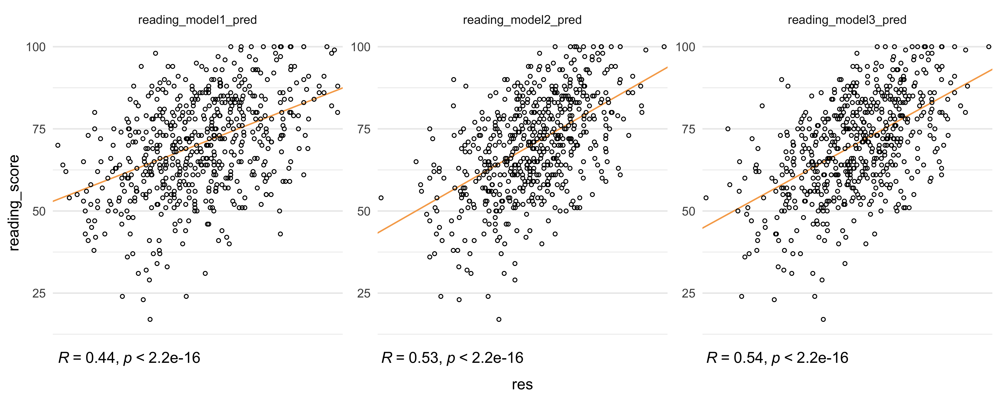

Predicting Reading Score
================
Jeong Yun Choi
2024-12-15

We implement step-wise regression to deduce significant covariates for
modeling `reading score`. We note that most of the variables listed are
categorical as mentioned prior. Therefore, we incorporated factor
releveing in order to give some dimensions. First, we will check for
non-linearity in the scores and apply transformation if need be.

``` r
# Preliminary using all covariates for the first model
reading_model1v1 <- lm(reading_score ~ gender + ethnic_group + parent_educ + lunch_type + test_prep + parent_marital_status + practice_sport + transport_means + wkly_study_hours, data = score_df)

summary(reading_model1v1)
```

    ## 
    ## Call:
    ## lm(formula = reading_score ~ gender + ethnic_group + parent_educ + 
    ##     lunch_type + test_prep + parent_marital_status + practice_sport + 
    ##     transport_means + wkly_study_hours, data = score_df)
    ## 
    ## Residuals:
    ##     Min      1Q  Median      3Q     Max 
    ## -40.941  -8.820   0.412   9.075  29.896 
    ## 
    ## Coefficients:
    ##                               Estimate Std. Error t value Pr(>|t|)    
    ## (Intercept)                    73.2325     3.2700  22.396  < 2e-16 ***
    ## gendermale                     -7.7133     1.1100  -6.949 1.02e-11 ***
    ## ethnic_groupgroup B            -1.4560     2.2540  -0.646 0.518547    
    ## ethnic_groupgroup C            -0.7939     2.1607  -0.367 0.713427    
    ## ethnic_groupgroup D             2.4767     2.1728   1.140 0.254824    
    ## ethnic_groupgroup E             5.9234     2.3830   2.486 0.013218 *  
    ## parent_educassociate's degree   4.8671     1.7280   2.817 0.005023 ** 
    ## parent_educbachelor's degree    7.3487     2.0266   3.626 0.000314 ***
    ## parent_educhigh school         -0.3464     1.7506  -0.198 0.843197    
    ## parent_educmaster's degree      8.7922     2.4794   3.546 0.000423 ***
    ## parent_educsome college         2.5284     1.7709   1.428 0.153919    
    ## lunch_typefree/reduced         -8.4564     1.1490  -7.360 6.51e-13 ***
    ## test_prepnone                  -6.4209     1.1682  -5.496 5.87e-08 ***
    ## parent_marital_statusdivorced  -1.8091     1.7943  -1.008 0.313756    
    ## parent_marital_statusmarried    3.3283     1.3466   2.472 0.013746 *  
    ## parent_marital_statuswidowed    3.7308     3.6279   1.028 0.304219    
    ## practice_sportregularly        -0.8158     1.8552  -0.440 0.660293    
    ## practice_sportsometimes         0.6334     1.7995   0.352 0.724958    
    ## transport_meansprivate         -0.3129     1.1350  -0.276 0.782905    
    ## wkly_study_hours5-10            2.6766     1.3092   2.044 0.041367 *  
    ## wkly_study_hours> 10            1.1958     1.7100   0.699 0.484642    
    ## ---
    ## Signif. codes:  0 '***' 0.001 '**' 0.01 '*' 0.05 '.' 0.1 ' ' 1
    ## 
    ## Residual standard error: 13.2 on 566 degrees of freedom
    ## Multiple R-squared:  0.2682, Adjusted R-squared:  0.2423 
    ## F-statistic: 10.37 on 20 and 566 DF,  p-value: < 2.2e-16

``` r
###covariates practice_sports, is_first_child, nr_siblings, transport_means are not significant.
reading_model1v2 <- lm(reading_score ~ gender + ethnic_group + parent_educ +lunch_type + test_prep + parent_marital_status + wkly_study_hours, data = score_df)
summary(reading_model1v2)
```

    ## 
    ## Call:
    ## lm(formula = reading_score ~ gender + ethnic_group + parent_educ + 
    ##     lunch_type + test_prep + parent_marital_status + wkly_study_hours, 
    ##     data = score_df)
    ## 
    ## Residuals:
    ##     Min      1Q  Median      3Q     Max 
    ## -41.661  -8.604   0.594   9.263  30.252 
    ## 
    ## Coefficients:
    ##                               Estimate Std. Error t value Pr(>|t|)    
    ## (Intercept)                    73.0893     2.8156  25.959  < 2e-16 ***
    ## gendermale                     -7.7224     1.1084  -6.967 8.98e-12 ***
    ## ethnic_groupgroup B            -1.4318     2.2509  -0.636 0.524965    
    ## ethnic_groupgroup C            -0.7388     2.1541  -0.343 0.731750    
    ## ethnic_groupgroup D             2.5473     2.1671   1.175 0.240303    
    ## ethnic_groupgroup E             5.8112     2.3770   2.445 0.014796 *  
    ## parent_educassociate's degree   4.9095     1.7238   2.848 0.004557 ** 
    ## parent_educbachelor's degree    7.3948     2.0224   3.657 0.000279 ***
    ## parent_educhigh school         -0.3808     1.7470  -0.218 0.827512    
    ## parent_educmaster's degree      8.9831     2.4667   3.642 0.000296 ***
    ## parent_educsome college         2.4921     1.7673   1.410 0.159046    
    ## lunch_typefree/reduced         -8.4814     1.1468  -7.395 5.07e-13 ***
    ## test_prepnone                  -6.4210     1.1610  -5.531 4.87e-08 ***
    ## parent_marital_statusdivorced  -1.7892     1.7875  -1.001 0.317292    
    ## parent_marital_statusmarried    3.3561     1.3439   2.497 0.012796 *  
    ## parent_marital_statuswidowed    3.6598     3.6151   1.012 0.311792    
    ## wkly_study_hours5-10            2.6738     1.3069   2.046 0.041220 *  
    ## wkly_study_hours> 10            1.2128     1.7068   0.711 0.477627    
    ## ---
    ## Signif. codes:  0 '***' 0.001 '**' 0.01 '*' 0.05 '.' 0.1 ' ' 1
    ## 
    ## Residual standard error: 13.19 on 569 degrees of freedom
    ## Multiple R-squared:  0.2661, Adjusted R-squared:  0.2442 
    ## F-statistic: 12.14 on 17 and 569 DF,  p-value: < 2.2e-16

``` r
#increased adjusted R^2 value. Will be keeping this model.

reading_model1<- lm(reading_score ~ gender + ethnic_group + parent_educ +lunch_type + test_prep + parent_marital_status + wkly_study_hours, data = score_df)

par(mfrow = c(1,1))
boxcox_reading <- MASS::boxcox(reading_model1, lambda = seq(-2.5, 2.5, 0.1))
```


``` r
shapiro.test(rstandard(reading_model1))
```

    ## 
    ##  Shapiro-Wilk normality test
    ## 
    ## data:  rstandard(reading_model1)
    ## W = 0.99177, p-value = 0.002428

``` r
boxcox_reading <- Reduce(cbind, boxcox_reading)
optimal_power <- boxcox_reading |> 
  as_tibble() |> 
  filter(V2 == max(V2)) |> 
  pull(init) |> 
  round(digits =2)
```

``` r
# Transformed Y using the optimal lambda: 
score_df <- score_df %>% 
  mutate(transformed_reading = (reading_score +1)^1.44)

#adjusted some relevant covariates
reading_model1 = lm(transformed_reading ~ gender + ethnic_group + parent_educ + test_prep + parent_marital_status + wkly_study_hours, data = score_df)

reading_model1 %>% 
  broom::tidy() %>% 
  mutate(`p.value` = signif(`p.value`, 3), 
         estimate = round(estimate, 3), 
         `std.error` = round(`std.error`, 3), 
         statistic = round(statistic, 3)) |> 
  knitr::kable(digits = 50)
```

| term                          | estimate | std.error | statistic |  p.value |
|:------------------------------|---------:|----------:|----------:|---------:|
| (Intercept)                   |  465.027 |    26.590 |    17.489 | 0.00e+00 |
| gendermale                    |  -69.200 |    10.650 |    -6.498 | 1.78e-10 |
| ethnic_groupgroup B           |  -13.951 |    21.656 |    -0.644 | 5.20e-01 |
| ethnic_groupgroup C           |   -7.464 |    20.724 |    -0.360 | 7.19e-01 |
| ethnic_groupgroup D           |   23.186 |    20.849 |     1.112 | 2.67e-01 |
| ethnic_groupgroup E           |   58.666 |    22.853 |     2.567 | 1.05e-02 |
| parent_educassociate’s degree |   44.727 |    16.585 |     2.697 | 7.21e-03 |
| parent_educbachelor’s degree  |   69.559 |    19.457 |     3.575 | 3.80e-04 |
| parent_educhigh school        |   -3.014 |    16.806 |    -0.179 | 8.58e-01 |
| parent_educmaster’s degree    |   80.619 |    23.731 |     3.397 | 7.28e-04 |
| parent_educsome college       |   22.078 |    17.004 |     1.298 | 1.95e-01 |
| test_prepnone                 |  -56.974 |    11.164 |    -5.103 | 4.55e-07 |
| parent_marital_statusdivorced |  -14.511 |    17.195 |    -0.844 | 3.99e-01 |
| parent_marital_statusmarried  |   32.312 |    12.926 |     2.500 | 1.27e-02 |
| parent_marital_statuswidowed  |   31.750 |    34.780 |     0.913 | 3.62e-01 |
| wkly_study_hours5-10          |   28.875 |    12.562 |     2.299 | 2.19e-02 |
| wkly_study_hours\> 10         |   12.072 |    16.421 |     0.735 | 4.63e-01 |

``` r
par(mfrow = c(2,2))
plot(reading_model1)
```


``` r
shapiro.test(rstandard(reading_model1))
```

    ## 
    ##  Shapiro-Wilk normality test
    ## 
    ## data:  rstandard(reading_model1)
    ## W = 0.99564, p-value = 0.1008

``` r
##After transforming, shapiro test fails to reject null, indicating normality in the distribution 

### removing the influential point if needed
cooksd_read <- cooks.distance(reading_model1)
influential_read <- as.numeric(names(cooksd_read)[(cooksd_read > 0.5)])
# influential_read is 0
```

As seen above the after Y transformation where
$Y^*= ({reading\_score + 1})^{1.44}$, the residuals follow normality,
homoscedascity and mean zero looking at the diagnostic plots.

## Refined Covariates

``` r
### Add interaction between `ethnic_group` and `parent_educ`.
reading_model2v1 <- lm(transformed_reading ~ gender + test_prep + parent_marital_status + wkly_study_hours + ethnic_group * parent_educ, data = score_df)
summary(reading_model2v1)
```

    ## 
    ## Call:
    ## lm(formula = transformed_reading ~ gender + test_prep + parent_marital_status + 
    ##     wkly_study_hours + ethnic_group * parent_educ, data = score_df)
    ## 
    ## Residuals:
    ##     Min      1Q  Median      3Q     Max 
    ## -334.91  -81.35   -0.31   85.27  320.17 
    ## 
    ## Coefficients:
    ##                                                   Estimate Std. Error t value
    ## (Intercept)                                        463.409     42.330  10.947
    ## gendermale                                         -68.359     10.902  -6.271
    ## test_prepnone                                      -58.528     11.424  -5.123
    ## parent_marital_statusdivorced                      -14.468     17.713  -0.817
    ## parent_marital_statusmarried                        33.164     13.399   2.475
    ## parent_marital_statuswidowed                        38.838     35.706   1.088
    ## wkly_study_hours5-10                                28.969     12.888   2.248
    ## wkly_study_hours> 10                                10.087     16.876   0.598
    ## ethnic_groupgroup B                                -31.412     46.580  -0.674
    ## ethnic_groupgroup C                                -23.398     46.509  -0.503
    ## ethnic_groupgroup D                                 43.495     44.663   0.974
    ## ethnic_groupgroup E                                 82.925     51.064   1.624
    ## parent_educassociate's degree                       45.048     59.512   0.757
    ## parent_educbachelor's degree                        67.953     75.239   0.903
    ## parent_educhigh school                              20.661     51.023   0.405
    ## parent_educmaster's degree                          21.969     98.782   0.222
    ## parent_educsome college                              9.241     56.186   0.164
    ## ethnic_groupgroup B:parent_educassociate's degree   34.929     68.880   0.507
    ## ethnic_groupgroup C:parent_educassociate's degree   25.278     68.068   0.371
    ## ethnic_groupgroup D:parent_educassociate's degree  -24.182     68.094  -0.355
    ## ethnic_groupgroup E:parent_educassociate's degree  -45.344     72.544  -0.625
    ## ethnic_groupgroup B:parent_educbachelor's degree    42.848     86.893   0.493
    ## ethnic_groupgroup C:parent_educbachelor's degree    30.251     83.146   0.364
    ## ethnic_groupgroup D:parent_educbachelor's degree   -49.722     84.432  -0.589
    ## ethnic_groupgroup E:parent_educbachelor's degree   -25.045     94.028  -0.266
    ## ethnic_groupgroup B:parent_educhigh school         -18.306     61.485  -0.298
    ## ethnic_groupgroup C:parent_educhigh school          -2.463     61.340  -0.040
    ## ethnic_groupgroup D:parent_educhigh school         -47.234     60.239  -0.784
    ## ethnic_groupgroup E:parent_educhigh school         -34.166     71.280  -0.479
    ## ethnic_groupgroup B:parent_educmaster's degree     134.817    114.821   1.174
    ## ethnic_groupgroup C:parent_educmaster's degree      20.610    109.220   0.189
    ## ethnic_groupgroup D:parent_educmaster's degree      51.954    106.728   0.487
    ## ethnic_groupgroup E:parent_educmaster's degree      74.876    116.445   0.643
    ## ethnic_groupgroup B:parent_educsome college         22.658     68.880   0.329
    ## ethnic_groupgroup C:parent_educsome college         39.145     65.071   0.602
    ## ethnic_groupgroup D:parent_educsome college         -3.025     64.492  -0.047
    ## ethnic_groupgroup E:parent_educsome college        -14.537     72.400  -0.201
    ##                                                   Pr(>|t|)    
    ## (Intercept)                                        < 2e-16 ***
    ## gendermale                                        7.28e-10 ***
    ## test_prepnone                                     4.16e-07 ***
    ## parent_marital_statusdivorced                       0.4144    
    ## parent_marital_statusmarried                        0.0136 *  
    ## parent_marital_statuswidowed                        0.2772    
    ## wkly_study_hours5-10                                0.0250 *  
    ## wkly_study_hours> 10                                0.5503    
    ## ethnic_groupgroup B                                 0.5004    
    ## ethnic_groupgroup C                                 0.6151    
    ## ethnic_groupgroup D                                 0.3306    
    ## ethnic_groupgroup E                                 0.1050    
    ## parent_educassociate's degree                       0.4494    
    ## parent_educbachelor's degree                        0.3668    
    ## parent_educhigh school                              0.6857    
    ## parent_educmaster's degree                          0.8241    
    ## parent_educsome college                             0.8694    
    ## ethnic_groupgroup B:parent_educassociate's degree   0.6123    
    ## ethnic_groupgroup C:parent_educassociate's degree   0.7105    
    ## ethnic_groupgroup D:parent_educassociate's degree   0.7226    
    ## ethnic_groupgroup E:parent_educassociate's degree   0.5322    
    ## ethnic_groupgroup B:parent_educbachelor's degree    0.6221    
    ## ethnic_groupgroup C:parent_educbachelor's degree    0.7161    
    ## ethnic_groupgroup D:parent_educbachelor's degree    0.5562    
    ## ethnic_groupgroup E:parent_educbachelor's degree    0.7901    
    ## ethnic_groupgroup B:parent_educhigh school          0.7660    
    ## ethnic_groupgroup C:parent_educhigh school          0.9680    
    ## ethnic_groupgroup D:parent_educhigh school          0.4333    
    ## ethnic_groupgroup E:parent_educhigh school          0.6319    
    ## ethnic_groupgroup B:parent_educmaster's degree      0.2408    
    ## ethnic_groupgroup C:parent_educmaster's degree      0.8504    
    ## ethnic_groupgroup D:parent_educmaster's degree      0.6266    
    ## ethnic_groupgroup E:parent_educmaster's degree      0.5205    
    ## ethnic_groupgroup B:parent_educsome college         0.7423    
    ## ethnic_groupgroup C:parent_educsome college         0.5477    
    ## ethnic_groupgroup D:parent_educsome college         0.9626    
    ## ethnic_groupgroup E:parent_educsome college         0.8409    
    ## ---
    ## Signif. codes:  0 '***' 0.001 '**' 0.01 '*' 0.05 '.' 0.1 ' ' 1
    ## 
    ## Residual standard error: 127.9 on 550 degrees of freedom
    ## Multiple R-squared:  0.2157, Adjusted R-squared:  0.1643 
    ## F-statistic: 4.201 on 36 and 550 DF,  p-value: 8.364e-14

``` r
### No significant interaction effect between `ethnic_group` and `parent educ` and adjusted R^2 value decreased. Too many covariates from the interaction. Will not be keeping this.

# Add lunch_type covariate and added interaction effect between `parent_marital_status` and `wkly_study_hours`
reading_model2v2 <- lm(transformed_reading ~ gender + parent_educ + lunch_type + ethnic_group + test_prep + parent_marital_status + wkly_study_hours + parent_marital_status*wkly_study_hours, data = score_df)
summary(reading_model2v2)
```

    ## 
    ## Call:
    ## lm(formula = transformed_reading ~ gender + parent_educ + lunch_type + 
    ##     ethnic_group + test_prep + parent_marital_status + wkly_study_hours + 
    ##     parent_marital_status * wkly_study_hours, data = score_df)
    ## 
    ## Residuals:
    ##     Min      1Q  Median      3Q     Max 
    ## -347.49  -80.64   -2.18   88.20  319.93 
    ## 
    ## Coefficients:
    ##                                                    Estimate Std. Error t value
    ## (Intercept)                                         463.192     29.824  15.531
    ## gendermale                                          -71.429     10.220  -6.989
    ## parent_educassociate's degree                        45.411     15.859   2.863
    ## parent_educbachelor's degree                         70.884     18.634   3.804
    ## parent_educhigh school                               -7.697     16.110  -0.478
    ## parent_educmaster's degree                           83.598     22.656   3.690
    ## parent_educsome college                              23.006     16.228   1.418
    ## lunch_typefree/reduced                              -78.070     10.569  -7.386
    ## ethnic_groupgroup B                                 -10.900     20.646  -0.528
    ## ethnic_groupgroup C                                  -6.444     19.756  -0.326
    ## ethnic_groupgroup D                                  24.879     19.863   1.253
    ## ethnic_groupgroup E                                  55.830     21.772   2.564
    ## test_prepnone                                       -59.990     10.642  -5.637
    ## parent_marital_statusdivorced                        46.634     32.321   1.443
    ## parent_marital_statusmarried                         72.135     23.073   3.126
    ## parent_marital_statuswidowed                        129.611     88.150   1.470
    ## wkly_study_hours5-10                                 64.224     23.978   2.679
    ## wkly_study_hours> 10                                 93.013     31.065   2.994
    ## parent_marital_statusdivorced:wkly_study_hours5-10  -62.714     38.919  -1.611
    ## parent_marital_statusmarried:wkly_study_hours5-10   -48.107     28.466  -1.690
    ## parent_marital_statuswidowed:wkly_study_hours5-10  -110.633     96.890  -1.142
    ## parent_marital_statusdivorced:wkly_study_hours> 10 -166.633     51.146  -3.258
    ## parent_marital_statusmarried:wkly_study_hours> 10   -91.362     36.952  -2.472
    ## parent_marital_statuswidowed:wkly_study_hours> 10  -140.502    124.991  -1.124
    ##                                                    Pr(>|t|)    
    ## (Intercept)                                         < 2e-16 ***
    ## gendermale                                         7.87e-12 ***
    ## parent_educassociate's degree                      0.004348 ** 
    ## parent_educbachelor's degree                       0.000158 ***
    ## parent_educhigh school                             0.633007    
    ## parent_educmaster's degree                         0.000246 ***
    ## parent_educsome college                            0.156833    
    ## lunch_typefree/reduced                             5.47e-13 ***
    ## ethnic_groupgroup B                                0.597739    
    ## ethnic_groupgroup C                                0.744423    
    ## ethnic_groupgroup D                                0.210903    
    ## ethnic_groupgroup E                                0.010598 *  
    ## test_prepnone                                      2.74e-08 ***
    ## parent_marital_statusdivorced                      0.149624    
    ## parent_marital_statusmarried                       0.001861 ** 
    ## parent_marital_statuswidowed                       0.142025    
    ## wkly_study_hours5-10                               0.007611 ** 
    ## wkly_study_hours> 10                               0.002873 ** 
    ## parent_marital_statusdivorced:wkly_study_hours5-10 0.107653    
    ## parent_marital_statusmarried:wkly_study_hours5-10  0.091585 .  
    ## parent_marital_statuswidowed:wkly_study_hours5-10  0.254009    
    ## parent_marital_statusdivorced:wkly_study_hours> 10 0.001190 ** 
    ## parent_marital_statusmarried:wkly_study_hours> 10  0.013713 *  
    ## parent_marital_statuswidowed:wkly_study_hours> 10  0.261453    
    ## ---
    ## Signif. codes:  0 '***' 0.001 '**' 0.01 '*' 0.05 '.' 0.1 ' ' 1
    ## 
    ## Residual standard error: 120.6 on 563 degrees of freedom
    ## Multiple R-squared:  0.2852, Adjusted R-squared:  0.256 
    ## F-statistic: 9.766 on 23 and 563 DF,  p-value: < 2.2e-16

``` r
### lunch_type is a significant term and the interaction also is significant.  However, ethnic_group variables demonstrates to be less significant when lunch_type is added.

# Add interaction between `gender`/ `wkly_study_hours` / `test_prep` and `parent_educ`.
reading_model2v3 <- lm(transformed_reading ~ gender + lunch_type + parent_marital_status + gender*parent_educ + test_prep*parent_educ, data = score_df)
summary(reading_model2v3)
```

    ## 
    ## Call:
    ## lm(formula = transformed_reading ~ gender + lunch_type + parent_marital_status + 
    ##     gender * parent_educ + test_prep * parent_educ, data = score_df)
    ## 
    ## Residuals:
    ##     Min      1Q  Median      3Q     Max 
    ## -321.61  -83.86    1.82   84.39  317.61 
    ## 
    ## Coefficients:
    ##                                             Estimate Std. Error t value
    ## (Intercept)                                  506.136     23.914  21.165
    ## gendermale                                   -54.708     23.766  -2.302
    ## lunch_typefree/reduced                       -80.500     10.794  -7.458
    ## parent_marital_statusdivorced                -10.238     16.842  -0.608
    ## parent_marital_statusmarried                  29.512     12.647   2.333
    ## parent_marital_statuswidowed                  37.757     34.057   1.109
    ## parent_educassociate's degree                 69.150     30.185   2.291
    ## parent_educbachelor's degree                  98.032     34.577   2.835
    ## parent_educhigh school                         4.580     32.868   0.139
    ## parent_educmaster's degree                    63.690     44.288   1.438
    ## parent_educsome college                       75.976     32.287   2.353
    ## test_prepnone                                -39.818     23.998  -1.659
    ## gendermale:parent_educassociate's degree      -8.919     32.352  -0.276
    ## gendermale:parent_educbachelor's degree      -45.571     38.342  -1.189
    ## gendermale:parent_educhigh school            -12.371     32.716  -0.378
    ## gendermale:parent_educmaster's degree         17.487     47.355   0.369
    ## gendermale:parent_educsome college           -36.281     33.231  -1.092
    ## parent_educassociate's degree:test_prepnone  -32.686     32.833  -0.996
    ## parent_educbachelor's degree:test_prepnone   -21.934     38.439  -0.571
    ## parent_educhigh school:test_prepnone         -13.336     34.732  -0.384
    ## parent_educmaster's degree:test_prepnone      19.588     49.497   0.396
    ## parent_educsome college:test_prepnone        -55.677     34.864  -1.597
    ##                                             Pr(>|t|)    
    ## (Intercept)                                  < 2e-16 ***
    ## gendermale                                   0.02170 *  
    ## lunch_typefree/reduced                      3.34e-13 ***
    ## parent_marital_statusdivorced                0.54353    
    ## parent_marital_statusmarried                 0.01997 *  
    ## parent_marital_statuswidowed                 0.26806    
    ## parent_educassociate's degree                0.02234 *  
    ## parent_educbachelor's degree                 0.00474 ** 
    ## parent_educhigh school                       0.88922    
    ## parent_educmaster's degree                   0.15096    
    ## parent_educsome college                      0.01896 *  
    ## test_prepnone                                0.09762 .  
    ## gendermale:parent_educassociate's degree     0.78289    
    ## gendermale:parent_educbachelor's degree      0.23512    
    ## gendermale:parent_educhigh school            0.70547    
    ## gendermale:parent_educmaster's degree        0.71206    
    ## gendermale:parent_educsome college           0.27540    
    ## parent_educassociate's degree:test_prepnone  0.31991    
    ## parent_educbachelor's degree:test_prepnone   0.56848    
    ## parent_educhigh school:test_prepnone         0.70114    
    ## parent_educmaster's degree:test_prepnone     0.69244    
    ## parent_educsome college:test_prepnone        0.11082    
    ## ---
    ## Signif. codes:  0 '***' 0.001 '**' 0.01 '*' 0.05 '.' 0.1 ' ' 1
    ## 
    ## Residual standard error: 123.7 on 565 degrees of freedom
    ## Multiple R-squared:  0.2455, Adjusted R-squared:  0.2175 
    ## F-statistic: 8.756 on 21 and 565 DF,  p-value: < 2.2e-16

``` r
## Some significant interaction effect between `test_prep` and `parent_educ` and adjusted R^2 slightly decreased so will be not be keeping these interactions. Keeping reading_model2v2. 
```

``` r
reading_model2 <- lm(transformed_reading ~ gender + parent_educ + lunch_type + ethnic_group + test_prep + parent_marital_status + wkly_study_hours + parent_marital_status*wkly_study_hours, data = score_df)

reading_model2 |> 
  broom::tidy() |> 
  mutate(`p.value` = signif(`p.value`, 3), 
         estimate = round(estimate, 3), 
         `std.error` = round(`std.error`, 3), 
         statistic = round(statistic, 3)) |> 
  drop_na()|>
  knitr::kable(digits = 50)
```

| term | estimate | std.error | statistic | p.value |
|:---|---:|---:|---:|---:|
| (Intercept) | 463.192 | 29.824 | 15.531 | 1.56e-45 |
| gendermale | -71.429 | 10.220 | -6.989 | 7.87e-12 |
| parent_educassociate’s degree | 45.411 | 15.859 | 2.863 | 4.35e-03 |
| parent_educbachelor’s degree | 70.884 | 18.634 | 3.804 | 1.58e-04 |
| parent_educhigh school | -7.697 | 16.110 | -0.478 | 6.33e-01 |
| parent_educmaster’s degree | 83.598 | 22.656 | 3.690 | 2.46e-04 |
| parent_educsome college | 23.006 | 16.228 | 1.418 | 1.57e-01 |
| lunch_typefree/reduced | -78.070 | 10.569 | -7.386 | 5.47e-13 |
| ethnic_groupgroup B | -10.900 | 20.646 | -0.528 | 5.98e-01 |
| ethnic_groupgroup C | -6.444 | 19.756 | -0.326 | 7.44e-01 |
| ethnic_groupgroup D | 24.879 | 19.863 | 1.253 | 2.11e-01 |
| ethnic_groupgroup E | 55.830 | 21.772 | 2.564 | 1.06e-02 |
| test_prepnone | -59.990 | 10.642 | -5.637 | 2.74e-08 |
| parent_marital_statusdivorced | 46.634 | 32.321 | 1.443 | 1.50e-01 |
| parent_marital_statusmarried | 72.135 | 23.073 | 3.126 | 1.86e-03 |
| parent_marital_statuswidowed | 129.611 | 88.150 | 1.470 | 1.42e-01 |
| wkly_study_hours5-10 | 64.224 | 23.978 | 2.679 | 7.61e-03 |
| wkly_study_hours\> 10 | 93.013 | 31.065 | 2.994 | 2.87e-03 |
| parent_marital_statusdivorced:wkly_study_hours5-10 | -62.714 | 38.919 | -1.611 | 1.08e-01 |
| parent_marital_statusmarried:wkly_study_hours5-10 | -48.107 | 28.466 | -1.690 | 9.16e-02 |
| parent_marital_statuswidowed:wkly_study_hours5-10 | -110.633 | 96.890 | -1.142 | 2.54e-01 |
| parent_marital_statusdivorced:wkly_study_hours\> 10 | -166.633 | 51.146 | -3.258 | 1.19e-03 |
| parent_marital_statusmarried:wkly_study_hours\> 10 | -91.362 | 36.952 | -2.472 | 1.37e-02 |
| parent_marital_statuswidowed:wkly_study_hours\> 10 | -140.502 | 124.991 | -1.124 | 2.61e-01 |

``` r
par(mfrow = c(2,2))
plot(reading_model2)
```


``` r
### removing the influential point if needed
cooksd <- cooks.distance(reading_model2)
cooksd_clean <- cooksd[!is.na(cooksd)]
influential <- as.numeric(names(cooksd_clean)[(cooksd_clean > 0.5)])
# influential_read is 0
```

``` r
### Interaction between `transport_means`/ `is_first_child` with `test_prep`
reading_model3v1 <- lm(transformed_reading ~ gender + lunch_type + parent_marital_status + test_prep*transport_means + test_prep*is_first_child, data = score_df)
summary(reading_model3v1)
```

    ## 
    ## Call:
    ## lm(formula = transformed_reading ~ gender + lunch_type + parent_marital_status + 
    ##     test_prep * transport_means + test_prep * is_first_child, 
    ##     data = score_df)
    ## 
    ## Residuals:
    ##     Min      1Q  Median      3Q     Max 
    ## -357.94  -89.28   -3.05   88.65  342.21 
    ## 
    ## Coefficients:
    ##                                      Estimate Std. Error t value Pr(>|t|)    
    ## (Intercept)                           541.857     21.408  25.311  < 2e-16 ***
    ## gendermale                            -75.764     10.544  -7.186 2.08e-12 ***
    ## lunch_typefree/reduced                -79.986     10.975  -7.288 1.04e-12 ***
    ## parent_marital_statusdivorced         -15.877     17.152  -0.926   0.3550    
    ## parent_marital_statusmarried           28.946     12.834   2.255   0.0245 *  
    ## parent_marital_statuswidowed           38.368     34.460   1.113   0.2660    
    ## test_prepnone                         -45.640     21.650  -2.108   0.0355 *  
    ## transport_meansprivate                 12.260     17.756   0.690   0.4902    
    ## is_first_childyes                      15.032     19.407   0.775   0.4389    
    ## test_prepnone:transport_meansprivate  -29.809     22.361  -1.333   0.1830    
    ## test_prepnone:is_first_childyes        -9.115     23.740  -0.384   0.7012    
    ## ---
    ## Signif. codes:  0 '***' 0.001 '**' 0.01 '*' 0.05 '.' 0.1 ' ' 1
    ## 
    ## Residual standard error: 126.5 on 576 degrees of freedom
    ## Multiple R-squared:  0.1962, Adjusted R-squared:  0.1822 
    ## F-statistic: 14.06 on 10 and 576 DF,  p-value: < 2.2e-16

``` r
### No significant interaction/ Will not be keeping this

### Interaction between `is_first_child` and `parent_educ` and `parent_marital_status` and `wkly_study_hours`
reading_model3v2 <- lm(transformed_reading ~ gender + lunch_type + is_first_child:parent_educ + parent_marital_status:wkly_study_hours + ethnic_group:test_prep, data = score_df)
summary(reading_model3v2)
```

    ## 
    ## Call:
    ## lm(formula = transformed_reading ~ gender + lunch_type + is_first_child:parent_educ + 
    ##     parent_marital_status:wkly_study_hours + ethnic_group:test_prep, 
    ##     data = score_df)
    ## 
    ## Residuals:
    ##     Min      1Q  Median      3Q     Max 
    ## -352.16  -77.22   -1.66   88.46  307.56 
    ## 
    ## Coefficients: (3 not defined because of singularities)
    ##                                                    Estimate Std. Error t value
    ## (Intercept)                                         588.584     90.428   6.509
    ## gendermale                                          -72.933     10.326  -7.063
    ## lunch_typefree/reduced                              -78.052     10.695  -7.298
    ## is_first_childno:parent_educsome high school        -39.868     24.315  -1.640
    ## is_first_childyes:parent_educsome high school       -35.400     19.876  -1.781
    ## is_first_childno:parent_educassociate's degree       12.383     22.738   0.545
    ## is_first_childyes:parent_educassociate's degree       8.289     19.390   0.427
    ## is_first_childno:parent_educbachelor's degree        50.152     27.569   1.819
    ## is_first_childyes:parent_educbachelor's degree       27.790     22.912   1.213
    ## is_first_childno:parent_educhigh school             -67.016     24.833  -2.699
    ## is_first_childyes:parent_educhigh school            -34.913     19.030  -1.835
    ## is_first_childno:parent_educmaster's degree          50.208     41.385   1.213
    ## is_first_childyes:parent_educmaster's degree         46.463     26.613   1.746
    ## is_first_childno:parent_educsome college            -44.447     24.658  -1.803
    ## is_first_childyes:parent_educsome college                NA         NA      NA
    ## parent_marital_statussingle:wkly_study_hours< 5     -83.779     88.909  -0.942
    ## parent_marital_statusdivorced:wkly_study_hours< 5   -40.090     91.206  -0.440
    ## parent_marital_statusmarried:wkly_study_hours< 5    -12.622     87.911  -0.144
    ## parent_marital_statuswidowed:wkly_study_hours< 5     63.211    122.431   0.516
    ## parent_marital_statussingle:wkly_study_hours5-10    -21.362     88.089  -0.243
    ## parent_marital_statusdivorced:wkly_study_hours5-10  -39.090     88.497  -0.442
    ## parent_marital_statusmarried:wkly_study_hours5-10     6.020     87.482   0.069
    ## parent_marital_statuswidowed:wkly_study_hours5-10    -1.515     94.560  -0.016
    ## parent_marital_statussingle:wkly_study_hours> 10      9.242     90.415   0.102
    ## parent_marital_statusdivorced:wkly_study_hours> 10 -116.367     92.588  -1.257
    ## parent_marital_statusmarried:wkly_study_hours> 10   -12.239     88.207  -0.139
    ## parent_marital_statuswidowed:wkly_study_hours> 10        NA         NA      NA
    ## ethnic_groupgroup A:test_prepcompleted               30.848     34.848   0.885
    ## ethnic_groupgroup B:test_prepcompleted               -8.627     25.639  -0.336
    ## ethnic_groupgroup C:test_prepcompleted              -15.574     23.435  -0.665
    ## ethnic_groupgroup D:test_prepcompleted               14.288     25.504   0.560
    ## ethnic_groupgroup E:test_prepcompleted               44.477     27.021   1.646
    ## ethnic_groupgroup A:test_prepnone                   -81.266     27.742  -2.929
    ## ethnic_groupgroup B:test_prepnone                   -78.173     22.640  -3.453
    ## ethnic_groupgroup C:test_prepnone                   -68.002     21.445  -3.171
    ## ethnic_groupgroup D:test_prepnone                   -37.154     21.489  -1.729
    ## ethnic_groupgroup E:test_prepnone                        NA         NA      NA
    ##                                                    Pr(>|t|)    
    ## (Intercept)                                        1.70e-10 ***
    ## gendermale                                         4.91e-12 ***
    ## lunch_typefree/reduced                             1.02e-12 ***
    ## is_first_childno:parent_educsome high school       0.101642    
    ## is_first_childyes:parent_educsome high school      0.075456 .  
    ## is_first_childno:parent_educassociate's degree     0.586240    
    ## is_first_childyes:parent_educassociate's degree    0.669201    
    ## is_first_childno:parent_educbachelor's degree      0.069434 .  
    ## is_first_childyes:parent_educbachelor's degree     0.225679    
    ## is_first_childno:parent_educhigh school            0.007176 ** 
    ## is_first_childyes:parent_educhigh school           0.067100 .  
    ## is_first_childno:parent_educmaster's degree        0.225577    
    ## is_first_childyes:parent_educmaster's degree       0.081382 .  
    ## is_first_childno:parent_educsome college           0.072002 .  
    ## is_first_childyes:parent_educsome college                NA    
    ## parent_marital_statussingle:wkly_study_hours< 5    0.346451    
    ## parent_marital_statusdivorced:wkly_study_hours< 5  0.660432    
    ## parent_marital_statusmarried:wkly_study_hours< 5   0.885888    
    ## parent_marital_statuswidowed:wkly_study_hours< 5   0.605852    
    ## parent_marital_statussingle:wkly_study_hours5-10   0.808474    
    ## parent_marital_statusdivorced:wkly_study_hours5-10 0.658870    
    ## parent_marital_statusmarried:wkly_study_hours5-10  0.945158    
    ## parent_marital_statuswidowed:wkly_study_hours5-10  0.987220    
    ## parent_marital_statussingle:wkly_study_hours> 10   0.918619    
    ## parent_marital_statusdivorced:wkly_study_hours> 10 0.209344    
    ## parent_marital_statusmarried:wkly_study_hours> 10  0.889698    
    ## parent_marital_statuswidowed:wkly_study_hours> 10        NA    
    ## ethnic_groupgroup A:test_prepcompleted             0.376431    
    ## ethnic_groupgroup B:test_prepcompleted             0.736640    
    ## ethnic_groupgroup C:test_prepcompleted             0.506596    
    ## ethnic_groupgroup D:test_prepcompleted             0.575567    
    ## ethnic_groupgroup E:test_prepcompleted             0.100323    
    ## ethnic_groupgroup A:test_prepnone                  0.003537 ** 
    ## ethnic_groupgroup B:test_prepnone                  0.000597 ***
    ## ethnic_groupgroup C:test_prepnone                  0.001603 ** 
    ## ethnic_groupgroup D:test_prepnone                  0.084368 .  
    ## ethnic_groupgroup E:test_prepnone                        NA    
    ## ---
    ## Signif. codes:  0 '***' 0.001 '**' 0.01 '*' 0.05 '.' 0.1 ' ' 1
    ## 
    ## Residual standard error: 120.8 on 553 degrees of freedom
    ## Multiple R-squared:  0.2963, Adjusted R-squared:  0.2543 
    ## F-statistic: 7.056 on 33 and 553 DF,  p-value: < 2.2e-16

``` r
### No Significant interaction between wkly_study_hours  and parent_educ but some significance between ethnic_group and test_prep and adjusted R^2 increased slightly. Note that this model added many covariates due to the interaction terms.

## Add 3 way interaction between `ethnic_group`, `parent_educ`, `gender`.
reading_model3v3 <- lm(transformed_reading ~ test_prep + lunch_type + ethnic_group*parent_educ*gender, data = score_df)
summary(reading_model3v3)
```

    ## 
    ## Call:
    ## lm(formula = transformed_reading ~ test_prep + lunch_type + ethnic_group * 
    ##     parent_educ * gender, data = score_df)
    ## 
    ## Residuals:
    ##     Min      1Q  Median      3Q     Max 
    ## -326.20  -81.92    3.92   80.25  329.83 
    ## 
    ## Coefficients: (1 not defined because of singularities)
    ##                                                               Estimate
    ## (Intercept)                                                   595.3759
    ## test_prepnone                                                 -61.5600
    ## lunch_typefree/reduced                                        -81.2267
    ## ethnic_groupgroup B                                          -102.9748
    ## ethnic_groupgroup C                                           -84.0826
    ## ethnic_groupgroup D                                           -32.9222
    ## ethnic_groupgroup E                                             0.5895
    ## parent_educassociate's degree                                   4.7281
    ## parent_educbachelor's degree                                  148.6651
    ## parent_educhigh school                                         -6.5194
    ## parent_educmaster's degree                                   -221.4619
    ## parent_educsome college                                       -56.0364
    ## gendermale                                                   -166.8018
    ## ethnic_groupgroup B:parent_educassociate's degree              67.9284
    ## ethnic_groupgroup C:parent_educassociate's degree              34.1460
    ## ethnic_groupgroup D:parent_educassociate's degree              38.8615
    ## ethnic_groupgroup E:parent_educassociate's degree              37.5485
    ## ethnic_groupgroup B:parent_educbachelor's degree               -9.9727
    ## ethnic_groupgroup C:parent_educbachelor's degree              -53.7858
    ## ethnic_groupgroup D:parent_educbachelor's degree              -79.9889
    ## ethnic_groupgroup E:parent_educbachelor's degree             -108.3796
    ## ethnic_groupgroup B:parent_educhigh school                     24.3312
    ## ethnic_groupgroup C:parent_educhigh school                     14.4387
    ## ethnic_groupgroup D:parent_educhigh school                    -18.7629
    ## ethnic_groupgroup E:parent_educhigh school                     37.7248
    ## ethnic_groupgroup B:parent_educmaster's degree                427.4705
    ## ethnic_groupgroup C:parent_educmaster's degree                262.1720
    ## ethnic_groupgroup D:parent_educmaster's degree                240.3631
    ## ethnic_groupgroup E:parent_educmaster's degree                304.9592
    ## ethnic_groupgroup B:parent_educsome college                   139.7136
    ## ethnic_groupgroup C:parent_educsome college                   104.1524
    ## ethnic_groupgroup D:parent_educsome college                   106.1197
    ## ethnic_groupgroup E:parent_educsome college                    26.9473
    ## ethnic_groupgroup B:gendermale                                 89.6237
    ## ethnic_groupgroup C:gendermale                                116.6817
    ## ethnic_groupgroup D:gendermale                                100.3316
    ## ethnic_groupgroup E:gendermale                                118.4429
    ## parent_educassociate's degree:gendermale                       64.4281
    ## parent_educbachelor's degree:gendermale                       -50.8722
    ## parent_educhigh school:gendermale                              30.5107
    ## parent_educmaster's degree:gendermale                         456.3254
    ## parent_educsome college:gendermale                             92.3043
    ## ethnic_groupgroup B:parent_educassociate's degree:gendermale  -29.1284
    ## ethnic_groupgroup C:parent_educassociate's degree:gendermale  -28.6377
    ## ethnic_groupgroup D:parent_educassociate's degree:gendermale  -93.0854
    ## ethnic_groupgroup E:parent_educassociate's degree:gendermale -133.3881
    ## ethnic_groupgroup B:parent_educbachelor's degree:gendermale     5.2272
    ## ethnic_groupgroup C:parent_educbachelor's degree:gendermale    41.0098
    ## ethnic_groupgroup D:parent_educbachelor's degree:gendermale   -10.0698
    ## ethnic_groupgroup E:parent_educbachelor's degree:gendermale         NA
    ## ethnic_groupgroup B:parent_educhigh school:gendermale         -38.8174
    ## ethnic_groupgroup C:parent_educhigh school:gendermale         -26.6450
    ## ethnic_groupgroup D:parent_educhigh school:gendermale         -27.1200
    ## ethnic_groupgroup E:parent_educhigh school:gendermale         -89.1531
    ## ethnic_groupgroup B:parent_educmaster's degree:gendermale    -622.4164
    ## ethnic_groupgroup C:parent_educmaster's degree:gendermale    -443.1649
    ## ethnic_groupgroup D:parent_educmaster's degree:gendermale    -345.6607
    ## ethnic_groupgroup E:parent_educmaster's degree:gendermale    -415.3803
    ## ethnic_groupgroup B:parent_educsome college:gendermale       -135.0852
    ## ethnic_groupgroup C:parent_educsome college:gendermale       -130.7281
    ## ethnic_groupgroup D:parent_educsome college:gendermale       -155.6616
    ## ethnic_groupgroup E:parent_educsome college:gendermale        -38.6108
    ##                                                              Std. Error t value
    ## (Intercept)                                                     56.8457  10.474
    ## test_prepnone                                                   11.3448  -5.426
    ## lunch_typefree/reduced                                          11.1898  -7.259
    ## ethnic_groupgroup B                                             63.4451  -1.623
    ## ethnic_groupgroup C                                             64.3662  -1.306
    ## ethnic_groupgroup D                                             63.0554  -0.522
    ## ethnic_groupgroup E                                             78.7318   0.007
    ## parent_educassociate's degree                                   83.5174   0.057
    ## parent_educbachelor's degree                                   137.3611   1.082
    ## parent_educhigh school                                          78.9992  -0.083
    ## parent_educmaster's degree                                     136.5473  -1.622
    ## parent_educsome college                                         78.7938  -0.711
    ## gendermale                                                      75.6325  -2.205
    ## ethnic_groupgroup B:parent_educassociate's degree               94.4982   0.719
    ## ethnic_groupgroup C:parent_educassociate's degree               93.5212   0.365
    ## ethnic_groupgroup D:parent_educassociate's degree               94.6285   0.411
    ## ethnic_groupgroup E:parent_educassociate's degree              106.1560   0.354
    ## ethnic_groupgroup B:parent_educbachelor's degree               146.6438  -0.068
    ## ethnic_groupgroup C:parent_educbachelor's degree               144.2659  -0.373
    ## ethnic_groupgroup D:parent_educbachelor's degree               145.9744  -0.548
    ## ethnic_groupgroup E:parent_educbachelor's degree               114.8620  -0.944
    ## ethnic_groupgroup B:parent_educhigh school                      89.6171   0.272
    ## ethnic_groupgroup C:parent_educhigh school                      91.0265   0.159
    ## ethnic_groupgroup D:parent_educhigh school                      91.0600  -0.206
    ## ethnic_groupgroup E:parent_educhigh school                     114.8925   0.328
    ## ethnic_groupgroup B:parent_educmaster's degree                 150.6528   2.837
    ## ethnic_groupgroup C:parent_educmaster's degree                 150.9226   1.737
    ## ethnic_groupgroup D:parent_educmaster's degree                 146.4112   1.642
    ## ethnic_groupgroup E:parent_educmaster's degree                 157.5411   1.936
    ## ethnic_groupgroup B:parent_educsome college                     96.6067   1.446
    ## ethnic_groupgroup C:parent_educsome college                     88.2614   1.180
    ## ethnic_groupgroup D:parent_educsome college                     89.3951   1.187
    ## ethnic_groupgroup E:parent_educsome college                    105.0654   0.256
    ## ethnic_groupgroup B:gendermale                                  91.2982   0.982
    ## ethnic_groupgroup C:gendermale                                  91.1671   1.280
    ## ethnic_groupgroup D:gendermale                                  86.9195   1.154
    ## ethnic_groupgroup E:gendermale                                 101.6542   1.165
    ## parent_educassociate's degree:gendermale                       116.0114   0.555
    ## parent_educbachelor's degree:gendermale                        111.5236  -0.456
    ## parent_educhigh school:gendermale                              102.2142   0.298
    ## parent_educmaster's degree:gendermale                          192.1205   2.375
    ## parent_educsome college:gendermale                             109.1017   0.846
    ## ethnic_groupgroup B:parent_educassociate's degree:gendermale   135.1029  -0.216
    ## ethnic_groupgroup C:parent_educassociate's degree:gendermale   132.9835  -0.215
    ## ethnic_groupgroup D:parent_educassociate's degree:gendermale   132.6570  -0.702
    ## ethnic_groupgroup E:parent_educassociate's degree:gendermale   143.0976  -0.932
    ## ethnic_groupgroup B:parent_educbachelor's degree:gendermale    143.7288   0.036
    ## ethnic_groupgroup C:parent_educbachelor's degree:gendermale    131.8558   0.311
    ## ethnic_groupgroup D:parent_educbachelor's degree:gendermale    134.5127  -0.075
    ## ethnic_groupgroup E:parent_educbachelor's degree:gendermale          NA      NA
    ## ethnic_groupgroup B:parent_educhigh school:gendermale          122.9405  -0.316
    ## ethnic_groupgroup C:parent_educhigh school:gendermale          122.3753  -0.218
    ## ethnic_groupgroup D:parent_educhigh school:gendermale          119.5893  -0.227
    ## ethnic_groupgroup E:parent_educhigh school:gendermale          144.3243  -0.618
    ## ethnic_groupgroup B:parent_educmaster's degree:gendermale      240.7640  -2.585
    ## ethnic_groupgroup C:parent_educmaster's degree:gendermale      212.5302  -2.085
    ## ethnic_groupgroup D:parent_educmaster's degree:gendermale      208.1758  -1.660
    ## ethnic_groupgroup E:parent_educmaster's degree:gendermale      245.2057  -1.694
    ## ethnic_groupgroup B:parent_educsome college:gendermale         134.8845  -1.001
    ## ethnic_groupgroup C:parent_educsome college:gendermale         128.4548  -1.018
    ## ethnic_groupgroup D:parent_educsome college:gendermale         125.2362  -1.243
    ## ethnic_groupgroup E:parent_educsome college:gendermale         142.3867  -0.271
    ##                                                              Pr(>|t|)    
    ## (Intercept)                                                   < 2e-16 ***
    ## test_prepnone                                                8.79e-08 ***
    ## lunch_typefree/reduced                                       1.41e-12 ***
    ## ethnic_groupgroup B                                           0.10518    
    ## ethnic_groupgroup C                                           0.19202    
    ## ethnic_groupgroup D                                           0.60181    
    ## ethnic_groupgroup E                                           0.99403    
    ## parent_educassociate's degree                                 0.95488    
    ## parent_educbachelor's degree                                  0.27962    
    ## parent_educhigh school                                        0.93426    
    ## parent_educmaster's degree                                    0.10543    
    ## parent_educsome college                                       0.47729    
    ## gendermale                                                    0.02786 *  
    ## ethnic_groupgroup B:parent_educassociate's degree             0.47256    
    ## ethnic_groupgroup C:parent_educassociate's degree             0.71517    
    ## ethnic_groupgroup D:parent_educassociate's degree             0.68148    
    ## ethnic_groupgroup E:parent_educassociate's degree             0.72370    
    ## ethnic_groupgroup B:parent_educbachelor's degree              0.94581    
    ## ethnic_groupgroup C:parent_educbachelor's degree              0.70943    
    ## ethnic_groupgroup D:parent_educbachelor's degree              0.58395    
    ## ethnic_groupgroup E:parent_educbachelor's degree              0.34583    
    ## ethnic_groupgroup B:parent_educhigh school                    0.78611    
    ## ethnic_groupgroup C:parent_educhigh school                    0.87403    
    ## ethnic_groupgroup D:parent_educhigh school                    0.83683    
    ## ethnic_groupgroup E:parent_educhigh school                    0.74278    
    ## ethnic_groupgroup B:parent_educmaster's degree                0.00472 ** 
    ## ethnic_groupgroup C:parent_educmaster's degree                0.08295 .  
    ## ethnic_groupgroup D:parent_educmaster's degree                0.10125    
    ## ethnic_groupgroup E:parent_educmaster's degree                0.05343 .  
    ## ethnic_groupgroup B:parent_educsome college                   0.14871    
    ## ethnic_groupgroup C:parent_educsome college                   0.23852    
    ## ethnic_groupgroup D:parent_educsome college                   0.23573    
    ## ethnic_groupgroup E:parent_educsome college                   0.79768    
    ## ethnic_groupgroup B:gendermale                                0.32672    
    ## ethnic_groupgroup C:gendermale                                0.20116    
    ## ethnic_groupgroup D:gendermale                                0.24890    
    ## ethnic_groupgroup E:gendermale                                0.24448    
    ## parent_educassociate's degree:gendermale                      0.57888    
    ## parent_educbachelor's degree:gendermale                       0.64847    
    ## parent_educhigh school:gendermale                             0.76544    
    ## parent_educmaster's degree:gendermale                         0.01790 *  
    ## parent_educsome college:gendermale                            0.39792    
    ## ethnic_groupgroup B:parent_educassociate's degree:gendermale  0.82938    
    ## ethnic_groupgroup C:parent_educassociate's degree:gendermale  0.82958    
    ## ethnic_groupgroup D:parent_educassociate's degree:gendermale  0.48318    
    ## ethnic_groupgroup E:parent_educassociate's degree:gendermale  0.35169    
    ## ethnic_groupgroup B:parent_educbachelor's degree:gendermale   0.97100    
    ## ethnic_groupgroup C:parent_educbachelor's degree:gendermale   0.75591    
    ## ethnic_groupgroup D:parent_educbachelor's degree:gendermale   0.94035    
    ## ethnic_groupgroup E:parent_educbachelor's degree:gendermale        NA    
    ## ethnic_groupgroup B:parent_educhigh school:gendermale         0.75232    
    ## ethnic_groupgroup C:parent_educhigh school:gendermale         0.82772    
    ## ethnic_groupgroup D:parent_educhigh school:gendermale         0.82069    
    ## ethnic_groupgroup E:parent_educhigh school:gendermale         0.53702    
    ## ethnic_groupgroup B:parent_educmaster's degree:gendermale     0.01000 *  
    ## ethnic_groupgroup C:parent_educmaster's degree:gendermale     0.03753 *  
    ## ethnic_groupgroup D:parent_educmaster's degree:gendermale     0.09742 .  
    ## ethnic_groupgroup E:parent_educmaster's degree:gendermale     0.09086 .  
    ## ethnic_groupgroup B:parent_educsome college:gendermale        0.31705    
    ## ethnic_groupgroup C:parent_educsome college:gendermale        0.30929    
    ## ethnic_groupgroup D:parent_educsome college:gendermale        0.21444    
    ## ethnic_groupgroup E:parent_educsome college:gendermale        0.78637    
    ## ---
    ## Signif. codes:  0 '***' 0.001 '**' 0.01 '*' 0.05 '.' 0.1 ' ' 1
    ## 
    ## Residual standard error: 124.5 on 526 degrees of freedom
    ## Multiple R-squared:  0.2889, Adjusted R-squared:  0.2078 
    ## F-statistic: 3.562 on 60 and 526 DF,  p-value: 2.997e-15

``` r
### Few significant 3-way interaction effect and the adjusted R^2 decreasing so not choosing these interactions

### will be keeping model3v2
```

``` r
reading_model3 <- lm(transformed_reading ~ gender + lunch_type + is_first_child:parent_educ + parent_marital_status:wkly_study_hours + ethnic_group:test_prep, data = score_df)

reading_model3 |> 
  broom::tidy() |> 
  mutate(`p.value` = signif(`p.value`, 3), 
         estimate = round(estimate, 3), 
         `std.error` = round(`std.error`, 3), 
         statistic = round(statistic, 3)) |> 
  knitr::kable(digits = 50)
```

| term | estimate | std.error | statistic | p.value |
|:---|---:|---:|---:|---:|
| (Intercept) | 588.584 | 90.428 | 6.509 | 1.70e-10 |
| gendermale | -72.933 | 10.326 | -7.063 | 4.91e-12 |
| lunch_typefree/reduced | -78.052 | 10.695 | -7.298 | 1.02e-12 |
| is_first_childno:parent_educsome high school | -39.868 | 24.315 | -1.640 | 1.02e-01 |
| is_first_childyes:parent_educsome high school | -35.400 | 19.876 | -1.781 | 7.55e-02 |
| is_first_childno:parent_educassociate’s degree | 12.383 | 22.738 | 0.545 | 5.86e-01 |
| is_first_childyes:parent_educassociate’s degree | 8.289 | 19.390 | 0.427 | 6.69e-01 |
| is_first_childno:parent_educbachelor’s degree | 50.152 | 27.569 | 1.819 | 6.94e-02 |
| is_first_childyes:parent_educbachelor’s degree | 27.790 | 22.912 | 1.213 | 2.26e-01 |
| is_first_childno:parent_educhigh school | -67.016 | 24.833 | -2.699 | 7.18e-03 |
| is_first_childyes:parent_educhigh school | -34.913 | 19.030 | -1.835 | 6.71e-02 |
| is_first_childno:parent_educmaster’s degree | 50.208 | 41.385 | 1.213 | 2.26e-01 |
| is_first_childyes:parent_educmaster’s degree | 46.463 | 26.613 | 1.746 | 8.14e-02 |
| is_first_childno:parent_educsome college | -44.447 | 24.658 | -1.803 | 7.20e-02 |
| is_first_childyes:parent_educsome college | NA | NA | NA | NA |
| parent_marital_statussingle:wkly_study_hours\< 5 | -83.779 | 88.909 | -0.942 | 3.46e-01 |
| parent_marital_statusdivorced:wkly_study_hours\< 5 | -40.090 | 91.206 | -0.440 | 6.60e-01 |
| parent_marital_statusmarried:wkly_study_hours\< 5 | -12.622 | 87.911 | -0.144 | 8.86e-01 |
| parent_marital_statuswidowed:wkly_study_hours\< 5 | 63.211 | 122.431 | 0.516 | 6.06e-01 |
| parent_marital_statussingle:wkly_study_hours5-10 | -21.362 | 88.089 | -0.243 | 8.08e-01 |
| parent_marital_statusdivorced:wkly_study_hours5-10 | -39.090 | 88.497 | -0.442 | 6.59e-01 |
| parent_marital_statusmarried:wkly_study_hours5-10 | 6.020 | 87.482 | 0.069 | 9.45e-01 |
| parent_marital_statuswidowed:wkly_study_hours5-10 | -1.515 | 94.560 | -0.016 | 9.87e-01 |
| parent_marital_statussingle:wkly_study_hours\> 10 | 9.242 | 90.415 | 0.102 | 9.19e-01 |
| parent_marital_statusdivorced:wkly_study_hours\> 10 | -116.367 | 92.588 | -1.257 | 2.09e-01 |
| parent_marital_statusmarried:wkly_study_hours\> 10 | -12.239 | 88.207 | -0.139 | 8.90e-01 |
| parent_marital_statuswidowed:wkly_study_hours\> 10 | NA | NA | NA | NA |
| ethnic_groupgroup A:test_prepcompleted | 30.848 | 34.848 | 0.885 | 3.76e-01 |
| ethnic_groupgroup B:test_prepcompleted | -8.627 | 25.639 | -0.336 | 7.37e-01 |
| ethnic_groupgroup C:test_prepcompleted | -15.574 | 23.435 | -0.665 | 5.07e-01 |
| ethnic_groupgroup D:test_prepcompleted | 14.288 | 25.504 | 0.560 | 5.76e-01 |
| ethnic_groupgroup E:test_prepcompleted | 44.477 | 27.021 | 1.646 | 1.00e-01 |
| ethnic_groupgroup A:test_prepnone | -81.266 | 27.742 | -2.929 | 3.54e-03 |
| ethnic_groupgroup B:test_prepnone | -78.173 | 22.640 | -3.453 | 5.97e-04 |
| ethnic_groupgroup C:test_prepnone | -68.002 | 21.445 | -3.171 | 1.60e-03 |
| ethnic_groupgroup D:test_prepnone | -37.154 | 21.489 | -1.729 | 8.44e-02 |
| ethnic_groupgroup E:test_prepnone | NA | NA | NA | NA |

``` r
par(mfrow = c(2,2))
plot(reading_model3)
```


``` r
### removing the influential point if needed
cooksd <- cooks.distance(reading_model3)
influential <- as.numeric(names(cooksd)[(cooksd > 0.5)])
## no influential points
```

``` r
### added `nr_siblings` variables instead of `wkly_study_hours`
reading_model4v1 <- lm(transformed_reading ~ gender + ethnic_group + parent_educ + test_prep + parent_marital_status + nr_siblings, data = score_df)
summary(reading_model4v1)
```

    ## 
    ## Call:
    ## lm(formula = transformed_reading ~ gender + ethnic_group + parent_educ + 
    ##     test_prep + parent_marital_status + nr_siblings, data = score_df)
    ## 
    ## Residuals:
    ##     Min      1Q  Median      3Q     Max 
    ## -356.87  -81.64   -0.11   92.48  316.21 
    ## 
    ## Coefficients:
    ##                               Estimate Std. Error t value Pr(>|t|)    
    ## (Intercept)                    478.592     25.825  18.532  < 2e-16 ***
    ## gendermale                     -69.674     10.682  -6.523 1.52e-10 ***
    ## ethnic_groupgroup B            -17.759     21.571  -0.823 0.410681    
    ## ethnic_groupgroup C             -9.332     20.682  -0.451 0.652005    
    ## ethnic_groupgroup D             21.013     20.872   1.007 0.314498    
    ## ethnic_groupgroup E             57.083     22.896   2.493 0.012943 *  
    ## parent_educassociate's degree   44.167     16.636   2.655 0.008156 ** 
    ## parent_educbachelor's degree    68.315     19.515   3.501 0.000500 ***
    ## parent_educhigh school          -2.655     16.903  -0.157 0.875223    
    ## parent_educmaster's degree      80.418     23.797   3.379 0.000776 ***
    ## parent_educsome college         22.085     17.066   1.294 0.196149    
    ## test_prepnone                  -57.652     11.163  -5.165 3.33e-07 ***
    ## parent_marital_statusdivorced  -12.284     17.247  -0.712 0.476592    
    ## parent_marital_statusmarried    33.257     12.963   2.566 0.010553 *  
    ## parent_marital_statuswidowed    36.670     34.826   1.053 0.292806    
    ## nr_siblings                      3.156      3.589   0.879 0.379608    
    ## ---
    ## Signif. codes:  0 '***' 0.001 '**' 0.01 '*' 0.05 '.' 0.1 ' ' 1
    ## 
    ## Residual standard error: 127.3 on 571 degrees of freedom
    ## Multiple R-squared:  0.193,  Adjusted R-squared:  0.1718 
    ## F-statistic: 9.103 on 15 and 571 DF,  p-value: < 2.2e-16

``` r
### nr_siblilngs is not significant. will not be adding this. 

### added `transport_means`
reading_model4v2 <- lm(transformed_reading ~ gender + ethnic_group + parent_educ + test_prep + parent_marital_status + wkly_study_hours + transport_means, data = score_df)
summary(reading_model4v2)
```

    ## 
    ## Call:
    ## lm(formula = transformed_reading ~ gender + ethnic_group + parent_educ + 
    ##     test_prep + parent_marital_status + wkly_study_hours + transport_means, 
    ##     data = score_df)
    ## 
    ## Residuals:
    ##     Min      1Q  Median      3Q     Max 
    ## -349.97  -82.09   -1.33   92.74  331.10 
    ## 
    ## Coefficients:
    ##                               Estimate Std. Error t value Pr(>|t|)    
    ## (Intercept)                    466.750     27.083  17.234  < 2e-16 ***
    ## gendermale                     -69.256     10.659  -6.497 1.79e-10 ***
    ## ethnic_groupgroup B            -14.064     21.676  -0.649 0.516696    
    ## ethnic_groupgroup C             -7.136     20.762  -0.344 0.731184    
    ## ethnic_groupgroup D             23.353     20.871   1.119 0.263640    
    ## ethnic_groupgroup E             58.755     22.872   2.569 0.010457 *  
    ## parent_educassociate's degree   44.455     16.617   2.675 0.007682 ** 
    ## parent_educbachelor's degree    69.302     19.487   3.556 0.000407 ***
    ## parent_educhigh school          -2.840     16.827  -0.169 0.866047    
    ## parent_educmaster's degree      80.650     23.750   3.396 0.000732 ***
    ## parent_educsome college         22.287     17.028   1.309 0.191113    
    ## test_prepnone                  -57.306     11.215  -5.110 4.41e-07 ***
    ## parent_marital_statusdivorced  -14.506     17.208  -0.843 0.399601    
    ## parent_marital_statusmarried    32.202     12.940   2.489 0.013109 *  
    ## parent_marital_statuswidowed    31.473     34.817   0.904 0.366396    
    ## wkly_study_hours5-10            28.799     12.574   2.290 0.022365 *  
    ## wkly_study_hours> 10            11.870     16.444   0.722 0.470702    
    ## transport_meansprivate          -3.725     10.893  -0.342 0.732514    
    ## ---
    ## Signif. codes:  0 '***' 0.001 '**' 0.01 '*' 0.05 '.' 0.1 ' ' 1
    ## 
    ## Residual standard error: 127 on 569 degrees of freedom
    ## Multiple R-squared:  0.1999, Adjusted R-squared:  0.176 
    ## F-statistic: 8.364 on 17 and 569 DF,  p-value: < 2.2e-16

``` r
### transport_means is not significant. will not be adding this. 

### will test reading_model1, reading_model2 and reading_model3.
```

## Splitting dataset for cross validation

``` r
#specify the cross-validation method
set.seed(1)
ctrl <- trainControl(method = "cv", number = 5)

filtered_df <- score_df |> 
  drop_na(gender, parent_educ, test_prep, lunch_type, parent_marital_status, wkly_study_hours, ethnic_group)

#fit a regression model and use k-fold CV to evaluate performance
model1 <- train(transformed_reading ~ gender + ethnic_group + parent_educ + test_prep + parent_marital_status + wkly_study_hours, data = filtered_df, method = "lm", trControl = ctrl)

model2 <- train(transformed_reading ~ gender + parent_educ + lunch_type + ethnic_group + test_prep + parent_marital_status + wkly_study_hours + parent_marital_status*wkly_study_hours, data = filtered_df, method = "lm", trControl = ctrl)

model3 <- train(transformed_reading ~ gender + lunch_type + is_first_child:parent_educ + parent_marital_status:wkly_study_hours + ethnic_group:test_prep, data = filtered_df, method = "lm", trControl = ctrl)

# get fold subsets
fold_data_model1 <- lapply(model1$control$index, function(index) filtered_df[index,]) |> 
    bind_rows(.id = "Fold") 
fold_data_model2 <- lapply(model2$control$index, function(index) filtered_df[index,]) |> 
    bind_rows(.id = "Fold") 
fold_data_model3 <- lapply(model3$control$index, function(index) filtered_df[index,]) |> 
    bind_rows(.id = "Fold") 

# example plots
plot1 <- ggplot(fold_data_model1, aes(reading_score, col = Fold)) + geom_density(alpha = 0.6) + ggtitle("Model1")
plot2 <- ggplot(fold_data_model2, aes(reading_score, col = Fold)) + geom_density(alpha = 0.6) + ggtitle("Model2")
plot3 <- ggplot(fold_data_model3, aes(reading_score, col = Fold)) + geom_density(alpha = 0.6) + ggtitle("Model3")
ggarrange(plot1, plot2, plot3, ncol = 3, common.legend = TRUE)
```


Below is the 5-fold cross-validation results including fitted value
versus observed score plot and performace metrices from each of the
three models.

``` r
filtered_df |> 
  mutate(reading_model1_pred = (model1[["finalModel"]][["fitted.values"]])^(1/1.44) - 1, 
         reading_model2_pred = (model2[["finalModel"]][["fitted.values"]])^(1/1.44) - 1, 
         reading_model3_pred = (model3[["finalModel"]][["fitted.values"]])^(1/1.44) - 1) |> 
  pivot_longer(
    cols = c(reading_model1_pred, reading_model2_pred, reading_model3_pred), 
    names_to = "model_type", 
    values_to = "res"
  ) |> 
  ggplot(aes(x = res, y = reading_score)) +
  geom_abline(intercept = 0, slope = 1, color = "#f7aa58") +
  geom_point(size = 1, shape = 21) +
  facet_wrap(~model_type, scale = "free") +
  stat_cor(label.y = 5) +
  scale_x_discrete(labels = c("Predicted Reading Score"))
```



``` r
bind_rows(model1$results, model2$results, model3$results) |> 
  mutate(model_id = c(1, 2, 3)) |> 
  relocate(model_id) |> 
  knitr::kable(digits =3, caption = "Performance matrices of the 3 Multiple Linear Regression Models")
```

| model_id | intercept |    RMSE | Rsquared |     MAE | RMSESD | RsquaredSD | MAESD |
|---------:|:----------|--------:|---------:|--------:|-------:|-----------:|------:|
|        1 | TRUE      | 129.251 |    0.160 | 104.486 |  6.984 |      0.067 | 6.426 |
|        2 | TRUE      | 121.818 |    0.244 |  99.713 |  5.941 |      0.055 | 5.328 |
|        3 | TRUE      | 124.509 |    0.214 | 102.166 |  2.568 |      0.014 | 2.064 |

Performance matrices of the 3 Multiple Linear Regression Models

Based on the results, the model with the lowest RMSE value indicates
highest accuracy. Therefore, the final model will be `reading_model2`

``` r
final_model = reading_model2
summary(reading_model2)
```

    ## 
    ## Call:
    ## lm(formula = transformed_reading ~ gender + parent_educ + lunch_type + 
    ##     ethnic_group + test_prep + parent_marital_status + wkly_study_hours + 
    ##     parent_marital_status * wkly_study_hours, data = score_df)
    ## 
    ## Residuals:
    ##     Min      1Q  Median      3Q     Max 
    ## -347.49  -80.64   -2.18   88.20  319.93 
    ## 
    ## Coefficients:
    ##                                                    Estimate Std. Error t value
    ## (Intercept)                                         463.192     29.824  15.531
    ## gendermale                                          -71.429     10.220  -6.989
    ## parent_educassociate's degree                        45.411     15.859   2.863
    ## parent_educbachelor's degree                         70.884     18.634   3.804
    ## parent_educhigh school                               -7.697     16.110  -0.478
    ## parent_educmaster's degree                           83.598     22.656   3.690
    ## parent_educsome college                              23.006     16.228   1.418
    ## lunch_typefree/reduced                              -78.070     10.569  -7.386
    ## ethnic_groupgroup B                                 -10.900     20.646  -0.528
    ## ethnic_groupgroup C                                  -6.444     19.756  -0.326
    ## ethnic_groupgroup D                                  24.879     19.863   1.253
    ## ethnic_groupgroup E                                  55.830     21.772   2.564
    ## test_prepnone                                       -59.990     10.642  -5.637
    ## parent_marital_statusdivorced                        46.634     32.321   1.443
    ## parent_marital_statusmarried                         72.135     23.073   3.126
    ## parent_marital_statuswidowed                        129.611     88.150   1.470
    ## wkly_study_hours5-10                                 64.224     23.978   2.679
    ## wkly_study_hours> 10                                 93.013     31.065   2.994
    ## parent_marital_statusdivorced:wkly_study_hours5-10  -62.714     38.919  -1.611
    ## parent_marital_statusmarried:wkly_study_hours5-10   -48.107     28.466  -1.690
    ## parent_marital_statuswidowed:wkly_study_hours5-10  -110.633     96.890  -1.142
    ## parent_marital_statusdivorced:wkly_study_hours> 10 -166.633     51.146  -3.258
    ## parent_marital_statusmarried:wkly_study_hours> 10   -91.362     36.952  -2.472
    ## parent_marital_statuswidowed:wkly_study_hours> 10  -140.502    124.991  -1.124
    ##                                                    Pr(>|t|)    
    ## (Intercept)                                         < 2e-16 ***
    ## gendermale                                         7.87e-12 ***
    ## parent_educassociate's degree                      0.004348 ** 
    ## parent_educbachelor's degree                       0.000158 ***
    ## parent_educhigh school                             0.633007    
    ## parent_educmaster's degree                         0.000246 ***
    ## parent_educsome college                            0.156833    
    ## lunch_typefree/reduced                             5.47e-13 ***
    ## ethnic_groupgroup B                                0.597739    
    ## ethnic_groupgroup C                                0.744423    
    ## ethnic_groupgroup D                                0.210903    
    ## ethnic_groupgroup E                                0.010598 *  
    ## test_prepnone                                      2.74e-08 ***
    ## parent_marital_statusdivorced                      0.149624    
    ## parent_marital_statusmarried                       0.001861 ** 
    ## parent_marital_statuswidowed                       0.142025    
    ## wkly_study_hours5-10                               0.007611 ** 
    ## wkly_study_hours> 10                               0.002873 ** 
    ## parent_marital_statusdivorced:wkly_study_hours5-10 0.107653    
    ## parent_marital_statusmarried:wkly_study_hours5-10  0.091585 .  
    ## parent_marital_statuswidowed:wkly_study_hours5-10  0.254009    
    ## parent_marital_statusdivorced:wkly_study_hours> 10 0.001190 ** 
    ## parent_marital_statusmarried:wkly_study_hours> 10  0.013713 *  
    ## parent_marital_statuswidowed:wkly_study_hours> 10  0.261453    
    ## ---
    ## Signif. codes:  0 '***' 0.001 '**' 0.01 '*' 0.05 '.' 0.1 ' ' 1
    ## 
    ## Residual standard error: 120.6 on 563 degrees of freedom
    ## Multiple R-squared:  0.2852, Adjusted R-squared:  0.256 
    ## F-statistic: 9.766 on 23 and 563 DF,  p-value: < 2.2e-16
